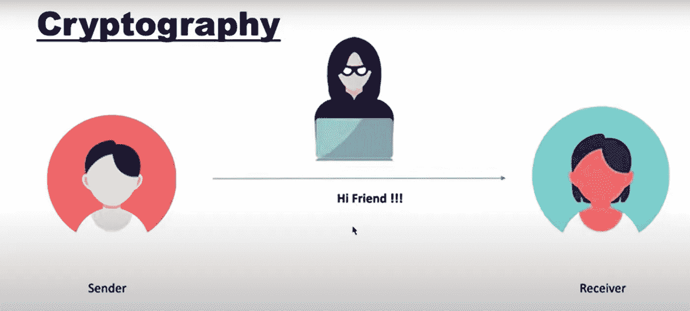
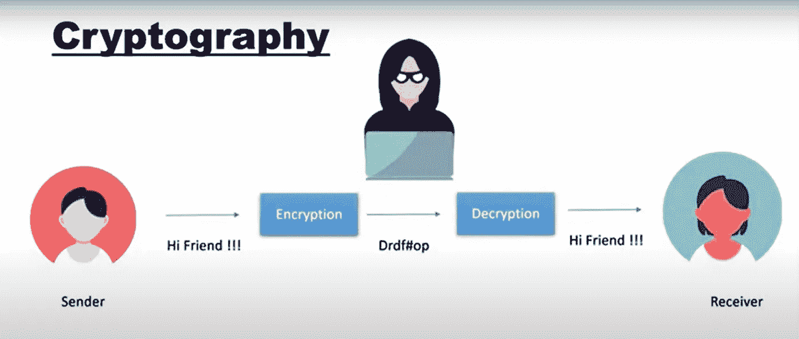
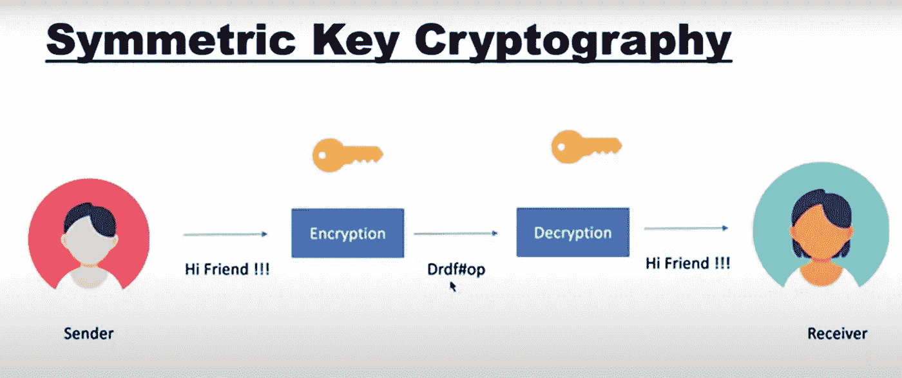
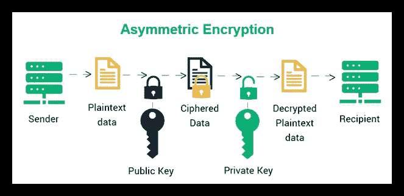
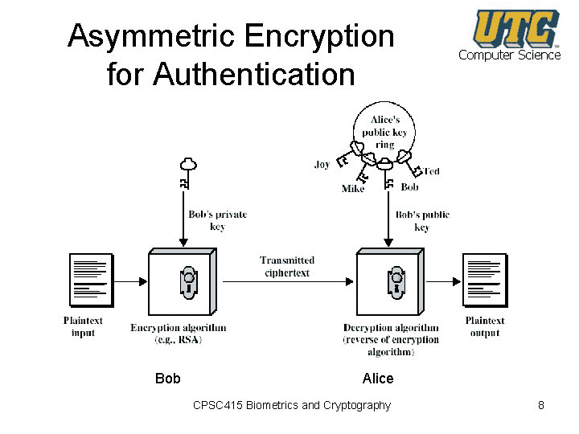
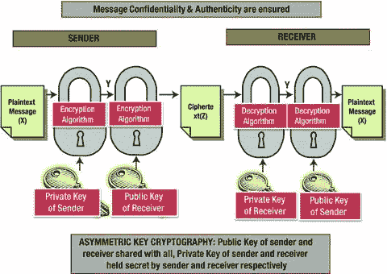

# 区块链的密码学

> 原文：<https://blog.devgenius.io/cryptography-in-blockchain-952d5da0372d?source=collection_archive---------9----------------------->

在这篇文章中，我们将看到什么是密码术，密码术的类型，密码术如何工作，以及密码术如何使区块链不可阻挡。

# 什么是密码学？

让我们通过一个例子来看看什么是密码学。假设 alice 通过简单的通信网络模式向 bob 发送消息，这种模式会出现什么问题？在这种情况下，监控他们的网络或信道的第三方可以很容易地侵入该信道，并读取他们之间的消息。在这个例子中，我们只讨论简单消息，如果 alice 和 bob 共享一些机密信息或任何其他事务，在这种情况下会有严重的问题。

上述问题的解决方案是什么？答案是密码学。在密码术中，发送者(alice)将加密该消息，而不是直接发送消息。现在，由于加密，消息被转换成不可读的形式，在发送之后，接收者(bob)将把这个不可读的消息解密成原始消息。现在，如果黑客想破解或阅读信息，黑客只能看到不可读的信息，这是毫无意义的。

在这里，我们看到，使用加密技术，我们将我们的消息转换成秘密格式，以实现/维护我们数据的机密性。

# 密码术的类型

有两种类型的加密技术:-

## 对称密钥加密

在对称密钥中，发送方(Alice)将生成一个密钥并使用该密钥加密消息，现在发送方将连同该密钥一起发送不可读/加密的消息，因为在接收方，该加密的消息只能用该密钥解密。因此，在接收到密钥和消息后，接收方使用该密钥解密该消息，并接收原始消息。

这种类型的加密有什么问题？

所以发送者发送信息和密钥给接收者，如果他们是一个正在监视他们通信的黑客/网络可以很容易地得到这个加密的信息和密钥来解密这个信息。使用这种类型的加密技术，我们不能说我们实现了我们的保密性。

## 非对称密钥加密

在非对称密钥加密中，有公钥-私钥，发送方和接收方都生成自己的公钥和私钥。

这里，如果消息是用私钥加密的，则只能用公钥解密，如果消息是用公钥加密的，则只能用私钥解密

双方都知道对方公钥，但私钥只有我们自己知道。

加密方法保护机密性、真实性和完整性。真实性是证明你是谁，完整性是保护数据免受未经授权的更改。

*   **非对称密钥加密中的保密性**

在这里，发送方用接收方的公钥加密数据，然后这个消息只能用接收方的私钥解密，这个私钥只对接收方可用。

在这种类型中，接收者永远不知道谁是这个消息的发送者。

*   **非对称密钥加密中的真实性**

这里，发送者用自己的私钥加密数据，然后该消息只能用发送者的公钥解密，该公钥对该网络或信道中的每个人都可用，因此接收者将知道该消息来自谁。

在这种情况下，由于发送方的公钥对该通道中的每个人都可用，每个人都可以解密该消息。在这种情况下，我们失去了数据的保密性。

*   **非对称密钥加密中的机密性和真实性**

在这里，我们进行双重加密，以同时实现机密性和真实性。发送方将使用自己的私钥加密消息，然后使用接收方的公钥再次加密该消息。现在，接收者将首先用自己私钥解密这个消息，然后用发送者的公钥解密。

在这种情况下，我们同时实现了保密性和真实性。

# 区块链中的密码学

在区块链，加密技术用于保护区块链网络中两个节点之间发生的交易。在区块链中有两个主要概念:加密和散列。密码术用于加密 P2P 网络中的消息，散列法用于保护区块链中的块信息和链接块。

它有助于保护区块链网络上的不同交易。它确保只有交易数据所针对的个人才能获得、读取和处理交易。

加密技术在保持公共网络安全方面发挥着关键作用，因此它适合于维护区块链的完整性和安全性。

*   在区块链中，密码学主要用于保护用户隐私和交易信息，确保数据的一致性。
*   密码学的核心技术包括对称加密和非对称加密。
*   非对称加密使用数字签名进行验证，记录到块中的每个交易都由发送方通过数字签名进行签名，并确保数据不被破坏。