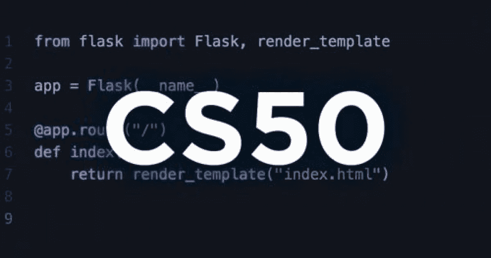

# CS50 期末项目:没你想的那么简单

> 原文：<https://blog.devgenius.io/cs50-final-project-its-not-as-easy-as-you-think-d6599b22ae45?source=collection_archive---------4----------------------->

为了完成这个项目，你必须创建一个财务网页。

但是你不能使用编程语言。相反，你必须使用编程语言的组合，并检查所有的代码，以确保一切正常。然后，您只需创建一个 zip 文件并提交给 CS50 页面。如果你做对了，你就通过了这个模块。因此，如果你完成了整个课程中 70-80%的作业，你就通过了所有的课程。

**让我们深入了解我对最终项目的体验。**

## 1-在我开始之前，我认为我可以在一天内完成这个项目

相反，我错了，因为我不得不写数百行代码来使网站独自创建 python 应用程序。然后，我必须创建一个 SQLite 数据库，并用 HTML 和 CSS 代码完成它。简而言之，所有这些都必须用 python 代码相互连接。简而言之，我很快意识到这个项目不会在一天内完成。相反，它只能在几天内完成，不像大多数应用程序。

## 2-你需要首先编写 python 程序

使用 python 来构建网站可能会很奇怪。但是，您必须首先使用烧瓶应用程序。然后使用 SQL 中的一些命令。在这里，您将使用 SQLite 来访问和创建数据库。稍后，你必须连接所有用不同编程语言编写的程序。这是最困难的阶段开始的地方。因为它们都需要相互依赖地工作。仅仅一个错误就足以干扰它的工作。为了使脚本正常运行，每个代码脚本在提交之前都应该经过彻底的检查。尽管项目提交可能需要相当长的时间，但如果流量太大，只需要 10 分钟。

## 3-必须创建一个数据库

每个网站都需要一个数据库。它必须由另一种叫做 SQL 的编程语言来创建。但是，您必须用 python 代码编写命令，而数据库的其余部分应该在另一个程序中准备。为此，您可以使用 SQLite 和。md 代码来创建并最终纠正您自己的数据库。

## 4-你必须写 HTML 和 CSS 代码

在所有东西都与 python 连接并且正在创建数据库之后，编写 HTML 和 CSS 代码需要编写脚本并连接到主程序。然而，这是最容易的阶段之一，你不必创建庞大的程序。最大的程序已经是用 python 写的了。相反，编写这些程序将它们连接到实际的结构上。

## 5-你尝到了编程的滋味

如果不算我第一次参加创业加速比赛的编程经历，这是我第一次尝试编程的经历之一。与我的 CS50 项目相比，这要困难得多，因为我必须不断地寻找错误并修复它们。但是我有一个朋友，在最困难的情况下，我可以依靠他。因此，我们已经完成了原型。但是在这个项目中，我大部分时间都是独自一人，当我写完网站运行所需的所有脚本时，我不得不自己解决所有问题。因此，它向我展示了在每一个环境中情况不会是相同的，我必须在编写脚本时做好准备，确保一切正常。

最后，CS50 成为了一次很好的计算机编程经历，在那里我学到了算法是如何工作的，并且自己也有了第一手的全面编程经验。

你做过 CS50 期末项目吗？如果你有，请在下面的评论区分享你的想法和经历。