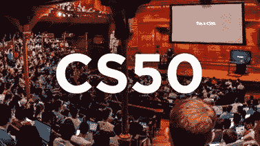
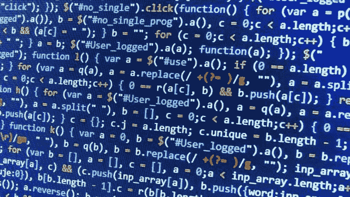

# CS50:接近尾声，也是最后一个项目

> 原文：<https://blog.devgenius.io/cs50-near-the-end-and-a-final-project-d41f390f789b?source=collection_archive---------5----------------------->

对我来说，它从未结束。相反，我会去采取另一种算法专门化，使它变得坚实。

这是我一年前开始编程时的第一堂算法课。包括 python，基本 HTML，JavaScript，R，nodeJS，solidity 整整一年。但是我的工具箱里没有算法。所以，这门课在编程方面对我帮助很大。

现在，让我们深入了解 CS50 如何让我受益。

## 1-我了解了算法的含义和工作原理

算法简单来说就是通过设计每一步来解决问题。它不仅仅用于计算机科学，它被用于生活的各个方面，了解它的工作原理可以帮助你在竞争中领先。

## 2-它让我系统地思考

算法让我们系统思考了吗？当我们考虑计算机科学家和工程师如何通过设计过程中的步骤来系统地思考解决问题时，可能是的。如果非技术人员不知道算法是什么，他们可能无法理解。但当有人了解算法如何工作，以及它们如何在现实生活中用于解决自己的问题时，这是有意义的。

## 3-还没有创建完整的系统，但是它帮助我形成了一个基本的基础

在我参加这个课程之前，我可以设计一些小的系统，但是它们并不是很有效。相反，它们是解决问题的初级设计，没有变得高度专业化。但是他们在算法训练的开始帮助了我，我有信心建立更大和更有效的系统来解决我作为软件开发人员所需要的潜在问题。即使你不打算成为一名软件开发人员，它对解决你的问题也是有用的，拥有这些知识可以让你为未来的职业机会做更好的准备。

## 4-你可以选择课程结束后你想做什么

好的方面是，当考虑到传统的工作正在变得过时时，你可以选择基于计算机的职业或不同领域的职业。因此，自疫情开始以来，我们有非常规的工作，需要非常规的方法。尤其是考虑到大学对教育的打击，因为贸易学校和在线课程及其动手准备变得越来越受欢迎。此外，一些人估计大学将成为过去。我们无法知道未来会带来什么，但我们可以说，光靠大学是不够的，在世界上大多数地方，贸易学校的在线课程更能让学生为未来做好准备。

*你吃过 CS50 吗？如果您参加了本课程，请分享您对本课程的看法。*