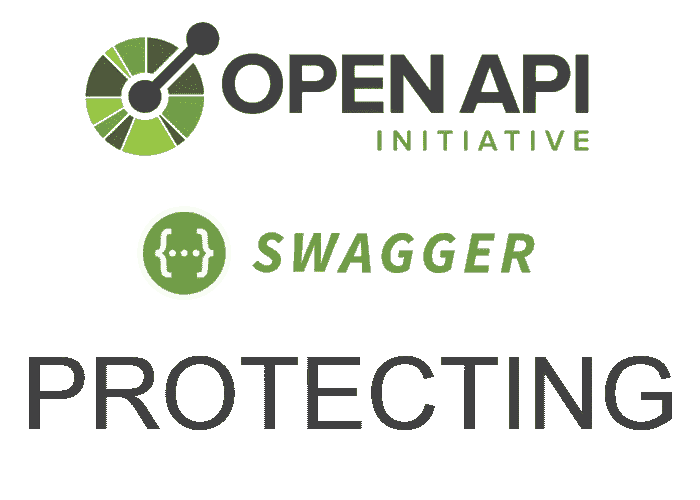
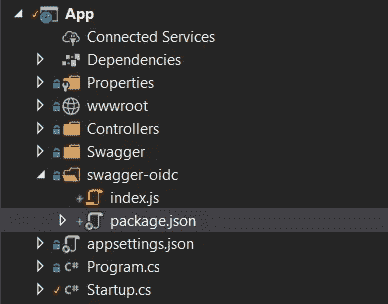
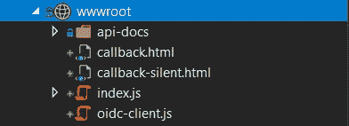
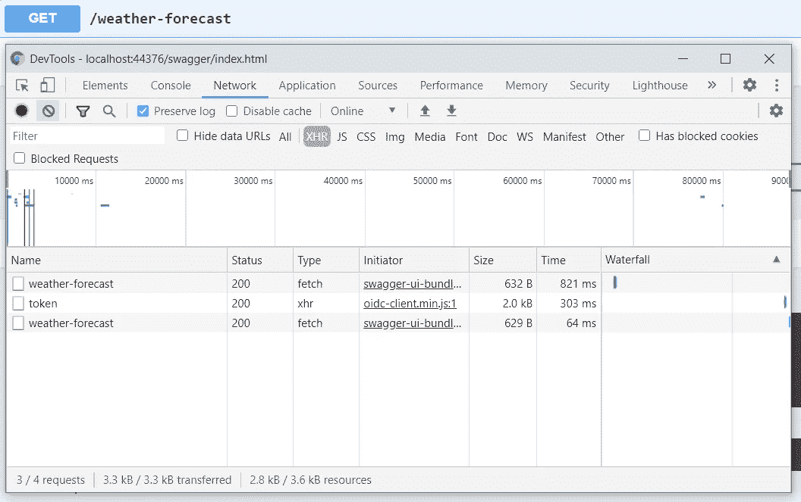

# C#保护 Swagger 端点

> 原文：<https://blog.devgenius.io/csharp-protecting-swagger-endpoints-82ae5cfc7eb1?source=collection_archive---------0----------------------->

> 以前的类似文章:
> [具有泛型支持的 C#客户端使用 NSwag](https://medium.com/dev-genius/nswag-csharp-client-with-generics-support-6ad6a09f81d6?source=your_stories_page---------------------------)
> [来自多个 API 版本的 C#客户端使用 NSwag](https://medium.com/dev-genius/nswag-charp-client-from-multiple-api-versions-7c79a3de4622?source=your_stories_page---------------------------)

如果我们不想向世界开放我们的 OpenAPI 模式，该怎么办？我们可以选择一些路径:

*   基本授权
*   使用身份服务器的 OpenId 连接授权

在本文中，我将展示第二条道路。

## 默认工具

首先，我尝试用 swagger UI 的集成工具配置 OAuth 2 授权:

但是它也有一些缺点。

*   如果访问令牌过期，那么你什么也做不了，只能再次注销登录——非常不舒服
*   API 方法受到保护，但大摇大摆的 UI 页面对所有人开放

为了解决这些缺点，应该保护 swagger 端点，并且 OAuth 2 的客户端应该正常工作。

## 保护 swagger 端点

集中保护您的 API 和与服务的通信的最佳方式是 Identity Server。在[identity server 4](http://docs.identityserver.io/en/release/intro/test.html)和 ASP.NET 核心中的[路由的帮助下，我们已经:](https://docs.microsoft.com/en-us/aspnet/core/fundamentals/routing?view=aspnetcore-3.1)

在这些更改之后，任何未授权的访问端点的尝试( */swagger/index.html* 、*/swagger/v1/swagger . JSON*以及其他与 swagger 相关的内容)都将导致重定向到 identity server 登录页面。

## 添加自定义 oidc-客户端

现在我们已经保护了端点，但是如何通过 swagger UI 调用 API 方法并添加新的访问令牌呢？Identity server 提供客户端库，对于 javascript 来说是 [oidc-client-js](https://github.com/IdentityModel/oidc-client-js/wiki) 。

让我们将 oidc 客户端连接到 swagger UI 页面。这里我们准备了 swagger UI 来支持客户端:

只有三行:

*   `showMutatedRequest`设置为`false` ( [关于 swagger-ui 库的卷曲输出问题](https://github.com/swagger-api/swagger-ui/issues/4778))
*   `requestInterceptor: swagOidc.requestInterceptor` —自定义[请求拦截器](https://swagger.io/docs/open-source-tools/swagger-ui/usage/configuration/)，这里我将为传出的请求添加授权头
*   `CustomJavaScriptPath = "index.js"` —自定义 js 文件，新的 oidc 客户端驻留在其中

[有足够的例子](https://github.com/IdentityServer/IdentityServer4/tree/main/samples/Clients)来配置一个特定的客户端。我用了部分[这个](https://github.com/IdentityServer/IdentityServer4/tree/main/samples/Clients/src/JsOidc)。`CustomJavaScriptPath`只允许加载一个文件，不支持模块([拉取请求](https://github.com/RicoSuter/NSwag/pull/3030))。所以我们需要 bundler，它将把 oidc-client-js 和我们的定制逻辑捆绑到一个文件中。快速的谷歌搜索让我找到了包裹。

阅读包裹的文档并添加所需的包裹后，我们有:

索引. js

包含自定义脚本和 package.json 的新文件夹

package.json

callback.html 页面

*package.json* 脚本部分的命令`build`捆绑 *index.js* 文件，输出到 *wwwroot* 文件夹，将模块公开为 UMD(使用`swagOidc`公开 *index.js* 的所有导出)。

进行一些测试来检查令牌刷新。在下面的屏幕截图中，API 请求在自动访问令牌刷新前后具有成功状态代码:

最后，将 npm run 命令添加到构建管道中会很有用:

# 概述

这个解决方案实际上不是特定的。您可以将相同的解决方案应用于 Swashbuckle。因此，您的 API 将受到保护，不受外界影响。

最终的代码你可以在我的知识库中找到，链接在**参考文献**部分。

# 参考

 [## Rynaret/SwagGenSample

### 功能/保护-swagger-端点

github.com](https://github.com/Rynaret/SwagGenSample/tree/feature/protect-swagger-endpoints)  [## 欢迎使用 IdentityServer4(最新)- IdentityServer4 1.0.0 文档

### 本文件涵盖了主要分支机构的最新版本。这可能还没有发布。使用下方的版本选择器…

docs.identityserver.io](http://docs.identityserver.io/en/release/index.html)  [## ASP.NET 核心中的路由

### 路由负责匹配传入的 HTTP 请求，并将这些请求分派给应用程序的可执行文件…

docs.microsoft.com](https://docs.microsoft.com/en-us/aspnet/core/fundamentals/routing?view=aspnetcore-3.1)