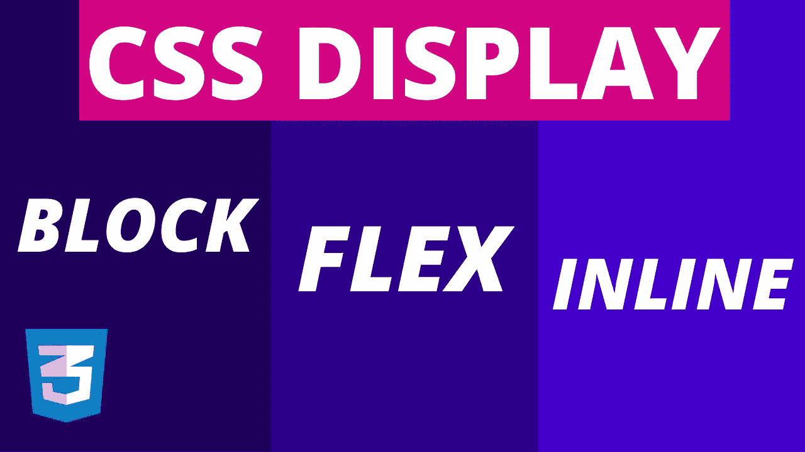
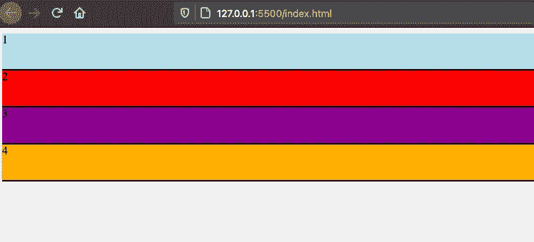
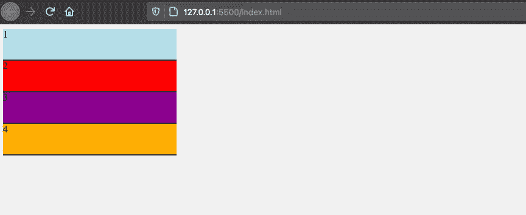
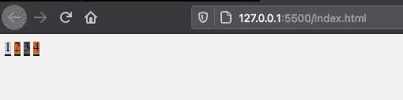
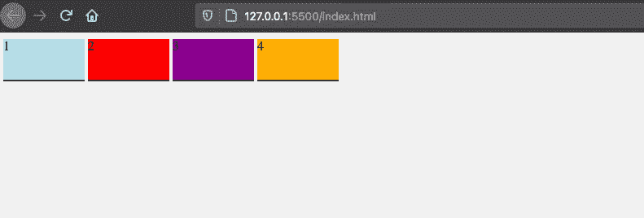
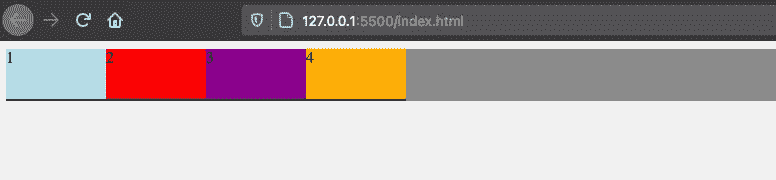
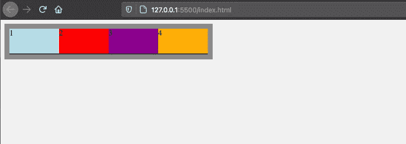
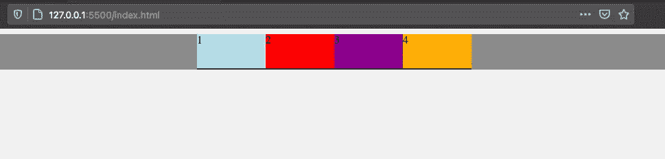

# CSS 显示:FLEX vs Block、Inline 和 Inline-Block 解释

> 原文：<https://blog.devgenius.io/css-display-flex-vs-block-inline-and-inline-block-explained-5fa588a3a960?source=collection_archive---------0----------------------->



属性被用来在我们的布局中显示、隐藏或定位 HTML 元素。每个 HTML 元素都有一个默认的显示行为，如果不理解它背后的逻辑，你在使用 CSS 时会有困难。

display 属性还有一个更新的选项叫做 flex，我们用它来构建 Flexbox 布局，flex 还提供了一种更简单的定位元素的方法。所以在这篇文章中，你将会学到:

*   什么是块级和内联级元素
*   为什么使用内联块是好的
*   作为替代方案的 flex 属性
*   Flex 与内嵌 Flex
*   如何使用 Flex 轻松居中

# 块级元素

每个 HTML 元素都有一个默认的显示行为。一些 HTML 元素(如

、

、

块级意味着一旦它们被放入模板中，它们将占用一个完整行的整个宽度。

```
<div class="box blue"> 1 </div><div class="box red"> 2 </div><div class="box purple"> 3 </div><div class="box orange"> 4 </div>// STYLING
.box {
  border-bottom: 2px solid black;
  height: 50px;
}
```

因此，上面示例中的这 4 个 div 元素(框)占用了它们行的 100%的空间，即使我没有分配任何宽度属性:



块级元素

## 如何将它们并排放置？

现在你可能会想，好吧，如果他们占宽度的 100%，如果我分配一个更小的宽度，比如说 20%，会发生什么？

```
.box {
  width: 20%;
}
```

然后，它们应该并排放置，对吗？嗯，不完全是…



宽度较小的块级元素

这是许多人都会犯的一个常见错误，即使你分配了一个较小的宽度，他们仍然保持他们的块级显示行为，而不管是否分配了(较小的)宽度。

因此，如果您想将它们并排放置，您需要更改它们的显示行为，比如说内联:

```
display: inline;
```

# 内嵌元素

那么什么是内联呢？

您在上面看到了一个块级元素的例子。另一方面，也有一些默认的内联级元素(像或者标签)，可以直接并排放置:



您可以使用代替

，或者您可以为 box 类分配一个内联值:

```
.box {
  border-bottom: 2px solid black;
  width: 100px;
  height: 50px;
  display: inline;
}
```

但是内联元素的缺点是我们不能应用宽度或高度属性，它们不能使用它们。如果你不知道这些信息，那么使用 CSS 真的会令人沮丧。

# **一个好的解决方案:内嵌块**

还有第三种选择:内联块。该属性同时利用了块级元素和内联级元素的优点。

因此，如果您使用显示内嵌块:

*   您将能够对元素应用宽度和高度属性，这在内联元素中是无法实现的
*   您还可以将这些元素并排放置，这在块级元素中是做不到的

```
.box {
  display: inline-block;
}
```



与显示器并排放置的盒子:内嵌块

这种方法已经在 CSS 中使用了很长时间，用于定位元素或改变它们的显示行为。

# 显示器呢:Flex？

还有一种更新的方法可以用于对齐或设计网页的布局，这就是 flex 属性:

```
display: flex;
```

首先，你应该知道的重要的一点是“flex”不仅仅是像“block”或“inline”那样的属性。它是一个更大的 CSS 模块，具有各种子属性。

我将在接下来的文章中详细介绍。(目前，你也可以在这里查看本帖的[教程视频](https://youtu.be/JtR2XKFj9tQ)。)

## 仅对容器使用 Flex

使用 flex 属性需要一个父(或容器)元素。

flex 的好处只能在其容器的元素下使用，但在容器之外就不行了。

```
<div class="container">
  <div> 1 </div>
  <div> 2 </div>
  <div> 3 </div>
  <div> 4 </div>
</div>
```

现在让我们为容器 div 分配一个 display flex 属性:

```
.container {
  display: flex;
  background: gray;
}
```

当我们这样做时，所有这些框将自动并排放置，即使不改变它们的显示行为:



盒子(子件)并排放置在 flex 容器下

此外，容器(div)仍然采用其行的完整宽度，行为类似于块级元素，但现在它实际上是一个 flex 容器。

## Flex 与内嵌 Flex

另一方面，如果您喜欢将 flex 容器作为内嵌级别的 flex 元素，那么您需要做的就是将它改为 inline-flex:

```
display: inline-flex;
```

所以容器占用的空间和它的子容器一样大。为了使它可见，我们也添加一些填充:

```
.container {
  display: inline-flex;
  padding: 10px;
  background-color: gray;
}
```



内嵌 flex 容器内的框

# 带弯曲的定心元件

使用 flex 非常有益，我们甚至可以做更多的事情。例如，我们可以使用一个名为 justify-content 的属性轻松地将这些框居中:

```
.container {
  display: flex;
  justify-content: center;
  background-color: gray;
}
```



框很容易居中对齐内容

所以现在所有的孩子都很容易被放在中间。justify-content 属性仅适用于 flex 元素。我将在接下来的文章中继续解释更多的 Flex 特性。

喜欢这篇文章吗？Medium 是一个很棒的平台，可以承载成千上万篇很棒的文章，却不显示任何广告。由于 Medium 是无广告的，热爱这个平台的读者可以通过成为会员来支持它。

[你可以在这里](https://medium.com/@cem.eygi/membership)成为媒介会员，并且**无限制**访问媒介上的每个故事。如果你使用上面的链接，它也会支持我成为一个作家，因为我会从 Medium 赚一点佣金。谢谢大家！