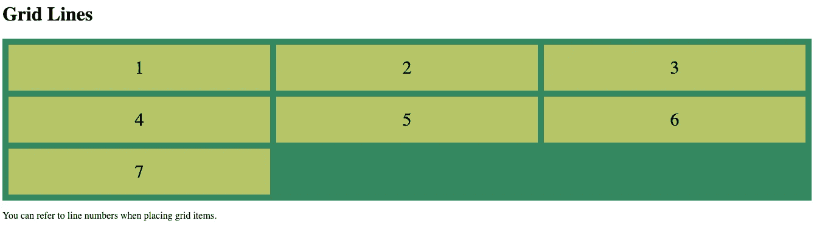
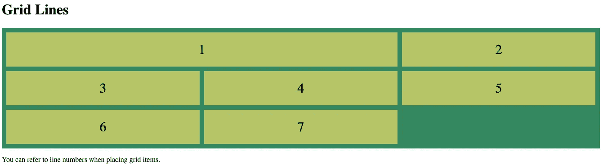
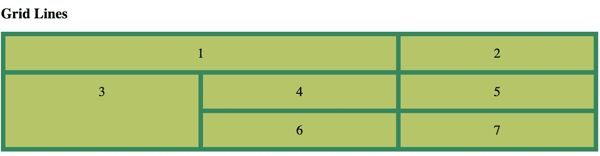
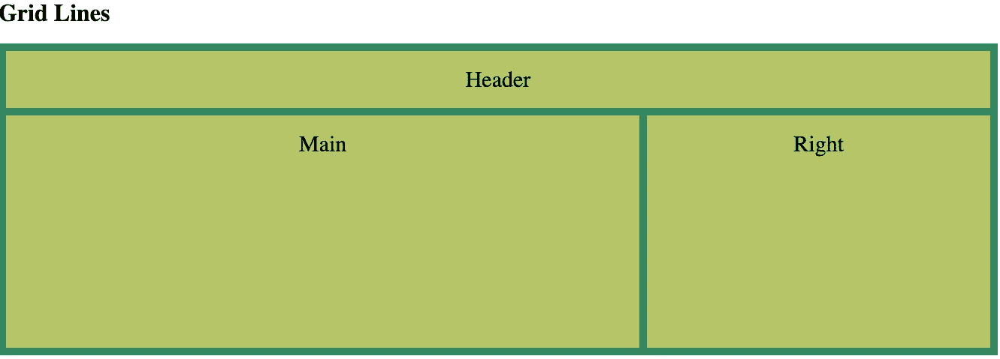

# CSS 网格系统用于快速有效的布局

> 原文：<https://blog.devgenius.io/css-grid-system-for-fast-and-efficient-layout-f5eae9f63e7c?source=collection_archive---------6----------------------->

## 什么是 CSS 网格系统？

CSS 网格布局是一个 2-d 系统，旨在使用 CSS 管理布局。网格系统的功能本质上就像一个表格，在这里你可以控制数量、大小、列间距/在网格中排序项目的过程等等。CSS grid 极大地减少甚至消除了使用浮动和定位来根据需要布局元素的需要。CSS Grid 是一个强大的工具，不需要任何外部库，几乎所有浏览器都自带(包括它们的移动版本)。

## 基本网格术语

列—从上到下的布局部分

行—从左向右延伸的布局部分

间隙—行和列之间的空间

网格线—将各行和各列分隔成单元格的线条

## 基本 CSS 网格语法= >容器

首先，你必须定义一个容器来存放你的网格。这通常在一个 *< div >* 标签内完成。

7 件物品的基本 3 x 3 造型

如果您要在这个网格容器中添加 7 个子 div，每个子 div 都有一个数字作为它们的文本内容，它将呈现如下



包含七个项目的基本网格

# 基本 CSS 网格语法= >网格项目

网格容器的所有直接子容器自动成为网格项目。

网格容器中直接列出的项目将成为该网格中的项目，这是有意义的。既然我们知道可以向这些网格项添加一些类和特定的样式。

**网格线在这里非常重要，因为这是我们用来告诉项目从哪里开始和停止。**

```
.item1 { grid-column-start: 1; grid-column-end: 3;}
```

上面的样式意味着该项目将从第一列开始延伸，并在第三列结束(实际上占用了两列),快速刷新之前的页面，我们将得到这个。



使用网格-列-开始/结束扩展项目 1 的大小

让我们对一行做同样的事情，这样我们可以使第 3 项的高度增加一倍。

```
*.item3* { grid-row-start:2; grid-row-end: 4;}
```

快速刷新会给我们…



使用网格-行-开始/结束扩展第三项

## 还感兴趣吗？

## 请继续阅读，寻找对我最近的项目有帮助的更有用的东西

## :

## 查看我在底部链接的文档，获得 CSS grid 功能的完整列表

# 网格-模板-区域

这是一个可以添加到任何网格中的属性，它将帮助您(以及与您一起工作的开发人员)可视化网格布局，并将为页面上的空间提供名称，以便您可以引用您想要放在那里的内容。

例如，我们可以这样定义网格:

```
*.grid-container* { display: grid; grid-template-columns: auto auto auto; grid-template-rows: auto 300px; grid-template-areas: "header header header" "main main right" "main main right"; grid-gap: 10px; background-color: rgb(52, 135, 96); padding: 10px;}
```

grid-template-areas 属性为页面上的每个空间提供了一个名称。然后，我们将在 css 类中为各个项目命名这些空间，它将显示在位置中。

这是成品:



使用网格模板区域属性的布局

我的 GitHub:

【https://github.com/MisterC1ean 

# 我在撰写本文时使用的资源:

[](https://css-tricks.com/snippets/css/complete-guide-grid/) [## Grid | CSS-Tricks 完全指南

### CSS 网格布局是 CSS 中最强大的布局系统。这是一个二维系统，意味着它可以…

css-tricks.com](https://css-tricks.com/snippets/css/complete-guide-grid/) [](https://developer.mozilla.org/en-US/docs/Web/CSS) [## CSS:级联样式表

### 级联样式表(CSS)是一种样式表语言，用于描述用 HTML 编写的文档的表示形式

developer.mozilla.org](https://developer.mozilla.org/en-US/docs/Web/CSS) [](https://www.w3schools.com/css/css_grid.asp) [## CSS 网格布局

### 亲自尝试“CSS 网格布局模块提供了一个基于网格的布局系统，具有行和列，使它更容易…

www.w3schools.com](https://www.w3schools.com/css/css_grid.asp)