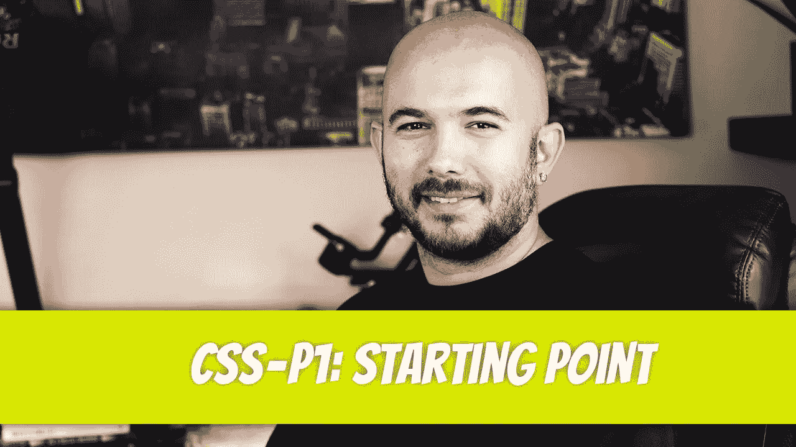

# CSS — P1:起点

> 原文：<https://blog.devgenius.io/css-p1-starting-point-bd026a8ba9c6?source=collection_archive---------7----------------------->



创建 CSS 是为了将 HTML 文档的样式和结构分开。我们将探索三种类型的 CSS 包含:`inline`、`internal`和`external`。我们只关注最基本的。我们将样式化`text`、`images`和其他一些 HTML 元素。不过这一章的重点将会放在响应式设计上。响应式设计允许您的网站在任何屏幕尺寸上适当缩放。我们将首先使用纯 CSS 来解决这个问题，然后我们将使用`Bootstrap`框架来简化这个过程。

**CSS** (级联样式表)是用于描述网页表现的“[语言，包括颜色、布局和字体。](https://www.w3.org/standards/webdesign/htmlcss)“CSS 允许内容和风格的分离。为什么我们需要内容和表现的分离？让你的网站容易被搜索引擎索引。为了让你的网站对搜索引擎友好，我们将从标记中去除任何多余的膨胀，并专注于正确的语义。CSS 将帮助我们保持网站的视觉吸引力，同时提高我们的 SEO(搜索引擎优化)。

在 CSS 实现之前，HTML 元素使用特定的元素属性进行样式化。例如，单元格填充是用于在表格中创建填充的属性，`<table cellpadding=”10">`..`</table>`。从 HTML5 开始，不再支持单元格填充。要在 HTML5 中向表格添加填充，请使用 CSS。我们将在后面的文章中讨论`<tables>`。

# 包括 CSS

你要学习的第一件事是如何将 CSS 添加到文档中。有三种方式:

```
inlineinternalexternal
```

使用 style 属性可以将内联 CSS 添加到任何 HTML 元素中。如果我们想给按钮添加填充，并将背景色改为蓝色，我们可以这样做:

```
<button 
   style=”padding: 10px; background-color: blue;”
>
  Click Me
</button>
```

即使只向按钮添加了两种样式，代码的可读性也已经开始受到影响。如果你有多个按钮，并希望每个按钮都有 10px 的填充和蓝色的背景色，你必须将样式复制到每个按钮。代码的可维护性会受到影响。尽可能避免内嵌样式。有时应该使用内嵌样式；我们很快会回到这个话题。

内部 CSS 包含在`<head>`标签中。CSS 代码放在`<style>`标签中。让我们看看前面的按钮代码，看看如何用可读性更好的代码产生同样的结果。

```
<!DOCTYPE html>
<html lang="en">
<head>
    <meta charset="UTF-8">
    <title>Internal Stylesheet</title>

    <style>
        button {
            padding: 10px;
            background-color: blue;
            color: white;
        }
    </style>
</head>

<body>
    <h1>This button is blue.</h1>
    <button>Click Me!</button>
</body>
</html>
```

看看代码，CSS 已经被移到了`<head>`标签，留下了带有最少标记的 body 标签。它非常容易阅读。

外部 CSS 样式表是不属于 HTML 文档的文档。这是一个以扩展名`.css`结尾的独立文件。要在 HTML 文档中使用 CSS 元素，必须包含文件。通过指定样式表在`<head>`标签中的位置来包含该文件:

```
<!DOCTYPE html> 
<html lang="en"> 
<head>
    <meta charset="UTF-8"> 
    <title>External Stylesheet Include</title>
    <link rel="stylesheet" href="style.css"> 
</head> 
<body>
    <h1>The following page includes an external stylesheet.</h1>
    <button>Click Me!</button> 
</body> 
</html>
```

我们首先指定`<link>`是一个样式表；后面是样式表的位置。样式表的位置使用 href 属性指定。`index.html`和`style.css`文件在同一个文件夹中，所以可以使用`style.css`文件的相对路径。如果文件嵌套在子文件夹中，那么应该提供该子文件夹的相对路径:`<link rel=”stylesheet” href=”css/style.css”>`。如果文件位于外部服务器上，可以使用绝对路径。绝对路径指定文件的完整路径。举个例子，

```
<link rel=”stylesheet” href=”http://example.com/css/style.css”>.
```

外部样式表允许样式和内容完全分离，是使用 CSS 的首选方法。

```
/*
style.css
CSS Stylesheet
*/

button {
    padding: 10px;
    background-color: green;
    color: white;
}
```

上面列出了外部文档`style.css`。所有的代码都被移动到外部表中，使得 HTML 文档没有任何 CSS 混乱。结果页面显示一个绿色按钮。


让我们再来看看内联样式。如果您指定外部文档中的每个按钮应为蓝色，但您需要一个按钮为红色，则可以在该特定按钮上使用内嵌样式。内联 CSS 优先于内部和外部 CSS。

```
<!DOCTYPE html> 
<html lang="en"> 
<head>
    <meta charset="UTF-8"> 
    <title>External Stylesheet Include</title> 
    <link rel="stylesheet" href="style.css">
    <style> 
        button {
            background-color: blue;
        }
    </style> 
</head> 
<body>
    <h1>The following page includes an external stylesheet.</h1>
    <h2>The button below should be red.</h2>
    <button style="background-color: red;">Click Me!</button> 
</body> 
</html>
```

让我们浏览一下上面的代码。它包含一个到外部样式表的链接。外部工作表包含按钮的样式。外部样式表中按钮的背景色设置为`green`。它还有一个`10 pixels`的填充和一个`white`的字体颜色。包含的下面是按钮的内部样式。它包含一个`blue`背景色。`blue`背景色覆盖`green`背景色。内联样式覆盖内部和外部样式，并将按钮的背景颜色显示为`red`。填充和字体颜色样式继承自外部样式表。


迪诺·卡伊奇目前是 [LSBio(生命周期生物科学公司)](https://www.lsbio.com/)、[绝对抗体](https://absoluteantibody.com/)、 [Kerafast](https://www.kerafast.com/) 、[珠穆朗玛生物](https://everestbiotech.com/)、[北欧 MUbio](https://www.nordicmubio.com/) 和 [Exalpha](https://www.exalpha.com/) 的 IT 主管。他还担任我的自动系统的首席执行官。他有十多年的软件工程经验。他拥有计算机科学学士学位，辅修生物学。他的背景包括创建企业级电子商务应用程序、执行基于研究的软件开发，以及通过写作促进知识的传播。

你可以在 [LinkedIn](https://www.linkedin.com/in/dinocajic/) 上联系他，在 [Instagram](https://instagram.com/think.dino) 上关注他，[访问他的博客](https://www.dinocajic.com/)，或者[订阅他的媒体出版物](https://dinocajic.medium.com/subscribe)。

阅读 Dino Cajic(以及 Medium 上成千上万的其他作家)的每一个故事。你的会员费直接支持迪诺·卡吉克和你阅读的其他作家。你也可以在媒体上看到所有的故事。