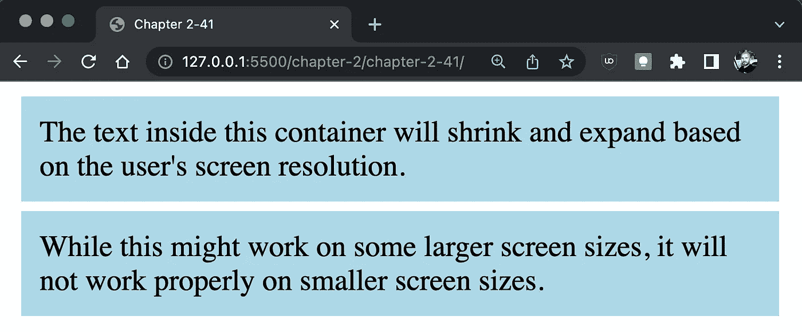

# CSS — P10:响应式网页设计

> 原文：<https://blog.devgenius.io/css-p10-responsive-web-design-2df8ffd9279b?source=collection_archive---------5----------------------->


你见过根据屏幕大小缩放不同的网站吗？这是通过响应式网页设计实现的。下面你会看到一个网站的例子，它是在考虑响应性的情况下创建的。


在现代网站设计时代之前，开发人员会构建同一个网站的多个版本。移动版本通常会放在一个子域下，如 m.dinocajic.com。移动版本将包含独立于在台式电脑上浏览的网站的代码。这种方法有几个问题:

*   您必须维护两个独立的代码库
*   屏幕分辨率的数量无限增加。为每个屏幕尺寸创建单独的版本是不切实际的。

如果网站在设计时考虑到了响应性，那么网站应该可以在任何尺寸的屏幕上工作。开发人员也将只维护一个代码库。

很少会出现不需要响应网站的情况。每次你开始设计网站的时候，响应式设计都应该在你的脑海中出现。

# **媒体查询**

开发人员如何使用 CSS 来制作响应迅速的 web 应用程序？毕竟，仅仅设置高度和宽度的百分比，并允许内容相应地缩小，这将是糟糕的设计。让我们试试这种方法。我们将创建两个并排显示的 div 元素。

```
<div> The text inside this container will shrink and expand based on the user's screen resolution.</div><div> While this might work on some larger screen sizes, it will not work properly on smaller screen sizes.</div>
```

在我们开始创建 CSS 代码之前，向 HTML 文档添加一个额外的标签是很重要的。这是视口元标记。**视窗**是浏览器的内容区域。在没有`viewport`元标签的移动设备上查看网站时，移动浏览器将尝试显示网站的桌面版本。手机浏览器将缩放一切以适应屏幕。因此，我们需要让浏览器知道这个网站响应迅速，并且针对移动环境进行了优化。将`viewport`元标签添加到 HTML 文档的 head 部分。

```
<head> <meta charset="UTF-8"> <meta http-equiv="X-UA-Compatible" content="IE=edge"> <meta name="viewport" content="width=device-width, initial-scale=1.0"> <link rel="stylesheet" href="style.css"> <title>Chapter 2-38</title></head>
```

现在我们可以开始创建 CSS 代码了。`div`标签被设计成有一个`10px`填充，一个浅蓝色背景，一个`5px`T5，来占据屏幕的`45%`，并显示为内嵌块。

```
div { width: 45%; padding: 10px; background-color: lightblue; display: inline-block; margin: 5px;}
```


到目前为止一切顺利。这两个集装箱看起来很棒。让我们试着稍微降低屏幕分辨率。一旦我们到达某一点，这些容器就会一个接一个地堆叠起来。


这是预期的行为，但是每个元素的右边有很多额外的空间。一旦达到一定的屏幕分辨率，我们如何改变容器的宽度？接受媒体询问。**媒体查询**根据具体的大小断点允许不同的风格。

使用关键字`@media`将媒体查询直接添加到 CSS 文档中。我们将从添加关键字`@media`开始，后跟断点。当屏幕小于或等于`400px`时，显示红色背景。

```
@media (max-width: 400px) { body { background-color: salmon; }}
```

一旦屏幕大于 400 像素，背景颜色将会变成默认的浏览器颜色。如果我们想为用户提供每种屏幕分辨率的不同背景颜色，我们可以为每个特定范围添加额外的媒体查询。

```
@media (max-width: 400px) { body { background-color: salmon; }}@media (min-width: 401px) and (max-width: 899px) { body { background-color: lightblue; }}@media (min-width: 900px) { body { background-color: cornflowerblue; }}
```

对于小于`400px`的屏幕分辨率，第一个媒体查询将背景颜色更改为红色。第二媒体查询的目标是在`401px`和`899px`之间的屏幕分辨率。背景颜色将显示为浅蓝色。最后，对于所有其他较大的屏幕尺寸，背景颜色会变为深蓝色。


要根据特定的屏幕分辨率加载不同的样式表，可以直接将媒体查询添加到标题内的 link 标记中。

```
<link rel="stylesheet" media="screen and (max-width: 400px)" href="mobile.css"><link rel="stylesheet" media="screen and (min-width: 401px) and (max-width: 899px)" href="tablet.css"><link rel="stylesheet" media="screen and (min-width: 900px)" href=“desktop.css">
```


您只需创建三个不同的样式表，以便加载它们。在单个样式表中，`@media`关键字是不必要的。

让我们重温一下在单个页面上有两个 div 元素的例子。如果没有媒体查询，在特定的屏幕尺寸下，div 标签会堆叠在彼此之上，而不会填满整个屏幕。


让我们应用一个媒体查询来更改断点处 div 的宽度。当屏幕分辨率低于`750px`时，`div`将变回一个方块，并横跨屏幕的整个宽度。所有其他属性将保持从媒体查询上方的默认`div`样式继承而来，例如`padding`、`background-color`和`margin`。

```
div { width: 45%; padding: 10px; background-color: lightblue; display: inline-block; margin: 5px;}@media (max-width: 750px) { div { display: block; max-width: 100%; }}
```



# **想想智能手机**

智能手机已经占领了世界。如果你的网站不支持手机，你就失去了一个巨大的市场。像谷歌这样的搜索引擎提供商会惩罚你没有一个移动友好的网站。不管你的内容如何，你的网站很可能在排名中受损。在如此重视手机的情况下，为智能手机市场设计一个网站，而不用担心台式机市场，会更有意义，而不是相反。

尽管响应式设计不是移动设计。理想情况下，你的网站可以在所有网络媒体上运行。也就是说，应该额外关注手机屏幕分辨率。他们不仅屏幕更小，处理器也更慢。你的网站应该看起来又好又快。


一些设计师甚至采取了移动优先的方法，他们首先为移动市场设计网站，然后随着分辨率的提高进行修改。我们将首先关注大分辨率的网站，然后反向操作。最终，由你来决定你的发展方式。

# **响应式设计对 SEO 至关重要**

如果您的网站没有响应，不仅您的网站可能会阻碍回头客，它不会在大多数现代搜索引擎上排名很高。搜索引擎通过广告创收。然而，当用户看到搜索结果时，他们不仅会看到广告，还会看到有机搜索结果。让我们通过一个场景来看看如果你的网站和其他一些网站在设计上没有响应，搜索引擎会如何表现。

用户可能会搜索像 cookies 这样的术语。搜索引擎显示几个广告，通常是前 10 个搜索结果。用户要么点击广告，要么点击一个有机的结果。如果用户点击广告，搜索引擎公司将向该公司收取少量费用。但是为什么搜索引擎公司会关心响应式设计呢？


如果用户点击其中一个有机结果，并且在网站上没有良好的用户体验，他或她可能会退出网站并点击下一个网站。如果下一个网站提供了同样不令人满意的用户体验，用户将再次返回并尝试下一个结果。他或她会重复这个过程，直到两件事情之一发生:要么用户会找到一个他们满意的网站，要么他们会离开那个搜索引擎，尝试一个不同的。第二种情况是搜索引擎公司害怕什么。他们搜索引擎的访客越少，他们展示的广告不被点击的几率就越高。这就是为什么他们在他们展示的每个网站上推动高用户体验。用户找到与其需求相关的网站越快，用户返回特定搜索引擎的机会就越大，他或她点击广告的机会就越大。


迪诺·卡伊奇目前是 [LSBio(生命周期生物科学公司)](https://www.lsbio.com/)、[绝对抗体](https://absoluteantibody.com/)、 [Kerafast](https://www.kerafast.com/) 、[珠穆朗玛生物](https://everestbiotech.com/)、[北欧 MUbio](https://www.nordicmubio.com/) 和 [Exalpha](https://www.exalpha.com/) 的 IT 主管。他还担任我的自动系统的首席执行官。他有十多年的软件工程经验。他拥有计算机科学学士学位，辅修生物学。他的背景包括创建企业级电子商务应用程序、执行基于研究的软件开发，以及通过写作促进知识的传播。

你可以在 [LinkedIn](https://www.linkedin.com/in/dinocajic/) 上联系他，在 [Instagram](https://instagram.com/think.dino) 上关注他，或者[订阅他的媒体出版物](https://dinocajic.medium.com/subscribe)。

[*阅读迪诺·卡吉克(以及媒体上成千上万其他作家)的每一个故事。你的会员费直接支持迪诺·卡吉克和你阅读的其他作家。你也可以在媒体上看到所有的故事。*](https://dinocajic.medium.com/membership)