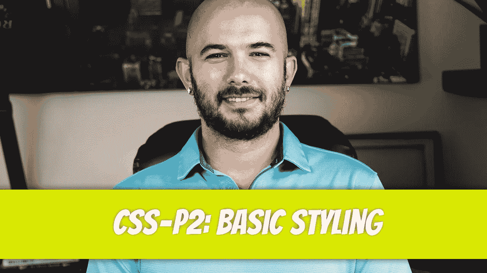
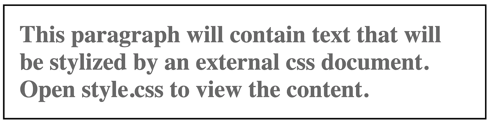
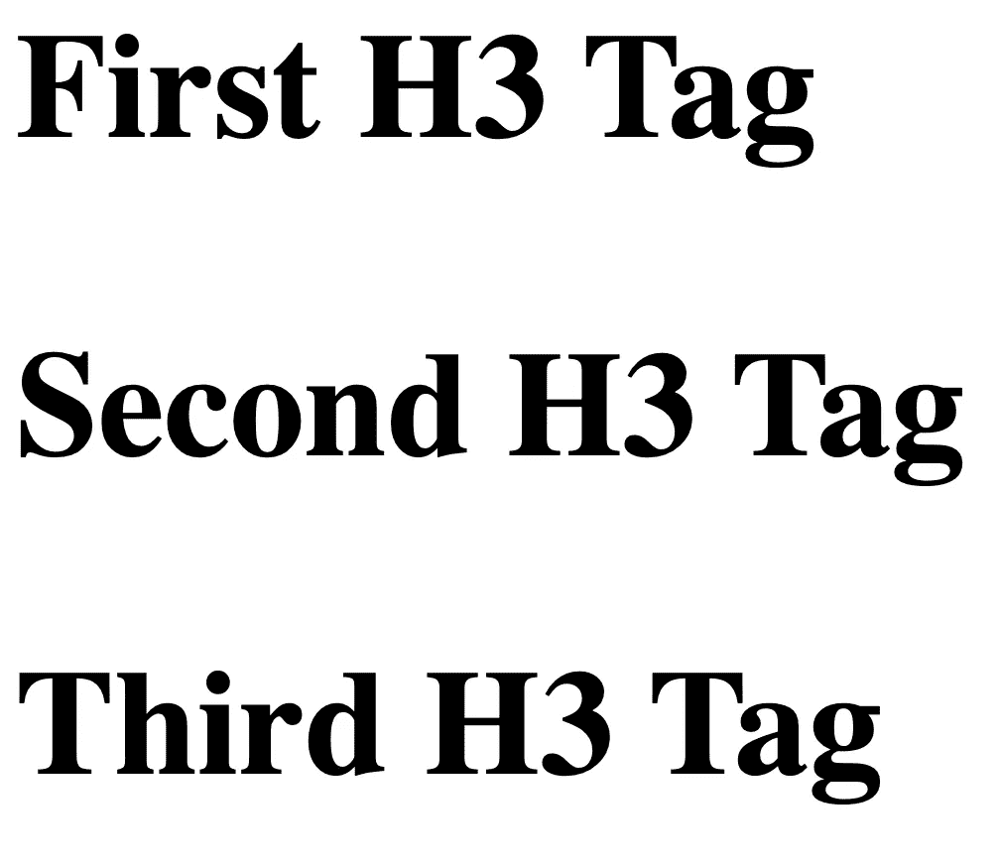
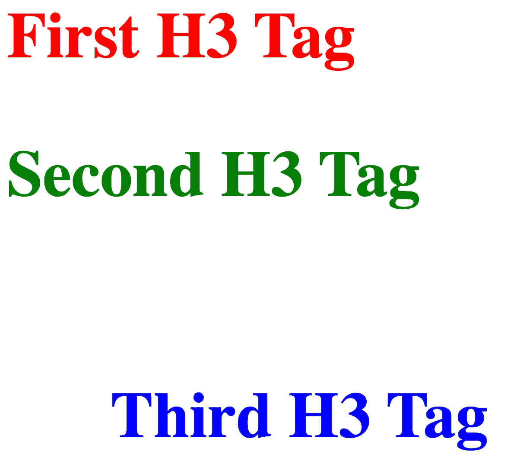
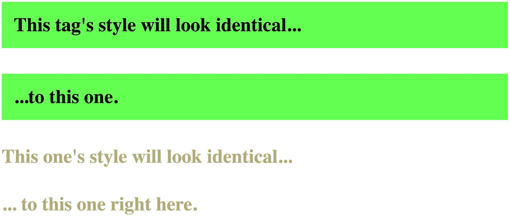
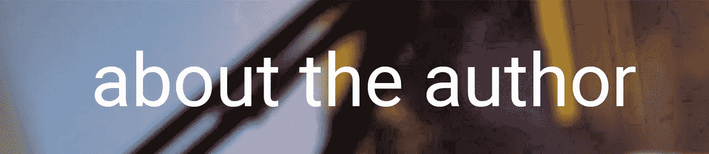

# CSS — P2:基本样式

> 原文：<https://blog.devgenius.io/css-p2-basic-styling-4715acdf10cf?source=collection_archive---------15----------------------->



尽管我们在[之前的文章](/css-p1-starting-point-bd026a8ba9c6)中看到了一些关于编写 CSS 代码的例子，让我们更深入地看一下。我们将重点讨论外部样式表，但是这里涉及的相同原则也可以转化为内部样式和内联样式。

# HTML 元素样式

CSS 可以根据元素类型、元素的`class`或元素的`id`来设置 HTML 元素的样式。这意味着 CSS 接受 HTML 元素并对其应用样式。元素类型的一些例子包括:`<p>`、`<a>`、`<div>`等。我们将从设计下面的段落`<p>`标签开始。

```
<p>
    This paragraph will contain text that will be stylized by an 
    external css document. Open style.css to view the content. 
</p>
```

如果在浏览器中查看文件，段落将以默认的浏览器样式显示。

出于演示目的，我们将向`<p>`标签添加以下样式:

*   将字体颜色改为`dim-gray`
*   将字体粗细改为`bold`
*   将`padding`添加到段落中
*   将段落的最大宽度设置为`300 pixels`
*   在段落周围添加纯黑色`border`

```
/* 
    style.css 
    CSS Stylesheet 
*/

p {
    color: dimgray;           /* Text color */
    font-weight: bold;        /* Make font bold */
    padding: 10px;            /* Internal padding */
    max-width: 300px;         /* Set container max width */
    border: 1px black solid;  /* Add black border */
}
```

保存文件并刷新浏览器中的`index.html`页面后，您会注意到段落标签和其中的内容发生了巨大的变化。



对于其他每个 HTML 元素，您将重复类似的过程。输入元素名(选择器)，后跟花括号。声明将写在花括号内。每个声明都写在一个`property: value;`对中。**属性**是将要应用的样式类型，**值**是该特定属性允许的可接受术语。例如，`color`属性需要下列值之一:

*   关键词颜色值:`red`
*   十六进制颜色值:`#0000FF`
*   RGB 值:`rgb(100, 80, 100)`
*   RGBA 值:`rgba(100, 80, 100, 0.3)`
*   HSL 值:`hsl(100, 50%, 65%)`
*   HSLA 值:`hsla(100, 50%, 65%, 0.4)`

可以将注释添加到您的 CSS 外部文件中，并包含在`/* */`中。评论是为你准备的。您已经在[上一篇文章](/css-p1-starting-point-bd026a8ba9c6)和这篇文章中看到了外部样式表中的注释。

# 通过 ID 进行造型

将样式应用于 HTML 元素是更改所有带有指定标签的 HTML 元素的样式的好方法。但是，如果您的文档有多个相同的 HTML 标签，但您只想更改一个或几个，那么就必须引入一种新的方法。如果你的文档有多个`<h3>`标签，并且你想让每个`<h3>`标签包含自己的风格，那么 HTML `id`属性将会非常适合。对于每个 HTML 文档,`id`属性必须是唯一的。我们首先向我们想要修改的每个`<h3>`标签添加`id`属性。

```
<h3 id="first-h3">First H3 Tag</h3> 
<h3 id="second-h3">Second H3 Tag</h3> 
<h3 id="third-h3">Third H3 Tag</h3>
```

在没有添加任何样式的情况下，`<h3>`标签会产生如下结果:



我们可以打开我们的外部样式表(`style.css`)并对每个`id`应用一个独特的样式。为了指定样式用于`id`，而不是选择器，使用了井号`#`。

```
#first-h3 { color: red; }#second-h3 { color: green; }#third-h3 { color: #0000FF; /* Blue */ padding: 30px;}
```

如果我们刷新页面，您会注意到第一个`<h3>`标签中有红色文本，第二个`<h3>`标签中有绿色文本，第三个`<h3>`标签中有带有一些额外填充的蓝色文本。



# 通过类设置样式

要将一个样式应用于一种类型的多个(但不是所有)标签，必须使用`class`属性。与必须唯一的`id`标签不同，`class`属性不需要唯一。让我们在 HTML 文档中创建`<h4>`标签，并将`class`属性添加到每个元素中。

```
<h4 class="first-h4">This tag's style will look identical...</h4><h4 class="first-h4">...to this one.</h4><h4 class="second-h4">This one's style will look identical...</h4><h4 class="second-h4">... to this one right here.</h4>
```

为了引用外部 CSS 文档中的 class 属性，在类名前使用句点。

```
.first-h4 { background-color: rgb(100, 255, 80); /* Greenish color */ padding: 10px; max-width: 400px;}.second-h4 { color: hsl(50, 30%, 60%); } /* Tan color */
```

当您在浏览器中刷新页面时，会产生以下结果。



前两个`<h4>`元素有一个`green`背景色，而后两个`<h4>`元素以颜色`tan`出现。`class`和`id`属性可以应用于所有的 HTML 元素。

多个类可以应用于一个 HTML 元素。要向第一个元素添加第二个`class`，请用空格分隔`class`名称。我们将从在 CSS 文档中创建两种样式开始。

```
.red-background { background-color: red; }.h5-padding { padding: 10px; }
```

让我们将这两个类添加到 HTML 代码中的`<h5>`标签中。

```
<h5 class=”h5-padding red-background”>
    This background will be red
</h5>
```


我觉得这是一个停下来消化的好时机。下次我们将涉及更多的造型。



Dino Cajic 目前是 [LSBio(寿命生物科学公司)](https://www.lsbio.com/)、[绝对抗体](https://absoluteantibody.com/)、 [Kerafast](https://www.kerafast.com/) 、 [Everest BioTech](https://everestbiotech.com/) 、 [Nordic MUbio](https://www.nordicmubio.com/) 和 [Exalpha](https://www.exalpha.com/) 的 IT 主管。他还是 [MyAutoSystem](https://myautosystem.com/) 的首席执行官。他有十多年的软件工程经验。他拥有计算机科学学士学位，辅修生物学。他的背景包括创建企业级电子商务应用程序、执行基于研究的软件开发，以及通过写作促进知识的传播。

你可以在 [LinkedIn](https://www.linkedin.com/in/dinocajic/) 上联系他，在 [Instagram](https://instagram.com/think.dino) 上关注他，或者[订阅他的媒体出版物](https://dinocajic.medium.com/subscribe)。

阅读 Dino Cajic(以及 Medium 上成千上万的其他作家)的每一个故事。你的会员费直接支持迪诺·卡吉克和你阅读的其他作家。你也可以在媒体上看到所有的故事。