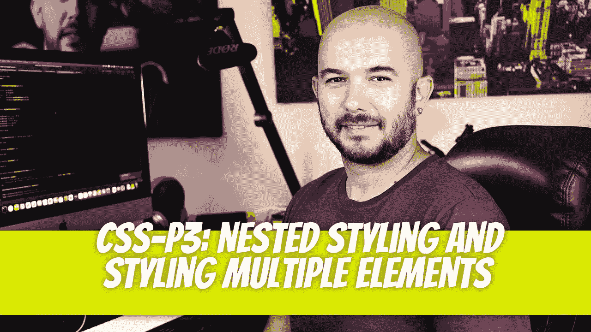
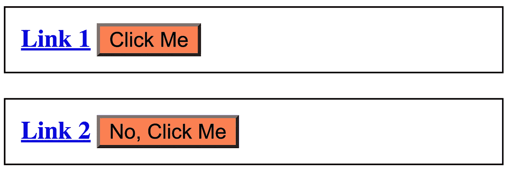
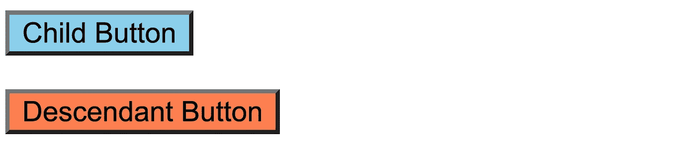
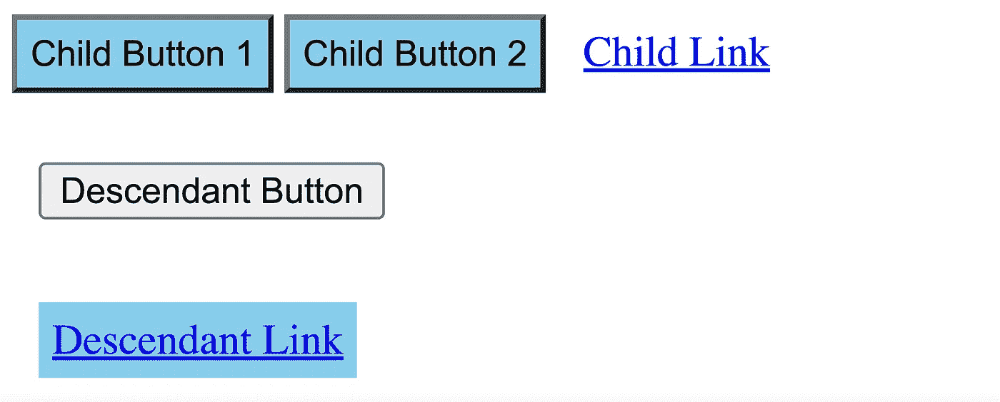

# CSS — P3:嵌套样式和多元素样式

> 原文：<https://blog.devgenius.io/css-p3-nested-styling-and-styling-multiple-elements-ea40cc5ac727?source=collection_archive---------8----------------------->



让我们继续学习 CSS 基础知识。如果你没看过上一篇文章，一定要先看。

[](/css-p2-basic-styling-4715acdf10cf) [## CSS — P2:基本样式

### 尽管我们在上一篇关于编写 CSS 代码的文章中看到了一些例子，但是让我们在…

blog.devgenius.io](/css-p2-basic-styling-4715acdf10cf) 

# 嵌套样式

CSS 允许嵌套的 HTML 元素样式。在下面的例子中，我们有两个段落标签。每个段落都有一个链接和一个按钮。

```
<p id="first-p">
    <a href="#">Link 1</a>
    <button>Click Me</button>
</p><p id="second-p">
    <a href="#">Link 2</a>
    <button>No, Click Me</button>
</p>
```

由于链接和按钮都没有`id`和`class`属性，我们必须通过嵌套来指定它们的样式。为了选择第一段中包含的链接，我们将编写以下 CSS 代码:

```
#first-p a { font-weight: bold; }
```

我们在`#first-p`段落中设计了`<a>`标签的样式。要仅向段落标记内的两个按钮添加样式，并排除段落标记外的按钮，可以编写以下 CSS 代码:

```
p button { background-color: coral; }
```

应用了这些样式，并产生了下面的结果。



通过使用大于号`>`，样式可以应用于子元素，但不能应用于后代。在这个例子中，我们将有一个`<section>`父节点、一个`<button>`子节点、一个`<p>`子节点和一个`<button>`子节点。

```
<section>
    <button>Child Button</button>

    <p>
        <button>Descendant Button</button>
    </p>
</section>/* CSS */
section > button { background-color: skyblue; }
```



# 样式化多个元素

CSS 在如何指定选择器和应用样式方面有很大的灵活性。为了给多个 HTML 元素添加样式，我们将用逗号分隔每个元素。例如，如果我们想改变`<h1>`、`<h2>`和`<h3>`标签的颜色，我们可以编写以下代码:

```
h1, h2, h3 {
    color: royalblue;
}
```

您可以将多个选择器与标记名、类名、嵌套选择器和 id 混合搭配。

```
<section>
    <button class="first-button">Child Button 1</button>
    <button id="second-button">Child Button 2</button> <a href="#">Child Link</a> <p>
        <button>Descendant Button</button>
    </p> <div>
        <a href="#">Descendant Link</a>
    </div>
</section>/* CSS */p, div, section > a { padding: 10px; }.first-button, #second-button, div > a {
    background-color: skyblue;
    padding: 5px;
}
```

第一种样式向任何段落元素、任何 div 元素和 section 元素的任何子链接添加 10px 填充。第二种样式向第一个按钮类、第二个按钮 id 和 div 标记的任何子链接添加天蓝色背景色和 5px 填充。第三种样式为段落标记的任何子按钮和部分标记的任何子链接添加 10px 的上边距。



迪诺·卡伊奇目前是 [LSBio(生命周期生物科学公司)](https://www.lsbio.com/)、[绝对抗体](https://absoluteantibody.com/)、 [Kerafast](https://www.kerafast.com/) 、[珠穆朗玛生物](https://everestbiotech.com/)、[北欧 MUbio](https://www.nordicmubio.com/) 和 [Exalpha](https://www.exalpha.com/) 的 IT 主管。他还担任我的自动系统的首席执行官。他有十多年的软件工程经验。他拥有计算机科学学士学位，辅修生物学。他的背景包括创建企业级电子商务应用程序、执行基于研究的软件开发，以及通过写作促进知识的传播。

你可以在 [LinkedIn](https://www.linkedin.com/in/dinocajic/) 上联系他，在 [Instagram](https://instagram.com/think.dino) 上关注他，或者[订阅他的媒体出版物](https://dinocajic.medium.com/subscribe)。

[*阅读迪诺·卡吉克(以及媒体上成千上万其他作家)的每一个故事。你的会员费直接支持迪诺·卡吉克和你阅读的其他作家。你也可以在媒体上看到所有的故事。*](https://dinocajic.medium.com/membership)