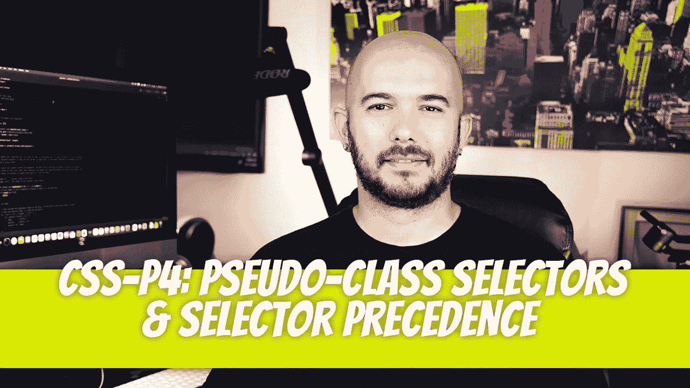
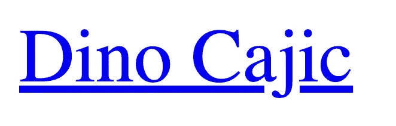
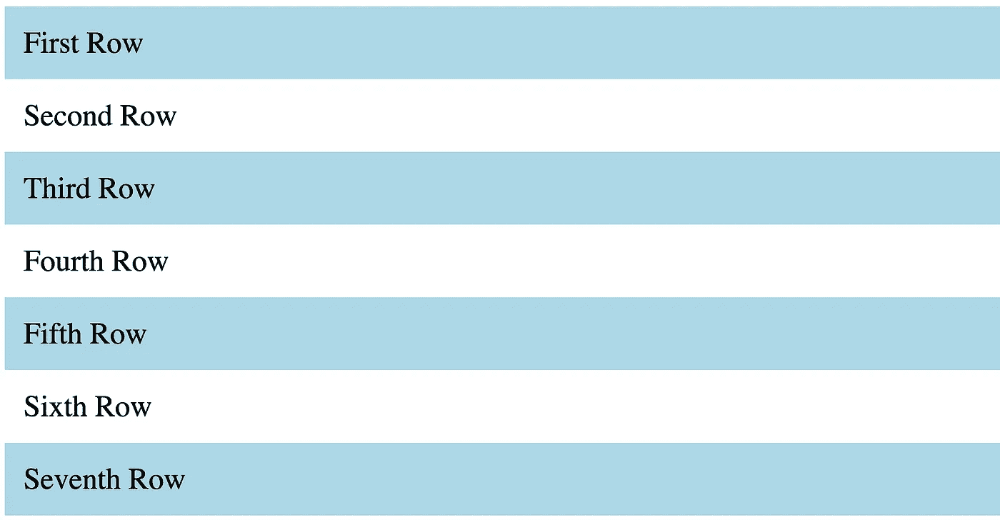
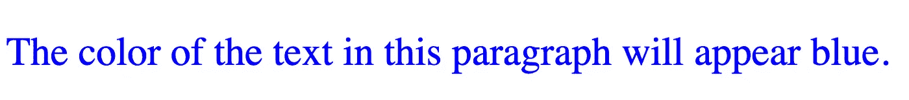
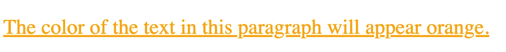
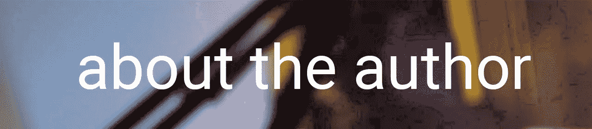

# CSS — P4:伪类选择器和选择器优先级

> 原文：<https://blog.devgenius.io/css-p4-pseudo-class-selectors-selector-precedence-d124e38f7102?source=collection_archive---------19----------------------->



继续我们的 CSS 之路。之前的文章可以在这里找到:

[](/css-p3-nested-styling-and-styling-multiple-elements-ea40cc5ac727) [## CSS — P3:嵌套样式和多元素样式

### 让我们继续学习 CSS 基础知识。如果你没看过上一篇文章，一定要先看。

blog.devgenius.io](/css-p3-nested-styling-and-styling-multiple-elements-ea40cc5ac727) 

# 伪类选择器

我们要介绍的最后一种选择器是伪类选择器。您可能会遇到的是与锚定标签相关的标签。让我们从创建一个简单的链接开始。

`<a href=”https://dinocajic.com">Dino Cajic</a>`

浏览器会给链接加下划线，并将文本颜色设为蓝色。当您悬停在它上面时，您可能会看到也可能看不到颜色变化。访问该链接可能会将的颜色从蓝色变为紫色。



要修改链接外观，我们可以修改每个伪类:未访问的、已访问的、悬停的、已选择的。我们将通过在 a 选择器和伪类之间添加一个冒号来做到这一点。

```
a:link { text-decoration: none; color: red; }
a:visited { color: green; }
a:hover { text-decoration: underline; }
a:active { color: purple; }
```

在浏览器中打开页面以查看结果。未访问的链接将显示为红色。将鼠标悬停在链接上会使文本显示下划线。单击并按住链接会将文本的颜色更改为紫色。访问页面后，链接的颜色将显示为绿色。

还有其他几个伪类选择器，但是我们将关注的最后一个是第 n 个子伪选择器。第 n 个子伪选择器允许您基于特定的模式选择元素，例如所有奇数元素。当您尝试将表格样式化为具有交替颜色以提高可读性时，这是非常有益的。

第 n 个子伪选择器可以有以下值:

**:第 n 个子(奇数)**

*   选择所有奇数元素:1，3，5，…

**:第 n 个子(偶数)**

*   选择所有偶数元素:2，4，6，…

**:第 n 个子(An+B)**

*   允许特定选择的数学公式，例如 2n+5，其中 n 在 0 到∞的范围内。结果是从 5 开始的所有奇数:5，7，9，11，13，

**:第 n 个子(n)**

*   选择特定元素:n = 34

第 n 个子伪选择器可以应用于任何 HTML 元素。让我们将它应用于 div 标记。

```
<section> <div>First Row</div> <div>Second Row</div> <div>Third Row</div> <div>Fourth Row</div> <div>Fifth Row</div> <div>Sixth Row</div> <div>Seventh Row</div></section>/* CSS */div { padding: 10px; }div:nth-child(odd) { background-color: lightblue; }
```

我们首先对所有的`div`标签应用 10px 的填充。每个奇数 div 元素也接收一个`light-blue`背景颜色。



# 选择器优先级

如果 HTML 元素附加了多种类型的选择器，并且这些选择器已经在 CSS 文档中定义了，那么您就必须考虑优先级。假设我们有一个带有 class 和 id 属性的段落标签。

```
<p class=”red-text” id=”blue-text”> The color of the text in this paragraph will appear blue.</p>/* CSS */p { color: green; }.red-text { color: red; }#blue-text { color: blue; }
```



属性`id`的优先级最高，其次是属性`class`，最后是类型选择器。

嵌套选择器也比非嵌套选择器具有更高的优先级。例如，如果我们扩展前面的例子，我们可以再次改变优先级。

```
<p class=”red-text” id=”blue-text”> <a href=”#”> The color of the text in this paragraph will appear orange. </a></p>/* CSS */p { color: green; }.red-text { color: red; }#blue-text { color: blue; }a { color: purple; }p a { color: orange; }
```



仔细分析上面的例子，`<p>`标签有三种附加样式:

*   `<p>`标签的绿色文本颜色
*   `.red-text`的文字颜色为红色`class`
*   `#blue-text`的文字颜色为蓝色`id`

嵌套的`<a>`标签附加了两种样式:

*   紫色，非嵌套文本颜色
*   橙色的嵌套文本颜色

如果嵌套标签(`p a { … }`)没有在外部 CSS 文档中声明，颜色将显示为紫色。嵌套的`<a>`标签的样式优先于`class`和`id`属性。



迪诺·卡希奇目前是 [LSBio(寿命生物科学公司)](https://www.lsbio.com/)、[绝对抗体](https://absoluteantibody.com/)、 [Kerafast](https://www.kerafast.com/) 、[珠穆朗玛生物科技](https://everestbiotech.com/)、[北欧 MUbio](https://www.nordicmubio.com/) 和 [Exalpha](https://www.exalpha.com/) 的 IT 负责人。他还担任我的自动系统的首席执行官。他有十多年的软件工程经验。他拥有计算机科学学士学位，辅修生物学。他的背景包括创建企业级电子商务应用程序、执行基于研究的软件开发，以及通过写作促进知识的传播。

你可以在 [LinkedIn](https://www.linkedin.com/in/dinocajic/) 上联系他，在 [Instagram](https://instagram.com/think.dino) 上关注他，或者[订阅他的媒体出版物](https://dinocajic.medium.com/subscribe)。

阅读 Dino Cajic(以及 Medium 上成千上万的其他作家)的每一个故事。你的会员费直接支持迪诺·卡吉克和你阅读的其他作家。你也可以在媒体上看到所有的故事。