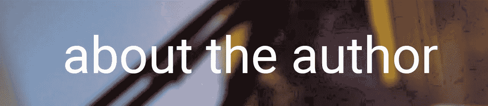

# CSS — P5:文本样式

> 原文：<https://blog.devgenius.io/css-p5-text-styling-4bb0809638bb?source=collection_archive---------9----------------------->


一种经常出现的样式是字体样式。字体样式可以让你不用担心默认的字体样式。例如，`<h1>`到`<h6>`标签不仅用于显示通常与这些标签相关联的特定字体样式，它们还用于构建网站。我们将在后面讨论网站结构。我们可以更改我们在整个网站中使用的字体的以下属性:

*   `font-family`
*   `font-size`
*   `font-style`
*   `font-weight`

字体系列指定您希望在逗号分隔列表中选择的字体类型。在下面的例子中，我们有三个值附加到这个字体上。第一个选项指定您的首选，第二个值是第一个选项不可用时的后备选项，第三个值是前两个选项不可用时的后备选项。最后两个选项没有引号。这是因为这些是通用字体，并且通用字体必须在没有引号的情况下声明。

`h1 { font-family: “Times New Roman”, Times, sans-serif; }`

使用 font-size 属性修改字体的大小。测量字体大小最常用的单位是`px`和`em`单位。我们将讨论的第一个单位是像素单位。像素是一个绝对值，不会因周围的元素而改变。`em`单元是一个相对单元，将根据继承的字体大小改变其大小。例如，假设我们有一个嵌套了锚标记的段落标记。段落标记内的文本将具有字体大小`12px`，锚标记将具有字体大小`1em`。考虑到它最近的祖先的字体大小为`12px`，它的字体大小也将为`12px`。如果我们把锚文本字体大小改成`2em`，那么字体大小就是`24px` (2x12)。因此，`em`单元只是将最接近的继承字体大小的字体大小相乘。

```
<p> <a href=”#”> This text will be 24px in size. </a></p> /* CSS */p { font-size: 12px; }a { font-size: 2em; }
```


将锚点字体大小设置为`0.5em`将导致锚点字体显示为段落字体大小的两倍。由于段落字体大小为`12px`高，将锚点标记设置为`0.5em`将导致锚点文本显示为`6px`高。

字体样式用于向元素添加斜体样式。字体样式属性的可接受值有:`italic`、`oblique`和`normal`。

```
<div>Default text style.</div><p id=”italic”>This text will appear italic.</p><p id=”oblique”>This text will appear oblique.</p> /* CSS */#italic { font-style: italic; }#oblique { font-style: oblique; }
```


斜体字和斜体字几乎无法区分。如果字体没有倾斜或斜体版本，字体将看起来相同。

字体粗细是指定字体粗细的属性。字体粗细可以用数字指定(从`100`到`900`，增量为`100`)，也可以用关键字指定，比如`bold`。

```
<div>Default text weight.</div><p>This text will appear bold.</p>/* CSS */
p { font-weight: bold; }
```


外部字体有时比通用字体更好。要包含 web 字体，必须在 CSS 文档中指定@font-face。`@font-face`属性必须指定以下两个属性:`font-family`和`src`。字体系列指定您尝试使用的字体名称，src 指定字体的位置。一旦添加了字体，就可以在其他 CSS 元素中使用它。

```
@font-face {
    font-family: “Raleway-Regular”;
    src: url(Raleway.ttf);
}h1 { font-family: “Raleway-Regular”, Times, serif; }
```

Web 字体可以从本地目录下载和包含，或者从在线存储库中检索，如 Google Fonts。要检索谷歌字体，首先导航至[https://fonts.google.com/](https://fonts.google.com/)。


找到想要使用的字体后，按下指定字体旁边的加号按钮。这会将字体添加到集合中。您将能够在您的网页中包含所需的字体。复制标签`<link>`中的内容并粘贴到 HTML 文档的`<head>`中，就在外部 CSS 文档的上方。


```
<head> <link rel="preconnect" href=“https://fonts.googleapis.com"> <link rel="preconnect" href="https://fonts.gstatic.com" crossorigin > <link href="https://fonts.googleapis.com/css2?  
        family=Roboto:ital,wght@0,100;0,300;1,100&display=swap" rel=“stylesheet"
    > <link rel="stylesheet" href="style.css"></head><body> <div>Default Font</div> <p>Using Google's Roboto font.</p></body> /* CSS */p { font-family: 'Roboto', sans-serif; }
```

如果您在自定义样式表下包含样式表，您的样式表将无法读取包含的字体。

要开始使用附带的字体，请导航回 Google Fonts 页面并选择 font-family 属性。打开 CSS 文档，将代码粘贴到您选择的选择器中。



迪诺·卡伊奇目前是 [LSBio(生命周期生物科学公司)](https://www.lsbio.com/)、[绝对抗体](https://absoluteantibody.com/)、 [Kerafast](https://www.kerafast.com/) 、[珠穆朗玛生物](https://everestbiotech.com/)、[北欧 MUbio](https://www.nordicmubio.com/) 和 [Exalpha](https://www.exalpha.com/) 的 IT 主管。他还担任我的自动系统的首席执行官。他有十多年的软件工程经验。他拥有计算机科学学士学位，辅修生物学。他的背景包括创建企业级电子商务应用程序、执行基于研究的软件开发，以及通过写作促进知识的传播。

你可以在 [LinkedIn](https://www.linkedin.com/in/dinocajic/) 上联系他，在 [Instagram](https://instagram.com/think.dino) 上关注他，或者[订阅他的媒体出版物](https://dinocajic.medium.com/subscribe)。

[*阅读迪诺·卡吉克(以及媒体上成千上万其他作家)的每一个故事。你的会员费直接支持迪诺·卡吉克和你阅读的其他作家。你也可以在媒体上看到所有的故事。*](https://dinocajic.medium.com/membership)