# CSS — P6:图像样式

> 原文：<https://blog.devgenius.io/css-p6-image-styling-2b65d82e840e?source=collection_archive---------8----------------------->

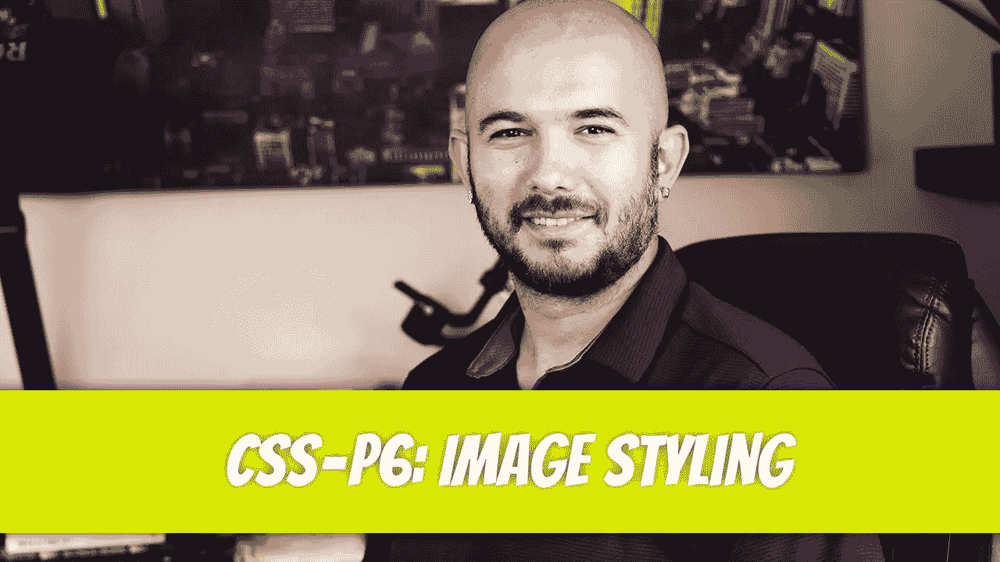

就像任何 CSS 样式一样，我们可以开始写，永远不会结束，因为有太多独特的方式，个人可以设计一个图像。我们将介绍一些设计图片样式的基本方法，这也是你真正想看到的，最后还将介绍一些设计背景图片样式的方法。

[](/css-p5-text-styling-4bb0809638bb) [## CSS — P5:文本样式

### 一种经常出现的样式是字体样式。字体风格会让你远离烦恼…

blog.devgenius.io](/css-p5-text-styling-4bb0809638bb) 

# 基本图像造型

让我们从在 HTML 文件中包含一个图像开始。

```
<section> </section>
```

这将显示图像的当前高度和宽度。

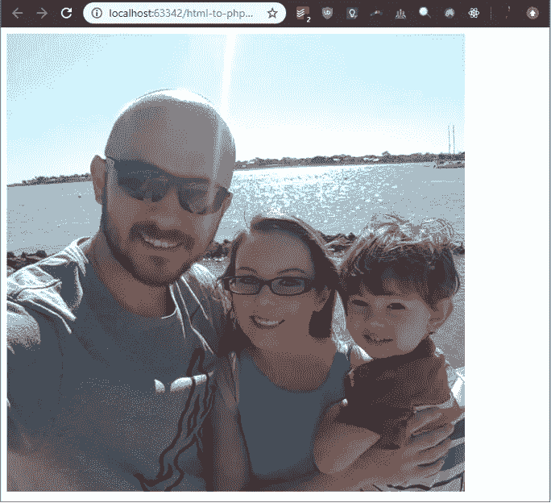

为了设置图像的高度和宽度，我们将应用`height`和`width`属性。

```
img { height: 200px; width: 300px;}
```

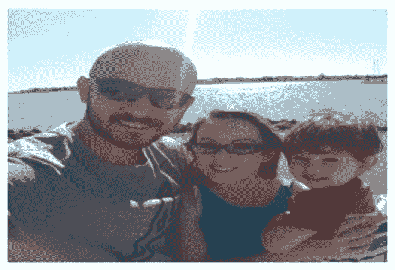

您可能已经注意到当前的高度和宽度值扭曲了图像。为了让图像保持其自然比例，我们可以添加`width`或`height`属性，但不能两者都添加。

```
img { height: 200px; }
```


我们还可以通过应用 border 属性为图像添加边框。

```
img { height: 200px; border: 5px cornflowerblue solid;}
```


我们甚至可以通过调整边框半径将方形图像变成圆形图像。

```
img { height: 200px; border-radius: 50%;}
```


通过减小半径，我们可以将方形图像转换成圆角图像。

```
img { height: 200px; border-radius: 20px;}
```


# 背景调整

首先，让我们创建一个内部`div` 元素居中的全高横幅。

让我们将背景颜色从蓝色修改为实际的图像。我将从 [Pixabay](https://pixabay.com/photos/sun-sunrise-field-cabin-house-hut-5685447/) 中获取一个图像。


删除`background-color` 属性，替换为`background` 属性。将`url` 指向保存图像的路径。由于我的图像与我的文件在同一个文件夹中，我可以将图像名称添加到`url()` 功能中。

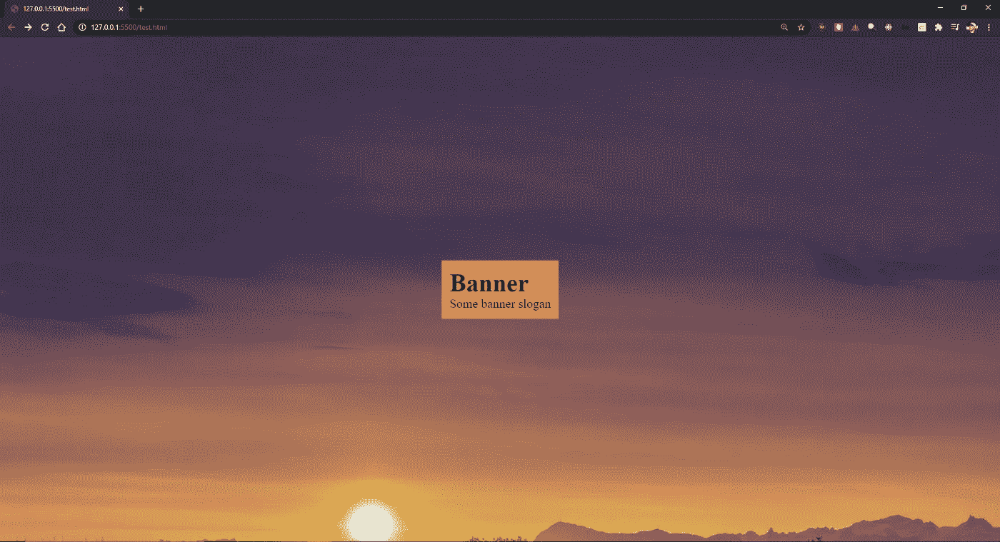

如果我调整浏览器的大小，它实际上会显示图像的左上角。我想让它围绕图像的中心调整大小。我们可以用`background-position` 属性来实现。

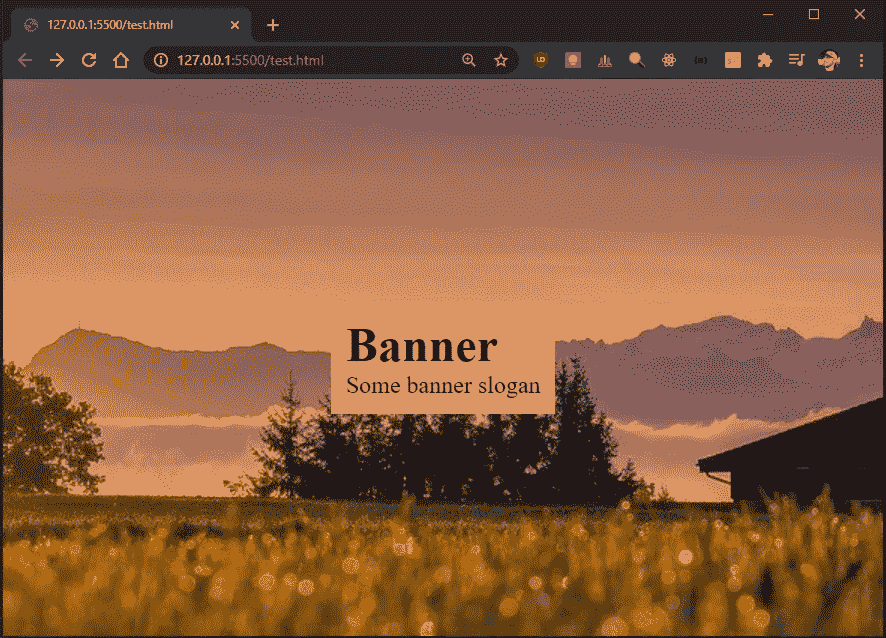

如果图像很大，这很好，但是如果图像不是那么大呢？让我们来看看这张图片的缩小版。

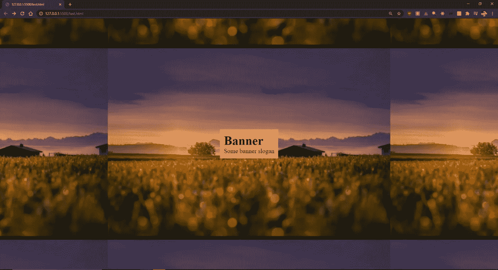

看起来不太像我们预想的那样。大多数时候，我们只是想拉伸图像来填满空间。让我们从消除重复开始。我们将把`background-repeat` 属性设置为`no-repeat`。

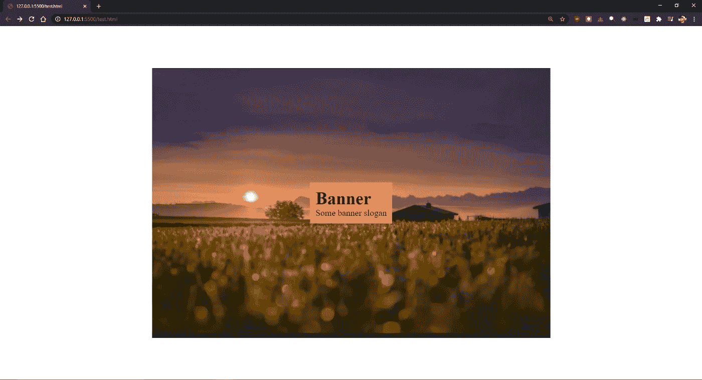

不幸的是，我们现在有一堆空白。它在屏幕中央的原因是因为`background-position` 属性之前被设置为*居中。让我们拉伸图像来填满容器的空间。我们可以通过将`background-size` 属性设置为`cover`来实现。*

根据您的屏幕分辨率和图像质量，图像可能看起来模糊。多模糊是可以接受的？这由你来决定。

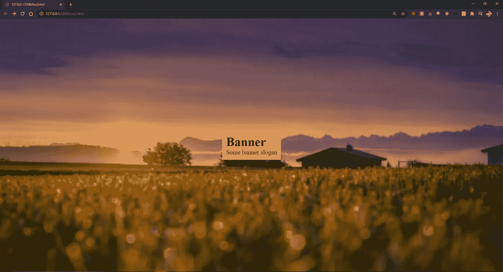

# 文字移动时横幅图像被修复

你有没有见过这样的页面，当你开始向下滚动时，图像是固定的，而文本是移动的？这也很容易实现。让我们创建一个包含三个`div` 元素的页面。

*   第一个和第三个`div` 将有一个鲑鱼背景颜色，而第二个`div`将有一个背景图像。背景图片只是为了帮助更进一步的可视化这个过程。
*   每个`div` 还会有一个`p` 标签，标签内会有一些文本。`p` 标签将会是蓝色的，并且会有一些填充。
*   每个`div` 的高度都会是`100vh`。
*   每个`div` 内的每个`p` 标签将在屏幕上居中。

我们以前做过所有这些。不应该有任何让你害怕的东西。

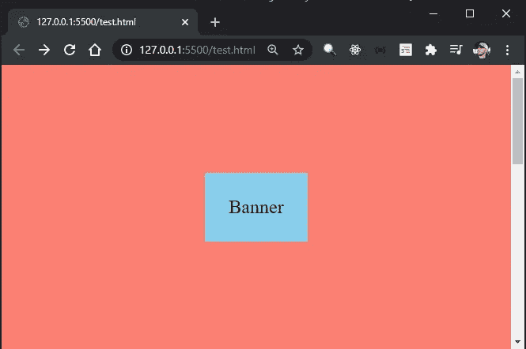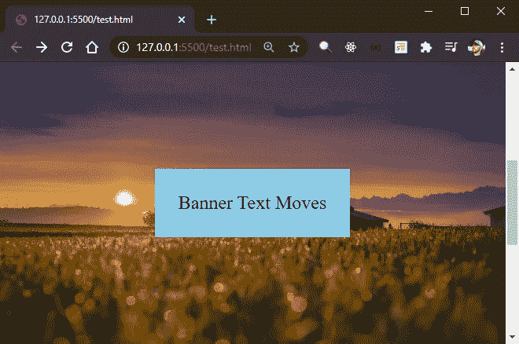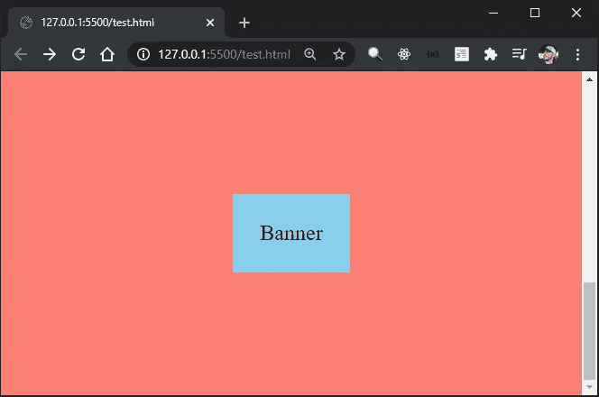

对于那些感到恐慌的人，让我们快速浏览一下 CSS。任何时候一个属性在`div`之间重复，我都会把它分离出来。例如，我们将为`banner` 和`banner-fixed` 类设置高度为`100vh`，所以我将它们分组。其他一切都应该是不言自明的。

让我们看看向下滚动页面时会发生什么。

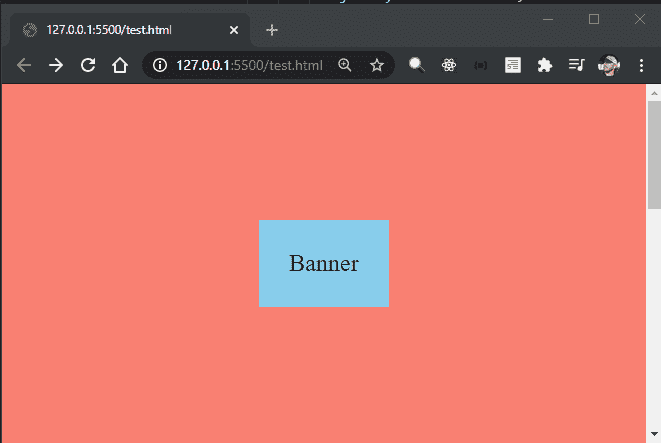

到目前为止，它的表现就像我们习惯看到的普通网页。第二个`div` 的内容和背景图像一起移动。让我们通过在内容移动时固定第二个 div 的背景图像来改变这一点。我们可以通过将`background-attachment` 属性设置为`fixed` *来实现。*

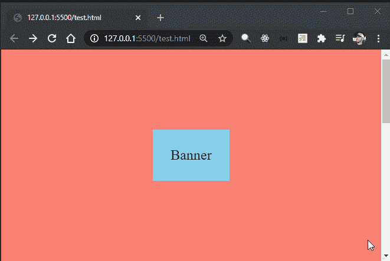

# 使背景图像变暗

如果您有一个横幅图像，并且您希望文本弹出，您可能希望将背景图像变暗。为此，让我们创建一个横幅并添加一些文本。我们将使用`flex` 使文本居中，并将字体设置为白色和粗体。这看起来相当不错。

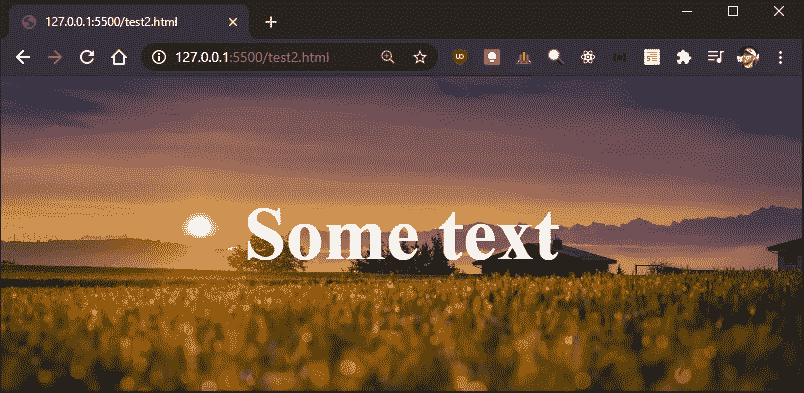

如果我们想让图像稍微暗一点，我们可以用`50%`不透明度应用一个线性渐变，然后增加或减少它。线性渐变应用于`background` 属性。

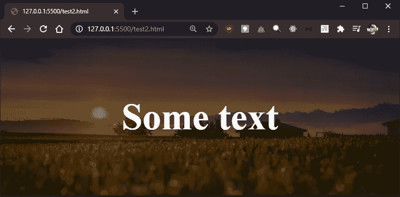

# 使图像适合容器

您可能以前遇到过这个问题。你有一个容器，容器里有一个图像。图像对于容器来说太大了，所以它会溢出容器。

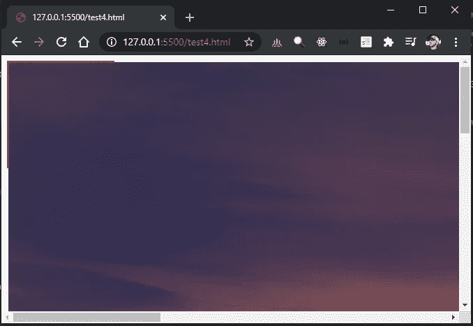

我们可以使用`overflow` 属性并将其设置为`hidden`。为了使图像居中，我们可以使用`flex`。

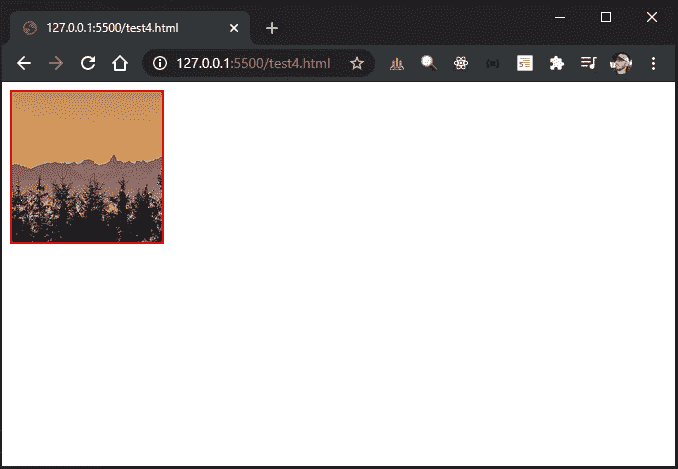

# 结论

嗯，有点过于形象化了。就像我说的，你可以开始写，永远写不完。为了结束这篇文章，我不得不停下来。下一集见。


迪诺·卡希奇目前是 [LSBio(寿命生物科学公司)](https://www.lsbio.com/)、[绝对抗体](https://absoluteantibody.com/)、 [Kerafast](https://www.kerafast.com/) 、[珠穆朗玛生物科技](https://everestbiotech.com/)、[北欧 MUbio](https://www.nordicmubio.com/) 和 [Exalpha](https://www.exalpha.com/) 的 IT 主管。他还担任我的自动系统的首席执行官。他有十多年的软件工程经验。他拥有计算机科学学士学位，辅修生物学。他的背景包括创建企业级电子商务应用程序、执行基于研究的软件开发，以及通过写作促进知识的传播。

你可以在 [LinkedIn](https://www.linkedin.com/in/dinocajic/) 上联系他，在 [Instagram](https://instagram.com/think.dino) 上关注他，或者[订阅他的媒体刊物](https://dinocajic.medium.com/subscribe)。

阅读 Dino Cajic(以及 Medium 上成千上万的其他作家)的每一个故事。你的会员费直接支持迪诺·卡吉克和你阅读的其他作家。你也可以在媒体上看到所有的故事。