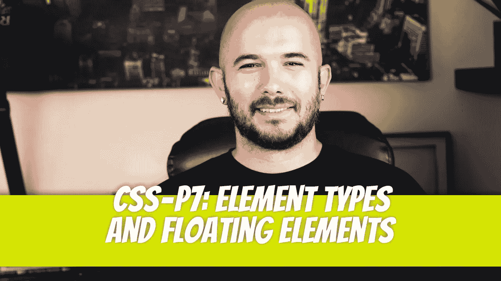
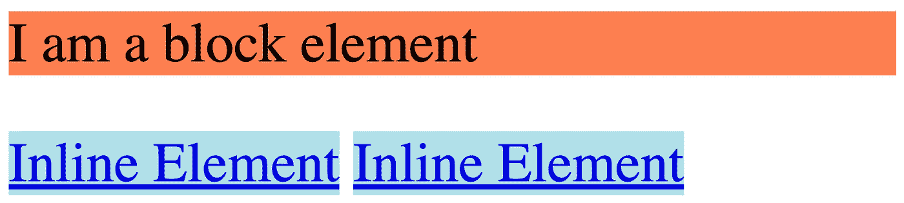
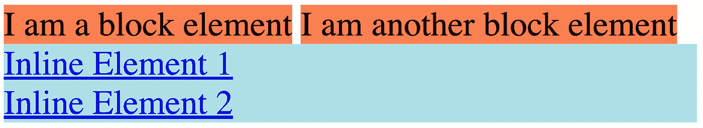
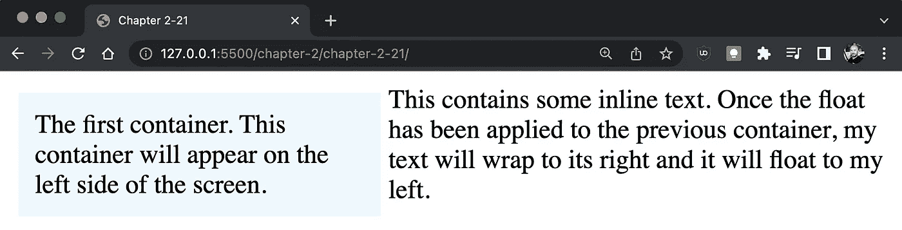
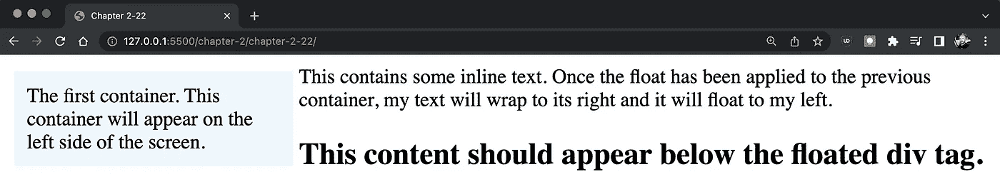
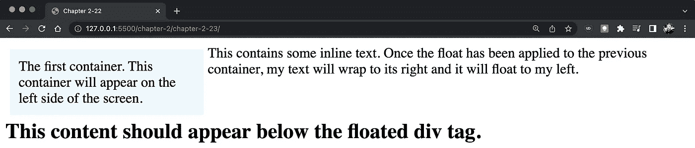
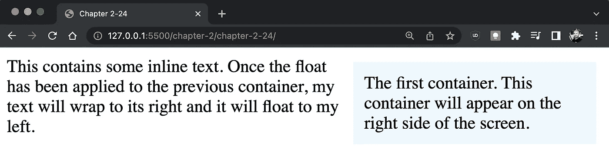
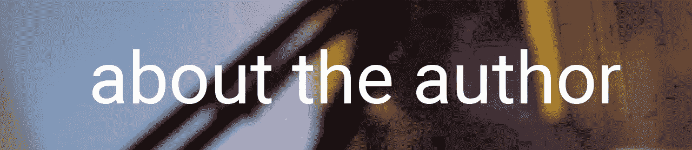

# CSS — P7:元素类型和浮动元素

> 原文：<https://blog.devgenius.io/css-p7-element-types-and-floating-elements-a382632731?source=collection_archive---------9----------------------->



您可能已经注意到，在我们前面的例子中，当我们输入某些 HTML 标签时，比如`<p>`或< `h1` >，这些元素都显示在新的一行上。当我们输入像`<a>`这样的标签时，这些元素会并排显示。

[](/css-p6-image-styling-2b65d82e840e) [## CSS — P6:图像样式

### 就像任何 CSS 样式一样，我们可以开始写，永远不会结束，因为有太多独特的方式…

blog.devgenius.io](/css-p6-image-styling-2b65d82e840e) 

# 元素类型

元素，如段落元素，称为**块**元素。块元素将出现在新的一行上，并将跨越容器宽度的 100%。 **Inline** 元素将是它们所包含内容的宽度。因为行内元素不跨越容器的宽度，所以未样式化的行内元素将彼此相邻出现。

```
<p>I am a block element</p><a href="#">Inline Element</a><a href="#">Inline Element</a> /* CSS */p { background-color: coral; }a { background-color: powderblue; }
```



一些常见的块级元素有:

*   `<article>`
*   `<div>`
*   `<form>`
*   `<h1>, <h2>, <h3>, <h4>, <h5>, <h6>`
*   `<main>`
*   `<nav>`
*   `<p>`
*   `<section>`
*   `<table>`

一些常见的行内元素有:

*   `<a>`
*   `<button>`
*   `<em>`
*   `<i>`
*   ``
*   `<input>`
*   `<select>`
*   `<span>`
*   `<strong>`
*   `<textarea>`

通过使用 display 属性，行内元素可以表现为块元素，而块元素可以表现为行内元素。我们将把段落标签的显示属性值设置为 inline，锚标签的显示属性值设置为 block。

```
<p>I am a block element</p><p>I am another block element</p><a href=”#”>Inline Element 1</a><a href=”#”>Inline Element 2</a> /* CSS */p { background-color: coral; display: inline; }a { background-color: powderblue; display: block;}
```



块元素现在的行为类似于行内元素，反之亦然。要结合内联和块级元素的特征，我们可以使用:

`display: inline-block`

我们将很快更详细地查看显示属性。

# **浮动元素**

在上一节中，我们研究了如何显示彼此对齐的块级元素，以及如何在彼此之上显示内联元素。使用 float 属性，我们可以进行更多的控制。float 属性应用于希望其他元素在其旁边浮动的元素。让我们看一个例子。如果我们将`float` : `left`应用到`div`标签上，它旁边的内容将出现在它的右侧。

```
<div class=”add-left-float”> The first container. This container will appear on the left side of the screen.</div><span> This contains some inline text. Once the float has been applied to the previous container, my text will wrap to its right and it will float to my left.</span>/* CSS */div { width: 200px; background-color: aliceblue; padding: 10px; margin: 5px;}.add-left-float { float: left; }
```



如果有空间，浮动元素之后的所有元素都将服从它的行为。再加一个< 【 > element and see where it appears.

```
<div class=”add-left-float”> The first container. This container will appear on the left side of the screen.</div><span> This contains some inline text. Once the float has been applied to the previous container, my text will wrap to its right and it will float to my left.</span><h2> This content should appear below the floated div tag.</h2>/* CSS */div { width: 200px; background-color: aliceblue; padding: 10px; margin: 5px;}.add-left-float { float: left; }
```



In order to display the 【 tag below the content, like it normally would, we have to first clear the float property. Since we want the text inside the span tag to 【 to the 【 , we must clear the 【 inside the 【 tag.

```
div { width: 200px; background-color: aliceblue; padding: 10px; margin: 5px;}.add-left-float { float: left; } h2 { clear: both; }
```



We can also float the div element to the right of the span tag by applying the right 【 property.

```
<div class=”add-right-float”> The first container. This container will appear on the right side of the screen.</div><span> This contains some inline text. Once the float has been applied to the previous container, my text will wrap to its right and it will float to my left.</span>/* CSS */div { width: 200px; background-color: aliceblue; padding: 10px; margin: 5px;}.add-right-float { float: right; }
```



Dino Cajic is currently the Head of IT at [LSBio(寿命生物科学公司)](https://www.lsbio.com/)、[绝对抗体](https://absoluteantibody.com/)、 [Kerafast](https://www.kerafast.com/) 、[珠峰生物](https://everestbiotech.com/)、[北欧 MUbio](https://www.nordicmubio.com/) 和[艾阿尔法](https://www.exalpha.com/)。他还担任我的自动系统的首席执行官。他有十多年的软件工程经验。他拥有计算机科学学士学位，辅修生物学。他的背景包括创建企业级电子商务应用程序、执行基于研究的软件开发，以及通过写作促进知识的传播。

你可以在 [LinkedIn](https://www.linkedin.com/in/dinocajic/) 上联系他，在 [Instagram](https://instagram.com/think.dino) 上关注他，或者[订阅他的媒体出版物](https://dinocajic.medium.com/subscribe)。

阅读 Dino Cajic(以及 Medium 上成千上万的其他作家)的每一个故事。你的会员费直接支持迪诺·卡吉克和你阅读的其他作家。你也可以在媒体上看到所有的故事。