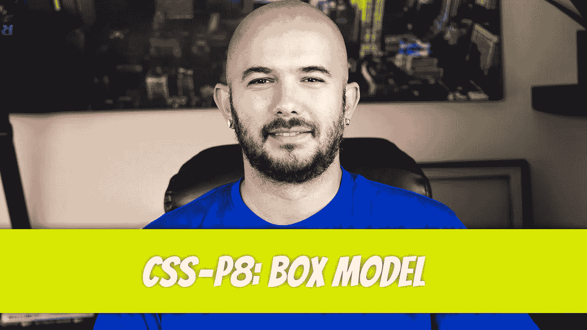
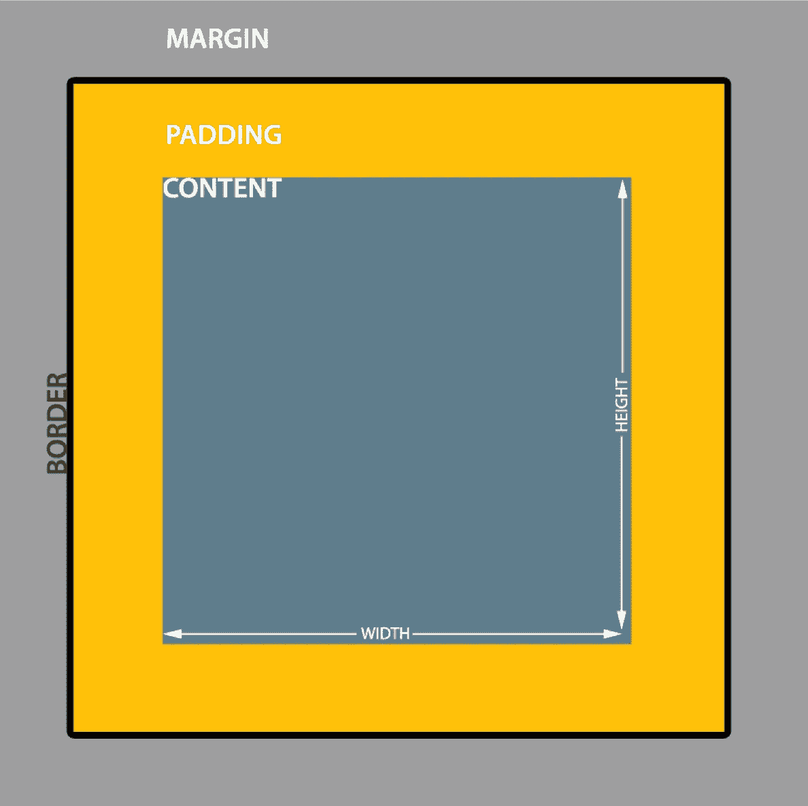
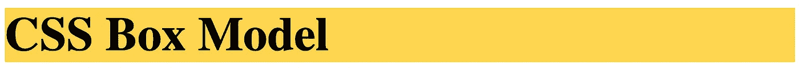
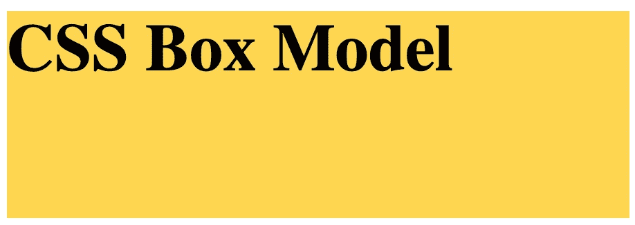
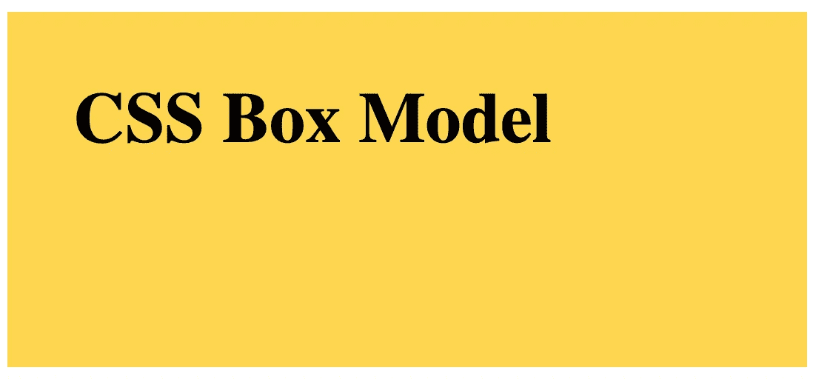
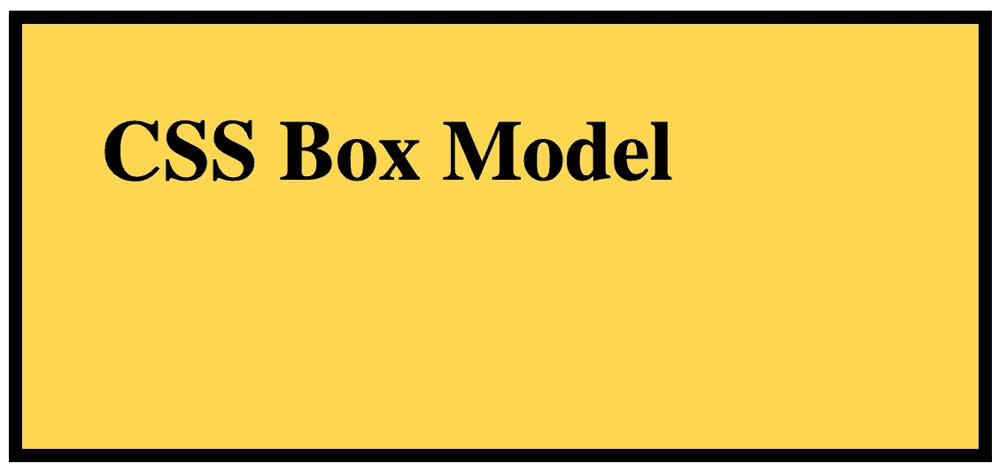
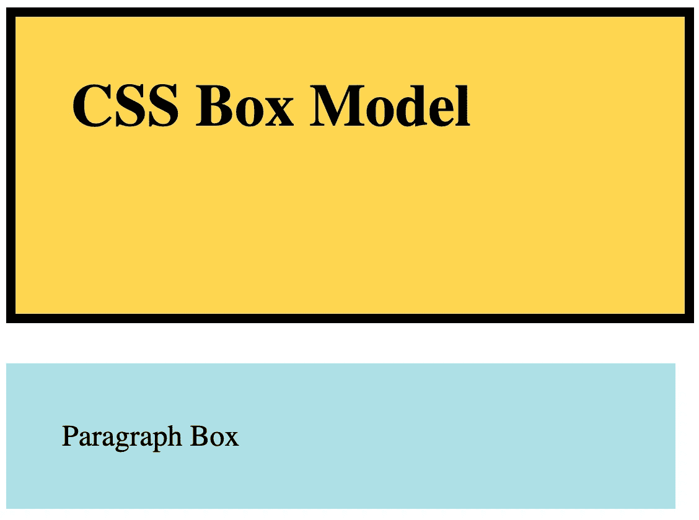
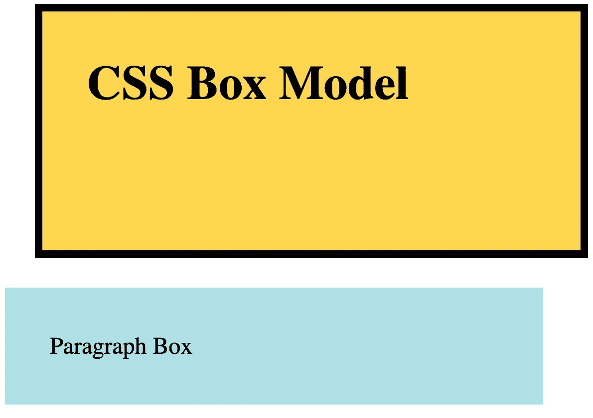
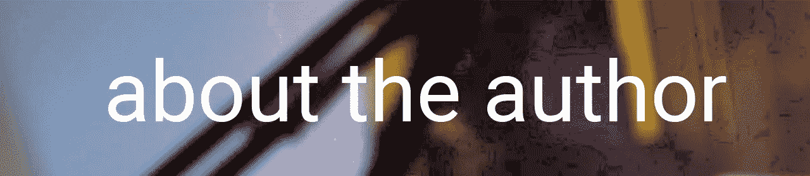

# CSS — P8:盒子模型

> 原文：<https://blog.devgenius.io/css-p8-box-model-d4e93b3132a5?source=collection_archive---------17----------------------->



块类型元素基于盒子模型的原理。箱式模型由以下部分组成:

**内容框**

*   更改内容框的大小
*   使用宽度和高度属性

**填充框**

*   在内容周围添加空白
*   使用填充属性

**边框框**

*   在填充框周围添加边框
*   使用边框属性

**边距框**

*   在边框和其他 HTML 元素之间添加空白
*   使用 margin 属性



解释盒子模型最简单的方法是通过一个例子。我们首先创建一个

# 元素，并将它的背景色设置为浅琥珀色。

```
<h1>CSS Box Model</h1>/* CSS */h1 { background-color: #FFD54F;}
```



我们可以开始用`width`和`height`属性修改盒子模型的内容部分。宽度和高度属性将改变容器的大小。

```
h1 { background-color: #FFD54F; width: 300px; height: 100px;}
```



接下来，我们将使用 padding 属性添加填充。填充也会改变容器的`width`和`height`，因为添加了额外的像素。可以按如下方式添加填充值:

`padding: 30px;`

*   在内容周围添加一个`30px` `padding`

`padding: 10px 25px;`

*   在内容的上方和下方添加一个`10px` `padding`，在内容的左侧和右侧添加一个`25px` `padding`

`padding: 10px 30px 20px;`

*   在内容上方添加一个`10px` `padding`，在内容左侧和右侧添加一个`30px` `padding`，在内容下方添加一个`20px` `padding`

`padding: 10px 25px 5px 30px;`

*   在内容上方增加一个`10px` `padding`，内容右侧增加一个`25px` `padding`，内容下方增加一个`5px` `padding`，内容左侧增加一个`30px` `padding`

`padding-top: 10px;`

*   `10px`上面增加了一个`padding`的内容

`padding-right: 10px;`

*   在内容的右边添加一个`10px` `padding`

`padding-bottom: 10px;`

*   `10px`在内容下面增加了一条`padding`

`padding-left: 10px;`

*   在内容的左边添加一个`10px`T5

```
h1 { background-color: #FFD54F; width: 300px; height: 100px; padding: 30px;}
```



设置边框需要将 border 属性添加到填充框的外边缘。就像填充一样，border 属性有许多可接受的值。我们将只讨论两个:

`border: solid;`

*   在填充框周围添加一个`solid`黑色`border`。
*   其他风格还有:`dotted`、`dashed`、`double`、`groove`等。

`border: 2px solid;`

*   在填充框周围添加一个`2px` `solid` `border`。

```
h1 { background-color: #FFD54F; width: 300px; height: 100px; padding: 30px; border: 5px solid;}
```



添加边距会将边框推离其他 HTML 元素。我们可以用下面的例子来说明。我们将从在`<h1>`元素下面插入一个`<p>`元素开始。我们将为该段落添加一些样式，以便于可视化。

```
<h1>CSS Box Model</h1><p>Paragraph Box</p>/* CSS */h1 { background-color: #FFD54F; width: 300px; height: 100px; padding: 30px; border: 5px solid;}p { background-color: powderblue; padding: 30px; width: 300px;}
```



现在，我们将为`<h1>`选择器添加一个边距。这将在`<h1>`元素周围添加空白。

```
h1 { background-color: #FFD54F; width: 300px; height: 100px; padding: 30px; border: 5px solid; margin: 20px;}p { background-color: powderblue; padding: 30px; width: 300px;}
```



像填充一样，也有许多方法来表示边距值:

`margin: 30px;`

*   在边框周围添加一个`30px` `margin`

`margin: 10px 25px;`

*   在边框上下添加一个`10px` `margin`，在边框左右添加一个`25px` `margin`

`margin: 10px 30px 20px;`

*   在边框上方添加一个`10px` `margin`，在边框左右各添加一个`30px` `margin`，在边框下方添加一个`20px` `margin`

`margin: 10px 25px 5px 30px;`

*   在边框上方添加一个`10px` `margin`，在边框右侧添加一个`25px` `margin`，在边框下方添加一个`5px` `margin`，在边框左侧添加一个`30px` `margin`

`margin-top: 10px;`

*   在边框上方添加一个`10px` `margin`

`margin-right: 10px;`

*   在边框右侧添加一个`10px` `margin`

`margin-bottom: 10px;`

*   在边框下方添加一个`10px` `margin`

`margin-left: 10px;`

*   在边框左侧添加一个`10px` `margin`



Dino Cajic 目前是 [LSBio(寿命生物科学公司)](https://www.lsbio.com/)、[绝对抗体](https://absoluteantibody.com/)、 [Kerafast](https://www.kerafast.com/) 、[珠穆朗玛生物](https://everestbiotech.com/)、[北欧 MUbio](https://www.nordicmubio.com/) 和 [Exalpha](https://www.exalpha.com/) 的 IT 负责人。他还担任我的自动系统的首席执行官。他有十多年的软件工程经验。他拥有计算机科学学士学位，辅修生物学。他的背景包括创建企业级电子商务应用程序、执行基于研究的软件开发，以及通过写作促进知识的传播。

你可以在 [LinkedIn](https://www.linkedin.com/in/dinocajic/) 上联系他，在 [Instagram](https://instagram.com/think.dino) 上关注他，或者[订阅他的媒体刊物](https://dinocajic.medium.com/subscribe)。

阅读 Dino Cajic(以及 Medium 上成千上万的其他作家)的每一个故事。你的会员费直接支持迪诺·卡吉克和你阅读的其他作家。你也可以在媒体上看到所有的故事。