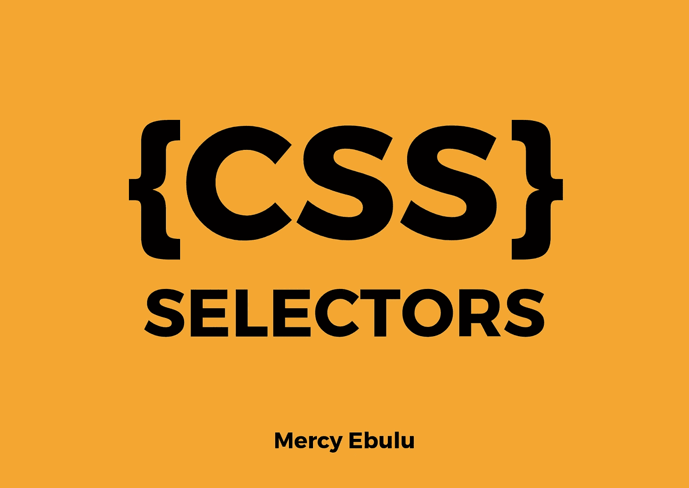

# CSS 选择器:基本演练！

> 原文：<https://blog.devgenius.io/css-selectors-a-basic-walkthrough-55fef1a2d8e9?source=collection_archive---------10----------------------->



用 Canva 创建的图像

理解 CSS 最重要的关键是理解选择器及其工作。您并不总是希望 HTML 文档中相同类型的所有元素都采用相同的样式。例如，如果您的文档是一篇带有侧边栏的文章，您可能希望对文章和侧边栏中的段落元素应用不同的样式。CSS 选择器允许我们将特定的 HTML 元素作为目标，并在声明块中使用样式。这篇文章将带你了解基本的 CSS 选择器。莱格。

**通用 CSS 规则。**

每个 CSS 规则都遵循一般模式。

```
selector{
  property:value;
  }
```

我们有一个选择器(例如 h2，p，form)和一个声明块({})，在这里我们声明我们的样式，属性可以是背景色，字体大小，属性值可以是红色，居中对齐等等。

让我们来看看今天我为你准备了什么！

**#1。通用选择器:**

我把这个选择者称为上帝选择者，所有选择者之母，所有选择者之母，一个选择者统治他们所有人。这就是它的强大之处。
通用选择器选择页面上的每个标签，因此我们可以用一个规则来设计每个标签或元素的样式，通用选择器使用*。不需要列出 HTML 文档中的所有标签来实现特定的样式，就像这样:

```
p h1 img h2 ul li{
        background-color:red;
        }
```

使用通用选择器更安全。

```
/* This will implement the following styling properties to all the tags and elements in the HTML document*/*{
background-color:red;
font-size:20px;
line-height:5px;
color:#658gdc;
}
```

**#2。元素类型选择器:**

```
/* selects all paragraphs in the HTML document*/p{
 Color:blue;
 font-size:15px;
 }
```

这是将 CSS 样式应用到我们的 HTML 文档的最熟悉和最简单的方法。元素类型选择器选择页面上出现的标签或元素的所有实例。在我们的例子中，我们会给页面上所有的 HTML 元素指定颜色和字体大小。

**#3。类别选择器:**

```
/* Selects all elements with class of 'green'*/.green{
      margin:10px;
      border: green 3px solid;
      color:green;
}
```

**类**选择器可能是最有用和最通用的选择器。当您想要为多个元素重用一个样式时，最好使用类选择器。你在 CSS 中写这个的方法是，你写下你的类的名字并加上一个点(。)在它前面。

在上面的例子中，这告诉浏览器嘿！这是一个类选择器，选择所有具有 class 属性且值为绿色的元素，并为其分配以下样式属性。

> 注意:类选择器允许样式的重用。

**#4。ID 选择器:**

ID 属性仅特定于一个元素。如果出于某种原因，您希望将某个样式应用于某个元素，那么您可以为该元素添加一个 ID 属性，然后使用 CSS 中的 ID 选择器对其进行样式化。ID 选择器就像类选择器一样，只是在 ID 属性的名称前面加了一个#号。这个选择器在 CSS 特异性方面是最强大的。

> **注意:**元素 ID 的值在网页上必须是唯一的。在同一个文档中多次使用一个 ID 的值违反了 HTML 标准。ID 选择器是严格的，不允许样式的重用。

```
/* Selects the element with the id attribute set to #nav-link*/#nav-link{
        Padding:10px;
        margin:5px;
        display:flex;
        }
```

**#5。选择器列表:**

CSS 选择器列表允许我们一次用不同的选择器选择多个元素，并设置它们的样式。这是通过将它们分组到一个逗号分隔的列表中来完成的，CSS 选择列表中所有匹配的元素。

> **注意:**当你以这种方式分组选择器时，如果任何一个选择器无效，整个规则将被忽略。

```
/* Selects all matching elements in the List */div, span, p{
     color:rgb(0,0,0);
     text-align:center;
}
```

**组合器选择器**

这组选择器组合了其他选择器，以便定位 HTML 文档中的元素。

当一个 CSS 选择器包含不止一个简单的选择器时，它被称为**组合子**，因为它显示了两个单个选择器之间的关系。

我们将在下面讨论 CSS 中的四种类型的组合子:

1.  **后代选择器**

这个选择器允许我们选择其他选择器的后代元素。它使用空白作为元素之间的分隔符。

```
/* Selects all <a>'s that are nested inside an <ol>*/ol a{
    text-decoration:none;
    color:teal;
}
```

> **注意:**我们正在设计嵌套在< ol >中任何位置的所有< a >，它不一定是第一个子对象或第一个依赖对象，它可以是嵌套在 ol 中的任何位置。术语“后代”表示嵌套在 DOM 树中的任何位置。它可以是一个直接的孩子或者比 3 层更深，但是它仍然被称为后代。

2.**直接子组合子**

这个组合子的行为更像后代组合子，但它更关注父元素的直接子元素。这个组合器使用>作为元素之间的分隔符。

```
/* Selects all <p> that are direct children of a <div>*/
 div > <p>{
      color:blue;
}
```

> 值得注意的是，后代组合子识别所有的后代，包括嵌套在父元素中的子元素和孙元素。但是直接子组合子顾名思义**这里不允许孙子！**

3.**相邻兄弟姐妹组合子**

```
div + p{background-color:green;}
```

相邻的兄弟组合符由两个选择器之间的加号(+)表示。这个选择器在另一个指定元素之后选择紧随其后的指定 HTML 元素，这两个元素必须是同一个父元素的子元素或者它们必须是兄弟元素。

上面的例子将选择第一个段落元素，它紧接在 div 元素之后，也是它的兄弟元素。

4.**通用兄弟组合子**

一般的同级组合由 Tlide 运算符(~)字符表示。

该组合器选择所有位于另一个指定元素之后的指定 HTML 元素，并且它们必须是同一父元素的子元素。

```
div~p{
   background-color;
}
```

上面的例子将选择所有段落元素，这些元素是 div 元素的兄弟元素，并且被放置在 div 元素之后。

在这篇文章的下一部分，我们将研究**属性选择器**和 CSS 中广泛使用但令人困惑的一组选择器，**伪选择器。**

我雇佣你来获取这些知识，并编写一些你会引以为豪的顶级 CSS 样式。

我对以下平台的连接持开放态度:

[推特](https://twitter.com/mercysticks)

[密码笔](https://codepen.io/your-work)

谢谢大家！