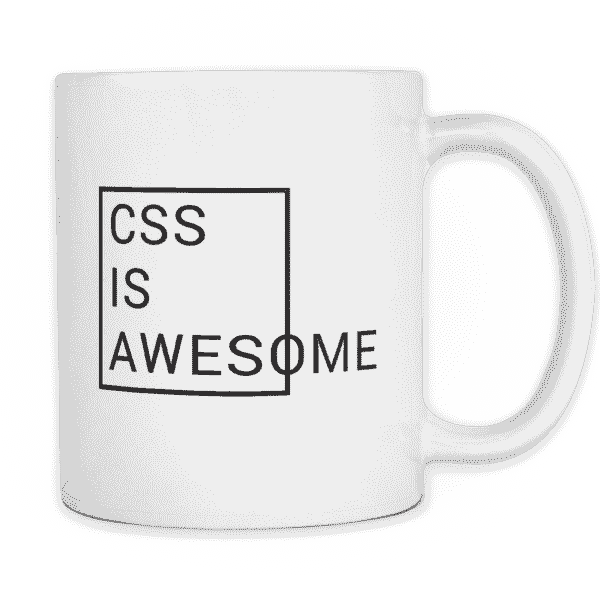

# CSS 特异性

> 原文：<https://blog.devgenius.io/css-specificity-17649dadff14?source=collection_archive---------9----------------------->



CSS 中更令人困惑(但也很重要)的一点是特异性。我不得不承认，这个概念花了我相当长的时间来理解。虽然这确实有点令人困惑，但是一旦你掌握了窍门，它实际上是相当简单的。也就是说，这里有一个关于理解 CSS 特异性的快速“什么和如何”方法。

## “什么”

按照规则，浏览器会从上到下读取你的 CSS 文件。这意味着如果你有两个 h1 选择器，文件中较低的那个将被读取。

```
h1 {
   color: red
}
h1 {
   color: orange
}
//Browser will display h1’s in orange since it is lower down
```

很多时候，当你写 CSS 的时候，你会在你的 CSS 文件中写入多个互相矛盾的“规则”。浏览器通过*特殊性*来决定如何对这些规则进行优先级排序。

举例:假设你有一个待办事项清单。每个待办事项都有一个“待办事项”类，但其中一些有唯一的 ID(不建议使用 ID，但它们有助于理解特殊性):

```
//HTML

<div class="to-do"> 
    To-Do #1 
</div>
<div class="to-do" id="second-to-do"> 
    To-Do #2 
</div>
<div class="to-do"> 
    To-Do #3 
</div>
```

在样式表中，使用红色背景的“to-do”类来设置每个元素的样式。但是，您也可以将元素的 id 设置为“second-to-do ”,背景颜色为绿色:

```
//stylesheet.to-do{
   background-color: red
}#second-to-do{
   background-color: green
}
```

“嗯……”你的浏览器在遇到第二个待办事项时想，“是哪个，绿色还是红色？”!"

除了你的浏览器实际上并不这么认为，因为(除了浏览器没有大脑)你的浏览器知道根据特殊性来决定风格！继续阅读…

## “如何”

那么浏览器是如何计算特异性的呢？对我们所有人来说，幸运的是，它有一个内置的方式来做到这一点！

浏览器通过用一个从 0000 开始的四位数汇总每个选择器来计算特异性，它是基于四个类别编译的。每当某个元素有两种或两种以上相矛盾的样式时(就像上面的待办事项示例)，具有较大四位数的选择器就是浏览器读取的那个。

让我们把 0000 分解一下:

*   第一个数字(* **0*** 000):由选择器是否具有内联样式或重要关键字(稍后将详细介绍)决定
*   第二位(0* **0*** 00):由选择器是否有 ID 决定。如果它只有一个 ID，没有其他的(如下所示)，那么特异性计算器看起来应该是:0100。如果它有两个 id，计算器将是:0200。

```
//one id, calculator is 0100
#second-to-do{
   background-color: green
}//two ids, calculator is 0200
#second-to-do#fourth-to-do{
    background-color: green
}
```

*   第三位(00* **0*** 0):由选择器是有类还是伪类决定(比如:hover)。有一个类，没有别的，数字是 0010，或者仅仅是 10。有了一个类和一个 ID，这个数字就是 0110，或者仅仅是 110。在下面的例子中，因为 110 大于 10，所以第二个待办事项的背景颜色是绿色。

```
//one class, calculator is 0010
.to-do{
   background-color: red
}//one id one class, calculator is 0110\. 
.to-do #second-to-do{
    background-color: green
}
//Since 0110 is higher than 0010, second to-do will have a background color of green.
```

*   第四位(000* **0*** ):由选择器是否有元素(如 div、h1、p…等)决定。).元素选择器是最不具体的，因为任何类或 id 选择器都不可避免地有一个更大的数字。

```
//one element, calculator is 0001
div{
   background-color: green
}
```

*   回到第一个数字( **0** ):一般来说，最好不要弄乱第一个数字。但是如果必须的话，当元素有内联样式或！**重要的**关键词。同样，这两个都不推荐，所以我不打算太详细。只要知道如果您使用内嵌样式或！重要的关键字，这是你能做到的最具体的(这反过来使你很难重构或调整你的风格，因此不推荐它)。

## 摘要

对 CSS 特异性没有清晰的理解会导致各种各样的头痛。了解浏览器计算特异性的方式是一个重要的工具，可以让你的页面看起来更好，代码更易读。特异性是在浏览器中用一个四位数进行计算的，这个数字是根据！重要的关键字/内联样式、id、类/伪类/属性和元素选择器。！重要样式和内嵌样式是最具体的。身份是第二重要的。类是第三特殊的。元素是最不具体的。

## 其他资源:

文件:【https://www.w3schools.com/css/css_specificity.asp 

特异性计算器:[https://specificity.keegan.st/](https://specificity.keegan.st/)