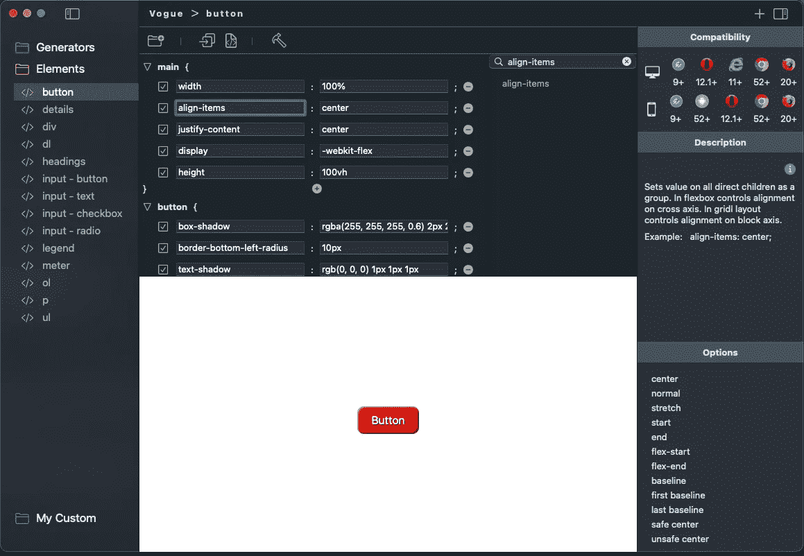
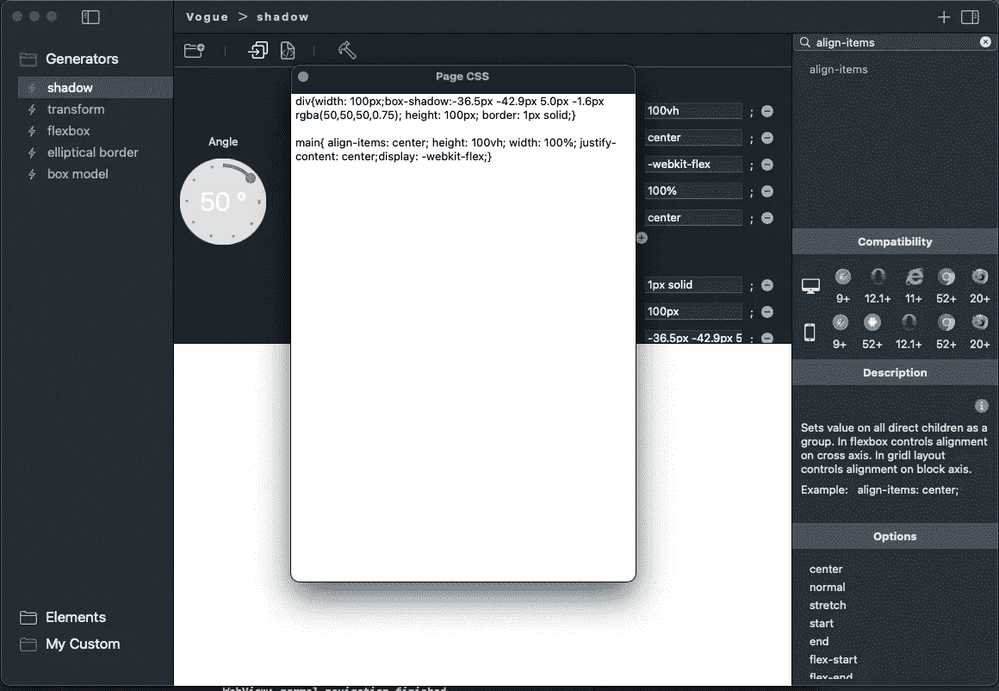

# CSS 工具

> 原文：<https://blog.devgenius.io/css-tool-825f966467e1?source=collection_archive---------7----------------------->

Web 开发人员和 UI/UX 设计人员都非常熟悉 CSS 样式的特点。有很多不同的开发工具用于后端编程，甚至有一些 wysiwyg(所见即所得)编辑器，但是很少有甚至没有真正的 CSS 专用工具。这已经改变了！UglyDawgTools 发布了一款名为 Vogue 的 Mac 专用 CSS 工具。

Vogue 的工作方式与浏览器检查器类似，您可以显示或隐藏属性，以及添加或删除属性。真正给 Vogue 带来优势的是所有的房产信息都在你面前，而不是去搜索网页。

当然，有大量的 CSS 信息散布在网络上，甚至有各种各样的 CSS 生成器可以使用。《Vogue》将许多这一切整合到一个简单的工具中。凭借 HTML 元素模板、CSS 生成器和保存您定制的模板的能力，Vogue 提供了一个不错的平台，或者可以轻松地用于创建严肃的设计。Vogue 还提供了从 CSS 本身到实际的 HTML 页面提取开发人员想要的任何内容的能力。

除了这些机制，Vogue 还拥有从规范 1 到规范 3 的几乎所有 CSS 属性。该工具内置了移动和桌面兼容性信息、属性描述、属性示例和属性值。每个属性还有到 Mozilla 的信息链接，以便更深入地了解属性。

该工具使开发更容易，因为它可以在 webview 中即时热重新加载属性和值更改，而不是更改代码和刷新页面。

我期待 UglyDawgTools 继续开发这个工具。看看吧！