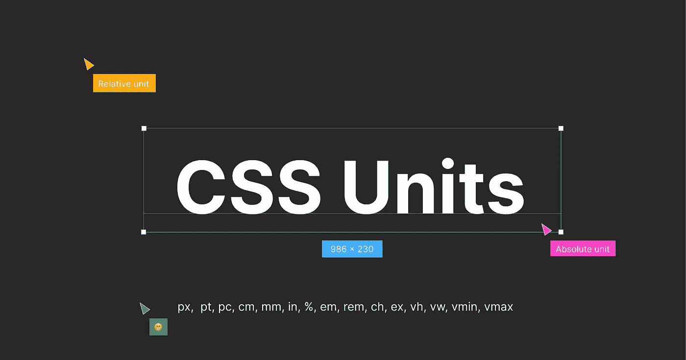
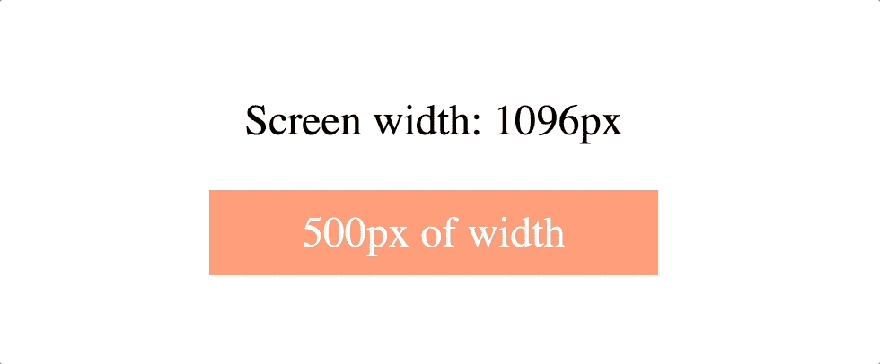
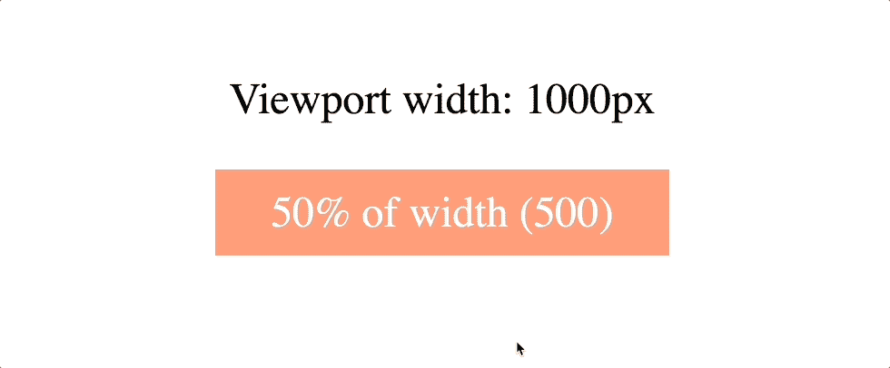
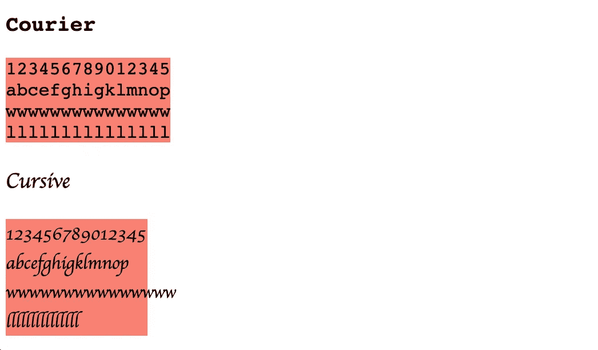
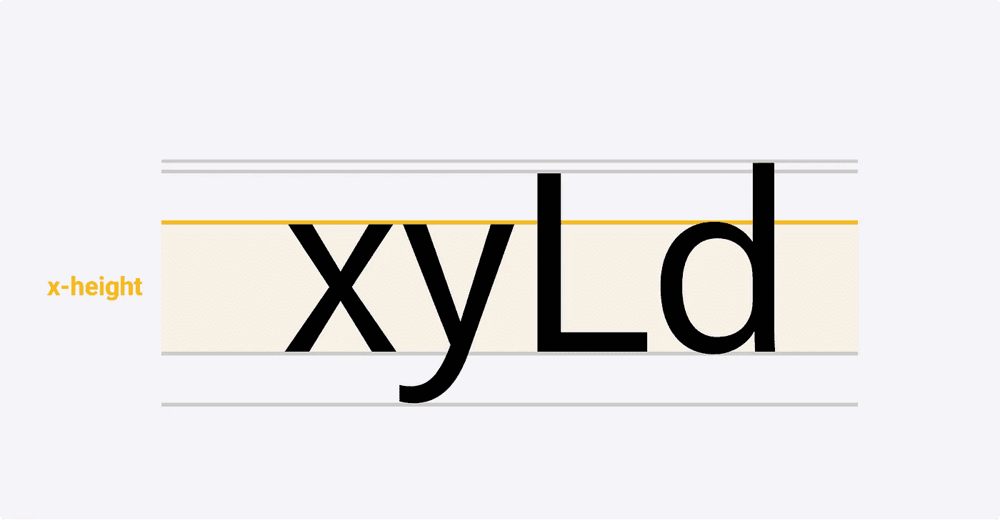

# CSS 单位解释

> 原文：<https://blog.devgenius.io/css-units-explained-35f509387b42?source=collection_archive---------4----------------------->



***👉🏼*** *看我网站上的文章:**[***这里***](https://oukunanan.me/css/css-units-explained?utm_source=medium&utm_medium=referal&utm_campaign=css-units) ***👈🏼****

*CSS 中的每个属性都有一个值，CSS 单元的作用是决定你为内容或元素设置的属性的大小。*

*让我用一个简单的例子给你演示一下*

```
*h1 { font-size: 16px }*
```

*当我们试图提取上述代码时。我们将得到**字体大小**作为属性， **16** 是数值， **px (pixel)** 是单位。*

*这是一个好的开始。现在，你知道 CSS 单元是什么了👍🏼*

# *绝对与相对单位*

*绝对单位*总是相同的，不管它在哪里定义。**

# **绝对单位**

> ***绝对单位与响应站点的比例不匹配，因为当屏幕尺寸更新时，该值不会改变。***

****

**绝对单位**

## **像素**

**px 单元是 CSS 中最常见或最广泛使用的单元。1px 可以定义为 1/96 英寸。**

## **点/点/点**

**1pt 和 1pc 可以分别定义为 1/72 和 1/6 英寸。可惜这两个单位并没有广泛使用而是打印行业常用***(@ media print rule)*****

## **厘米/毫米/英寸**

**如果你看着*真实世界的测量*单位。这三个单元可能适合你。它们主要用于印刷行业的打印机 ***类似于 pt(point)和 pc(pica)*** 。**

# **相对单位**

*****相对*** 的单元是基于某些东西的，可能是父元素，当前字体大小等。**

> ***在与各种屏幕尺寸交互时，相对单位可以得心应手。如果你的网站是响应式的，你应该考虑一下你的相对单位。***

****

**CSS 相对单位**

## **%(百分比)**

**最容易辨认的相对单位。%(百分比单位)相对于该属性的父元素值。**

## **全身长的**

**em 单位将与其父字体大小相关。例如，如果父字体大小等于 ***6px*** ，而您将子字体大小设置为 ***2em*** 。子字体大小等于 16 x 2 = 32px**

## **雷姆**

**类似于 ***em*** 的单位。rem 单位也与字体大小有关，但对于根元素来说，它是 ***< html >*** 元素。如果< html >没有具体的字体大小。浏览器会默认为 ***16px*** 。**

## **荣誉勋爵**

**这个单元有点复杂。让我用一个简短的解释向你详细说明👇🏼**

```
**ch unit is relative to the width of the "0" (zero)**
```

**这是正确的，但一些进一步的信息。**

**相对于任何字体中“0”字符宽度的 ch 单位。**在等宽(固定宽度)字体中。*所有字符宽度相同。1ch 表示一个字符*，但对于其他(可变宽度)字体。*任何给定的字符都可能比“0”字符*更大或更窄。****

****

**CSS ch 单位**

**你可以看到 ***Courier*** 字体中的所有元素与文本内容的宽度完全相同。与 ***草书*** 字体相反，只有数字的宽度与内容相同。**

## **前夫;前妻;前男友;前女友**

**同样，ex unit 将处理等宽(固定宽度),它指的是元素字体的 *x 高度*,通常是小写字母“x”的高度。**

****

**高度**

**ex 单元很少使用。它并不总是以你期望的方式运行。所以，当你使用这个装置时要小心。**

## **vh / vw**

**其余的单位***(VH/VW/vmin/VMAX)***将相对于视口的大小**

**vh 单位相对于视口高度，1vh 等于视口高度的 1%。**

**vw 单位与视口宽度相关，1vw 等于视口宽度的 1%。**

## **vmin / vmax**

**vmin 单位是相对于**最小边**的视口宽度或高度。**

**例如，如果视口尺寸的宽度小于其高度，则 1vmin 可以是 1vw，当视口的高度小于其宽度时， *1vmin 等于 1vh* 。**

**相反，vmax 单位是相对于**最大侧**的视图宽度或高度。就是这样。**

# **结论**

**你应该考虑的一件事是为你的项目选择合适的单元。如果您确实需要您的风格具有可伸缩性或响应性。 ***相对*** 单位是你自己选择的。否则， ***绝对*** 单位。**

**希望这篇文章能帮助你刷新你的 CSS 单元知识💪🏼**