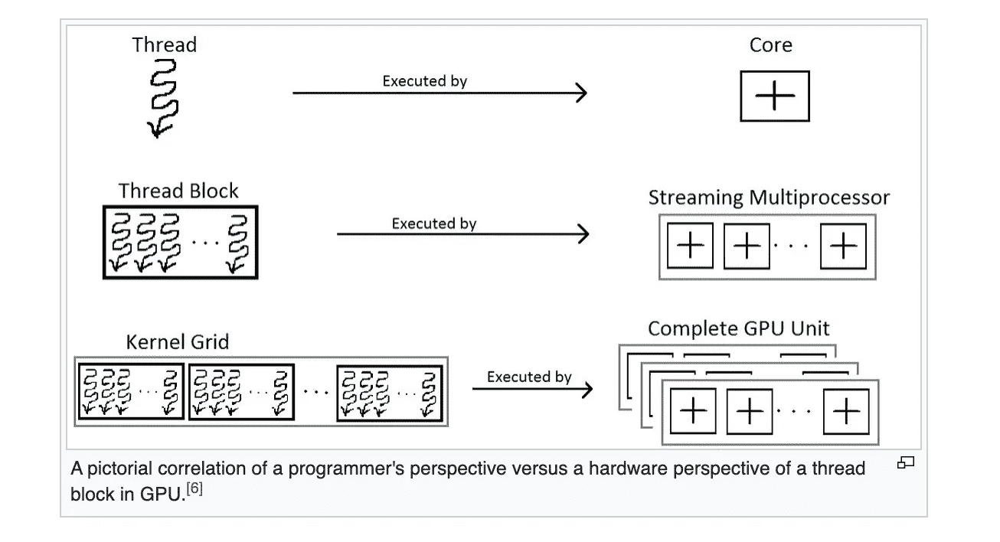

# CUDA 与 GPU 上的并行编程

> 原文：<https://blog.devgenius.io/cuda-and-parallel-programming-on-gpu-dd698d2bd73d?source=collection_archive---------1----------------------->

## CUDA 和 GPU 上的并行编程如何加速计算能力

亨特·哈里特在 [Unsplash](https://unsplash.com?utm_source=medium&utm_medium=referral) 上的照片

随着数据和分析的不断增加，总是需要更多的计算能力。机器学习和深度学习比以往任何时候都发展得更快，需要比现有能力更多的计算能力。GPGPU 来了——通用图形处理单元和 CUDA 计算统一设备架构。

## GPGPU

GPU 是一种可编程处理器，其上有数千个内核并行运行。在早期，GPU 用于加速图像、计算机图形的渲染，GPU 的主要应用是在游戏中。但后来，GPU 被编程来执行通常由 CPU 计算的计算，并被称为[gp GPU](https://en.wikipedia.org/wiki/General-purpose_computing_on_graphics_processing_units)——通用图形处理单元。所有现代的 GPU 都是 GPGPU。

GPGPU 通常由并行计算平台使用。许多人工智能工作负载的模型中有大量的并行性，通常需要几天时间才能在 CPU 上运行一个训练模型。这可以通过利用 GPGPU 的计算能力来显著降低。

对于一个部分可以并行运行并涉及大量计算的应用程序，这些大量计算部分可以分配到 GPU 上执行，而程序的其余部分可以在 CPU 上运行。这就是所谓的混合计算模型。通过这种方式，我们利用 GPU 和 CPU 的能力创建了一个高性能的应用程序。多个 GPU 也可以连接到同一个 CPU，这将提高并行性和计算能力，最终创造一个超级并行计算水平。

## 库达

NVIDIA 通过发明[CUDA](https://en.wikipedia.org/wiki/CUDA)——计算统一设备架构，彻底改变了 GPGPU 和并行计算。CUDA 是一个并行计算平台和编程模型，用于图形处理单元上的一般计算。开发人员可以使用 CUDA 编写应用程序，在 GPU 上调度程序并利用计算能力。

CUDA 支持多种编程语言在 GPU 上编程，包括 C、C++、Fortran、Python 等。NVIDIA 也在 CUDA 之上提供了很多库。这些可以用于跨许多领域的加速程序，如线性代数、图像和视频处理以及深度学习。

## CUDA 编程模型

让我们看看一个程序是如何使用 CUDA 在 GPU 上运行的。

系统中的 CPU 称为主机，与 CPU 相关联的内存称为主机内存。GPU 称为设备，GPU 内存称为设备内存。

以下是运行 CUDA 程序的三个重要步骤

*   程序的输入数据从主机存储器复制到设备存储器，也称为主机到设备传输。
*   程序被加载到 GPU 上并执行。为了提高性能，数据通常缓存在芯片上。
*   最后，结果从 GPU 内存传输回主机内存，也称为设备到主机传输。

CUDA 代码提供了通过 PCIe 总线在主机和设备之间进行数据传输的功能。CUDA 编程模型提供了一个平台，在该平台上，主机在 CPU 上运行 C/C++代码，并且这些代码的一部分作为 CUDA 内核在物理上独立的 GPU 设备上运行。

CUDA 内核是一个在 GPU 上执行的函数。该功能的并行部分在多个不同的 CUDA 线程上执行。

一个 CUDA 线程映射到 CUDA 核心。一组 CUDA 线程称为一个 CUDA 块，多个 CUDA 块组成一个网格。CUDA 内核或函数以线程块网格的形式执行。

每个 CUDA 块由一个流式多处理器执行，一个流式多处理器可以运行多个并发 CUDA 块。CUDA 设备上可以运行多个内核。流式多处理器是具有低时钟速率目标和小缓存的通用处理器。

图片来自[https://en . Wikipedia . org/wiki/Thread _ block _(CUDA _ programming)](https://en.wikipedia.org/wiki/Thread_block_(CUDA_programming))

CUDA 程序可以在兼容 CUDA 的 GPU 上运行。下面是一个示例代码。

当这段代码在 GPU 上运行时，它利用大规模并行性运行。向量的每个元素在 CUDA 块中的不同线程上执行。所有这些线程都是并行独立运行的。您可以看到并行编程是如何为开发人员大大简化的。

## 结论

GPGPU 极大地提高了许多领域的计算能力，包括科学计算、机器学习、信号处理、图像和视频处理等等。

CUDA 并行编程使开发人员能够轻松利用 GPU 的计算能力。

感谢阅读。我希望这有所帮助。请继续关注这个空间的更多文章。

看看我以前的一些相关文章。

 [## 并行计算中的进程是如何通信的？集体通信

### 集体通信导论

medium.com](https://medium.com/mlearning-ai/how-do-processes-communicate-in-parallel-computing-collective-communications-4419d90529c6)  [## 什么是消息传递接口(MPI)？

### 平均弹着点

) ?MPImedium.com](https://medium.com/@getting.better.everyday/what-is-message-passing-interface-mpi-e5cf61d2bcde) 

## 参考

[1]帕拉德普·古普塔，CUDA 复习者:CUDA 编程模型(2020)，[https://developer . NVIDIA . com/blog/CUDA-Refresher-CUDA-Programming-Model/](https://developer.nvidia.com/blog/cuda-refresher-cuda-programming-model/)

[2][https://en . Wikipedia . org/wiki/Thread _ block _(CUDA _ programming)](https://en.wikipedia.org/wiki/Thread_block_(CUDA_programming))