# 带有节点的 Botframework Composer 中的自定义操作。JS(第二部分)

> 原文：<https://blog.devgenius.io/custom-actions-in-botframework-composer-with-node-js-part-2-2b67ecf4701b?source=collection_archive---------5----------------------->

欢迎回到另一个关于创建自定义动作的博客。在我之前的[博客](https://medium.com/@gaikwadjitesh42/custom-actions-in-botframework-composer-with-node-js-part-1-8081b5c7927f)中，我告诉了你事情是如何开始的，在这篇博客中，我将告诉你事情的进展😜

我告诉过你有两种方式来集成定制动作，所以让我们从第一种方式开始，通过[创建组件](https://docs.microsoft.com/en-us/composer/concept-extend-with-code)

*在我们开始之前，请确保您具备* [*文档*](https://docs.microsoft.com/en-us/composer/how-to-create-custom-actions#prerequisites) 中提到的先决条件

## 构建自定义操作

我已经创建了一个示例动作，你可以在这里查看代码[和](https://github.com/JiteshGaikwad/AdditionDialogPackage)，我将快速解释这个包的结构

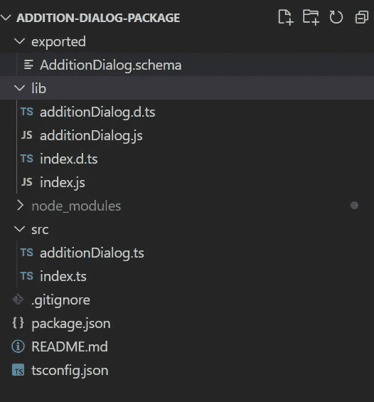

附加对话框包目录

*   ***导出*** :这个文件夹包含了我们自定义动作的模式，它会告诉编写器如何显示我们的组件
*   ***lib*** :这个文件夹包含了我们这个包编译好的代码
*   ***node_modules*** :该文件夹包含构建我们的自定义操作所需的 npm 包
*   ***src*** :该文件夹包含我们的自定义动作代码和 BotComponent 类
*   ***package.json*** :这个文件包含构建我们的包所需的 npm 包的列表
*   ***【tsconfing . JSON***:该文件包含编译包所需的编译器选项

> 如果你看到我上面提到的 git repo，你不会找到`lib`文件夹，那是因为我还没有上传 lib 文件夹，因为你可以在你克隆项目的时候上传

## 构建自定义操作的步骤

一旦您克隆了 repo，请运行以下命令来构建包，我假设您的系统上已经安装了 [nodejs](https://nodejs.org/en/) 和 [typescript](https://www.typescriptlang.org/)

**步骤 1** :构建项目

```
tsc -b
```

现在您将在项目目录中找到`lib`文件夹

**步骤 2** :创建 npm 包

```
npm pack
```

如果您要将**包**发布到 **npm** ，那么 **pack** 命令会创建一个. tgz 文件。运行上面的命令后，您会在项目目录中找到`addition-dialog-package-1.0.tgz`文件

就是这样！现在我们已经有了自定义的动作包，可以与我们的机器人集成了

## 将自定义操作与 Bot Composer 集成的步骤

既然我们已经准备好了定制动作，让我们使用 NodeJS 作为基本语言在 bot composer 中创建一个空 bot。一旦你创建了机器人，你会看到下面的界面

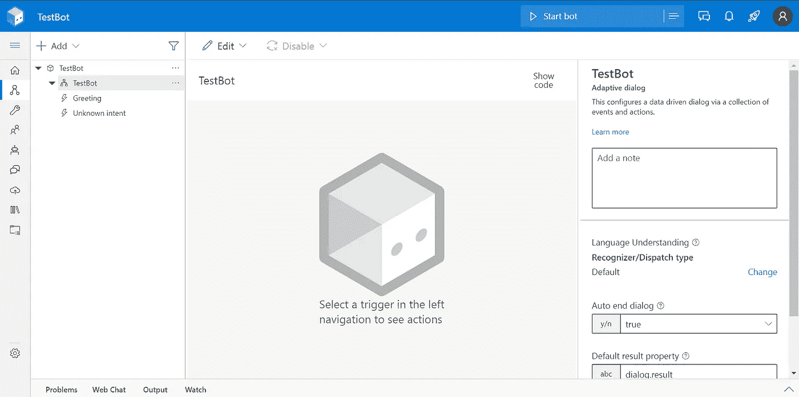

测试机器人

现在让我们转到您创建 bot 的项目目录，

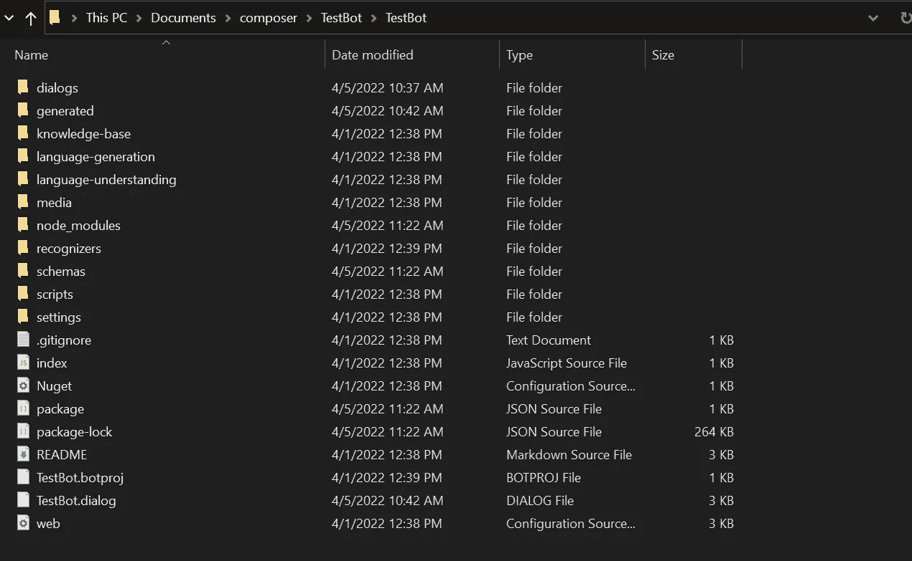

TestBot 项目目录

现在，在这里创建一个空文件夹，命名为`temp`，复制我们创建自定义动作后得到的`addition-dialog-package-1.0.tgz`文件，并将其粘贴到`temp`文件夹中。

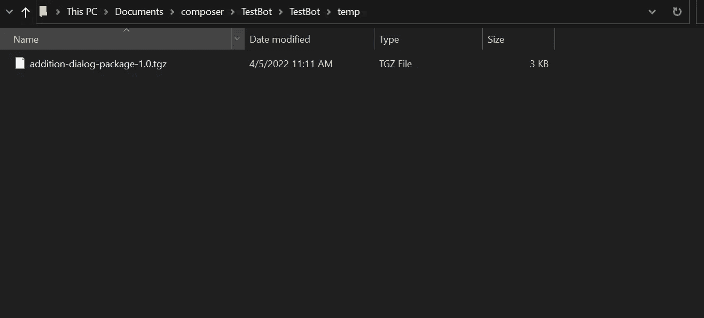

现在让我们编辑机器人的`package.json`文件来注册我们的自定义动作包路径

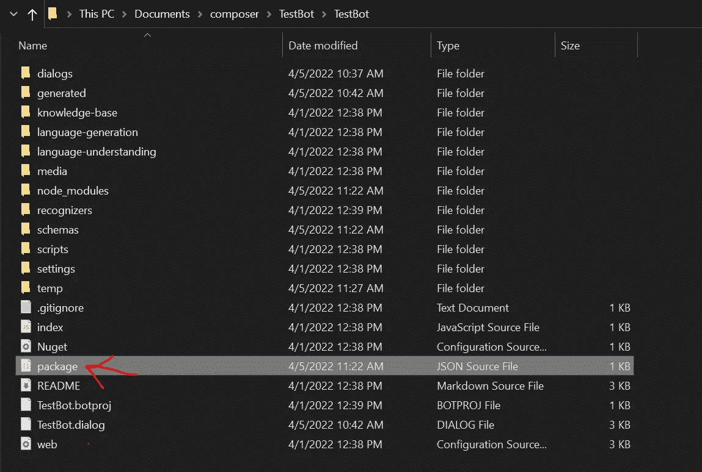

您的`package.json`文件将包含以下内容

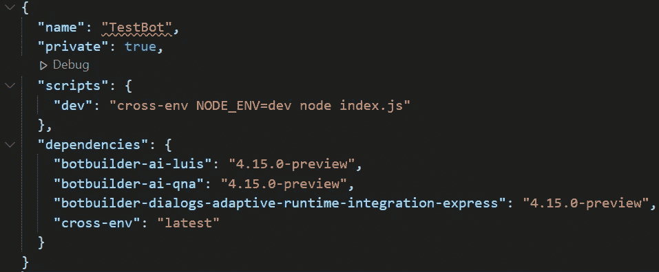

package.json

只需将路径添加到我们在`temp`文件夹中的自定义组件包，确保包名与我们在自定义操作`package.json`中的包名相匹配

```
{
"name": "TestBot",
"private": true,
"scripts": {
    "dev": "cross-env NODE_ENV=dev node index.js"
},
"dependencies": {
 **"addition-dialog-package":"file:./temp/addition-dialog-package- 1.0.tgz"**,
 "botbuilder-ai-luis": "4.15.0-preview",
 "botbuilder-ai-qna": "4.15.0-preview",
 "botbuilder-dialogs-adaptive-runtime-integration-express": "4.15.0- preview",
 "cross-env": "latest"
 }
}
```

现在让我们在 bot 的`appsettings`中注册我们的自定义动作。在 bot 项目的 *appsettings.json* 文件中(位于`<mybot>\settings`)将`addition-dialog-package`包含在`runtimeSettings/components`数组中。

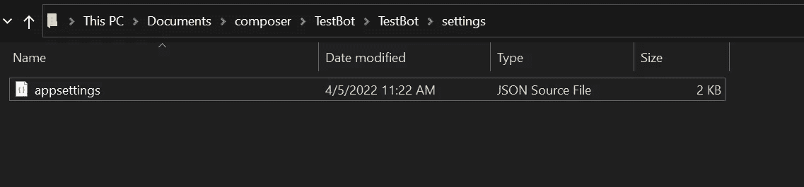

应用程序设置. json

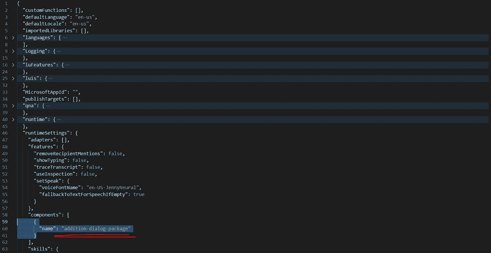

确保组件名与我们在自定义操作`package.json`中的包名相匹配

现在让我们在您的 bot 项目目录中运行`npm install`命令，这将在`node_modules`文件夹中安装您的自定义动作包

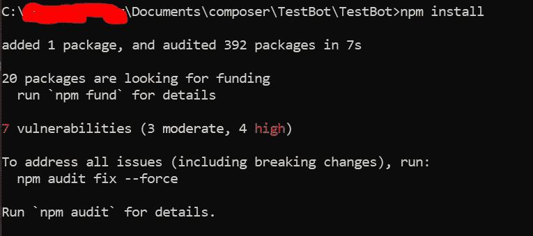

现在让我们将我们的自定义动作模式与机器人的 sdk 模式合并，你可以遵循官方文档中提到的步骤，我会告诉你怎么做

找到`schemas`文件夹并运行`update-schema`脚本，用我们的自定义动作模式更新模式

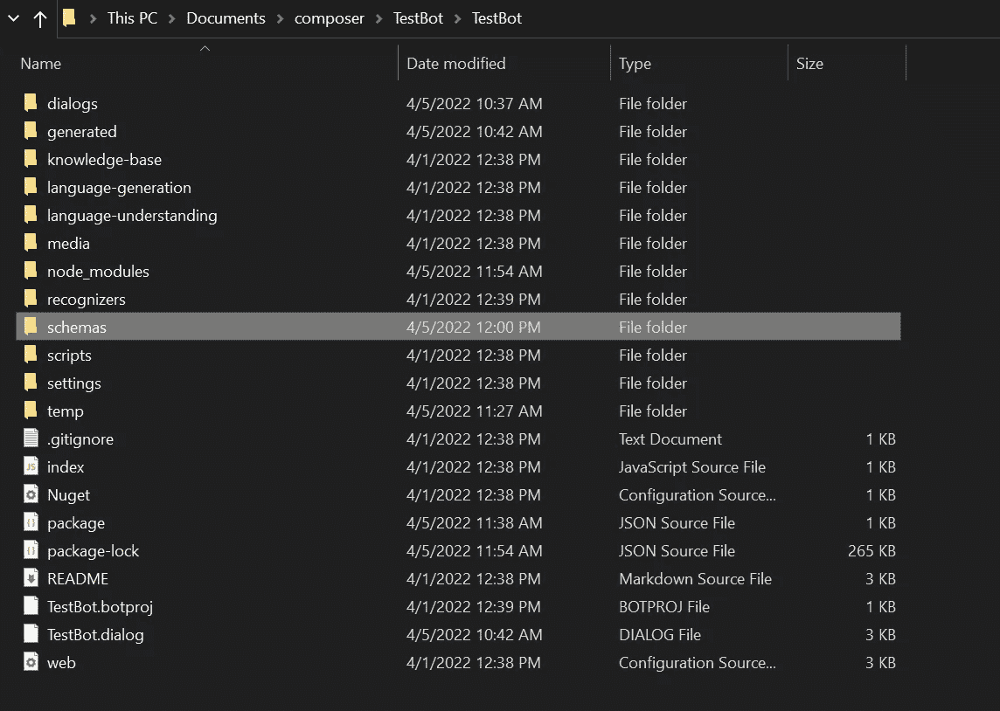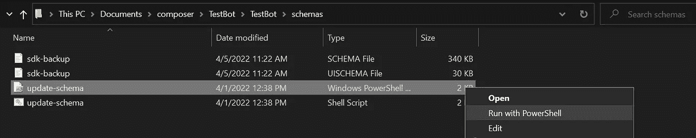

运行脚本后，您会看到包含`addition-dialog-package`的`imported`文件夹

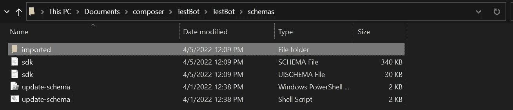

就是这样！我们现在已经成功地将我们的自定义操作与我们的机器人集成在一起，现在让我们来测试一下。

## 测试我们的自定义操作

如果您已经运行了 botframework composer 应用程序，请重新启动它，这样它就会根据我们刚才在上述步骤中所做的更改进行更新

一旦你打开了你的机器人，首先去你的机器人的`Package Manager`部分，然后`Installed`选项卡，检查我们的自定义动作是否在那里列出。如果你看到它，那么我们成功地将我们的自定义操作与机器人集成在一起

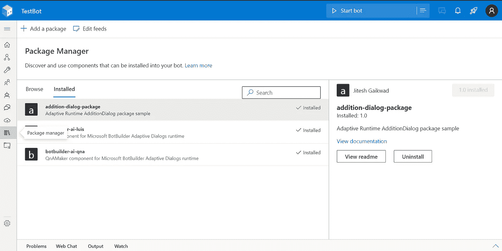

*您可以按照* [*文档*](https://docs.microsoft.com/en-us/composer/how-to-create-custom-actions#test) *中提到的步骤来测试您的自定义动作*

现在让我们回到画布，向机器人添加自定义操作(添加)对话框，

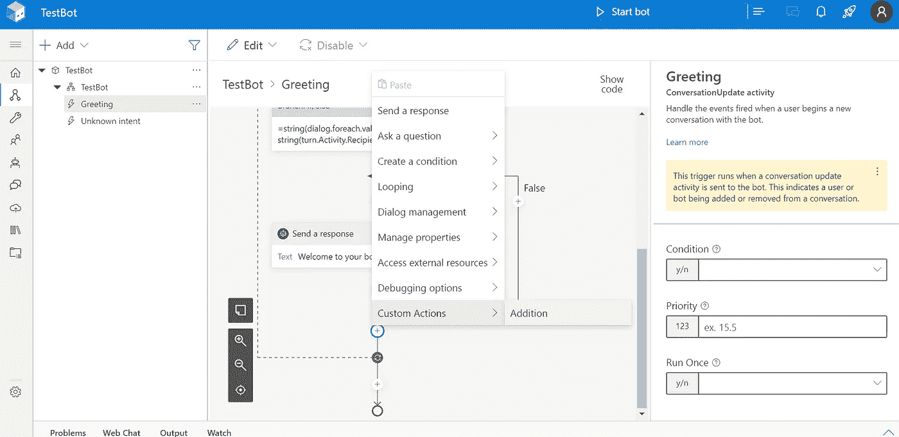

让我们给`Arg1`和`Arg2`添加一些值，并将加法结果存储在`dialog.result`属性中，并添加一个响应对话框来显示加法结果

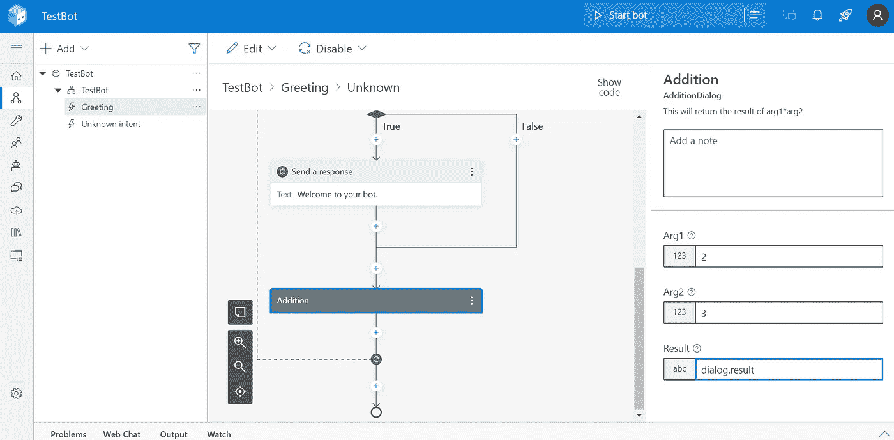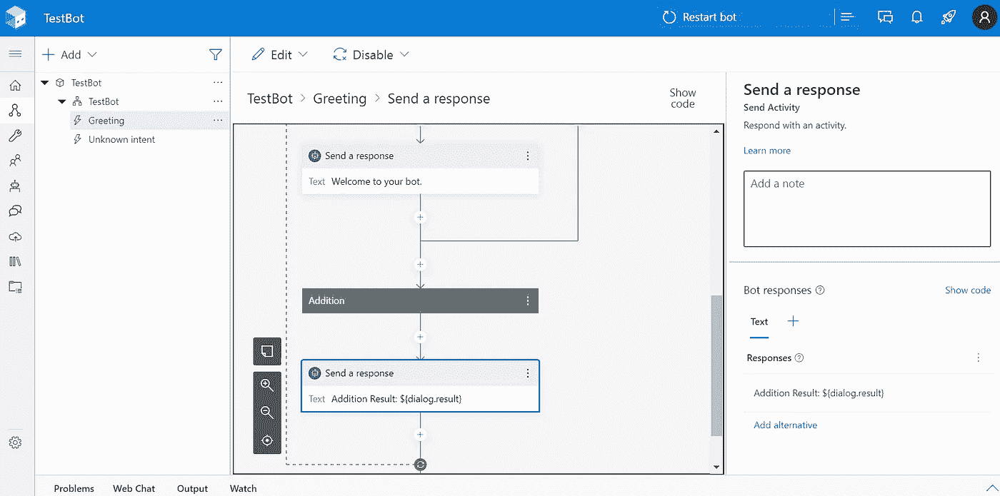

现在让我们点击`Start bot`按钮启动机器人，如果你的机器人运行没有任何问题，你会看到下面的屏幕

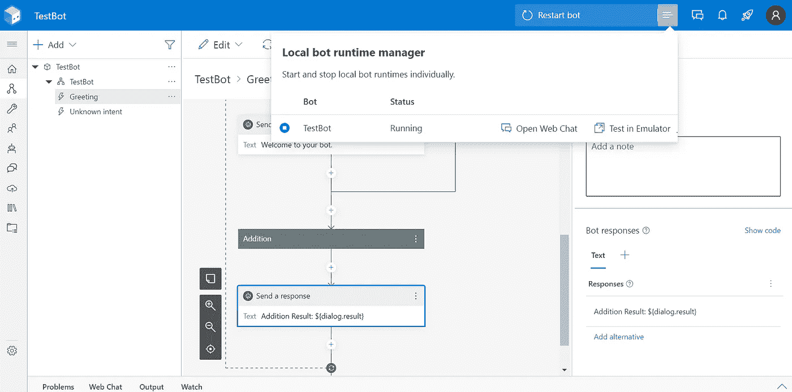

现在点击`Open Web Chat`，您将看到欢迎信息和添加结果信息

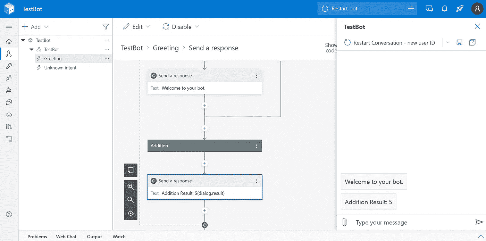

恭喜你！我们成功了！🥳:如果你已经完成了这一步，你就已经成功地将你的自定义操作与机器人集成在一起了。

我希望这篇博客对你有所帮助，并把它推荐给你那些可能在使用 botframework 中的自定义操作时遇到麻烦的朋友

我们的博客到此结束，我希望您理解构建自定义操作并将其与 bot composer 集成所需的步骤。这是关于 botframework composer 的许多博客之一，我有许多经验想与你分享，这些经验是我在开发 bot 时发现不容易获得的。更多更新即将推出！！！