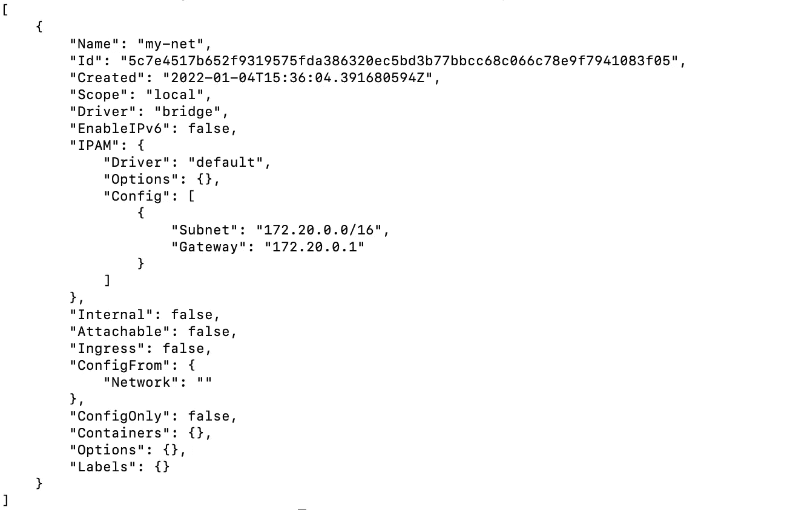

# 定制 Docker 桥接网络——如何运行容器？

> 原文：<https://blog.devgenius.io/custom-docker-bridge-networks-how-to-run-containers-b8d40c51bab2?source=collection_archive---------3----------------------->

这篇博客是我们从零开始讨论 **DevOps** 概念系列的一部分。本文来自于 ***中级*** 系列，因为它涉及到了解本地 Docker 桥上的 [***Docker 联网***](https://docs.docker.com/network/) 和一个小的 **Hello World** 例子。

这一系列中的一些早期博客如下。

[**TweetBot**](https://awstip.com/aws-lambda-simple-tweetbot-2f2f83fbe161)[**Azure 功能-GitHub 动作**](https://towardsdev.com/deploying-on-azure-functions-github-actions-a8f2a98acc0f)[**安全-自动化**](/aws-config-iam-compliance-85220763bee5)


# Docker 是什么？

Docker 是一个开源包管理器，用于将软件部署为称为容器的隔离包。它是操作系统级虚拟化的扩展，内核允许多个用户空间实例共存。与 [**虚拟机管理程序**](https://en.wikipedia.org/wiki/Hypervisor) 不同，后者用于在云资源上运行虚拟机，容器共享操作系统的内核，使其轻量级且快速启动和运行。

# Docker 网络类型

为了与运行容器的主机上的应用程序通信，有各种网络配置用于路由流量。两种常见 Docker 网络选项的简要说明:

**网桥—** 默认网络驱动程序，在主机和容器之间创建网络隔离。它使用隔离子网将虚拟 IP 分配给正在运行的容器。

**主机—** 在独立容器的情况下，主机和容器之间的隔离可以使用主机网络来移除。在这种配置中，主机的实际子网 IP 地址用于运行容器。

还有另一个 docker 网络驱动程序，如 **Overlay/Macvlan/None** 用于复杂的用例。

# 用户定义的桥

docker 守护进程使用默认的桥来托管任何新创建的容器。然而，该选项有一定的局限性，因此最好创建**用户定义的桥**。默认网桥的一些主要区别如下-

i) **更好的网络隔离**——不相关的服务/容器可以使用不同的定制桥/子网来隔离，以避免任何不安全的通信和增强的安全性。
ii) **自动 DNS 解析-** 共享同一个用户定义桥的多个容器除了使用 IP 之外，还可以使用 DNS 相互通信。iii) **容器的连接/分离** -运行中的容器可以跨用户定义的桥进行迁移。默认网桥中的相同选项要求正在运行的容器在迁移前停止。


**隔离用户定义的桥**

在上图中，**服务 A/服务 B** 、**服务 C/服务 D** 可以相互通信，也可以与主机通信。但是**服务 A/服务 B** - **服务 C/服务 D** 之间存在网络隔离

## 创建用户定义的桥

创建用户定义的网桥的第一步是使用以下命令创建虚拟网络

```
docker network create my-net
```

可以使用以下命令检查虚拟网络

```
docker inspect create my-net
```

上面的输出将显示所创建子网上的网关详细信息、CIDR 数据块/ IP4/IP6 设置



完成上述步骤后，网络就可以在相同的

## 在用户定义的桥上运行容器。

**创建 Hello World DockerFile 文件**

**打造 Hello World 形象**

```
docker build . -t hello-world:1.0.0
```

**在用户定义的桥上运行 Hello World 容器**

```
docker run -p 80:80  --name hello-world --network my-net hello-world:1.0.0
```

## 确认

在网络浏览器上打开端点[http://localhost/test . html](http://localhost/test.html)


## 额外资源

[](https://github.com/amit894/docker-images) [## GitHub - amit894/docker-images:学习 docker 的报告

### 用于学习 Docker docker 从容器注册表中拉取图像 Docker 推送图像到容器…

github.com](https://github.com/amit894/docker-images) 

*如需反馈，请留言至****Amit[dot]894[at]Gmail[dot]com****或联系 https://about.me/amit_raj*[*的任何链接。*](https://about.me/amit_raj)