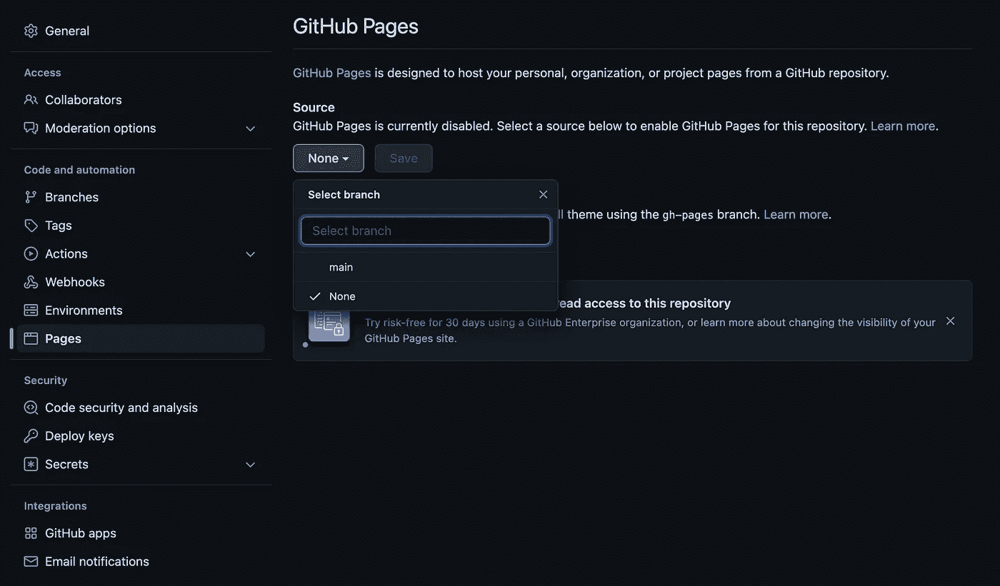
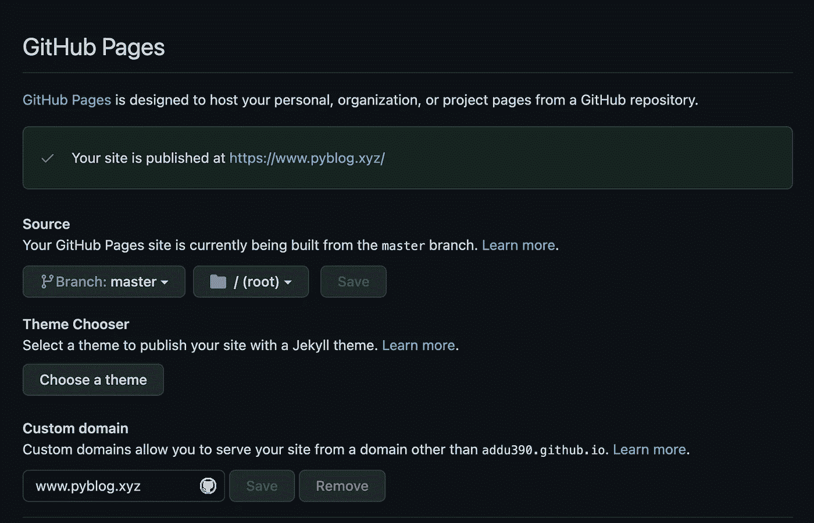
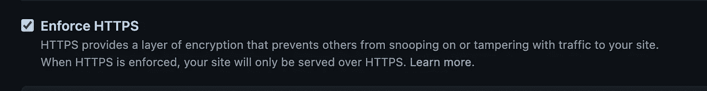

# GitHub 页面的自定义域

> 原文：<https://blog.devgenius.io/custom-domain-for-github-pages-23ce9def3a08?source=collection_archive---------8----------------------->


让我们把网站建起来！— Drama llama。

# 配置

*   域(example.com)。
*   子域(www.example.com)。
*   HTTPS(可选，但强烈推荐)。

在本教程的最后，您将有一个设置，所有到 example.com 的请求将被重定向到[https://www.example.com](https://www.example.com/)

# 在 GitHub 设置中启用 GitHub 页面

*   转到存储库→设置⚙️ →页面
*   选择`Source`；选择`master` / `main`分支将`README.md`视为 web `index.html`，选择`/docs`将`/docs/README.md`视为 web `index.html`



图 1:在 GitHub 设置中启用 Gh 页面

*   主题选择→选择主题；从默认主题中选择一个，或者从 [jamstackthemes.dev](https://jamstackthemes.dev/) 中复制你最喜欢的主题
*   等到 GitHub 发布网站。确认消息:`Your site is ready to be published at example.com`

# 在 GitHub 设置中指定自定义域

*   输入自定义域名:[www.example.com](http://www.example.com)



图 2:设置自定义域

*   注(推荐使用 [www.example.com):](http://www.example.com):)
*   如果自定义域是 example.com，那么[www.example.com](http://www.example.com)将重定向到 example.com
*   如果定制域是[www.example.com，](http://www.example.com,)那么 example.com 将重定向到[www.example.com。](http://www.example.com.)

# 管理 DNS

*   在 DNS 提供者的控制台中(在我的例子中是 GoDaddy)，创建四个`A`记录和一个`CNAME`。
*   在 GoDaddy 和其他一些 DNS 提供商中，您必须在`name`中指定`@`(在 AWS Route 53 中保留黑色)。
*   四个`A`记录的 IP 地址:

```
185.199.108.153
185.199.109.153
185.199.110.153
185.199.111.153
```

注意:这些可以随着时间的推移而改变；参考[文档](https://docs.github.com/en/pages/configuring-a-custom-domain-for-your-github-pages-site/managing-a-custom-domain-for-your-github-pages-site)

*   创建一个`CNAME`记录，将 www.example.com 指向`<GITHUB-USERNAME>.github.io`


图 3:设置 A 和 CNAME 记录

# 确认 DNS 条目

运行`dig www.example.com +nostats +nocomments +nocmd`确认`CNAME`和`A`记录；它应该返回四个`185.x.x.x` IP 地址和一个带有`<GITHUB-USERNAME>.github.io`的`CNAME`

注意:解析/传播 DNS 条目可能需要 1 到 3 个小时。要验证，在浏览器上:`https://<GITHUB-USERNAME>.github.io`重定向到`[http://www.example.com](http://www.example.com)`

# 启用 HTTPS

如果一切正常，可以点击`Enable HTTPS`复选框。



图 4:启用 HTTPS

*   复选框需要时间，并且不可点击，有时可能需要一天的时间。
*   在你`Enable HTTPS`之后，又一次，可能需要 1 小时到一天。

Github 支持很神奇；万一花费的时间比预期的长——创建一个标签: [Github 支持](https://support.github.com/tickets/personal)

一如既往，参考:[https://github.com/addu390/addu390.github.io](https://github.com/addu390/addu390.github.io)

差不多就是这样！🚀