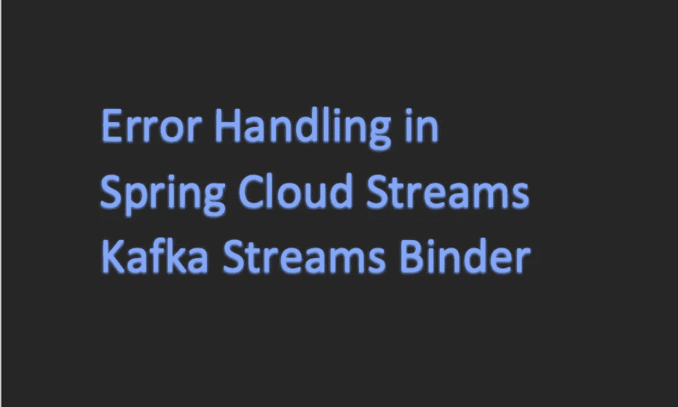
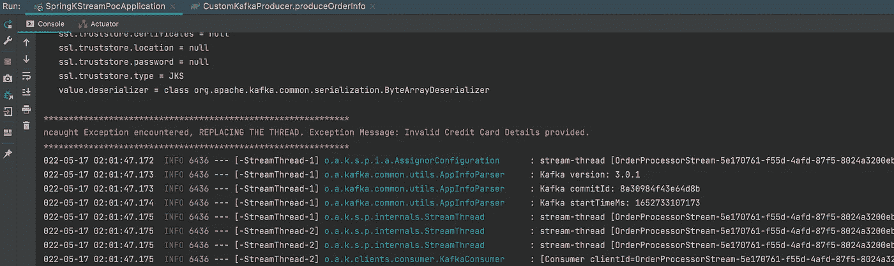
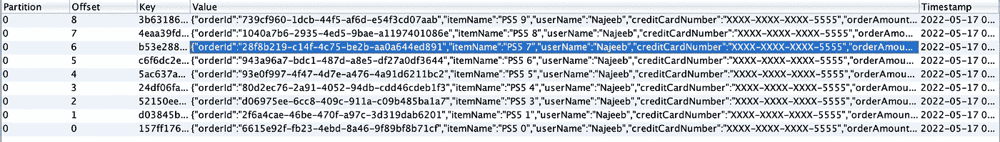
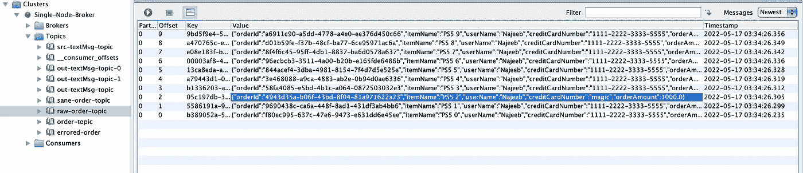
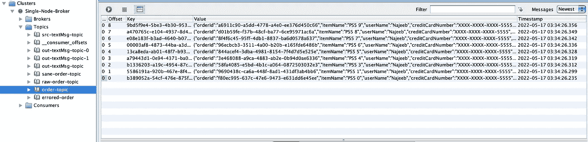
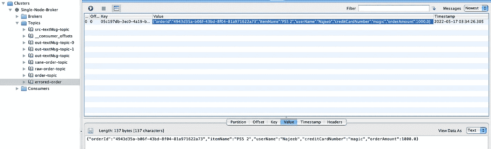

# 春云流 Kafka Streams Binder 中的错误处理

> 原文：<https://blog.devgenius.io/custom-exceptions-and-spring-cloud-stream-kafka-streams-binder-3caf7f7ff0c4?source=collection_archive---------1----------------------->



Spring 是开发云原生应用程序最广泛使用的 Java 框架之一。卡夫卡是最著名的信息经纪人之一。因此，很有可能你最终会使用 Spring Cloud Streams Kafka Streams Binder(或者我们可以使用 KStream Binder)。当在 KStream binder 应用程序中处理用户定义的异常时，我们有时会纠结于应该如何处理这些异常。我将试着解释几种我们可以在 KStream binder 应用程序中处理用户定义的异常的方法。

出于本文的考虑，我将考虑一个非常简单且假设的用例:订单处理。每当在任何 AlphaMart 商店下订单时，订单细节都会被推送到一个 Kafka 主题“raw-order-topic”。这个有效负载将包含订单的详细信息以及支付所使用的信用卡信息。我们的任务是从主题“raw-order-topic”中读取数据，以掩盖订单有效负载中的信用卡信息，然后将其发布到其他主题。

为了设置您的开发环境，您可以在 docker 容器中运行 Kafka。这个[指南](https://www.baeldung.com/ops/kafka-docker-setup)可以帮助你快速入门。我建议您按照单节点设置在本地系统中引导 Kafka 集群。一旦你的 Kafka 设置完成，我建议你使用[偏移浏览器](https://www.kafkatool.com/download.html)来整合你的 Kafka 主题(如果你不想购买许可证，你可以卸载它)。

本文的重点将放在处理用户定义的异常上，因此我不会详细讨论 KStream 绑定器和屏蔽信用卡的实现。你可以在下面的链接中找到完整的代码:
[项目的 Github 链接。](https://github.com/NajeebArif/SpringKStreamHub)

因此，让我们考虑我们已经开发了信用卡屏蔽功能。如果信用卡号的格式无效，此函数将抛出 InvalidCreditCardException。因此，让我们假设在“原始订单主题”上发布的消息中有一个信用卡号为“magic”。这将导致应用程序代码抛出运行时异常。如果异常没有被处理，KStream 将被关闭(默认行为)。

# StreamUncaughtExceptionHandler

KStream 绑定器为我们提供了一种机制，使用这种机制我们可以定义一个未被捕获的异常处理程序。通过定义 StreamsUncaughtExceptionHandler，我们可以决定应该做什么来响应未捕获的异常。有三个可用选项:替换线程、关闭客户端和关闭应用程序。请参考下面的代码，了解如何在 Spring 应用程序中进行配置。

为了测试这一点，我创建了一个测试类，它将生成关于输入主题的 10 条消息:

替换线程的代码在“replace-thread”分支中。我在异常处理程序中添加了一个 sysout，这样我们就可以看到线程被替换了。



流处理器的代码:

拼图的最后一块是 application.yml 文件:

# 超越 StreamUncaughtExceptionHandler

但是坚持住，仅仅替换当前线程可能并不能解决你的目的。您可能希望在将偏移量提交回 Kafka 之前定义一个重试策略，并且可能不希望在输出主题上发布这些记录。那么我们该怎么做呢？解决方案在于定义 RetryTemplate 并使用低级处理器 API 来“建议”提交。请记住，默认情况下，KStreams 的自动提交偏移量设置为 false，偏移量提交由偏移量提交间隔决定(您可以在这篇[汇合文章](https://www.confluent.io/blog/data-reprocessing-with-kafka-streams-resetting-a-streams-application/)中了解更多信息)。

因此，如果 StreamUncaughtExceptionHandler 对我来说还不够，我还能做什么呢？

我们可以做的一件事是，在一个指数回退周期内重试该消息 3 次，如果重试次数用尽，我会“请求”提交，然后继续处理该主题的其他消息。

另一个可能的解决方案是，每当遇到错误时，我们将这些消息路由到一个单独的主题，并将其余的消息路由到实际的输出主题。

让我们试着逐一构建这两个解决方案。

## 带有指数回退的重试消息

“main-retry-branch”中有这方面的代码。

这里的关键是远离高级 KStream DSL，使用低级处理器 API，并定义一个定制的重试模板。我们将在这里使用的方法将“转换”(类似的功能可以通过“处理”方法来实现)。

我们的测试用例保持不变，只是流处理器代码会发生变化。

请注意回调是如何提供的，当退休次数用完时将执行回调。

注意:application.yml 文件中还没有变化。

在做了这个改变之后，如果我们运行我们的测试用例来产生关于输入主题的数据，我们将会看到这样的日志:

请注意警告消息

你甚至可以检查主题上的数据，你会发现无效数据的记录并没有写在那里。



## 将出错的记录传送到不同的主题

现在让我们快速看看如何实现这一目标。“自定义错误处理程序”分支中有这方面的代码。

为了实现这一点，我们将依靠 KStream 绑定器的分支技术。除此之外，我们将创建一个数据结构 Tuple <t u="">，它将保存并帮助我们返回两个值(在 java 中，多次返回也是一种福气)。对于我们的用例，我们将显式地创建元组<throwable orderinputmsg="">的一个实例。我们将尝试执行映射输入 OrderInputMsg，如果捕获到任何异常，我们将使用一个元组来返回异常细节以及映射值。一旦我们得到一个实例元组，我们就可以根据元组实例中是否有 throwable 来对流进行分支。最后一步是从流处理中创建的元组中提取(展开)OrderInputMsg。我为它创建了一个单独的流处理器方法“orderBranchingProcessor”。</throwable></t>

首先，我们将消费一个输入主题，然后将消息发布到多个输出主题。为此，我们将返回类型用作

```
Function<KStream<String, OrderInputMsg>, KStream<String, OrderInputMsg>[]>
```

注意这两个谓词是如何被用来将流一分为二的。

```
Predicate<String, Tuple<Throwable, OrderInputMsg>> isSuccessful = (key, value) -> value.getOptionalT().isEmpty();Predicate<String, Tuple<Throwable, OrderInputMsg>> isFailure = (key, value) -> value.getOptionalT().isPresent();
```

这里需要注意的另一个要点是函数:getTransformedMessage

在流拓扑中调用该方法，将键和值映射到字符串元组的键-值(KStream)对。如果执行转换时没有异常，我们将 Throwable 设置为 null(这将用于确定转换是成功还是失败)。如果发生任何异常，我们只需将值设置为提供给该方法进行转换的原始值。然后我们返回键值。

在执行了上面的拓扑之后，我们通过使用我们之前定义的两个谓词在 KStream <string tuple="" orderinputmsg="">上执行一个分割。</string>

分支操作的结果将是一个地图。在这种情况下，它将是

```
Map<String, KStream<String, Tuple<Throwable, OrderInputMsg>>>
```

但是我们必须返回一个

```
KStream<String, OrderInputMsg>[]
```

现在我们有了 Map，我们用 Java 流处理和 KStream 处理来展开元组<throwable orderinputmsg="">到 OrderInputMsg，从而得到最终的 KStream <string orderinputmsg="">。</string></throwable>

之后，当我们运行测试用例在“原始订单主题”上生成 10 条记录时，我们将看到所有成功的记录都被路由到订单主题，出错的记录将被路由到出错订单。

输入主题:



“订单-主题”:



“出错主题”:



希望这有所帮助！

编码快乐！

GitHub 链接: [SpringKStreamHub](https://github.com/NajeebArif/SpringKStreamHub)