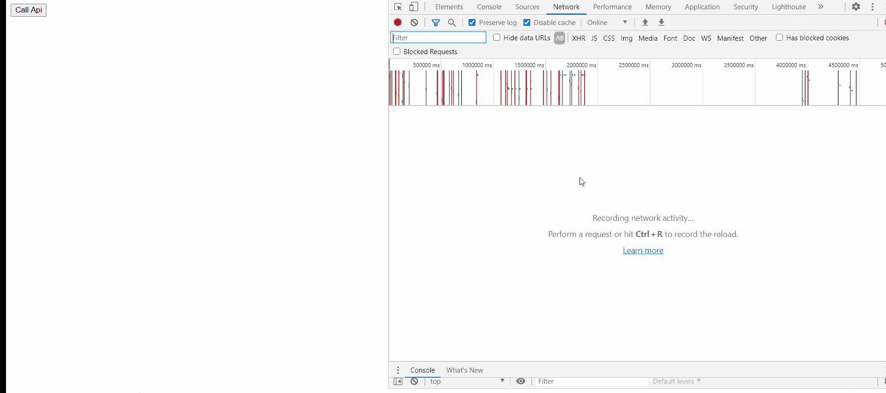
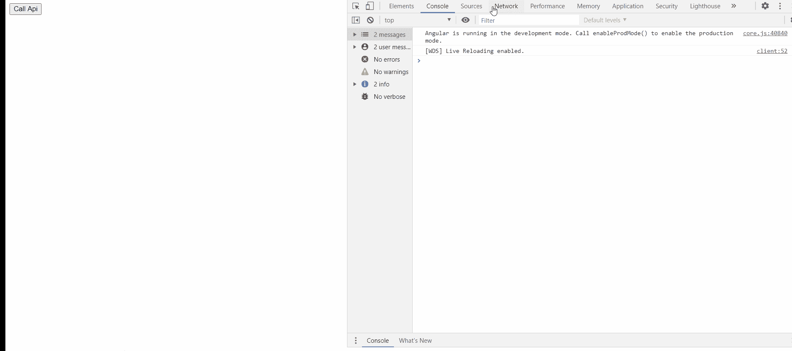

# Angular 中的自定义方法装饰器——一个 HTTP 缓存装饰器

> 原文：<https://blog.devgenius.io/custom-method-decorators-in-angular-a-http-cache-decorator-fb21d1e09932?source=collection_archive---------3----------------------->

> 有时，在我们的项目中，我们有一个在大多数方法中通用的需求，通常我们创建一个通用的帮助器方法，并在所有方法中手动调用它。但是调用这个方法需要修改代码，如果在后面的阶段我们不想对一个方法使用这个行为，我们必须再次从这个方法中移除这个调用。在某些情况下，应该选择自定义装饰器，而不是创建助手方法。

今天，我们将讨论这样一个场景。如果我们去查看 [Angular 的官方文档](https://angular.io/guide/http#using-interceptors-for-caching)来缓存 HTTP 调用，它建议使用 HTTP 拦截器的机制。

但是假设我有一些 HTTP 调用，为我的应用程序提供主数据，我只想缓存这些数据。在这种情况下，我需要修改我的拦截器来缓存特定 URL 的响应，或者为每个方法传递一个自定义头。

如果我们可以通过使用自定义装饰器来决定这种行为，并在我们希望缓存来自 API 的响应的方法上添加自定义装饰器，会怎么样呢？或者，如果我们不希望缓存它，只需移除装饰器。

> 所以让我们为我们的用例创建一个这样的装饰器。在 Angular 中，Decorators 是普通的函数，它应该返回另一个被调用的函数。有几种类型的装饰器，如类装饰器、方法装饰器等。我们也一直在使用 angular 提供的许多内置装饰器，如@Input、@Component 等。

在我们的用例中，我们将使用方法装饰器。

一般来说，我们从服务方法中返回一个由 HTTP 客户端返回的可观察对象。所以我们的 decorator 函数应该存储结果并在每次后续调用时返回它，对吗？。让我们看看实现这一点的代码。

因此，上面我们创建了一个名为 **CacheRes** 的函数，我们将其定义为 **MethodDecorator。**该方法将在服务初始化时调用。在 descriptor.value 中，我们获得了应用这个装饰器的实际方法，并返回了修改后的描述符来应用我们的缓存。Decorator 的调用由 Angular 自动处理。

这个装饰器可以像下面这样导入并正常使用。

让我们看看装饰者的行为。

但是目前，我们的装饰器将缓存响应一次，并总是返回缓存的响应，如果我们希望它在从缓存返回特定次数的响应后从后端获取数据，该怎么办。让我们修改我们的 **CacheRes** decorator 来获得这种支持。

我们添加了一个 refreshAfter 计数，默认值为-1。所以如果我们像下面这样使用装饰器，它会保持之前的行为。

如果我们现在想使用最新添加的计数来决定它从缓存中服务的次数，我们可以像下面这样使用它。

最后，让我们来看看新添加的功能是如何工作的。

注意:-目前这个装饰器只适用于没有动态参数和请求体的 API。用于获取国家列表、用户列表等场景。但是也可以扩展到处理这些情况。

> 一旦我们习惯于创建自定义装饰器，它们在处理这种场景时非常有用，并使我们的代码高度可配置，因为只需添加或删除一个装饰器来切换我们想要的功能，而不需要修改方法内部的主要逻辑。