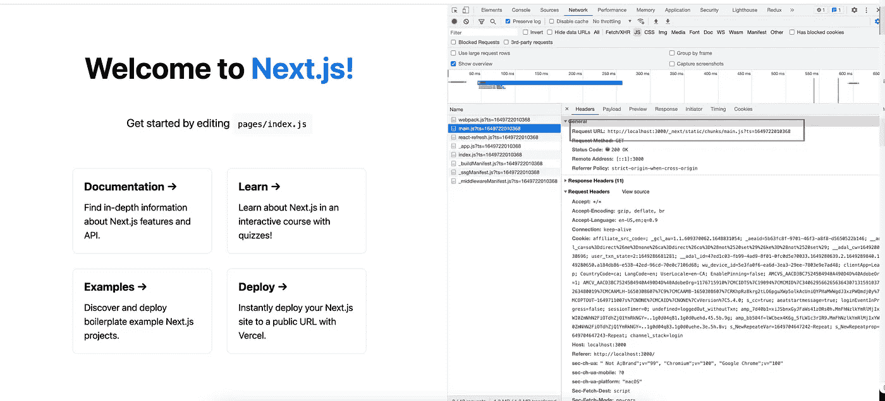
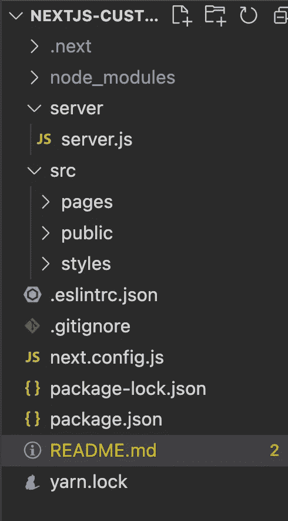
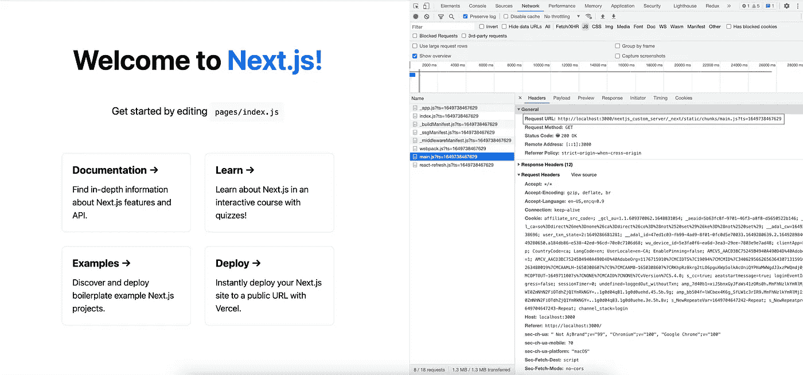

# NextJS 应用程序中的自定义 NodeJS 服务器

> 原文：<https://blog.devgenius.io/custom-nodejs-server-in-nextjs-application-879b6650fdf5?source=collection_archive---------2----------------------->

NextJS 是基于 ReactJS 的最流行的 SSR(服务器端渲染)框架之一。这是一个伟大的框架，为我们提供自己的服务器。这非常有效，我一直在使用它，直到我不得不为我的 NextJS 资产和 CSS 文件添加一个自定义的资产路径。

**为什么我们需要定制资产路径**

我们需要自定义路径的原因之一是，如果我们需要在 CDN 中部署 CSS([https://nextjs . org/docs/API-reference/next . config . js/CDN-support-with-asset-prefix](https://nextjs.org/docs/api-reference/next.config.js/cdn-support-with-asset-prefix)

当 NextJS 编译时，它会将所有文件编译并压缩到一个名为。下一个。当我们作为 nextJS 站点启动时，我们可以看到所有 JS / CSS 从一个公共目录 as _next 加载，如下所示

在上面的例子中，我们可以看到 main.js 文件是从 _next/static 文件夹中加载的。

如果我们有多个 NextJS 应用程序在同一个域中运行，我们不能基于 same _next 文件夹添加网络规则。我们也可以为每一个设置唯一的基本路径。

在我的方法中，我使用的是资产路径方法。资产路径适用于 CSS。但是对于 JavaScript 文件，默认的 NextJs 服务器不起作用。所以我选择了使用 ExpressJS 的定制服务器。

我们开始吧

1.  创建一个 NextJS 应用程序:`npx create-next-app@latest`
2.  创建应用程序后，使用 *npm run dev 运行应用程序。* App 在[*中运行良好 http://localhost:300*](http://localhost:300)*0*
3.  为了更好的结构，让我们添加一个目录作为 src，并在其中移动页面、公共和样式文件夹。现在添加目录作为服务器。

4.修改 next.config.js 文件并添加资产路径，如下所示

> /** @type {import('next ')。NextConfig} */
> 
> const nextConfig = {
> 
> reactStrictMode: true，
> 
> asset prefix:“/nextjs _ custom _ server/”
> 
> }
> 
> module.exports = nextConfig

5.现在，在 server.js 文件中添加以下代码

> const express = require('express ')
> 
> const next = require('next ')
> 
> const compression = require(' compression ')；
> 
> const port = parse int(process . env . port，10) || 3000
> 
> const dev = process.env.NODE_ENV！== '生产'
> 
> const app = next({ dev })
> 
> const handle = app . getrequesthandler()
> 
> app.prepare()。然后(()=> {
> 
> const server = express()
> 
> server.use(compression())
> 
> server.use(function (req，res，next) {
> 
> req . URL = req . original URL . replace('/nextjs _ custom _ server/_ next '，'/_ next ')；
> 
> next()；//一定要让下一个中间件处理修改后的请求。
> 
> });
> 
> server.get('/_next/* '，(req，res) => {
> 
> handle(req，RES)；
> 
> });
> 
> server.all('* '，(req，res) => {
> 
> handle(req，RES)；
> 
> });
> 
> server.listen(port，(err) => {
> 
> 如果(错误)抛出错误
> 
> console.log(`在${port} `上服务器就绪)
> 
> })
> 
> })

6.添加两个额外的脚本来运行 package.json 文件中的 server.js 文件，如下所示

> " node-dev ":" node server/server . js "，
> 
> "节点开始":"节点服务器/服务器. js "

7.之后，再次运行应用程序，如下图所示

> npm 运行节点-开发

在同一个地址启动应用程序 [http://localhost:3000](http://localhost:3000) 并转到网络选项卡。

我们会看到 main.js 是从***next js _ custom _ server***而不是根文件夹中提供的。

上面使用的例子可以从下面的链接下载

 [## GitHub-codedaemon 12/nextjs-custom-server

### 此时您不能执行该操作。您已使用另一个标签页或窗口登录。您已在另一个选项卡中注销，或者…

github.com](https://github.com/codedaemon12/nextjs-custom-server.git) 

高级提示:

在 server.js 中，我们允许所有使用*的路由。但是，如果我们需要任何特定的路径，我们可以添加正则表达式或特定的路径和协议，以便更好地控制，这在生产中是理想的。

> server . get('/[a-zA-Z]{ 2 }/[a-zA-Z]{ 2 }/custom/web '，async (req，res) = >
> 
> 返回句柄(请求，结果)
> 
> });

以上将接受任何符合以上规则的 URI。

编码快乐！！！