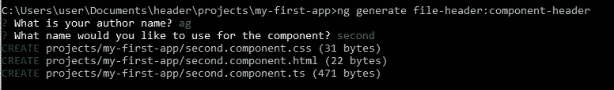

# 角度应用的自定义原理图

> 原文：<https://blog.devgenius.io/custom-schematics-for-your-application-in-angular-f691f6fd4dc?source=collection_archive---------2----------------------->

**照片由** [**卢卡布拉沃**](https://unsplash.com/@lucabravo?utm_source=unsplash&utm_medium=referral&utm_content=creditCopyText) **上** [**Unsplash**](https://unsplash.com/s/photos/magic-code?utm_source=unsplash&utm_medium=referral&utm_content=creditCopyText)

当你试图为一个大规模的项目打下基础时，了解原理图、它们是什么以及它们如何有用是非常重要的。我们先来看看官方的定义。

> 原理图是支持复杂逻辑的基于模板的代码生成器。它是通过生成或修改代码来转换软件项目的一组指令。
> 
> 原理图收集对于创建、修改和维护任何软件项目来说都是一个强大的工具，但对于定制 Angular 项目以满足您自己组织的特定需求来说尤其有用。例如，您可以使用 schematics，使用预定义的模板或布局来生成常用的 UI 模式或特定组件。您可以使用 schematics 来实施架构规则和约定，使您的项目保持一致和互操作。

我们所有人在使用 Angular 时都遇到过 Angular CLI 命令。当您使用 generate 命令生成组件时，会在幕后使用一个示意图来定义应该根据您提供的不同标志将什么内容放入新创建的 typescript 文件中。

让我们来看一个场景，每当我们生成一个组件时，我们都希望添加一个版权文件头。这是我们在公司项目中可能需要的一个非常常见的场景。例如:-

为此，我们可以自动创建一个用于组件生成的原理图，并自动附加该标题，以避免开发人员在组件中遗漏该内容。

让我们一步一步地创建这样的示意图。

1.  示意图 CLI。

Schematics 自带命令行工具。使用节点 6.9 或更高版本，全局安装 Schematics 命令行工具:

> *npm 安装-g*[*@ angular*](http://twitter.com/angular)*-devkit/schematics-CLI*

**2。创建角度工作空间**

用下面的命令创建一个新的角度工作空间。

> ng 新标头— createApplication=false

**3。创建一个角度库**

使用以下命令在工作区内创建一个库。

> ng 生成库文件-标题

**4。原理图文件夹的创建**

在库的根文件夹中，创建名为 schematics 的文件夹。另外，在该文件夹中创建一个 **collection.json** 文件，用于创建包含以下内容的原理图集合。

**5。创建 schema.json**

在 schematics 文件夹中创建一个名为 component-header 的文件夹，并在该文件夹中添加一个包含以下内容的文件 schema.json。

*   *id* :集合中模式的唯一 id。
*   *title* :模式的可读描述。
*   *type* :属性提供的类型描述符。
*   *属性*:定义原理图可用选项的对象。

**6。创建 schema.ts**

在为当前模式创建 schema.json 的位置创建 schema.ts。它定义了一个接口，该接口存储 schema.json 文件中定义的选项的值。

**7。添加模板文件**

在组件头文件夹中创建一个文件夹。之后，创建名为

_ _ name @ dash erize _ _ . component . ts . template，_ _ name @ dash erize _ _ . component . html . template，_ _ name @ dash erize _ _ . component . CSS . template

包含以下内容。

**8。添加规则工厂**

在创建 schema.json 的地方创建一个 index.ts 文件，然后向其中添加规则工厂，如下所示。

**9。定义生成规则**

现在我们将创建一个生成规则来使用我们的模板文件并为我们创建组件文件。

要理解这个代码的不同部分，你可以参考 Angular 的官方文档[原理图规则生成](https://angular.io/guide/schematics-for-libraries#define-a-generation-rule)。

10。使用模式更新 collection.json】

使用新创建的逻辑示意图更新 collection.json。

11。更新库的 package.json。

用下面的内容更新 projects\file-header 中的 package.json 并运行 npm install。

12。创建 tsconfig.schematics.json

使用以下内容在库的根目录下创建 tsconfig.schematics.json。

13。创建 Gulpfile

库根目录下的 Gulpfile 用于复制 dist 文件夹中的原理图。

**14。创建应用程序**

使用以下命令在同一工作空间内创建应用程序以使用此原理图集合。

> ng 生成应用程序我的第一个应用程序

15。构建和链接库

使用命令构建库

> ng 构建文件头

然后进入项目/文件头文件夹并运行命令

> npm 运行构建

然后，我们需要从工作区的根目录(即我们的标题文件夹)链接这个库。要链接，我们需要运行命令

> npm 链接文件-标题

16。开始使用示意图

您现在可以在我的第一个应用程序中使用这个原理图，这个应用程序是您在步骤 14 中通过命令创建的。

> ng 生成文件头:组件头

其中 file-header 是库名，component-header 是我们的原理图名。

它会给你如下的输出。

typescript 文件现在有了我们想要的标题。

> 现在，可以将多个示意图添加到同一个集合中，这可用于在项目中强制实施某些实践，并自动执行这些操作。

所示示例描述了用于生成的原理图。您也可以创建用于更新的原理图。如果您要发布一个支持向后兼容的库，这些会非常方便。

Angular 使用各种事物的示意图。当您运行 **ng update** 来更新角度依赖性时，会有多个原理图在后台运行来自动更新您的代码

> 注意:- Angular CLI 的 generate 命令在创建组件时支持各种标志和选项，并且它还会自动更新模块，这是我们的 schematics 在本例中无法做到的。因为这个例子更侧重于给出如何创建原理图的想法。要查看 CLI 生成组件命令的官方源代码，您可以访问他们的 Github 链接:-[https://Github . com/angular/angular-CLI/tree/master/packages/schematics/angular/component](https://github.com/angular/angular-cli/tree/master/packages/schematics/angular/component)
> 
> 为了知道除了生成之外如何创建不同类型的原理图，你可以访问 Angular 的官方文档:-【https://angular.io/guide/schematics 
> 
> 要查看上述例子的完整源代码，你可以访问我的 github 库:-[https://github.com/aakashgarg19/header](https://github.com/aakashgarg19/header)
> 
> Schematics 可以为应用程序提供无限的可能性，如果明智地使用，开发人员重复的各种活动可以自动化。一旦原理图被开发，它只是一个命令，将为你做所有的艰苦工作。