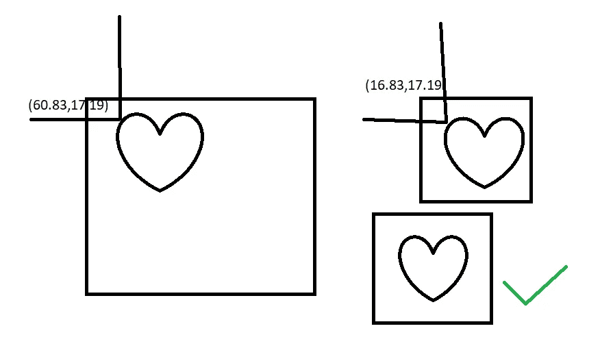

# Jetpack 组合中的自定义形状(深潜)

> 原文：<https://blog.devgenius.io/custom-shapes-in-jetpack-compose-deep-dive-b987a52c743c?source=collection_archive---------0----------------------->


来源:[https://www . be funky . com/learn/graphic-design-geometric-shapes/](https://www.befunky.com/learn/graphic-design-geometric-shapes/)

在 Compose 中，您可以将可组合剪辑成任何形状。框架提供了一些预定义的形状，如`***CircleShape***`、 `***RoundCornerShape***`、`***CutCornerShape***`等。但是如果你想要框架中不存在的其他形状，比如五边形呢？。

> 当某样东西不存在时，你会怎么做？在我以前的文章中找到答案:)

# 深潜

您可以使用以下工具裁剪形状

```
Modifier
    .*width*(100.*dp*)
    .*height*(100.*dp*)
    .*clip*(your shape),
```

`clip()`被定义为以一个形状作为自变量。

`***Shape***`是一个带有抽象方法`createOutline()`的接口，它返回一个`***Outline***`，我们的形状将被裁剪到这个接口上。

`***Outline***`是一个密封类，具有预定义的大纲`***Rectangle***`和`***Rounded.***`，但是我们感兴趣的是`***Generic***`，它接受一个`***Path***`并从中创建大纲。而一条 ***路径*** 可以形成任何你想要的形状。

# 保持身材

让我们创建一个`***Shape***`的子类，我们称之为**多边形**。

**多边形**接受边数并创建一个等边多边形`**Path**`，旋转用于旋转该多边形。我们可以将这个`***Path***`传递给`**Outline.Generic()**`

**用法**

```
Image(
    painter = painterResource(id = R.drawable.*image10*),
    contentDescription = null,
    modifier = Modifier
        .*width*(100.*dp*)
        .*height*(100.*dp*)
        .*clip*(Polygon(3,0f)),
    contentScale = ContentScale.Crop
)
```

**结果**


*剪辑*(多边形(3，0f))


*剪辑*(多边形(5，0f))

你刚才说了一次吗？，Ok Ok

让我们创建一个平行四边形

**平行四边形**取左下角的角度。所有其他角度都将从它导出。

**用法**

```
Image(
    painter = painterResource(id = R.drawable.*image10*),
    contentDescription = null,
    modifier = Modifier
        .*width*(100.*dp*)
        .*height*(100.*dp*)
        .*clip*(Parallelogram(70f)),
    contentScale = ContentScale.Crop
)
```

**结果**


## 你说复杂的形状呢？

是的，你是对的。你想只为简单的形状编写这种路径，但是如果你试图为复杂的任意形状编写这些路径，上面的过程可能会把你的灵魂吸走。

如果你想要一个**心形**形状，如下图所示


# 把她放在你的心里

编写代码以编程方式为简单形状创建路径是可以的，但为心形等形状创建路径真的会给你带来困难。

> 那我们该怎么办？

幸运的是，我们可以从一个`svg`文件的路径数据中创建一个`Path`对象。请按照下面的步骤，让它变得非常容易。

1.  从网上下载一个心形`svg`或任何其他的`svg`，但它应该只包含一个`Path`标签。
2.  现在用记事本打开，找到`d`属性。

> `d`属性包含用于绘制 svg 的路径命令。
> 
> 例如，在下面的路径中`M60.83,17.19`表示与**的`moveTo(60.83,17.19)`类似，路径**的**类**和`C68.84,8.84,74.45,1.62,86.79,0.21`类似`cubicTo(68.84,8.84,74.45,1.62,86.79,0.21)`等等。你可以在这里 了解更多`svg`命令[](https://developer.mozilla.org/en-US/docs/Web/SVG/Attribute/d)

*一个路径字符串`d`也可以被转换成 android 的一个`**Path**`对象，但是这个路径将有硬编码的绘图命令。例如，对于`M60.83,17.19` ，它将包含一个`moveTo(60.83,17.19)`，因此我们的组件大小无关紧要，绘图将从`x = 60.83`和`y = 17.19`开始。*

**

*正如你在上面看到的，这不是预期的行为，因为只有一个固定的尺寸适合这种形状，对于其他尺寸，它会在不正确的地方剪辑。但是我们不能根据形状的 svg 大小来调整可组合组件的大小，因为它们应该根据 UI 需求来调整大小。因此，我们必须根据可组合的大小来调整形状。*

# *缩放路径数据*

*svg 中的大小是由`svg`标签下的`[viewBox](https://developer.mozilla.org/en-US/docs/Web/SVG/Attribute/viewBox)`属性给出的，你可以在上面的要点中看到。*

> *`viewBox=”0 0 122.88 107.41"`*
> 
> *最后两个数字`122.88`和`107.41`分别代表`width`和`height`，这个`svg`就是根据这两个数字创建的。*

*因此，在这种情况下，如果我们的可组合元素的大小为`width = 122.88`像素和`height = 107.41`，那么命令或原始路径将完全适合，我们不需要做任何改变。但是如果我们的可组合体大小不同，假设它是在`viewbox.`中给出的大小的两倍*

*然后`width = 245.76`像素和`height = 214`因此我们不能使用原始路径，否则它会像上图中的第一个例子一样被剪切。所以我们需要转换 svg 的命令来适应新的大小。*

*所以从`viewbox`中，如果我知道`width = 122.88`和`height = 107.41`并且一个命令是`M60.83,17.19`，那么我可以说如果宽度和高度加倍，命令中的坐标也会加倍，所以对于`width = 245.76`和`height = 214`命令将是由`scaleX = newWidth/orignalWith`和`scaleY = newHeight/originalHeight`给出的`M121,35.32`*

*我在下面的代码中做了同样的事情，首先我找到了`d`中的所有数字，因为数字是路径数据中的 x 和 y 坐标，然后我将它们乘以正确的比例因子，并创建一个新的路径数据，然后根据新的路径数据创建`Path`对象，然后使用该路径对象进行绘制。*

*现在只要用 like*

```
*Image(
    painter = painterResource(id = R.drawable.*image10*),
    contentDescription = null,
    modifier = Modifier
        .*width*(100.*dp*)
        .*height*(100.*dp*)
        .*clip*(Heart()),
    contentScale = ContentScale.Crop
)*
```

*谢谢，祝您愉快:)*