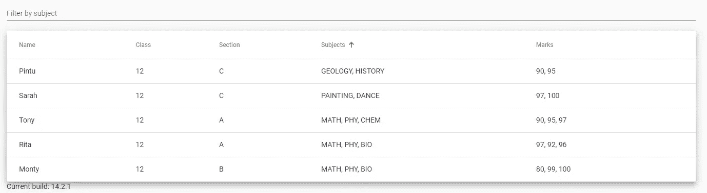

# 角度材料表的自定义排序和过滤

> 原文：<https://blog.devgenius.io/custom-sorting-and-filtering-for-angular-material-table-f18840fb188f?source=collection_archive---------1----------------------->

在本文中，我将介绍如何为[角度材料表](https://material.angular.io/components/table/overview)创建自定义过滤和排序。



最终产品—角度材料表

我假设你已经知道 Angular 和 JavaScript 的基础知识。如果没有，请浏览一遍，稍后再回到本文。

*   [https://angular.io/docs](https://angular.io/docs)
*   [https://javascript.info/](https://javascript.info/)

好吧，让我们开始吧。

# 需求讨论

我们将创建一个学生数据的材料表，我们将对每一列排序，并将按主题过滤。

## 学生界面

我们的学生界面将有名字，班级，部分，科目和分数。这里需要注意的一点是，主题和标记是数组，而其他的是原始数据类型。

```
export interface Student {
  name: string;
  subjects: string[];
  marks: number[];
  class: string;
  section: string;
}
```

## 过滤要求

我们应该有一个过滤器，在类型它应该过滤学生的科目。例如，如果我们开始搜索*“MAT”*，那么它将返回所有子字符串为*“MAT”*的学生。

## 分类要求

对于原始数据类型列，我们将进行普通的字符串比较。但是对于科目分类，我们将与学生拥有的科目数量进行比较。对于分数，我们将与分数的平均值进行比较。

# 履行

好的，让我们从实现开始。

首先让我们创建一个没有过滤和排序的简单表格。

## 首先是打字稿部分

*   我们将为学生创建界面。
*   然后我们将定义`displayedColumns`，它是我们将要在模板中显示的键
*   然后我们定义`columns`，它将包含我们每一列的`columnDef`、`header`和`cell`。这里需要注意的是`cell`，在这里你可以按照你想要在模板中显示的方式来格式化你的数据。
*   然后我们有了`dataSource`，一旦你得到数据，你就可以更新`dataSource`。这里我们使用常量，所以我们只能在`ngOnIntit`中更新它。

```
import { Component, OnInit } from '[@angular/core](http://twitter.com/angular/core)';
import { MatTableDataSource } from '[@angular/material](http://twitter.com/angular/material)/table';export interface Student {
  name: string;
  subjects: string[];
  marks: number[];
  class: string;
  section: string;
}const ELEMENT_DATA: Student[] = [
  {
    name: 'Tony',
    subjects: ['MATH', 'PHY', 'CHEM'],
    marks: [90, 95, 97],
    class: '12',
    section: 'A',
  },
  {
    name: 'Rita',
    subjects: ['MATH', 'PHY', 'BIO'],
    marks: [97, 92, 96],
    class: '12',
    section: 'A',
  },
  {
    name: 'Monty',
    subjects: ['MATH', 'PHY', 'BIO'],
    marks: [80, 99, 100],
    class: '12',
    section: 'B',
  },
  {
    name: 'Pintu',
    subjects: ['GEOLOGY', 'HISTORY'],
    marks: [90, 95],
    class: '12',
    section: 'C',
  },
  {
    name: 'Sarah',
    subjects: ['PAINTING', 'DANCE'],
    marks: [97, 100],
    class: '12',
    section: 'C',
  },
];[@Component](http://twitter.com/Component)({
  selector: 'table-filtering-example',
  styleUrls: ['table-filtering-example.css'],
  templateUrl: 'table-filtering-example.html',
})
export class TableFilteringExample implements OnInit{
  displayedColumns: string[] = [
    'name',
    'class',
    'section',
    'subjects',
    'marks',
  ];columns = [
    {
      columnDef: 'name',
      header: 'Name',
      cell: (element: Student) => `${element.name}`,
    },
    {
      columnDef: 'class',
      header: 'Class',
      cell: (element: Student) => `${element.class}`,
    },
    {
      columnDef: 'section',
      header: 'Section',
      cell: (element: Student) => `${element.section}`,
    },
    {
      columnDef: 'subjects',
      header: 'Subjects',
      cell: (element: Student) => `${element.subjects.join(', ')}`,
    },
    {
      columnDef: 'marks',
      header: 'Marks',
      cell: (element: Student) => `${element.marks.join(', ')}`,
    },
  ];dataSource: MatTableDataSource<Student>;ngOnInit() {
    this.dataSource = new MatTableDataSource(ELEMENT_DATA);
  }
}
```

## 现在模板

*   因为我们已经在 typescript 文件中定义了`columns`，所以我们不需要在这里特别定义所有的列。我们可以使用`*ngFor`来处理所有的列。
*   除此之外，它非常简单。

```
<table mat-table [dataSource]="dataSource" class="mat-elevation-z8">
  <ng-container
    *ngFor="let column of columns"
    [matColumnDef]="column.columnDef"
  >
    <th mat-header-cell *matHeaderCellDef >{{column.header}}</th>
    <td mat-cell *matCellDef="let row">{{column.cell(row)}}</td>
  </ng-container><tr mat-header-row *matHeaderRowDef="displayedColumns"></tr>
  <tr mat-row *matRowDef="let row; columns: displayedColumns;"></tr>
</table>
```

## 自定义过滤

角度材料已经允许有正常的过滤，我们可以通过一个关键，它将过滤所有行的数据，然后返回结果。但是对于像我们这样的复杂数据或者像我们这样的特殊功能，它就不起作用了。

要覆盖角度材质的过滤方法，我们可以通过自己的函数覆盖`dataSource`的`filterPredicate`。

```
ngOnInit() {
    // In the ngOnInit we can override the filterPredicate
    // by our function
    this.dataSource.filterPredicate = this.filterBySubject();
}// This is the method which get called from your filter input
applyFilter(event: Event) {
    const filterValue = (event.target as HTMLInputElement).value;
    this.dataSource.filter = filterValue.trim().toUpperCase();
}// This is our filter method. 
// It has to return a function
// Method of the function should be 
// (data: InterfaceName, filter: string): boolean 
filterBySubject() {
    let filterFunction = 
        (data: Student, filter: string): boolean => {
          if (filter) {
            const subjects = data.subjects;
            for (let i = 0; i < subjects.length; i++) {
              if (subjects[i].indexOf(filter) != -1) {
                return true;
              }
            }
            return false;
          } else {
            return true;
          }
       }; return filterFunction;
}
```

在模板中，我们可以用搜索词调用`applyFilter`。

```
<mat-form-field appearance="standard">
    <mat-label>
        Filter by subject
    </mat-label>
    <input 
        matInput 
        (keyup)="applyFilter($event)" 
        placeholder="Filter by subject" 
        #input 
    />
</mat-form-field></mat-form-field>
```

## 自定义排序

与过滤类似，有角度的材料允许通过一些简单的步骤进行正常的分类。但是对于特殊情况和复杂数据，这是行不通的。为此，我们必须用自己的函数覆盖`dataSource`的`sortData`方法。

```
[@ViewChild](http://twitter.com/ViewChild)(MatSort) sort: MatSort;ngOnInit() {
 // here we override the sortData with our custom sort function
 this.dataSource.sortData = this.sortData();
}// datasource sort has to be updated with the 
// template's sort.
ngAfterViewInit() {
 this.dataSource.sort = this.sort;
}// custom sort function
sortData() {
 let sortFunction = 
 (items: Student[], sort: MatSort): Student[] =>  {
   if (!sort.active || sort.direction === '') {
     return items;
   } return items.sort((a: Student, b: Student) => {
    let comparatorResult = 0;
    switch (sort.active) {
      case 'name':
       comparatorResult = a.name.localeCompare(b.name);
       break;
      case 'class':
       comparatorResult = a.class.localeCompare(b.class);
       break;
      case 'section':
       comparatorResult = a.section.localeCompare(b.section);
       break;
      case 'subjects':
       comparatorResult = a.subjects.length - b.subjects.length;
       break;
      case 'marks':
       comparatorResult =
        a.marks.reduce((prev, curr) => prev + curr) / a.marks.length
        -
        b.marks.reduce((prev, curr) => prev + curr) / b.marks.length;
        break;
      default:
        comparatorResult = a.name.localeCompare(b.name);
        break;
    }
    return comparatorResult * (sort.direction == 'asc' ? 1 : -1);
   });
 }; return sortFunction;
}
```

如果你想浏览整个源代码并查看工作预览，你可以在这里查看

*   [https://stackblitz.com/edit/angular-n4s7nc?file = src/app/table-filtering-example . html](https://stackblitz.com/edit/angular-n4s7nc?file=src/app/table-filtering-example.html)