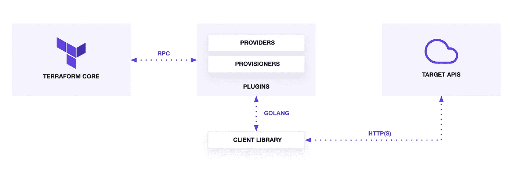
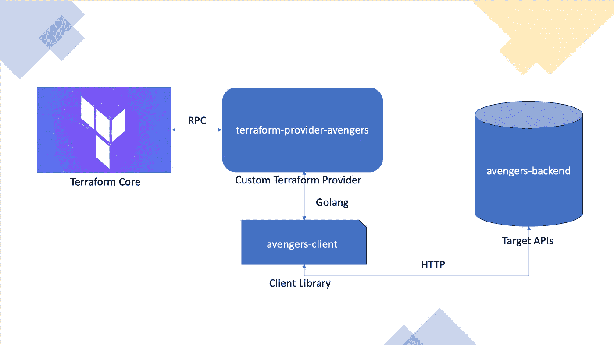
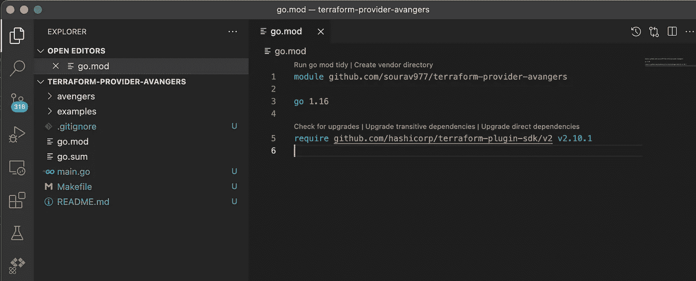

# 定制地形提供商设计:第 1 部分

> 原文：<https://blog.devgenius.io/custom-terraform-provider-design-c39287c816e9?source=collection_archive---------3----------------------->


图片来源:Sourav Patnaik(我自己)|ଯେତେଦେଖୁଥିଲେନୂଆଦିଶୁଥାଇସୁନ୍ଦରତୃପ୍ତିରଅବସାଦନାହିଁ|奥迪沙岛 Baleswar 的蓝湖

> 这是创建一个定制的 Terraform 提供者来管理我们的应用程序的第 1 部分。

T **erraform** 是一款开源的**基础设施 as Code (IaC)** 软件工具。基础设施即代码(IaC)是将基础设施定义保留在代码中并随后保留在版本控制中的实践。在这个开源工具的帮助下，我们可以将我们想要应用的指令应用到我们的基础设施，而不是手动操作。

简单地说，手动创建的基础设施是由个人创建的，而不是用代码记录的，可能是用文本格式记录的，或者更糟的是，根本不是；最终，团队或组织由于害怕破坏而不愿意接触这个基础设施。甚至我以前也遵循这种不好的做法:(但是 **IaC** 让我的生活更轻松。

让我们举一个在 Azure 上配置虚拟机的例子。在 Azure 中请求一个 VM 实例只需要注册 Azure，提供一堆值，然后点击“创建”按钮。“资源”将在几分钟内准备好，这是传统的做法。甚至可以使用 Azure CLI 并提供 CLI 参数来创建 VM。Terraform 提供了一种方法，以配置的形式获取这些凭证和输入，并处理它们以在目标云中创建资源。这些配置基本上是“**声明性的**”语法，用 Terraform 理解的语言描述资源。

" **Declarative** "语法，即声明您希望 IaC 实现的最终状态。“给我一杯拿铁”，是陈述性的；你为了给我带杯拿铁面临什么不同的挑战，我不在乎。很无情吧。 **Terraform 遵循声明式方法**让我们的生活变得更简单。“去自助餐厅，拿一杯新鲜的，装满拿铁的，放在我桌上”这是**命令式**。这里你一步一步提到了你将如何得到一杯拿铁；通常你是在 **Ansible** 中做的。

有了 IaC ，你不仅能够管理你基础设施(IaC 的主要宗旨是仅此而已)，你还能够在某些环境中部署你的应用，配置你的应用，放大/缩小你的应用，创建文件等等。

因此，基本上在这里您将编写一个文件(这里我们称之为 terraform 文件),其中包含您希望的目标环境中资源的状态。 **Terraform** 读取此文件，并通过与目标环境通信，将环境中的实际状态与您在 Terraform 文件中提到的所需状态进行比较，尝试在目标环境中创建/更新/获取/删除指定的资源。

# Terraform 如何工作



[地形如何工作](https://learn.hashicorp.com/tutorials/terraform/provider-use)

1.  当你在你的系统/服务器/集群/基础设施中安装 **Terraform** 时，基本上你是在安装 **TERRAFORM 核心**二进制文件(上图中的第一块)。这是一个 CLI 工具，用 Go 编写，它通常验证一个 terraform 文件，并构建一个[资源依赖图](https://www.terraform.io/internals/graph)，然后用数据对 **TERRAFORM 提供者**进行 RPC 调用。Terraform 文件有。tf 文件扩展名，例如 main.tf
2.  **TERRAFORM 插件/提供者**桥接 **TERRAFORM 核心**及其各自的目标 API。Terraform provider 插件通过基本的 CRUD APIs 实现资源，以便与第三方服务进行通信。Terraform 提供了 [**SDKv2**](https://www.terraform.io/plugin/sdkv2/sdkv2-intro) 和 [**Terraform 插件框架**](https://www.terraform.io/plugin/framework) 来创建自定义的 Terraform 提供者。我们将在 Golang 中使用 [**SDKv2**](https://www.terraform.io/plugin/sdkv2/sdkv2-intro) 创建一个定制的 Terraform 提供者。
3.  直接访问我们资源的公开目标 API 是不安全的。在这种情况下，我们的整个系统将是紧密耦合的，这不是保持软件项目模块化的最佳现代编码实践。所以我们需要开发一个**客户端库**，通过它我们可以与我们的目标 API 进行通信。我们将把这个**客户端库**导入到我们的**平台提供者**代码中，以访问**目标 API**。
4.  最后，上图中的第四个模块**目标 API**是我们的主应用程序，您已经在其中定义了应用程序的逻辑来实际执行操作。

在`terraform plan`或`terraform apply`时，**地形核心**通过 RPC 接口请求**地形提供者**执行一个动作。提供者试图通过对目标 API 的客户端库调用 CRUD 操作来完成请求。这个过程加强了关注点的清晰分离。提供者能够充当客户端库的抽象。

**虽然大多数 Terraform 提供商管理云基础设施(例如 AWS、Azure 和 GCP 提供商)，但提供商可以充当任何 API 的接口，并允许 Terraform 潜在地管理任何资源。**

> 在这篇博客中，我们将创建自定义的 Terraform 提供程序来管理我们的应用程序。

# **所以，我为什么要创建自定义的地形提供商**

我用 Golang 写了一个名为 [**复仇者**](https://github.com/sourav977/avengers-backend) 的后端应用，它创建、更新、删除、获取所有**复仇者**，并使用 **MongoDB** 存储数据。 [**Docker 图像**](https://hub.docker.com/repository/docker/souravpatnaik/avengers) 也可用于此应用。您可以使用 docker-compose up 轻松运行或创建该应用程序的实例。之后可以使用任何 API 测试平台对这个应用进行 REST API 调用，管理 [**复仇者**资源](https://hub.docker.com/repository/docker/souravpatnaik/avengers#:~:text=Readme-,avengers,-Its%20a%20simple)。

我想通过 Terraform 管理我的[复仇者联盟](https://github.com/sourav977/avengers-backend)资源。目前，还没有支持管理复仇者联盟资源的平台提供商。所以我必须手动创建一个新的提供者，并将其推送到 [Terraform Registry](https://registry.terraform.io/providers/sourav977/avengers/latest) ，这样复仇者联盟的资源就可以轻松管理。我将用 [SDKv2](https://www.terraform.io/plugin/sdkv2/sdkv2-intro) 创建一个名为[*Terraform-Provider-avangers*](https://github.com/sourav977/terraform-provider-avengers)的自定义 terra form 提供者，因为 [Terraform 插件框架](https://www.terraform.io/plugin/framework)还不够成熟。之后我会写一个 terraform.tf 文件来创建/获取/更新/删除复仇者，由 terraform 核心读取，然后传递给[terra form-provider-avangers](https://github.com/sourav977/terraform-provider-avengers)。

由于 [**复仇者**](https://github.com/sourav977/avengers-backend) 是一个后端服务器端应用程序，我们将创建一个客户端应用程序或库来访问 [**复仇者**](https://github.com/sourav977/avengers-backend) 从**[**terra form-provider-avangers**](https://github.com/sourav977/terraform-provider-avengers)**。**我已经创建了名为 [**复仇者联盟-客户端**](https://github.com/sourav977/avengers-client) 的库。**

**于是我们将 [**复仇者-客户端**](https://github.com/sourav977/avengers-client) 导入到**[**terraform-provider-avangers**](https://github.com/sourav977/terraform-provider-avengers)**中，与[**复仇者**](https://github.com/sourav977/avengers-backend) **进行通信。********

****为了让学习变得简单，我设计了所有的 API，没有任何认证和授权。****

> ****上述实现的图示将如下。将它与上面的 Terraform 如何工作图像进行比较。****

********

## ****参考:****

*   ******复仇者联盟-后端**:【https://github.com/sourav977/avengers-backend】T2****
*   ****【复仇者联盟-客户端:[https://github.com/sourav977/avengers-client](https://github.com/sourav977/avengers-client)****
*   ******地形供应商复仇者**:[https://github.com/sourav977/terraform-provider-avengers](https://github.com/sourav977/terraform-provider-avengers)****
*   ******Terraform 注册表**:[https://Registry . terra form . io/providers/sourav 977/Avengers/latest](https://registry.terraform.io/providers/sourav977/avengers/latest)****

****我已经按照 Terraform 网站提到的 [**教程创建了自定义的 Terraform 提供者**](https://learn.hashicorp.com/collections/terraform/providers) 。由于我的应用程序需求与教程不同，我对它们做了相应的修改。****

# ****先决条件****

*   ****Golang 1.14+****
*   ****本地安装的 Terraform 0.14+ CLI 。****
*   ****[Docker](https://www.docker.com/products/docker-desktop) 在本地运行 [**复仇者**](https://github.com/sourav977/avengers-backend) 的实例。****
*   ****用于代码编辑的 VSCode****
*   ****我在我的 Mac 电脑上做这个项目，因为 windows 会做相应的改变。****
*   ****我还假设你熟悉通常的地形规划/应用工作流程。如果您不熟悉 Terraform 本身，请首先参考[入门指南](https://learn.hashicorp.com/collections/terraform/aws-get-started)。****

# ******第一步:在本地运行复仇者联盟后端的一个实例******

*   ****首先，我们需要一个正在运行的复仇者联盟后端实例****
*   ****打开一个新的终端，git 克隆[https://github.com/sourav977/avengers-backend](https://github.com/sourav977/avengers-backend)****
*   ****复仇者联盟-后端****
*   ****docker-排版****
*   ****将终端留在这里，我们的定制平台提供商将在开发完成后与之通信。****
*   ****验证应用程序是否成功运行。打开 Postman 并向[http://localhost:8000/health check](http://localhost:8000/healthcheck)发出 GET 请求****

# ****步骤 2:设置开发环境****

*   ****创建了一个 Github 库**地形供应商复仇者联盟**。****
*   ******注意**回购名称应始终以**terra form-provider-<provider-name>**开头。这里**提供者名称**我选择了**复仇者**。****
*   ****在 new terminal 中，将刚刚创建的提供者存储库克隆到本地 go 工作区中。****
*   ****git 克隆 https://github.com/username/terraform-provider-<provider-name>& & CD 平台提供者-<provider-name></provider-name></provider-name>****
*   ****现在将[**terra form hashi cups Provider repository**](https://github.com/hashicorp/terraform-provider-hashicups)的样板文件分支的内容复制到您本地的 terra form-Provider-<Provider-name>目录中。这是我们的提供者工作区的样板。**Ref**:[https://github . com/hashi corp/terra form-provider-hashi cups/tree/boilerplate](https://github.com/hashicorp/terraform-provider-hashicups/tree/boilerplate)****
*   ****同时编辑 **main.go** 文件中的<provider-name>包名。我赶上了**包复仇者联盟**</provider-name>****
*   ****我把 hashicups 目录改名为<provider-name>。我正在创建一个复仇者联盟供应商，所以我在这里将其重命名为复仇者联盟。*这符合创建定制地形供应商标准。*</provider-name>****
*   ****正如我重命名目录，现在在复仇者联盟/供应商中重命名包名。转到**包复仇者联盟******
*   ****复制完成后，运行:**go mod init&go mod 整理******
*   ****已删除 docker_compose 目录，现在不需要。****
*   ****现在，我的工作区如下所示:****

********

# ****探索您的开发环境****

*   ******main . go**:main 函数消耗 Plugin SDK 的插件库，在那里我们传递 ProviderFunc Provider()，Provider func Provider()在 avengers 包中实现，方便 Terraform 核心和插件之间的 RPC 通信。Provider()是这个应用程序的核心。****

```
**package main

import (
    "github.com/hashicorp/terraform-plugin-sdk/v2/helper/schema"
    "github.com/hashicorp/terraform-plugin-sdk/v2/plugin"

    avenger "github.com/sourav977/terraform-provider-avengers/avengers"
)

func main() {
    plugin.Serve(&plugin.ServeOpts{
        ProviderFunc: func() *schema.Provider {
            return avenger.Provider()
        },
    })
}**
```

*   ******Makefile** :包含 make 目标，用于在本地构建、打包和安装 custom-terraform-provider。****
*   ****Do ' **go env** '并取出 GOHOSTOS 和 GOHOSTARCH 值，并在此处填充 OS 和 OS_ARCH 字段。比如 OS =达尔文 OS_ARCH=amd64。****
*   ****HOSTNAME=github.com 我已经选择了，你可以给它你自己的喜欢 myinfrastracture.com 或 mydatabase.org 等****
*   ****命名空间，一个正确定义应用程序的名称****
*   ****名字，提供者的名字，在这里我选择作为复仇者****
*   ****这很重要。当你运行 make build 时，它会构建项目并在 Mac 中的**~/. terraform . d/plugins/$ { HOSTNAME }/$ { NAMESPACE }/$ { NAME }/$ { VERSION }/$ { OS } _ $ { OS _ ARCH }**中保存二进制文件。实际上，当您键入 terraform init 时，Terraform Core 首先会在~/.terraform.d/plugins/中搜索其中提到的提供者二进制文件。如果没有找到，它将在 Terraform 注册表中搜索并下载提供者二进制文件副本并保存在此。当您构建自己的自定义 terraform 提供程序时，它既不会出现在 **~/.terraform.d/plugins/** 中，也不会出现在 **Terraform 注册表**中。因此，在成功构建之后，将您的二进制文件保存在**~/. terraform . d/plugins/$ { HOSTNAME }/$ { NAMESPACE }/$ { VERSION }/$ { OS } _ $ { OS _ ARCH }**中，对于这个项目，make install 将为您做到这一点。****
*   ******示例**:包含一个样本 terraform 文件来测试您的提供者。****
*   ****复仇者联盟:这是最重要的包，包含了主要的提供者代码。这将是定义提供者的资源和数据源实现的地方。****
*   ******avengers/provider.go** :当前定义了一个空的提供者。****

```
**package avengers

import (
  "github.com/hashicorp/terraform-plugin-sdk/v2/helper/schema"
)

// Provider -
func Provider() *schema.Provider {
  return &schema.Provider{
    ResourcesMap: map[string]*schema.Resource{},
    DataSourcesMap: map[string]*schema.Resource{},
  }
}**
```

*   ******ResourcesMap** 是一个映射，其中键属于**字符串**，值属于**资源**。基本上**映射键**是一个 **provider_resourceName** 格式的资源名，如“aws_vm”、“aws_iam”、“aws_storage”等。**资源**是**函数名**，其中定义了目标资源的模式(在 aws_vm 中，vm 的模式表示您为创建 vm 提供的不同值，如名称、类型、大小、vCPU 号、ram 大小等)以及管理该资源的不同方法，如创建、读取、更新、删除方法。****
*   ****意思是，当你要在一个 terraform 文件中编写，创建一个资源的例子:****

```
**resource "aws_vm" "dev_vm" {
  name = "dev_ubuntu_18"
  ram = "2G"
  vcpu = "2"
}**
```

****它会将上述代码解组到您定义的模式字段中，并传递给相应的创建、读取、更新、删除方法。同样，我创建了一个资源“avengers_resource”和相应的创建、读取、更新、删除方法。我们将在第 2 部分中讨论这个问题。****

*   ******DataSourcesMap** 也是一个映射，其中键是字符串，值是资源。通常我们用它来获取所有的资源信息。这很重要。我们不应该在它上面实现创建、更新和删除方法。它与 ResourcesMap 相同，但只有 Get all/Read all 方法。****
*   ****在这里，您将编写模式来保存获取的所有资源信息。一旦您读取了资源的所有信息，您就可以将结果整理到模式字段中。 [**我们会在第二部**](https://souravpatnaik.medium.com/custom-terraform-provider-design-part-02-e67436752706) **中那样做。******

> ****第一部分到此结束。查看 ***参考上面的*** *部分了解更多详情。*****

****第 02 部分可用[此处](https://souravpatnaik.medium.com/custom-terraform-provider-design-part-02-e67436752706)。****

****我在我的 [**LinkedIn 文章**](https://www.linkedin.com/pulse/create-custom-terraform-provider-part-01-sourav-patnaik) 里也发布过同样的内容。****

****Sourav Patnaik****