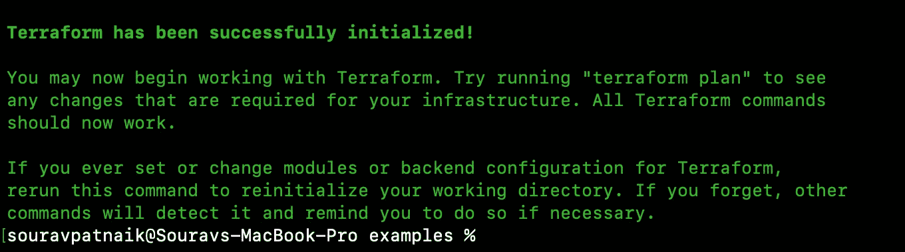

# 定制地形提供商设计:第 2 部分

> 原文：<https://blog.devgenius.io/custom-terraform-provider-design-part-02-e67436752706?source=collection_archive---------2----------------------->

> 在[第 01 部分](https://souravpatnaik.medium.com/custom-terraform-provider-design-c39287c816e9)中，我们已经介绍了 Terraform 的基础知识，即代码基础设施(IaC)；按照 terraform 的 [SDKv2](https://www.terraform.io/plugin/sdkv2/sdkv2-intro) 设置我们的开发环境，以创建我们自己的定制 Terraform 提供者。

现在，我们将实际实现自定义 terraform 提供者的逻辑。

# 好的，那么我们到底要做什么…

我们将为与我们的 [**复仇者-后端**](https://github.com/sourav977/avengers-backend) 应用程序的 API 交互的 Terraform 提供者创建**复仇者资源**。为此，我们将:

1.  **通过添加一个脚手架来定义复仇者资源**，该脚手架定义了一个空模式和创建、读取、更新和删除复仇者的函数。
2.  **定义复仇者模式**。我们将在所有需要的地方定义复仇者联盟资源需要的所有参数。
3.  **实现创建、读取、更新、删除功能**。Create 调用 POST 请求到/Avengers/createNewAvenger；Read 调用 GET 请求到/Avengers/getAllAvengers；更新调用 PUT 请求到/Avengers/updateAvengerByName；而 Delete 通过复仇者联盟-客户端库调用删除请求给复仇者联盟-后端应用的/avengers/deleteAvengerByName。
4.  更新 **Provider()** 模式中的 **ResourcesMap**
5.  实现**数据源**功能
6.  更新提供者()模式中的**数据源映射**
7.  **本地构建**
8.  **就地测试**。在 main.tf 文件中定义 avengers 资源来创建、读取、更新、删除
9.  将所有更改提交到你的 GitHub 库。

# 步骤 1:复制复仇者联盟资源支架

*   在复仇者目录下创建 **resource_avengers.go**
*   我们必须遵循上面的文件命名约定。我的资源名是 avengers，所以文件名 resource _ Avengers . go . "**resource _**"将作为资源名的前缀。示例:resource_users.go、resource_signup.go、resource_login.go、resource_iam.go 等。
*   每个资源都应该有一个单独的 resource_ <resource-name>。去归档。</resource-name>
*   将以下代码添加到 resource_avengers.go 文件中。这是复仇者资源的脚手架。

```
package avengers

import (
  "context"

  "github.com/hashicorp/terraform-plugin-sdk/v2/diag"
  "github.com/hashicorp/terraform-plugin-sdk/v2/helper/schema"

  aclient "github.com/sourav977/avengers-client"
)

func resourceAvengers() *schema.Resource {
  return &schema.Resource{
    CreateContext: resourceAvengersCreate,
    ReadContext:   resourceAvengersRead,
    UpdateContext: resourceAvengersUpdate,
    DeleteContext: resourceAvengersDelete,
    Schema: map[string]*schema.Schema{},
  }
}

func resourceAvengersCreate(ctx context.Context, d *schema.ResourceData, m interface{}) diag.Diagnostics {
  // Warning or errors can be collected in a slice type
  var diags diag.Diagnostics

  return diags
}

func resourceAvengersRead(ctx context.Context, d *schema.ResourceData, m interface{}) diag.Diagnostics {
  // Warning or errors can be collected in a slice type
  var diags diag.Diagnosticsreturn diags
}

func resourceAvengersUpdate(ctx context.Context, d *schema.ResourceData, m interface{}) diag.Diagnostics {
  return resourceOrderRead(ctx, d, m)
}

func resourceAvengersDelete(ctx context.Context, d *schema.ResourceData, m interface{}) diag.Diagnostics {
  // Warning or errors can be collected in a slice type
  var diags diag.Diagnostics

  return diags
}
```

让我们看一下上面的代码片段。

*   在 resource_avengers.go 中， **resourceAvengers()** 是重要的函数。由于我们正在创建复仇者资源，所以函数名为 resourceAvengers()。
*   **CreateContext** 、 **ReadContext** 、 **UpdateContext** 、 **DeleteContext** 是对该资源的 CRUD 操作。它们持有相应的函数名 **resourceAvengersCreate** ， **resourceAvengersRead** ， **resourceAvengersUpdate** ， **resourceAvengersDelete** ，其中实际逻辑已经实现，并在同一个 go 文件中声明和定义。
*   在模式中，我们将定义复仇者资源支持哪些不同的参数
*   导入我们的客户端-库 [**复仇者-客户端**](https://github.com/sourav977/avengers-client) ，通过它我们将与我们的[**aven egrs-后端**](https://github.com/sourav977/avengers-backend) 进行通信。

# 步骤 2:定义复仇者模式

所有 Terraform 资源都必须有一个模式。这允许提供者将 JSON 响应映射到模式。

*   为了创建复仇者资源，我们在复仇者后端定义了模型/对象。ref:[https://github . com/sourav 977/Avengers-back end/blob/main/models/avenger . go](https://github.com/sourav977/avengers-backend/blob/main/models/avenger.go)
*   为了保存复仇者联盟的结果，我们在复仇者联盟客户端库中创建了类似的模型/对象。ref:[https://github . com/sourav 977/Avengers-client/blob/main/models . go](https://github.com/sourav977/avengers-client/blob/main/models.go)

```
type Avenger struct {
		ID     string `json:"_id,omitempty"`
		Name   string `json:"name,omitempty"`
		Alias  string `json:"alias,omitempty"`
		Weapon string `json:"weapon,omitempty"`
	}
```

*   所以当你将要执行一个 create 操作的时候，你要传递上面的数据，当你将要执行 get all 的时候，你会收到一个复仇者列表。所以我们必须像那样设计我们的模式。为了便于学习，我没有创建一个复合结构，但得到所有复仇者联盟是复仇者联盟的一部分。
*   替换行架构:map[string]*schema。resourceAvengers()函数中的架构{}，具有以下架构。

```
Schema: map[string]*schema.Schema {
            "avengers": &schema.Schema{
                Type:     schema.TypeList,
                Computed: true,
                Elem: &schema.Resource{
                    Schema: map[string]*schema.Schema{
                        "_id": &schema.Schema{
                            Type:        schema.TypeString,
                            Computed:    true,
                            Description: "the _id value returned from mongodb",
                        },
                        "name": &schema.Schema{
                            Type:        schema.TypeString,
                            Computed:    true,
                            Description: "full name of avenger",
                        },
                        "alias": &schema.Schema{
                            Type:        schema.TypeString,
                            Computed:    true,
                            Description: "any alias/nickname of avenger",
                        },
                        "weapon": &schema.Schema{
                            Type:        schema.TypeString,
                            Computed:    true,
                            Description: "his/her special weapons",
                        },
                    },
                },
            },
            "_id": &schema.Schema{
                Type:        schema.TypeString,
                Computed:    true,
                Description: "the _id value returned from mongodb",
            },
            "name": &schema.Schema{
                Type:        schema.TypeString,
                Required:    true,
                Description: "full name of avenger",
            },
            "alias": &schema.Schema{
                Type:        schema.TypeString,
                Required:    true,
                Description: "any alias/nickname of avenger",
            },
            "weapon": &schema.Schema{
                Type:        schema.TypeString,
                Required:    true,
                Description: "his/her special weapons",
            },
            "deleted_count": &schema.Schema{
                Type:        schema.TypeInt,
                Computed:    true,
                Description: "deleted item count",
            },
            "matched_count": &schema.Schema{
                Type:        schema.TypeInt,
                Computed:    true,
                Description: "total matched item found",
            },
            "modified_count": &schema.Schema{
                Type:        schema.TypeInt,
                Computed:    true,
                Description: "total item modified",
            },
            "upserted_count": &schema.Schema{
                Type:        schema.TypeInt,
                Computed:    true,
                Description: "total item upserted",
            },
        },
```

*   如果你注意到，“复仇者联盟”是模式类型。类型列表。在这里，我们将举行获得所有复仇者的结果。当 terraform 将执行 get/getall 操作时，它将被填充。
*   类型:模式。类型字符串、架构。TypeInt 表示这些值分别为 string、Int 类型。
*   Computed: true，表示在创建时计算该值的结果(除非 config 指定)。
*   Required: true，表示创建/更新/删除时需要该值。
*   因为我们的复仇者联盟客户端库会告诉我们它从复仇者联盟后端得到了什么，所以我定义了复仇者联盟客户端将返回给 terraform provider 的所有元素。

# 步骤 03:实现创建功能:

*   现在在 resourceAvengersCreate()函数中添加下面的代码。

```
func resourceAvengersCreate(ctx context.Context, d *schema.ResourceData, m interface{}) diag.Diagnostics {
    // Warning or errors can be collected in a slice type
    log.Printf("[DEBUG] %s: Beginning resourceAvengersCreate", d.Id())
    var diags diag.Diagnostics
    c := m.(*ApiClient)

    name := d.Get("name").(string)
    alias := d.Get("alias").(string)
    weapon := d.Get("weapon").(string)

    a := aclient.Avenger{
        Name:   name,
        Alias:  alias,
        Weapon: weapon,
    }

    res, err := c.avengersclient.CreateAvenger(a)
    if err != nil {
        return diag.FromErr(err)
    }

    if err := d.Set("_id", res.ID); err != nil {
        return diag.FromErr(err)
    }
    if err := d.Set("name", res.Name); err != nil {
        return diag.FromErr(err)
    }
    if err := d.Set("alias", res.Alias); err != nil {
        return diag.FromErr(err)
    }
    if err := d.Set("weapon", res.Weapon); err != nil {
        return diag.FromErr(err)
    }

    d.SetId(res.ID)
    log.Printf("[DEBUG] %s: resourceAvengersCreate finished successfully", d.Id())
    return diags
}
```

*   让我们看一下上面的代码。
*   首先，我初始化一个客户端连接，从 Schema 获取值，然后调用 **CreateAvenger()** 。从 avengers-client 接收数据后，再次整理相应的值并返回。
*   下面是创建复仇者资源的序列图。


创建复仇者资源的顺序图

*   类似地，实现读取、更新、删除逻辑。ref:[https://github . com/sourav 977/terra form-provider-Avengers/blob/main/Avengers/resource _ Avengers . go](https://github.com/sourav977/terraform-provider-avengers/blob/main/avengers/resource_avengers.go)

# 步骤 04:更新 Provider()模式中的资源映射

*   打开 provider/provider.go 文件，添加我们在步骤 03 中编辑完成的 **resourceAvengers()** :

```
ResourcesMap: map[string]*schema.Resource {
               "avengers_resource": resourceAvengers(),
        },
```

*   另外，将模式添加到 **Provider()** 函数中，添加以下代码:

```
Schema: map[string]*schema.Schema {
            "host": &schema.Schema {
                Type:        schema.TypeString,
                Required:    true,
                DefaultFunc: schema.EnvDefaultFunc("AVENGERS_BACKEND_HOST_URL", "http://localhost:8000"),
            },
        },
        ConfigureContextFunc: providerConfigure,
```

*   **主机**:复仇者联盟提供者配置中始终需要。如果您的应用程序有登录/注册功能，然后在这里添加用户名，密码等字段。
*   **ConfigureContextFunc** :在任何读取、创建、更新、删除等函数之前都会被调用。provider configuration 是一个函数，在这个函数中，您将通过调用客户端库来执行所有预验证检查，如登录/注册等。
*   有关更多信息，请参考 provider.go。ref:[https://github . com/sourav 977/terra form-provider-Avengers/blob/main/Avengers/provider . go](https://github.com/sourav977/terraform-provider-avengers/blob/main/avengers/provider.go)

# 步骤 05:实现数据源

*   dataSource 是执行操作以一次获得所有资源数据的地方。
*   我们将在 getAllAvengers 中实现它
*   在复仇者目录中创建**data _ source _ Avengers . go**
*   我们必须遵循上面的文件命名约定。我的资源名称是 avengers，因此文件名 data _ source _ Avengers . go . "**data _ source _**"将作为资源名称的前缀。例如:data_source_users.go、data_source_signup.go、data_source_login.go、data_source_iam.go 等。
*   每个资源都应该有一个单独的 data_source_ <resource-name>。去归档。</resource-name>
*   在脚手架下方添加:

```
func dataSourceAvengers() *schema.Resource 
    return &schema.Resource{{
}}
```

*   **data source angers()**是 terraform 将调用的函数，用于检索特定资源的所有数据。
*   我们必须在这里创建一个模式，它将保存所有的资源数据和一个相应的函数来执行这样的操作。
*   这里我们将只添加模式来保存结果数据(复仇者的切片)，不需要创建单独的 ReadAll 功能，因为我们已经在 **resourceAvengersRead()** 函数提供者/resource_avengers.go 文件中实现了该功能。ref:[https://github . com/sourav 977/terra form-provider-Avengers/blob/main/Avengers/resource _ Avengers . go](https://github.com/sourav977/terraform-provider-avengers/blob/main/avengers/resource_avengers.go)

# 步骤 06:更新 Provider()模式中的 DataSourcesMap

*   打开 provider/provider.go 文件，添加我们在步骤 03 中编辑完成的**data source angers()**:

```
DataSourcesMap: map[string]*schema.Resource {
            "avengers_datasource": dataSourceAvengers(),
        },
```

# 步骤 07:构建代码

*   奔跑

```
make install
```

*   验证您的**~/. terra form . d/plugins/$ { HOSTNAME }/$ { NAMESPACE }/$ { VERSION }/$ { OS } _ $ { OS _ ARCH }**路径，并检查构建的二进制文件是否可用。

# 步骤 08:本地测试

*   在你的项目根路径中，创建**示例**目录并将其光盘化。
*   创建 **main.tf** 文件，添加以下内容

```
terraform {
  required_providers {
    avengers = {
      version = "1.0.1"
      source  = "github.com/sourav977/avengers"
    }
  }
}

provider "avengers" {
  host = "http://localhost:8000"
}

resource "avengers_resource" "foo" {
  name = "sourav patnaik"
  alias = "sikan"
  weapon = "hammer"
}

output "created_avenger" {
  value = avengers_resource.foo
}
```

*   现在运行:

```
terraform init
```



地形初始化输出

*   现在运行:

```
terraform plan
```


地形图输出

*   现在运行:

```
terraform apply
```

并在询问时输入“是”。


terraform 应用输出

*   类似地，通过编写适当的 terraform 脚本来执行 GetAll、Update、Delete 操作。参考:[https://github.com/sourav977/terraform-provider-avengers](https://github.com/sourav977/terraform-provider-avengers)

# 步骤 09:将代码提交到 GitHub

*   在本地成功验证您的定制 terraform 提供者之后，将代码推送到您的 GitHub 存储库。在项目根目录中:

```
git add .
git commit -m "<your message ... >"
git push
git tag v1.0.0
git push origin v1.0.0
```

*   是的，你必须创建一个标签。这将在第 03 部分中要求。

> *在* [***第 03 部分***](https://souravpatnaik.medium.com/create-custom-terraform-provider-part-03-c3f6bc9fd183) *中，我们将在 Terraform 注册表中创建一个帐户，并推送我们的自定义 Terraform 提供者。*

我在我的 [**LinkedIn 账号**](https://www.linkedin.com/pulse/create-custom-terraform-provider-part-02-sourav-patnaik/) 也发表过同样的内容。请检查。

Sourav Patnaik