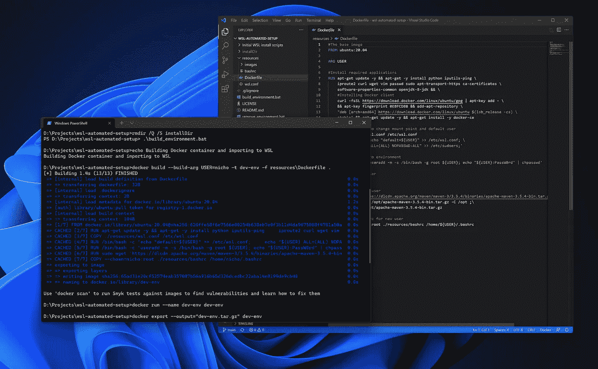
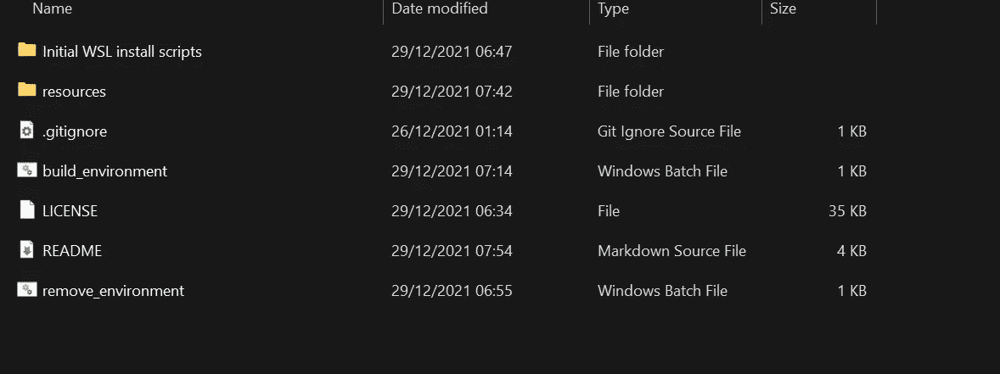
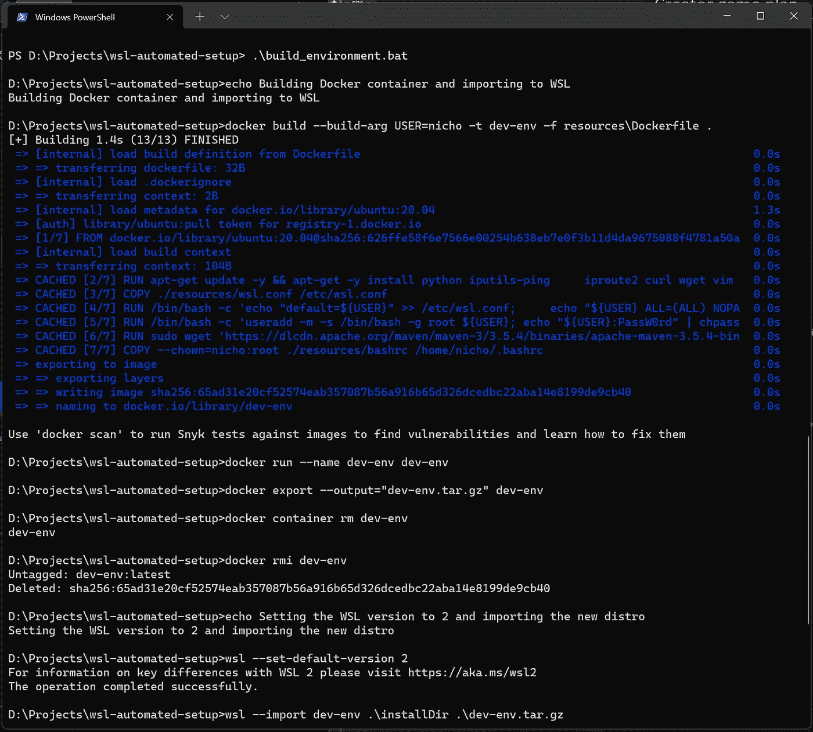
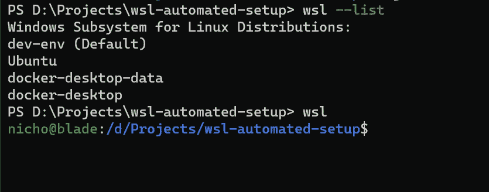

# 使用 Docker 定制 WSL 发行版

> 原文：<https://blog.devgenius.io/custom-wsl-distros-using-docker-1a326eedce46?source=collection_archive---------7----------------------->

关于如何创建可定制和可复制的 WSL 发行版的指南，该发行版可以在您的开发团队之间共享，以保持您的本地设置相同，这样我们就可以减少*“它在我的机器上工作…”的*时刻。



WSL 自动设置正在运行。

# 介绍

在软件开发团队中工作有起有落。对我来说，开始时的一个大问题是每个团队成员设置开发机器的方式不一致。是的，我知道每个人都有不同的品味和偏好……但是有些不一致可以归结为没有固定的做事方式，或者人们尝试了一种不起作用的方式，所以他们找到了自己的解决方案。

根据我自己的经验，这个问题是一个团队成员可能使用 VM 进行开发，而另一个成员使用 WSL、Git Bash 或 CMD。这导致在试图互相帮助解决常见问题或解释如何做某事时出现许多问题，因为每个不同的设置需要不同的程序或不同的工具，更不用说工具版本的不一致了。

## 好吧，你已经表达了你的观点，你的解决方案是什么？

当然，没有一个*的方案可以解决上述问题。然而，我决定采用的解决方案是使用 WSL，但不是以通常的方式。为了确保任何使用该设置的人都能以几乎镜像的方式完成安装，我创建了一组脚本和一个 docker 文件来完成一些事情。*

*   *安装所有需要的工具… java，maven 等*
*   *创建新用户(基于运行脚本的用户)*
*   *复制默认的. bashrc 文件以获得一致的别名和函数*

> *这里还可以做许多其他事情，比如为您的环境设置任何所需的网络。对于我自己的工作场所，这需要通过 VPN 连接到互联网，但我在这里没有提到它，因为它可能不会转移到其他用例。*

# *我们开始吧*

## *先决条件*

*在进行安装之前，有几个要求，它们是:*

*   *启用/安装 WSL2(它也可以用于版本 1)*
*   *Docker 桌面*
*   *克隆/下载以下回购:[https://github.com/n-murray/wsl-automated-setup](https://github.com/n-murray/wsl-automated-setup)*

*一旦你安装并运行了以上程序，你就可以继续安装了。*

*如果你不想下载回购，你可以自己重新创建。*

> *仅供参考:根据您的 Git 安装和配置，它有时会将文件的行尾从 Linux (LF)格式更改为 Windows (CRLF)格式，这可能会导致像“wsl.conf”和“”这样的安装文件出现问题。bashrc”需要是 LF 才能被 Linux 正确读取。*

## *装置*

*如果您查看 repo 内部，您会注意到它包含两个批处理文件和几个文件夹。最重要的部分是批处理文件，它们都顾名思义*构建*WSL 发行版并且*移除*它。*

**

*要构建环境，您只需在命令提示符或 PowerShell 窗口中打开文件夹，然后运行“build_environment.bat”。根据您的互联网连接，该过程可能需要一段时间才能完成，因为批处理文件正在构建 Docker 映像，并下载和安装 resources 文件夹中 Docker 文件中列出的所有要求。*

**

*一旦完成，您将能够通过运行下面的命令列出您的 WSL 发行版来检查结果。*

```
*wsl --list*
```

**

*这应该会给你一个类似于上面的输出，新发行版的名称是“dev-env”。您还会注意到，新发行版已经被设置为您的默认发行版，因此您现在只需在 PowerShell 或 CMD 中运行“wsl”就可以访问它。*

*要删除这个发行版，你可以运行“remove_environment.bat ”,这将从 WSL 中注销发行版并删除安装文件。使用这两个批处理文件的组合，您可以轻松地删除一个损坏的安装并重新安装一个新的副本。在更改了一些你不应该有的设置，也不记得是什么设置之后，这个就派上用场了。*

*是的，这几乎是你需要做的全部工作…*

## *刚刚发生了什么？*

*让我对‘build _ environment . bat’实际上是做什么的做一个高层次的解释，没有太多。*

*第一部分*

*以上命令是创建定制 Linux 发行版的第一步。*

*第 1 行在 resources 文件夹中构建 Docker 文件，并将当前用户作为参数传递，以便在 Docker 映像中创建一个用户。*

*第 2 行运行上面创建的映像，并将容器命名为“dev-env”，这个名称没有任何意义，只是为了在后续命令中调用它。*

*第 3 行[将“dev-env”容器文件系统导出为一个名为“dev-env.tar.gz”的 tar 归档文件。](https://docs.docker.com/engine/reference/commandline/export/)*

*第 4 行和第 5 行只是清理创建的容器和图像。*

*第二部分*

*创建 tar 文件后，下一步是[将它作为新发行版导入 WSL](https://docs.microsoft.com/en-us/windows/wsl/use-custom-distro) 。这是使用上述代码片段中的命令完成的。*

*第 1 行将默认的 WSL 版本设置为 2，以防它还不是。*

*第 2 行从之前创建的 tar 文件中实际导入发行版。它导入文件并将新发行版命名为“dev-env”(可以是任何名称)*

*第 3 行只是将新发行版设置为默认的 WSL 发行版，这有助于 Docker Desktop 自动与发行版集成。*

*第 6 行也是通过删除不再需要的 tar 文件进行清理，如果需要，可以重新创建。*

# *包扎*

*使用上面的脚本，你可以快速地创建一个新的 WSL 发行版，并同样快速地删除它，因为我们使用 docker 文件，你可以添加任何你需要的工具或者删除那些不再需要的工具。*

*最终目标是拥有多个 done 文件，可以用来为具有不同需求的不同项目快速创建一个新的发行版，这可以通过几种不同的方式来实现。创建 repo 的新分支或分叉可能是最简单的，但是在 resources 文件夹中有多个 docker 文件可以通过选择一个要安装的发行版并向批处理文件传递一个参数来实现。*

*我鼓励任何感兴趣的人对回购提出任何建议，因为我愿意合作，并为不同类型的发行版创建不同的分支。*

*最后，请随意对本文或其中概述的过程留下任何评论，因为我一直在寻找改进的方法。*