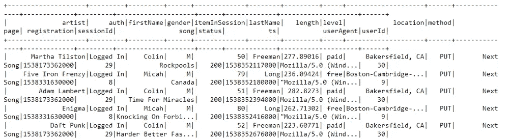
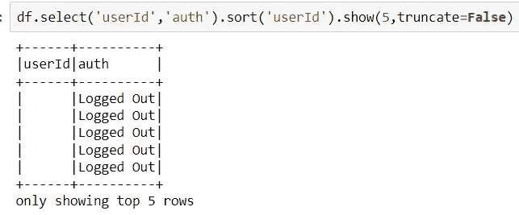

# 利用 PySpark 进行客户流失预测

> 原文：<https://blog.devgenius.io/customer-churn-prediction-with-pyspark-76c16a19f1?source=collection_archive---------6----------------------->


客户流失

流媒体公司最关心的事件之一就是客户流失。这可能会减少收入，并在行业中失去竞争力。客户流失广泛应用于技术行业，也称为客户流失，是指客户的流失或客户停止使用服务或产品。客户流失的原因可能是多方面的，如糟糕的客户服务、高昂的价格、竞争和缺乏价值等。本博客将介绍如何使用 PySpark 帮助公司降低客户流失率。本博客将关注数据处理和结果讨论。如果你对如何使用 PySpark 建立机器学习模型的细节感兴趣，请参见我之前的博客[这里](/build-a-machine-learning-model-with-pyspark-641cd70b7923)。该项目的代码可以在我的 Github [这里](https://github.com/xujiang1993/Customer_Churn_with_PySpark)找到。

# 问题定义

客户流失是许多流媒体公司面临的一个大问题。为了降低客户流失率，需要一个准确的预测器。一个好的客户流失预测器可以帮助公司识别潜在的流失客户，然后公司可以制定一些有用的促销计划/补救措施来留住客户。然而，流媒体公司的数据通常非常大，这导致普通的机器学习/数据处理库无法工作，因此需要分布式计算。这个博客中的项目将使用 PySpark 建立一个客户流失预测器。PySpark 是一个流行的大数据分布式计算库，它也支持一些线性机器学习模型的开发。工作流程将遵循下图


项目的工作流程

**数据来源**

这个项目使用了一家音乐流媒体公司来自 [Udacity](https://www.udacity.com/) 的客户事件数据。该数据包含播放的歌曲、相关的艺术家、帐户状态(登录/注销/客人/取消)、用户行为(主页、拇指向下、提交降级、取消、滚动广告、注销、保存设置、关于、提交注册、添加到播放列表、添加朋友、下一首歌、拇指向上、升级等。)、登录的设备、用户 id、时间戳、会话 id、位置、使用时长等。



数据演示

**指标**

该项目将使用 f1 得分和准确度来衡量模型的性能—f1 得分考虑了对预测器很重要的假阳性率和假阴性率，而准确度是衡量分类器性能的最基本指标。


f1 得分公式

# 数据预处理和可视化

该部分将研究数据并对数据进行一些处理。

## 删除重复和未知的行

当用户从应用程序注销时，在数据库中观察到一些空用户。下面给出一个例子。



观察到空的用户 id

第一步是删除这些空日志，因为这很难跟踪用户之前的活动以及这是否是一个付费用户。

## 用户数量

用户总数为 279 人，其中 52 人取消了他们的服务。流失率为 18.64%。


用户历史操作的统计

数据将是不平衡的数据，因此需要上采样或下采样。

## 页数

第一步是观察客户行为，这可以为我们提供客户行为的概况。共有 20 种客户行为，下图显示了它们的数量。


客户行为的数量

通常，最频繁的事件是播放指示客户的下一首歌曲，并且有 52 个服务取消事件，这与被取消的用户的数量一致。为了跟踪 52 个客户的情况，需要标记取消的客户和取消之前的事件。

## 数据标记

通过一些数据操作，所有取消的客户都被标记在一个新的称为“客户流失”的列中，并且使用窗口功能来跟踪取消之前的活动。

```
# customized function 
flag_event **=** udf(**lambda** x : 1 **if** x **in** {'Cancellation Confirmation'} **else** 0, IntegerType())*# define the current churn or not state*
df **=** df**.**withColumn('Churn',flag_event('page'))
df**.**where(df**.**Churn **==** 1)**.**show()*# label the activities prior to the cancellation*
churn_window **=** Window**.**partitionBy("userId")**.**rangeBetween(Window**.**unboundedPreceding, Window**.**unboundedFollowing)
df **=** df**.**withColumn("user_churned", sum('Churn')**.**over(churn_window))
df**.**show()
```


用一个名为“流失”的新列标记客户取消

## 取消前的活动

sql 语言用于查询每个用户取消前的活动。下图显示了 52 个子图，每个子图展示了每个被取消用户每天播放歌曲时长的趋势。x 轴是时间，y 轴代表每天播放歌曲的总时长。


取消前每天播放歌曲时长的可视化

总的来说，这 52 个用户存在的时间并不长，他们中的大多数只使用了几天。有四个支线剧情是空的，这是因为这四个用户只使用了一天的服务，然后他们取消了。这可能是因为他们在免费试用，或者服务对他们来说完全没有用。然而，一些用户在取消他们的服务之前似乎经常使用该服务(一些用户甚至每天使用该服务超过 8 小时)。他们取消的原因可能是一些不好的推荐或客户服务。可能需要更多信息(如客户反馈)来进一步调查根本原因。

## 拇指向下计数

拇指向下可以表明用户是否对服务质量感到失望。下图展示了被取消的用户被否决的次数。


对已取消用户的否决计数

如图所示，52 个用户中有 47 个在他取消之前使用过拇指向下，他们中的一些人经常点击拇指向下(> 10 次)。这表明一部分被取消的用户可能对推荐的歌曲不满意。因此，提高客户流失率的解决方案之一可能是改善他们的推荐。

# 方法学

上一节演示了如何清理数据，并探讨了客户流失的一些潜在原因。本节将介绍如何建立一个机器学习模型来预测客户流失。这个博客将使用二元分类器来识别用户是否倾向于被搅动。

## 数据工程

数据工程是关于为训练和测试模型创建特征输入。这些特征通常可以分为数字特征和类别特征。在这个阶段，sql 语言和 pandas dataframe 函数经常用于数据操作。

**数字特征**

这个项目中的数字特征已经被标准化了——较大的绝对数字可能会支配不需要的分类器。

1.  收听的歌曲数量:

用户收听的歌曲的数量可以指示该服务对用户是否有用。如果是，但用户仍然离开，这很可能是由一些客户服务而不是内容的质量引发的。

2.每个用户的歌曲长度的平均值和标准偏差:

用户收听的歌曲长度的平均和标准偏差也可以指示该内容对每个用户的吸引力。一般来说，较高的平均值和较低的标准偏差表明用户对服务有良好的体验。

3.活动计数

如前所述，竖起大拇指/放下大拇指等活动对于表明用户是否对服务感到失望非常重要。因此，计数将是识别客户情绪的关键特征。

4.用户关注的艺术家数量

用户关注的艺术家数量可以反映用户对该服务的依赖程度。更多的关注可能表明用户是有价值的，难以离开。

5.每个用户的会话数

会话的数量可以指示用户如何喜欢该服务，并且这将是识别用户是否会流失的重要特征。

6.用户订阅的时间长度

更长的订阅可能表明用户习惯于该服务，并且用户不太可能流失。

**分类特征**

该项目将所有分类特征转换为虚拟变量，这可以让模型无偏见地学习数据。使用的分类特征包括:

1.  *经纪人*:

此变量包含用于登录的设备/操作系统/平台的信息。选择这个变量的原因是，音乐应用程序可以在不同的平台上用不同的编程语言编写，这可能会影响用户体验。

2.性别:

不同的性别可能有不同的偏好，因此研究推荐系统是否对不同的性别有偏见是很重要的。

3.级别:

这个变量把用户分为免费和付费两个层次。这可以用作用户容忍度的指标——付费用户通常对服务质量差的容忍度较低。

4.位置:

不同的地点可能有不同的文化，这可能与推荐系统相冲突

**主成分分析**

这个项目已经从原始数据中提取了很多特征。因此，PCA 被用来消除冗余特征，保留信息特征。

**欠采样**

正如所展示的，数据子集中的流失客户数量只有 52。但是，子集数据中的总客户数是 279。为了获得更好的模型，需要对数据进行欠采样，以便输入模型进行训练。

## 系统模型化

由于 PySpark 目前仅支持线性机器学习方法，该项目测试了所有可用的分类器，包括逻辑回归、决策树、梯度提升树、随机森林和多层感知器分类器。该项目没有使用数据管道来封装整个数据处理模型，因为该项目没有包括许多转换器，并且需要测试各种估计器。在这种情况下，如果没有管道，它会运行得更快。

由于模型在本地模式下运行缓慢，因此这项工作选择了延迟验证来训练和测试模型。我会尝试用云平台制作下一个博客，使用更复杂的功能、后期处理和验证方法。网格搜索是为了测试模型的各种参数，并找到模型的最佳超参数。

# 履行

## 要求

编程语言— Python 3.6.2

软件包— PySpark、re 和 matplotlib

所有代码都在我 Github 的 [Sparkify.ipynb](https://github.com/xujiang1993/Customer_Churn_with_PySpark/blob/main/Sparkify.ipynb) 里。

## 算法

该项目测试了多个基本的机器学习模型，包括逻辑回归[【1】](https://towardsdatascience.com/logistic-regression-classifier-8583e0c3cf9)、决策树[【2】](https://medium.com/swlh/decision-tree-classification-de64fc4d5aac)、梯度提升树[【3】](https://blog.paperspace.com/gradient-boosting-for-classification/)、随机森林[【4】](https://towardsdatascience.com/understanding-random-forest-58381e0602d2)和多层感知器分类器[【5】](https://machinelearningmastery.com/neural-networks-crash-course/)。这个博客不会在这里描述这些分类器的基本原理，但是细节可以在上面的链接中找到。

## 精炼

这个项目使用支持验证和 gridsearch 函数来调整模型的参数。f1 分数用于指示模型的细化，所选择的特征和数据工程处理方法主要针对模型的细化进行更新。

# 结果和评估

这项工作使用 BinaryClassificationEvaluator()来测试模型的性能。衡量标准是 f1 得分和准确性。以下型号已经过测试。


逻辑回归的表现


决策树的性能


梯度提升树的性能


随机森林模型的性能


多层感知器分类器的性能

最好的模型是逻辑回归模型，该模型在客户流失预测中取得了大约 84%的 f1 分数，并且仅用了 15.8 分钟进行训练和测试。虽然这种准确性对于实际部署来说仍然不够，但 84%的 f1 分数可以帮助公司提前识别一些潜在的不稳定客户。下一步是从云平台获得更多的计算能力，以测试更多的超参数和功能，进一步改善 f1 的得分。如果可能，可以设计一个在线实验来进一步测试分类器是否能为企业带来利润。

**对齐**

由于本地模式的时间可用性和低计算能力，该项目已通过网格搜索功能将参数调整降至最低。即便如此，这些模型在只有 128 MB 子集数据的情况下，训练和测试需要 45 分钟。

虽然现在发现逻辑回归是具有 f1 分数的最佳模型，但是逻辑回归和多层感知器分类器的性能差异非常小。因此，可以怀疑，随着更多的参数与 gridsearch 函数一起使用，多层感知器分类器可以表现得更好。但正如我之前所说，本地模型运行太慢，52 个用户的数据量太小，不容易导致混乱。因此，这个项目需要运行 12 GB 的全套数据来重新训练和重新测试模型。在这种情况下，需要云平台提供更多的计算能力。

# 结论

客户流失困扰了很多流媒体公司。该项目使用 PySpark 从一些在线音乐服务数据中提取特征，并找到一个最佳的机器学习模型来预测客户流失。这可以帮助公司识别潜在的流失客户，并采取一些补救措施来留住客户。最好的模型可以达到 84%左右的 f1 分数。

# 反射

随着收集的数据量不断增加，我们不可避免地要使用多个聚类进行建模。因此，传统的 scikit-learn 或 pandas 不再有效。PySpark 是建立分布式电源支持的机器学习模型的有用工具，但目前仅限于线性模型的开发。此外，多集群设置需要云平台的支持，但在许多情况下，云平台上的服务不是免费的。本地模式可以用来练习语法，但是通常需要很长时间来训练和测试模型，并且很难练习用于分布式计算模式的调试。在未来，我希望分享更多关于 PySpark 的经验，帮助数据爱好者在最少的时间和成本内获得有用的技能。

# 改进

由于本地模式的可用性和计算能力不足，本博客以当前的功能和参数结束，但应该有一些空间来进一步改进完整数据集的解决方案(该项目仅使用 128MB 的子集数据来构建模型，但完整数据集将为 12GB，这需要使用云平台的多个集群来完成工作)，更多的功能，并使用 gridsearch 函数测试额外的参数(由于计算能力有限，我仅使用了几个参数)。我将在下一篇博客中尝试使用云平台来探索所有这些。最后，如果你能点击**鼓掌**来支持我的博客，我会非常感激，我会继续围绕数据科学或一些热点领域制作更多有趣的内容。