# 使用 SQL 进行客户和产品分析

> 原文：<https://blog.devgenius.io/customers-and-products-analysis-using-sql-973a22f4088e?source=collection_archive---------6----------------------->

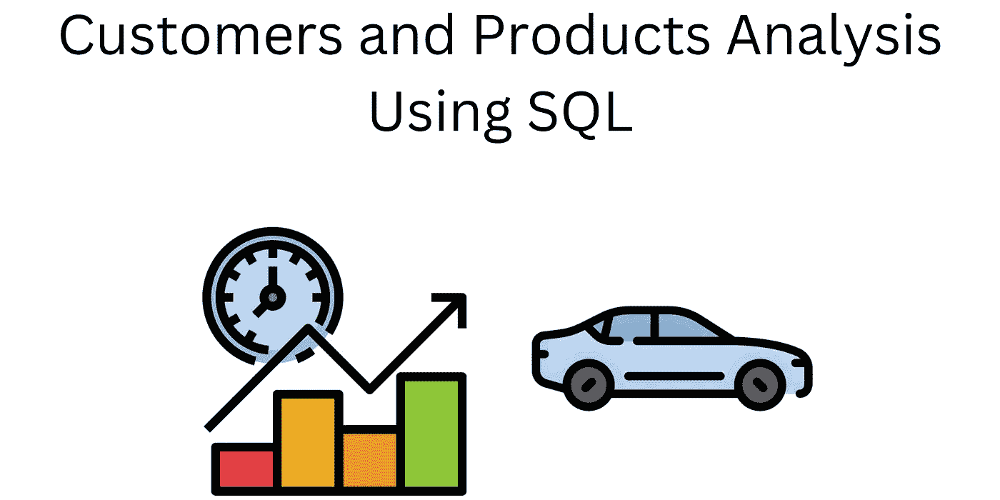

这个项目的目标是从比例模型汽车的销售记录数据库中分析数据，并为决策提取信息。

👉请点击查看查询[的链接](https://github.com/nuel000/Customers-and-Products-Analysis-Using-SQL)

我们都知道好的分析是从问题开始的。以下是我们想为这个项目回答的问题。

## 问题 1:我们应该多订购或少订购哪些产品？🤔

## 问题 2:我们应该如何根据客户行为定制营销和沟通策略？🤔

## **问题 3:** 我们可以花多少钱来获得新客户？🤔

## 问题 4:就产生的利润而言，哪一年是表现最好的一年，哪种产品名列榜首？🤔

首先，让我们熟悉一下数据库，这样我们可以更好地理解它的表之间的关系。下面是一个 [ERD](https://www.datanamic.com/dezign/erdiagramtool.html) 的数据库。

它包含八个表格:

**客户**:客户数据
**员工**:所有员工信息
**办事处:**销售办事处信息
**订单**:客户的销售订单
**订单明细**:每个销售订单的销售订单行
**付款**:客户的付款记录
**产品**:比例模型汽车列表
**生产线**

现在我们对数据库有了更好的了解，让我们继续回答一些问题

## 问题 1:我们应该多订购或少订购哪些产品？

此问题涉及库存报告，包括低库存和产品性能。这将通过防止畅销产品脱销来优化供应和用户体验。

为了回答这个问题，我们需要逐步分解解决方案

**步骤 1** :找出低库存产品，即每件产品的销售数量除以库存产品数量。我们可以考虑十个最低的利率。这将是(几乎)缺货的十大产品。

**第二步**:求每件产品销售额之和所代表的产品业绩。

**第三步**:优先补货的产品是那些产品性能高，处于缺货边缘的产品。

## 让我们查询！！！！🐱‍💻

**步骤 1(查找低库存产品):**为了实现这一点，我们运行以下查询；

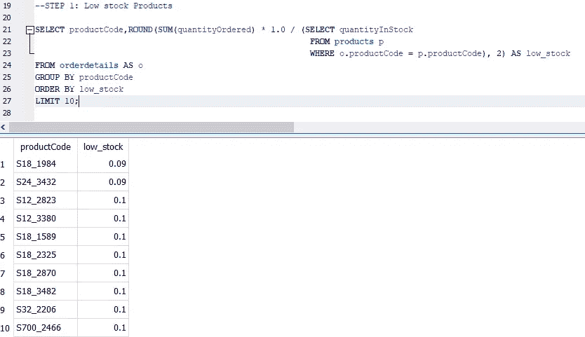

**第二步**:求每件产品销售额之和所代表的产品业绩。为此，我们运行以下查询；

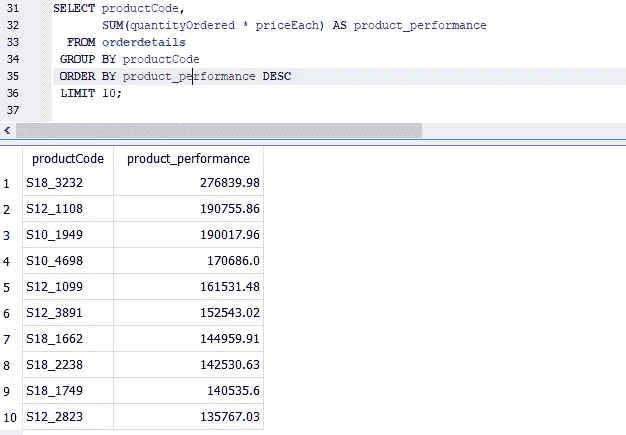

**第三步**:优先补货的产品是那些产品性能高，处于缺货边缘的产品。为此，我们运行以下查询；

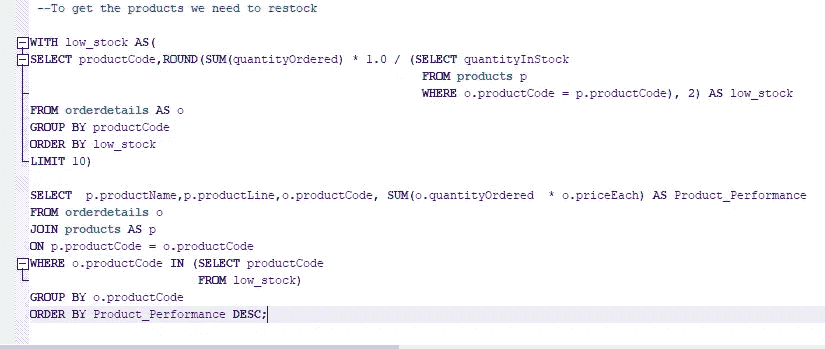

该查询产生了下图

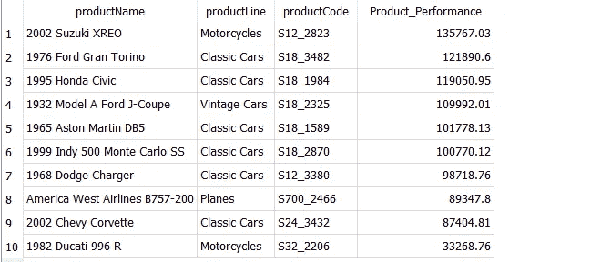

## 问题 2:我们应该如何根据客户行为定制营销和沟通策略？

这包括对客户进行分类:找到 VIP(非常重要的人)客户和那些不太参与的客户。VIP 顾客为商店带来最多的利润。参与度较低的客户带来的利润较少。例如，我们可以组织一些活动来提高贵宾的忠诚度，并为参与度较低的人发起一项活动。

**第一步**:让电脑计算每个顾客产生多少利润。为此，我们运行以下查询；

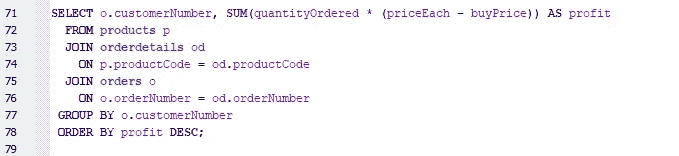

Reuslt

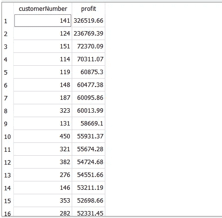

**第二步:**现在让我们知道谁是贵宾，他们来自哪个国家。为此，我们运行以下查询；

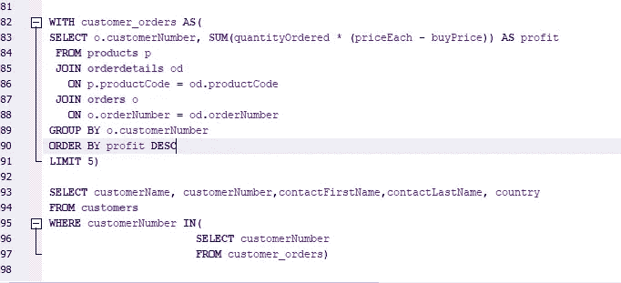

结果

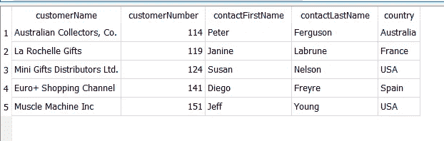

**第三步:**现在让我们了解一下最缺乏吸引力的客户。为此，我们运行以下查询；

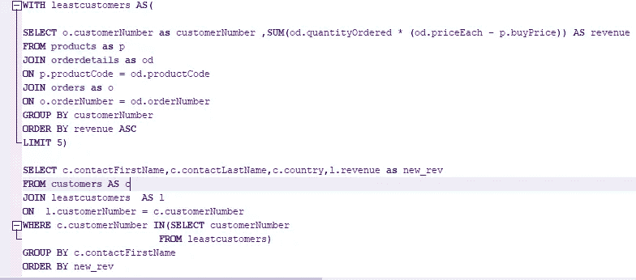

结果

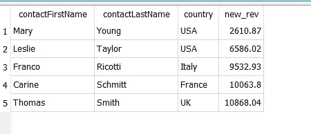

## 问题 3:获取新客户可以花多少钱？

要回答这个问题，我们需要计算客户的生命周期价值。这告诉我们，一个普通顾客在一生中使用我们的商店会产生多少利润。我们可以用它来预测我们未来的利润。为此，我们运行以下查询；

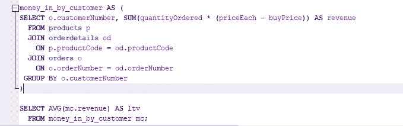

结果

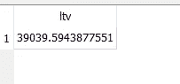

## 问题 4:就产生的利润而言，哪一年是表现最好的一年，哪种产品名列榜首？

为此，我们运行以下查询；

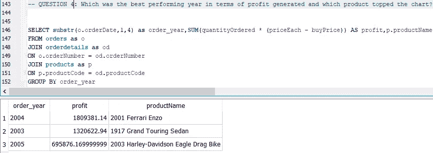

# 推论和结论

从上述分析中得出以下见解。

1.  *公司需要补充更多的* ***老爷车、*** *这是因为它们是性能最高的产品，几乎缺货*
2.  我们的 VIP 客户是:

> **1。澳大利亚收藏家公司**。来自**澳大利亚**
> 
> **2。拉罗谢尔的礼物**来自**法兰西**
> 
> **3。迷你礼品经销商有限公司**来自**美国**
> 
> **4。来自西班牙的 Euro +购物频道**
> 
> **5。美国肌肉机器公司**

而我们表现最差的客户是:

> 1.美国板和玩具公司
> 
> 2.美国汽车经典公司
> 
> 3.来自意大利的科勒齐奥夫人
> 
> 4.来自法国的画室
> 
> 5.英国双层礼品店有限公司

3.我们计算的顾客 LTV 是 **390，395** 这个告诉我们一个普通顾客在他们的一生中在我们商店创造了多少利润。我们可以用它来预测我们未来的利润。因此，如果我们下个月有 10 个新客户，我们将赚到 390，395 美元，我们可以根据这个预测来决定我们可以花多少钱来获得新客户。

4.该公司表现最好的年份是 2003 年，表现最好的产品是 2001 年**法拉利恩佐**

….贡献和建议将受到高度赞赏。感谢阅读🙏🙏