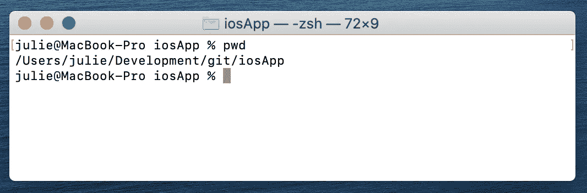
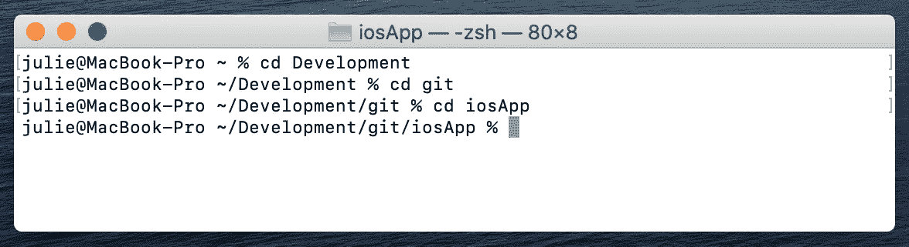
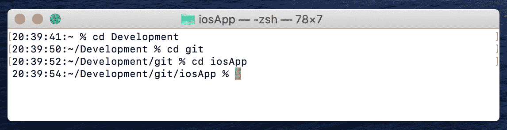
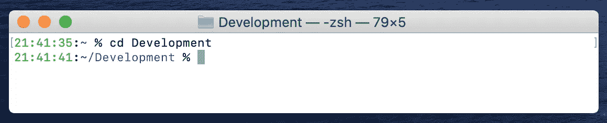

# 自定 MacOS 终端

> 原文：<https://blog.devgenius.io/customize-the-macos-terminal-zsh-4cb387e4f447?source=collection_archive---------0----------------------->

## 使用 Z Shell 个性化提高生产率的提示


[Goran Ivos](https://unsplash.com/photos/T8LMIN09-mo) 在 [Unsplash](https://unsplash.com/photos/T8LMIN09-mo) 上拍摄的照片

截至 2019 年，macOS Catalina 已经采用 [Z Shell](http://zsh.sourceforge.net/Guide/zshguide01.html) ，简称`zsh`作为默认登录 Shell。Z shell 是一个 Unix shell，充当交互式登录 Shell 和 Shell 脚本的命令行解释器。

如果您发现提示没有显示足够或太多的信息，本文将指导您使用几个简单的步骤定制提示。默认情况下，当您在任何 macOS 设备上打开终端时，提示符将只显示当前目录。当在多个目录间导航时，看不到完整的当前目录路径可能会产生阻碍。例如，您可能会发现自己经常键入`pwd`来获取完整路径。



下面我们将讨论如何定制`zsh`提示符。

# 创建一个`~/.zshrc`文件

首先，您需要创建一个配置文件`~/.zshrc`，它将包含提示变量和您可能需要的任何其他环境变量。

1.  打开终端
2.  键入`touch ~/.zshrc`创建文件。
3.  使用 vim、nedit 或任何其他文本编辑器打开`~/.zshrc`文件。如果您正在通过 Finder 访问文件，请使用`Cmd + Shift + .`来显示隐藏的文件。您需要将`PROMPT`变量添加到这个文件中，如下所述。

# 自定义提示

可以通过在`~/.zshrc`文件中设置`PROMPT`变量来覆盖该提示。

不同的占位符在 [zsh 提示文档](http://zsh.sourceforge.net/Doc/Release/Prompt-Expansion.html#Prompt-Expansion)中有详细描述。下面我将重点介绍一些最常见和最有用的提示配置。

默认的终端提示符显示用户名、主机名和当前目录。这表示为:

`PROMPT='%n@%m %. %% '`

组件说明:

```
%n  $USERNAME
%m  The hostname up to the first ‘.’
%.  Current directory
%%  Character '%'
```

如果您想让路径引用完整路径，可以将其配置为:

`PROMPT='%n@%m %~ %% '`

这里唯一的区别就是`%.`被`%~`取代了。

```
%~  Refers to the current working directory, but if the current working directory starts with $HOME, $HOME part is replaced by a '~'.An alternative would be to use %/, which evaluates to the absolute current working directory path.
```

在`~/.zshrc`中应用这些更改并打开一个*新的*终端窗口后，完整路径现在显示在提示符中:



如果你是唯一使用机器的人，并且只访问一台机器，也许显示用户名和机器名并不重要。这里有一个例子，我们只是显示时间和路径，其中`%*`表示一天中的时间，包括秒。

`PROMPT='%*:%~ %% '`



# 添加颜色

您还可以为提示的不同部分指定一种颜色。Zsh [支持颜色](https://wiki.archlinux.org/index.php/Zsh#Colors)字符串黑色、红色、绿色、黄色、蓝色、洋红色、青色、白色或 256 色调色板中从 0 到 255 的任何数字。参考此[链接](https://upload.wikimedia.org/wikipedia/commons/1/15/Xterm_256color_chart.svg)查看所有 256 种颜色的列表。

颜色分配必须以`%F`开始，表示前景色，以`%f`结束。例如，`%F{red}Label%f`将用红色打印单词*标签*。

继续我们上面的例子，假设我们希望时间是绿色的，但是路径是蓝色的。

`PROMPT='%F{green}%*%f:%F{blue}%~%f %% '`



# 额外资源

*   [Zsh 提示文件](http://zsh.sourceforge.net/Doc/Release/Prompt-Expansion.html#Prompt-Expansion)
*   [Git 集成](https://git-scm.com/book/en/v2/Appendix-A%3A-Git-in-Other-Environments-Git-in-Zsh)
*   [Apple Shell 脚本基础知识](https://developer.apple.com/library/archive/documentation/OpenSource/Conceptual/ShellScripting/shell_scripts/shell_scripts.html)
*   [哦，我的 Zsh](https://ohmyz.sh/) ，一个管理 Zsh 配置的开源框架

# 结论

当使用终端在目录和项目间导航时，对终端提示符进行简单的修改极大地提高了我的工作效率。本文涵盖了基础知识，但是进一步的定制和微调可以满足您的确切需求。感谢阅读！