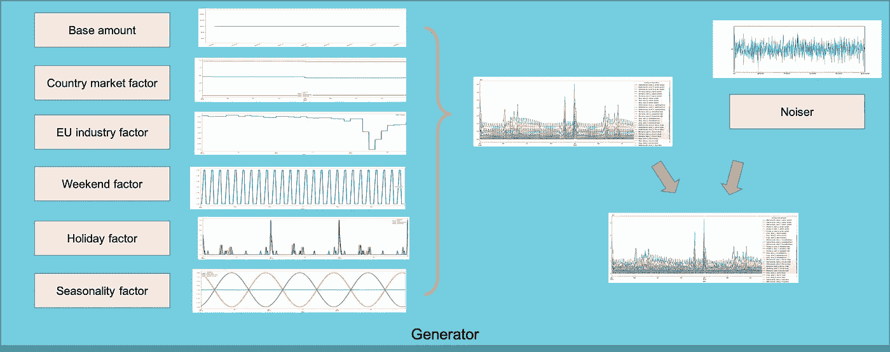

# 通过时间序列生成器定制您的合成时间序列数据

> 原文：<https://blog.devgenius.io/customize-your-synthetic-time-series-data-by-timeseries-generator-9a6669e393bc?source=collection_archive---------5----------------------->

# TL；速度三角形定位法(dead reckoning)

当我在耐克工作时，我们开源了一个可调的合成时间序列数据生成器 python 包: [timeseries-generator](https://github.com/Nike-Inc/timeseries-generator) 。您可以使用它通过合成不同的可配置因素(如趋势、季节性和噪声)来自定义合成时间序列数据。这个包易于使用和配置。我们还提供了一个基于 [Streamlit](https://streamlit.io/) 的 web UI 来生成合成时间序列。

# 你为什么需要这个包

在耐克，时间序列预测是机器学习(ML)最具影响力的领域之一，它有助于在零售供应链管理的许多领域进行数据驱动的决策。我的团队在 Nike 的一项任务是构建可重复使用的时间序列预测人工制品，如模板、示例和幻灯片，以便其他 ML 团队可以利用我们的人工制品，使他们的 ML 之旅更加顺畅。由于我们需要跨团队和组织展示和分享我们的模型和解决方案，使用真实的 Nike 数据集是不可行的。合成时间序列数据需要用于原型制作、演示和共享我们的时间序列预测解决方案。通过这种方式，我们可以 1)消除安全和法律风险，2)在不同的团队之间共享数据，并享受基于同一故事的多个演示/展示。

包装应符合以下标准:

*   模拟真实零售场景中的时间序列数据
*   易于使用和配置，因为用户可能只有有限的编程经验
*   这个包应该是可扩展的，以便内部企业开发人员社区和开源社区可以改进它并引入新的特性。

因此，我们开发了这个 Python 包 timeseries-generator，并在这里开源它[。接下来，我将在接下来的小节中介绍核心概念以及如何使用这个包。](https://github.com/Nike-Inc/timeseries-generator)

# 这个包是如何工作的

*ts = base _ value * factor 1 * factor 2 *……* factor n+Noiser(图片由作者提供)*

如图和公式所示，我们的时间序列生成器以组合方式工作。它首先从一个恒定的基本值开始。然后，在基本值的基础上应用模拟时间序列成分的各种因素，如趋势、季节性。最后，还附加了一个定制的噪声器。

为了以一种通用且易于扩展的方式实现它，引入了 Python 类***Generator***([/time series _ Generator/Generator . py](https://github.com/Nike-Inc/timeseries-generator/blob/master/timeseries_generator/generator.py))和***Factor***([/time series _ Generator/* _ Factor . py](https://github.com/Nike-Inc/timeseries-generator/blob/master/timeseries_generator/base_factor.py)):

*   **生成器**:生成时间序列的类。生成器包含一系列因素和噪声。通过叠加因素和噪声，生成器可以生成定制的时间序列
*   **因子**:抽象类“base_factor”定义了公共方法。自定义因子是从 base_factor 派生的具体类。任何时间序列组件都可以定义为一个因子。这些因素可以是任何东西，从随机噪声、线性趋势到季节性。因子通过乘以生成器的基值来生效。你最终生成的时间序列是由选定的因素决定的。

为了定制你的时间序列，选择你想要的因子并输入到**生成器**类。通过调用 **Generator.generate** 方法，创建了一个 Pandas dataframe，其中包含基本值、所有不同的因子值和最终的时间序列值，它们以列的形式显示，并带有时间戳索引。

## 内在因素

我们建立了如下几个因素。你可以按照这些例子来扩展你自己的因素。

*   **线性趋势**:根据输入斜率和截距给出线性趋势
*   **CountryYearlyTrend** :给出基于人均 GDP 的年度市值系数。
*   **EUEcoTrendComponents** :根据欧盟工业产品公开数据给出每月变化系数
*   **HolidayTrendComponents** :模拟假日销售高峰。它对不同国家的假期进行了不同的调整
*   黑色星期五销售组件:模拟黑色星期五销售事件
*   周末的销售量比平日多
*   **FeatureRandFactorComponents**:为不同的店铺和不同的产品设置不同的销售额
*   **ProductSeasonTrendComponents**:模拟季节性产品销售。在这个示例代码中，我们有 3 种不同类型的产品:
    -冬季夹克:与温度成反比，冬季销量更多
    -篮球上衣:与温度成正比，夏季销量更多
    -瑜伽垫:对温度不敏感
*   **白噪声**:产生随机白噪声

# 安装和使用

你可以通过`*pip install timeseries-generator*来安装这个包。

下面是一个代码片段，用来生成一个带有线性趋势和白噪声的简单时间序列。在[示例文件夹](https://github.com/Nike-Inc/timeseries-generator/tree/master/examples)中，我们还有 2 个示例笔记本:

*   ***generate _ stationary _ process***:适合介绍 timeseries_generator 的基础知识。展示了如何应用简单的线性趋势，以及如何引入特征和标签以及随机噪声。
*   ***使用外部因素*** :更详细地说明如何使用外部因素子模块。展示如何创建季节性趋势。

# 基于 Web 的原型 UI

我们还使用 [Streamlit](https://streamlit.io/) 构建了一个基于 web 的 UI，以演示如何使用这个包在交互式 web UI 中生成合成时间序列数据。您可以运行`streamlit run examples/streamlit/app.py`来启动 streamlit 应用程序。

Streamlit 仪表板(图片由作者提供)

# 摘要

Timeseries-generator 是一个可调的合成时间序列数据生成器。它可以模拟真实零售销售场景，易于使用和配置，并且易于扩展。我们在这里开源它[。欢迎使用和改进。](https://github.com/Nike-Inc/timeseries-generator)

**特别感谢 Jaap Langemeijer 对本包的贡献。**