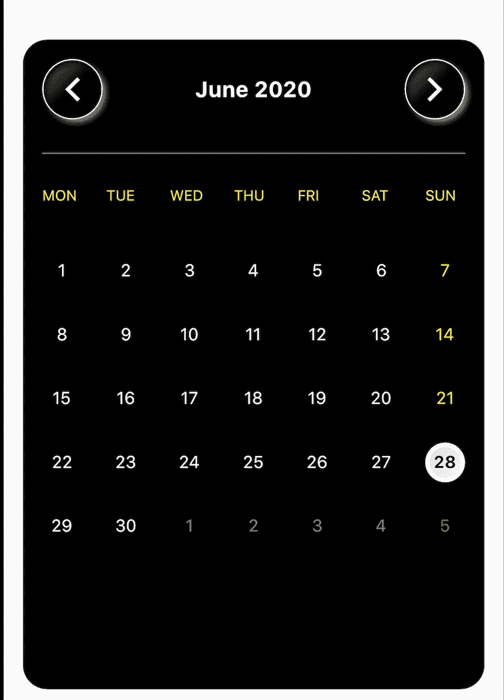
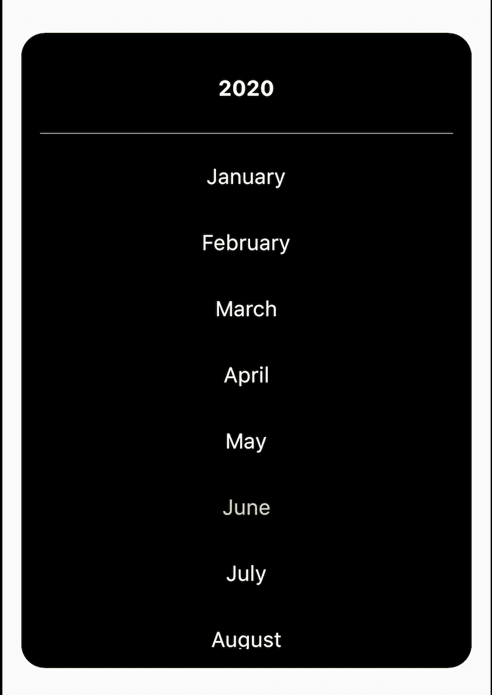
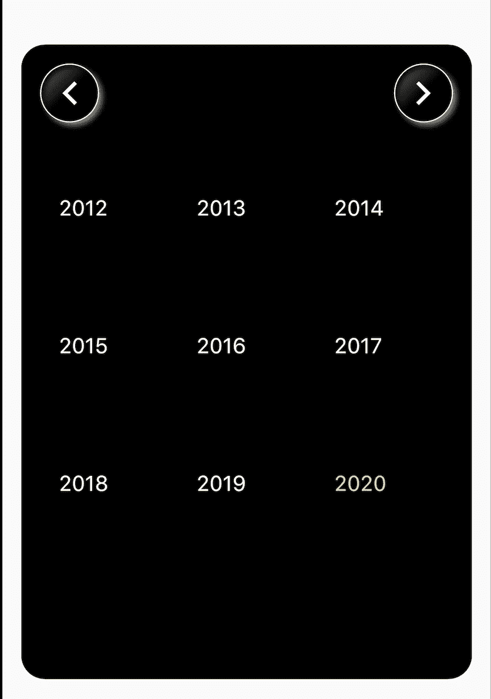

# Flutter 定制日历

> 原文：<https://blog.devgenius.io/customized-calendar-in-flutter-8ba20e3caf82?source=collection_archive---------9----------------------->


照片由 [Maddi Bazzocco](https://unsplash.com/@maddibazzocco?utm_source=medium&utm_medium=referral) 在 [Unsplash](https://unsplash.com?utm_source=medium&utm_medium=referral) 上拍摄

嘿，你曾经想要一个日期选择器在你的应用程序中，而不是在对话框中吗？您尝试了所有的 dart 包，但是无法按照您的要求更改它们的用户界面？我也碰到过这些问题！并提出了一个解决方案来构建一个自定义日历，并希望与大家分享:-)



我用这种定制方法构建的东西

那么，让我们开始我们的旅程吧！首先，创建一个新的 flutter 项目或者使用一个现有的项目。

> 好的，首先我们来搞清楚需要哪些数据？所以，日历都是关于日期的，对吗？我们必须计算一年中一个月的**日**以及它们发生在哪个工作日。这差不多是我们需要的所有计算。除此之外，我们可能希望在日历的月初和月末分别显示上个月和下个月的未满工作日。

## 在这里，我为每天创建了一个模型类来包含所有这些信息。

```
class Calendar{
  final DateTime date;
  final bool thisMonth;
  final bool prevMonth;
  final bool nextMonth;Calendar({
    this.date,
    this.thisMonth = false,
    this.prevMonth = false,
    this.nextMonth = false
  });
}
```

## 创建一个类，所有与日历相关的方法都将驻留在这个类中。

```
class CustomCalendar{// number of days in month 
  //[JAN, FEB, MAR, APR, MAY, JUN, JUL, AUG, SEP, OCT, NOV, DEC]
  final List<int> _monthDays = 
    [31, 28, 31, 30, 31, 30, 31, 31, 30, 31, 30, 31];// check for leap year
  bool _isLeapYear(int year){
    if(year % 4 == 0){
      if(year % 100 == 0){
        if(year % 400 == 0) return true;
        return false;
      }
      return true;
    }
    return false;
  }
}
```

这个类包含了一个按顺序排列的每个月的日期列表。我已经为二月使用了 28 天，但是不要担心它会在后期处理。此外，它还包含一个检查一年是否是闰年的方法，这是一个通用的已知检查公式:-)

> 对一些人来说，几周可能从周日开始，对另一些人来说从周一开始。

考虑到这两者，我为它们创建了一个枚举。

```
enum StartWeekDay {sunday, monday}
```

> 现在复杂的计算开始了！复杂与否你可以在最后决定:-)

下面是一个方法，它将计算一年中一个月的所有日子在工作日中的出现时间，将它们按顺序排列以显示在该月的日历中，并返回顺序列表。

```
*/// get the month calendar
/// month is between from 1-12 (1 for January and 12 for December)* **List<Calendar> getMonthCalendar(int month, int year, 
  {StartWeekDay startWeekDay = StartWeekDay.sunday}){** *// validate*
  **if(year == null || month == null || month < 1 || month > 12)
    throw ArgumentError('Invalid year or month');** **List<Calendar> calendar = List<Calendar>();** *// get no. of days in the month
  // month-1 because _monthDays starts from index 0 
  // and month starts from 1*
  **int totalDays = _monthDays[month - 1];** // if this is a leap year and the month is february, 
  // increment the total days by 1
  **if(_isLeapYear(year) && month == DateTime.february) totalDays++;** // get days for this month
  **for(int i=0; i<totalDays; i++){
    calendar.add(
      Calendar(**
        // i+1 because day starts from 1 in DateTime class
        **date: DateTime(year, month, i+1),
        thisMonth: true,
      ),
    );
  }
}**
```

在这个类中，有一个名为 calendar 的列表，它将按顺序返回一个月中的所有日子，它的类型是 Calendar，这是我们作为第一步创建的一个模型类。

> 嗯，就这样吧！我们把所有的日子都按顺序排好。现在我们完成了，对吗？是的，但是每个月不会从星期一或星期天开始，到星期天或星期六结束。**绝不！**我们需要分别用前一个月和下一个月的天数来填充开始和结束时那些缺失的点。

下面是用前一个月的天数来填充开始时缺失的点的计算。*将这几行代码放在****getMonthCalendar****方法结束之前。*

```
// used for previous and next month's calendar days
**int otherYear;
int otherMonth;
int leftDays;**// fill the unfilled starting weekdays of this month 
// with the previous month days
**if(
 (startWeekDay == StartWeekDay.sunday && 
   calendar.first.date.weekday != DateTime.sunday) ||
 (startWeekDay == StartWeekDay.monday &&  
   calendar.first.date.weekday != DateTime.monday)
 ){**
   // if this month is january, 
   // then previous month would be decemeber of previous year
   **if(month == DateTime.january){
     otherMonth = DateTime.december;
     otherYear = year-1;**
   **}
   else{
    otherMonth = month - 1;
    otherYear = year;
   }**
   // month-1 because _monthDays starts from index 0 
   // and month starts from 1
   **totalDays = _monthDays[otherMonth - 1];**
   **if(_isLeapYear(otherYear) && otherMonth == DateTime.february)
      totalDays++;** **leftDays = totalDays - calendar.first.date.weekday + 
     ((startWeekDay == StartWeekDay.sunday) ? 0 : 1);**

   **for(int i=totalDays; i>leftDays; i--){**
     // add days to the start of the list to maintain the sequence **calendar.insert(0,
       Calendar(
         date: DateTime(otherYear, otherMonth, i),
         prevMonth: true,
        ),
     );
   }**
**}**
```

太多的条件和计算了。但是我尽了最大努力给代码添加注释，使其易于理解。你可能想知道**剩余天数**是如何计算的，但老实说，我用笔复制了一份，得到了正确的模式，现在对此没有解释。但我向你保证，这很简单，每个人都可以很容易地找出这种模式*(甚至比它更好)*、**只要试一试！**

现在转到计算的另一部分，也是最后一部分，用下个月的天数来填充末尾缺少的点。*将这几行代码放在****getMonthCalendar****方法结束之前。*

```
// fill the unfilled ending weekdays of this month 
// with the next month days
**if(
  (startWeekDay == StartWeekDay.sunday && 
    calendar.last.date.weekday != DateTime.saturday) ||
  (startWeekDay == StartWeekDay.monday && 
    calendar.last.date.weekday != DateTime.sunday)
){**
  // if this month is december, 
  // then next month would be january of next year
  **if(month == DateTime.december){
    otherMonth = DateTime.january;
    otherYear = year+1;
  }
  else{
    otherMonth = month+1;
    otherYear = year;
  }**
  // month-1 because _monthDays starts from index 0 
  // and month starts from 1
  **totalDays = _monthDays[otherMonth-1];
  if(_isLeapYear(otherYear) && otherMonth == DateTime.february)  
    totalDays++;** **leftDays = 7 - calendar.last.date.weekday - 
    ((startWeekDay == StartWeekDay.sunday) ? 1 : 0);**
  **if(leftDays == -1) leftDays = 6;** **for(int i=0; i<leftDays; i++){
    calendar.add(
      Calendar(
        date: DateTime(otherYear, otherMonth, i+1),
        nextMonth: true,
      ),
    );
  }
}**
```

现在把我们的日程表还回来，否则我们所有的努力都将付之东流。*将这几行代码放在****getMonthCalendar****方法结束之前。*

```
return calendar;
```

> 那是我们所有的计算部分！现在让我们做一些用户界面的东西:-)

设置变量并做一些初始化工作。

```
class MyApp extends StatefulWidget {
  @override
  _MyAppState createState() => _MyAppState();
}class _MyAppState extends State<MyApp> { DateTime _currentDateTime;
  DateTime _selectedDateTime;
  List<Calendar> _sequentialDates;
  int midYear;
  final List<String> _weekDays = 
    ['MON', 'TUE', 'WED', 'THU', 'FRI', 'SAT', 'SUN'];
  final List<String> _monthNames = 
    ['January', 'February', 'March', 'April', 'May', 'June', 'July',  
     'August', 'September', 'October', 'November', 'December']; @override
  void initState() {
    super.initState();
    final date = DateTime.now();
    _currentDateTime = DateTime(date.year, date.month);
    _selectedDateTime = DateTime(date.year, date.month, date.day);
    WidgetsBinding.instance.addPostFrameCallback((timeStamp) {
     setState(() => _getCalendar());
    });
  } **// get calendar for current month**
  void _getCalendar(){
    _sequentialDates = 
      CustomCalendar().getMonthCalendar(_currentDateTime.month,   
        _currentDateTime.year, startWeekDay: StartWeekDay.monday);
  } @verride
  Widget build(BuildContext context) {
    return Scaffold(
      body: Center(
        child: Container(
          margin: EdgeInsets.all(16),
          padding: EdgeInsets.all(16),
          height: MediaQuery.of(context).size.height * 0.6,
          decoration: BoxDecoration(
            color: Colors.black,
            borderRadius: BorderRadius.circular(20),
          ),
          child: _datesView() **// to be added in next step**
        ),
      ),
    );
  }
}
```

添加日历正文以显示当月的日期，并切换按钮以移动到下个月和上个月。

```
**// dates view**
Widget _datesView(){
  return Column(
    mainAxisSize: MainAxisSize.min,
      children: <Widget>[
        **// header**
        Row(
          children: <Widget>[
            **// prev month button**
            _toggleBtn(false),
            **// month and year**
            Expanded(
              child: InkWell(
                onTap: (){
                  setState((){
                    **// explained in later stages**
                    _currentView = CalendarViews.months
                  });
                },
                child: Center(
                  child: Text(
                    '${_monthNames[_currentDateTime.month-1]} 
                     ${_currentDateTime.year}',
                     style: TextStyle(
                       color: Colors.white, 
                       fontSize: 18, 
                       fontWeight: FontWeight.w700
                     ),
                   ),
                 ),
               ),
             ),
             **// next month button**
             _toggleBtn(true),
           ],
         ),
         SizedBox(height: 20,),
         Divider(color: Colors.white,),
         SizedBox(height: 20,),
         Flexible(child: _calendarBody()),
      ],
   );
}**// next / prev month buttons**
Widget _toggleBtn(bool next) {
  return InkWell(
    **// explained in later stages**
    onTap: (){
      if(_currentView == CalendarViews.dates){
        setState(() => (next) ? _getNextMonth() : _getPrevMonth());
      }
      else if(_currentView == CalendarViews.year){
        if(next){
          midYear = (midYear == null) 
            ? _currentDateTime.year + 9 : midYear + 9;
        }
        else{
          midYear = (midYear == null) 
            ? _currentDateTime.year - 9 : midYear - 9;
        }
        setState(() {});
      }
    },
    child: Container(
      width: 50,
      height: 50,
      decoration: BoxDecoration(
      borderRadius: BorderRadius.circular(25),
      border: Border.all(color: Colors.white),
      boxShadow: [
        BoxShadow(
          color: Colors.white.withOpacity(0.5),
          offset: Offset(3, 3),
          blurRadius: 3,
          spreadRadius: 0,
        ),
      ],
      gradient: LinearGradient(
        colors: [Colors.black, Colors.black.withOpacity(0.1)],
        stops: [0.5, 1],
        begin: Alignment.bottomRight,
        end: Alignment.topLeft,
      )
    ),
    child: Icon((next) 
      ? Icons.arrow_forward_ios : Icons.arrow_back_ios, 
      color: Colors.white,),
    ),
  );
}**// calendar body**
Widget _calendarBody() {
  if(_sequentialDates == null) return Container();
  return GridView.builder(
    shrinkWrap: true,
    padding: EdgeInsets.zero,
    itemCount: _sequentialDates.length + 7,
    gridDelegate: SliverGridDelegateWithFixedCrossAxisCount(
      mainAxisSpacing: 20,
      crossAxisCount: 7,
      crossAxisSpacing: 20,
    ), 
    itemBuilder: (context, index){
      if(index < 7) return _weekDayTitle(index);
      if(_sequentialDates[index - 7].date == _selectedDateTime) 
        return _selector(_sequentialDates[index - 7]);
      return _calendarDates(_sequentialDates[index - 7]);
    },
  );
}**// calendar header**
Widget _weekDayTitle(int index){
  return Text(_weekDays[index], 
    style: TextStyle(color: Colors.yellow, fontSize: 12),);
}**// calendar element**
Widget _calendarDates(Calendar calendarDate){
  return InkWell(
    onTap: (){
      if(_selectedDateTime != calendarDate.date){
        if(calendarDate.nextMonth){
          _getNextMonth();
        }
        else if(calendarDate.prevMonth){
          _getPrevMonth();
        }
        setState(() => _selectedDateTime = calendarDate.date);
     } 
   },
   child: Center(
   child: Text(
     '${calendarDate.date.day}', 
     style: TextStyle(
       color: (calendarDate.thisMonth) 
         ? (calendarDate.date.weekday == DateTime.sunday) 
         ? Colors.yellow : Colors.white 
         : (calendarDate.date.weekday == DateTime.sunday) 
         ? Colors.yellow.withOpacity(0.5) 
         : Colors.white.withOpacity(0.5),
       ),
     )
   ),
 );
}**// date selector**
Widget _selector(Calendar calendarDate) {
  return Container(
    width: 30,
    height: 30,
    decoration: BoxDecoration(
      color: Colors.white,
      borderRadius: BorderRadius.circular(50),
      border: Border.all(color: Colors.white, width: 4),
      gradient: LinearGradient(
        colors: [Colors.black.withOpacity(0.1), Colors.white],
        stops: [0.1, 1],
        begin: Alignment.topLeft,
        end: Alignment.bottomRight,
      ),
    ),
    child: Container(
      decoration: BoxDecoration(
        color: Colors.white.withOpacity(0.9),
        borderRadius: BorderRadius.circular(50),
      ),
      child: Center(
        child: Text(
          '${calendarDate.date.day}',
          style: TextStyle(
            color: Colors.black,
            fontWeight: FontWeight.w700
          ),
        ),
      ),
    ),
  );
}
```

添加在导航到下个月或上个月时更改当前日期时间的方法。

```
**// get next month** **calendar**
void _getNextMonth(){
  if(_currentDateTime.month == 12) {
      _currentDateTime = DateTime(_currentDateTime.year+1, 1);
  }
  else{
      _currentDateTime = DateTime(_currentDateTime.year, 
           _currentDateTime.month+1);
  }
  _getCalendar();
}**// get previous month calendar**
void _getPrevMonth(){
  if(_currentDateTime.month == 1){
      _currentDateTime = DateTime(_currentDateTime.year-1, 12);
  }
  else{
      _currentDateTime = DateTime(_currentDateTime.year,  
          _currentDateTime.month-1);
  }
  _getCalendar();
}
```

> 如果我们想跳过几个月或几年，使用按钮浏览下个月或上个月可能会很累。

我们需要选择月份和年份的 2 个视图。现在，我们的日历将有 3 个视图日期视图，月视图，年视图。为同一创建枚举。

```
enum CalendarViews{ dates, months, year }
```

此外，我们需要存储要显示的当前视图，每当用户选择不同的视图时，它都会发生变化。因此，在 **_MyAppState 类**中创建一个类变量，默认视图为日期视图。

```
CalendarViews _currentView = CalendarViews.dates;
```

我们将通过单击日期视图的标题从日期视图切换到月份视图。上面已经配置了日期视图标题的 onTap 功能。

```
onTap: () => setState(() => _currentView = CalendarViews.months),
```



月视图

创建一个小部件来显示月份列表。用户可以从这些月份中进行选择。

```
**// show months list**
Widget _showMonthsList(){
  return Column(
    children: <Widget>[
      InkWell(
        onTap: (){
          setState((){
            **//switch to years views**
            _currentView = CalendarViews.year;
          });
        },
        child: Padding(
          padding: const EdgeInsets.all(20.0),
          child: Text('${_currentDateTime.year}', 
            style: TextStyle(fontSize: 18, 
              fontWeight: FontWeight.w700, color: Colors.white),
          ),
        ),
      ),
      Divider(color: Colors.white,),
      Expanded(
        child: ListView.builder(
          padding: EdgeInsets.zero,
          itemCount: _monthNames.length,
          itemBuilder: (context, index) => ListTile(
          onTap: (){
            **// change month of currentDateTime** 
            _currentDateTime = 
              DateTime(_currentDateTime.year, index+1);
            _getCalendar();
            **// switch back to dates view**
            setState(() => _currentView = CalendarViews.dates);
          },
          title: Center(
            child: Text(
              _monthNames[index], 
              style: TextStyle(fontSize: 18, 
                color: (index == _currentDateTime.month-1) 
                  ? Colors.yellow : Colors.white),
            ),
          ),
        ),
      ),
    ),
   ],
 );
}
```

用户可以通过点击月份视图的标题来浏览年份。上面已经配置了 onTap 月视图页眉功能。

创建年视图小部件。



年视图

```
**// years list views**
Widget _yearsView(int midYear){
  return Column(
    children: <Widget>[
      Row(
        children: <Widget>[
          _toggleBtn(false),
          Spacer(),
          _toggleBtn(true),
         ],
       ),
       Expanded(
         child: GridView.builder(
           shrinkWrap: true,
           itemCount: 9,
           physics: NeverScrollableScrollPhysics(),
           gridDelegate: SliverGridDelegateWithFixedCrossAxisCount(
             crossAxisCount: 3,
           ), 
           itemBuilder: (context, index){
             int thisYear;
             if(index < 4){
               thisYear = midYear - (4 - index);
             }
             else if(index > 4){
               thisYear = midYear + (index - 4);
             }
             else{
               thisYear = midYear;
             }
             return ListTile(
               onTap: (){
                 **// change year of currentDateTime**
                 _currentDateTime = 
                   DateTime(thisYear, _currentDateTime.month);
                 _getCalendar();
                 **// switch back to months view** 
                 setState(() => 
                   _currentView = CalendarViews.months);
               },
               title: Text(
                 '$thisYear', 
                 style: TextStyle(fontSize: 18, 
                   color: (thisYear == _currentDateTime.year) 
                     ? Colors.yellow : Colors.white),
               ),
             );
           }
         ),
       ),
     ],
   );
}
```

> 切换按钮有两组功能。
> 
> I .在日期视图中切换到下个月或上个月
> 
> 二。在年份视图中显示上一组或下一组年份。
> 
> 上述切换按钮的 onTap 功能中已经配置了这些功能。

现在我们必须根据当前视图的值来设置显示视图的条件。这将在我们简单地将 **_datesView** 作为构建方法中容器的子容器的地方完成。

> 更新了构建方法。

```
@override
Widget build(BuildContext context) {
  return Scaffold(
    body: Center(
      child: Container(
        margin: EdgeInsets.all(16),
        padding: EdgeInsets.all(16),
        height: MediaQuery.of(context).size.height * 0.6,
        decoration: BoxDecoration(
        color: Colors.black,
        borderRadius: BorderRadius.circular(20),
      ),
      child: (_currentView == CalendarViews.dates) ? _datesView() 
        : (_currentView == CalendarViews.months) ? _showMonthsList() 
        : _yearsView(midYear ?? _currentDateTime.year)
      ),
    ),
  );
}
```

仅此而已！现在你有了一个定制的日历，可以根据你的需求任意定制:-)

从这个[链接](https://github.com/Hitesh822/flutter_custom_calendar)获得完整的源代码。