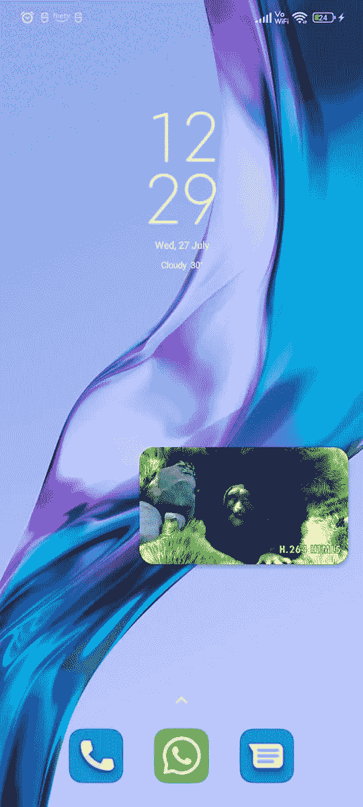

# 自定义 Exoplayer 和画中画模式

> 原文：<https://blog.devgenius.io/customizing-exoplayer-pip-mode-47c4ecd420b6?source=collection_archive---------6----------------------->

安卓克斯|科特林


# **简介**

一个视频播放器集成到 android 应用程序中，以简单高效的方式播放视频。

这是一个来自谷歌的开源可定制视频播放器。它支持几乎所有的网址格式，如 FMPG，WebM，MPEG-TS，FMP4，ADTS，MP3 等。

Exoplayer 支持 android 版本 **4.1** 也就是 API 级别 **16。**我还在 YouTube 上发布了一段视频。看一看！

**我们将在这个博客中看到什么**

1.  如何用我们自己的 UI 定制一个播放器？
2.  一个播放视频的 exoplayer 实现。
3.  为视频播放器集成画中画模式。

事不宜迟，让我们直接进入代码。

## **实现 Exoplayer**

首先，我们需要在 build.gradle 文件中集成 exoplayer 库

```
*//Exoplayer* implementation 'com.google.android.exoplayer:exoplayer:2.17.0'
```

现在让我们开始创建自定义 UI (activity_main.xml)

```
*<?*xml version="1.0" encoding="utf-8"*?>* <androidx.constraintlayout.widget.ConstraintLayout xmlns:android="http://schemas.android.com/apk/res/android"
    xmlns:app="http://schemas.android.com/apk/res-auto"
    xmlns:tools="http://schemas.android.com/tools"
    android:layout_width="match_parent"
    android:layout_height="match_parent"
    tools:context=".MainActivity">

    <com.google.android.exoplayer2.ui.PlayerView
        android:id="@+id/exoPlayer"
        android:layout_width="match_parent"
        android:layout_height="match_parent"
        app:layout_constraintLeft_toLeftOf="parent"
        app:layout_constraintRight_toRightOf="parent"
        app:layout_constraintTop_toTopOf="parent"
        app:layout_constraintBottom_toBottomOf="parent"
        app:controller_layout_id="@layout/custom_exo_layout"/>

</androidx.constraintlayout.widget.ConstraintLayout>
```

以下代码帮助我们为我们的 exoplayer 创建一个自定义布局，该布局必须作为 controller_layout_id 集成到 exoplayer 播放器 xml 文件中。

```
app:controller_layout_id="@layout/custom_exo_layout"
```

自定义 exoplayer 布局

```
*<?*xml version="1.0" encoding="utf-8"*?>* <FrameLayout xmlns:android="http://schemas.android.com/apk/res/android"
    android:layout_width="match_parent"
    android:layout_height="match_parent"
    xmlns:app="http://schemas.android.com/apk/res-auto">

    <View
        android:layout_width="match_parent"
        android:layout_height="match_parent"
        android:background="@color/black"
        android:id="@+id/viewShown"
        android:alpha="0.5"/>

    <FrameLayout
        android:layout_width="wrap_content"
        android:layout_height="wrap_content"
        android:layout_gravity="center">

    <ImageButton android:id="@id/exo_play"
        android:layout_width="80dp"
        android:layout_height="80dp"
        android:layout_gravity="center"
        android:background="@drawable/play"/>

    <ImageButton android:id="@id/exo_pause"
        android:layout_width="80dp"
        android:layout_height="80dp"
        android:layout_gravity="center"
        android:background="@drawable/pause"/>

    <ImageButton android:id="@id/exo_rew"
        android:layout_width="60dp"
        android:layout_height="60dp"
        android:layout_gravity="left|center"
        android:layout_marginRight="300dp"
        android:background="@drawable/rewind"/>

    <ImageButton android:id="@id/exo_ffwd"
        android:layout_width="60dp"
        android:layout_height="60dp"
        android:layout_gravity="right|center"
        android:layout_marginLeft="300dp"
        android:background="@drawable/fast_forward"/>

    </FrameLayout>

    <LinearLayout
        android:layout_width="match_parent"
        android:layout_height="wrap_content"
        android:layout_marginTop="4dp"
        android:gravity="center_vertical"
        android:layout_gravity="bottom"
        android:layout_marginBottom="20dp"
        android:orientation="horizontal">

        <TextView
            android:id="@id/exo_position"
            android:layout_width="wrap_content"
            android:layout_height="wrap_content"
            android:includeFontPadding="false"
            android:paddingLeft="4dp"
            android:paddingRight="4dp"
            android:textColor="@color/white"
            android:textSize="14sp"
            android:layout_marginLeft="10dp"
            android:textStyle="bold" />

        <com.google.android.exoplayer2.ui.DefaultTimeBar
            android:id="@id/exo_progress"
            android:layout_width="0dp"
            android:layout_height="26dp"
            android:layout_weight="1"
            android:layout_marginLeft="10dp"
            android:layout_marginRight="10dp"
            app:played_color="@color/black"
            app:unplayed_color="@color/white" />

        <TextView
            android:id="@id/exo_duration"
            android:layout_width="wrap_content"
            android:layout_height="wrap_content"
            android:includeFontPadding="false"
            android:paddingLeft="4dp"
            android:paddingRight="4dp"
            android:textColor="@color/white"
            android:textSize="14sp"
            android:layout_marginRight="10dp"
            android:textStyle="bold" />

    </LinearLayout>

</FrameLayout>
```

这是自定义布局，我有我的自定义播放和暂停按钮，自定义快进和快退按钮，自定义进度条和计时器。为了映射我们用 exo 功能创建的所有 UI，我们需要确保 id 与 exoplayer ids 相同，它引导您使用我们的自定义视图来执行功能和覆盖操作。

## 播放视频

为了初始化 exoplayer，我们需要首先创建一个名为 initializePlayer 的函数

```
private fun initializePlayer() {
    player = ExoPlayer.Builder(*applicationContext*).build()
    exoPlayer.*player* = player
    exoPlayer.*resizeMode* = AspectRatioFrameLayout.*RESIZE_MODE_FILL* val mediaItem: MediaItem = MediaItem.fromUri("http://clips.vorwaerts-gmbh.de/VfE_html5.mp4")
    player!!.setMediaItem(mediaItem)
    player!!.prepare()
    player!!.play()
}
```

上面的代码显示了我们如何初始化播放器并向其添加视频。

```
val mediaItem: MediaItem = MediaItem.fromUri("http://clips.vorwaerts-gmbh.de/VfE_html5.mp4")
```

这是创建媒体项目时的视频 url，我们可以添加该 url，该视频将在 videoplayer 中播放

```
player!!.setMediaItem(mediaItem)
```

我们需要将 mediaItem 添加到播放器中，最后准备并播放视频

```
player!!.prepare()
player!!.play()
```

在 onStart 方法中调用 initializePlayer 函数

```
override fun onStart() {
    super.onStart()
    initializePlayer()
}
```

## 画中画模式(画中画)

实现画中画模式是非常简单的，我们需要调用一个内置函数来进入画中画模式，但它总是在我们决定调用函数的基础上进入画中画模式的要求。画中画模式只不过是将更大的显示屏变成一个小屏幕，这将帮助我们在使用手机中的其他应用程序的同时进行多任务处理和观看视频。

```
@RequiresApi(Build.VERSION_CODES.*N*)
override fun onBackPressed() {
    if(!isPipMode!!) {
        enterPictureInPictureMode()
        isPipMode = true
    } else {
        super.onBackPressed()
    }
}
```

我在使用 enterPictureInPictureMode()函数点击后退按钮时进入 PIP 模式。

## **粘贴整个 MainActivity 类**

```
class MainActivity : AppCompatActivity(), Player.Listener {

    var player: ExoPlayer ?= null
    var isPipMode: Boolean ?= false

    override fun onCreate(savedInstanceState: Bundle?) {
        super.onCreate(savedInstanceState)
        setContentView(R.layout.*activity_main*)
        hideSystemUI()

        viewShown.setOnClickListener **{** Handler().postDelayed(**{** hideSystemUI()
            **}**, 2000)
        **}** }

    override fun onStart() {
        super.onStart()
        initializePlayer()
    }

    override fun onStop() {
        super.onStop()
        player?.release()
    }

    override fun onResume() {
        super.onResume()
        if(player!!.*isPlaying*) {
            isPipMode = false
        }
    }

    private fun initializePlayer() {
        player = ExoPlayer.Builder(*applicationContext*).build()
        exoPlayer.*player* = player
        exoPlayer.*resizeMode* = AspectRatioFrameLayout.*RESIZE_MODE_FILL* val mediaItem: MediaItem = MediaItem.fromUri("http://clips.vorwaerts-gmbh.de/VfE_html5.mp4")
        player!!.setMediaItem(mediaItem)
        player!!.prepare()
        player!!.play()
    }

    @RequiresApi(Build.VERSION_CODES.*N*)
    override fun onBackPressed() {
        if(!isPipMode!!) {
            enterPictureInPictureMode()
            isPipMode = true
        } else {
            super.onBackPressed()
        }
    }

    private fun hideSystemUI() {
        *// Set the IMMERSIVE flag.
        // Set the content to appear under the system bars so that the content
        // doesn't resize when the system bars hide and show.
        window*.*decorView*.setSystemUiVisibility(
            View.*SYSTEM_UI_FLAG_LAYOUT_STABLE* or View.*SYSTEM_UI_FLAG_LAYOUT_HIDE_NAVIGATION* or View.*SYSTEM_UI_FLAG_LAYOUT_FULLSCREEN* or View.*SYSTEM_UI_FLAG_HIDE_NAVIGATION // hide nav bar* or View.*SYSTEM_UI_FLAG_FULLSCREEN // hide status bar* or View.*SYSTEM_UI_FLAG_IMMERSIVE* )
    }

}
```

## 输出


自定义 exoplayer 布局



画中画模式

编码快乐！..谢谢你..