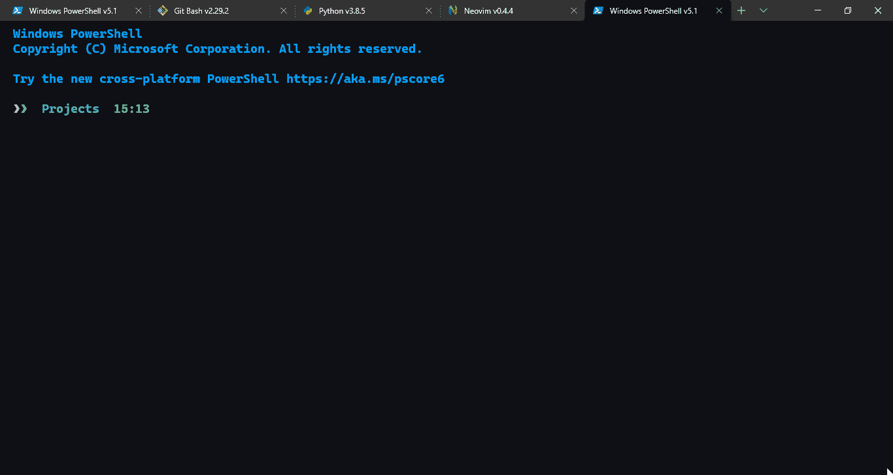

# 定制新的 Windows 终端:极简主义方法

> 原文：<https://blog.devgenius.io/customizing-the-new-windows-terminal-5eaeec193630?source=collection_archive---------1----------------------->

## 软件开发

当你得到一个完全定制的 Windows 终端时，谁还需要 Linux！

听说过新的 Windows 终端(WT)，微软最近一直在积极研究？如果你一直在推特上关注我的更新，你可能会的。很长一段时间以来，我一直倡导微软努力让 Windows 成为一个对开发者更友好的平台。自从我为了编码的需要从 Ubuntu 转到 Windows，我开始意识到在 Windows-land 上事情已经变得越来越好了。

# 这个新的 Windows 终端是什么？

也就是说，WT 是由微软开发和发布的一款控制台。它支持各种各样的 shells，我不知道它们的完整列表。但我确信它支持大多数流行的。因此，Bash/zsh 通过 Windows Subsystem for Linux (WSL)和 PowerShell 5.1 得到支持，PowerShell 5.1 预打包在 Windows 10 中。

关于这一点，我一直在使用 PowerShell 5.1，主要是因为它是默认的&是一种比 Bash 简单得多的脚本语言。所以，事不宜迟，让我们深入了解一下我是如何对 WT 进行极简定制的。

# 为什么要保持简约的外观？

你很快就会看到，Windows 终端是非常可定制的。您可以设置自己选择的背景图像(或 GIF)。您可以在一个选项卡中添加多个窗格，每个窗格运行一个不同的 shell 实例，这种可能性是无限的。但是这种程度的定制伴随着一个警告，花费更多的时间来定制终端看起来“完美”是非常耗时的。我可以花在项目上的时间可以用来工作。

此外，还有我难以应对的认知超载问题。因此，我尽可能遵循极简主义的原则。简而言之，对于一项任务，我只需要足够的特定信息。如果出现需求，定制终端以满足这些需求仍然是一种开放的选择。

不管怎样，我的辩解已经说够了&让我们别再追了。这是我使用的配置，请随意复制和使用它们。

需要解释配置的每个部分是做什么的吗？然后继续读，直到下一节。

# 配置文件的我的定制和描述

Windows 终端配置分为 4 个不同的部分，每个部分定制软件的一个特定方面。

## 全局(或默认)设置

配置文件以全局(或“*默认*”)设置开始。接着是配置文件、配色方案&，最后是按键绑定(或“*动作*”)。

就在文件的开头，全局设置将定制应用于整个软件，就像 Windows 终端的行为一样。在上下文中，我的配置使用 PowerShell 作为默认配置文件启动 Windows 终端(稍后将详细介绍配置文件)，用“ *defaultProfile* ”设置表示。

在它的正下方&直到第 12 行，我已经将 Windows 终端设置为选中时不复制正文&甚至不复制格式。Azure Shell 和 WSL 配置文件也被禁用了，因为我还没有找到它们的任何相关用途。最后，为了确保我的眼睛不被灼伤和保护，一个黑暗的主题，标签宽度和启动窗口最大化被启用。

这些是作为软件应用于整个 Windows 终端的全局设置。他们做的不多，但帮助启动时间，我的眼睛和生产力。

但是在这里事情变得视觉有趣，定制个人资料。

## **配置文件**

配置文件是 Windows 终端创建和操作 shells 和其他终端模拟器的方式。换句话说，您可以让 PowerShell 会话与 Bash(运行在 Ubuntu-WSL 上)在一个选项卡上并行运行。

如果从专题图片的 GIF 中还看不出来，我已经设置了四个概要文件——PowerShell、Python Repl、Git Bash 和 Neovim。但是配置列表 6，怎么&怎么回事？

耐心点，很快你也会明白的。

概要文件部分也接受一些默认设置。它们将应用于数组中的每个配置文件。默认设置指定了，配置文件启动时的起始目录，字体大小，粗体字(这样你就不用眯着眼睛看文本)，填充(使文本看起来更好&像 CSS 填充一样)，光标的形状和颜色(增加一些魅力…)。启用丙烯酸背景，使终端看起来透明。最后，不要忘记配色方案的名称。

这些默认设置确保了所使用的 shell 模拟器的一致性。这些设置也确保了良好的极简主义美学，而不会太分散注意力和/或对眼睛造成伤害。

第 25–64 行列出了配置文件，我们到目前为止一直在讨论的 Windows 终端的顶部。在这里你可以做更多的事情，所以我建议先查看一下[官方文件](https://docs.microsoft.com/en-us/windows/terminal/customize-settings/profile-settings)。你可以基于我的配置&是的，别忘了与我分享你的创作(用推特发给我😉).

无论如何，记住一个极简的方法，命令提示符和 Azure 配置文件被隐藏使用“*隐藏* : *真"*。由于 Windows 终端默认自带&它们，移除它们会使软件行为怪异，我觉得最好把它们一起隐藏起来。除了 Azure Shell &命令提示符之外，PowerShell 还被配置为默认在安装后立即加载。

而且，我最近一直在使用 PowerShell &我向你保证，它非常棒！它是一种很好的脚本语言，具有 Python 的简单性和 Bash 的文件系统管理能力。所以，我觉得你应该试一试，尤其是现在，因为它是跨平台的。因此，PowerShell 被设置为“*隐藏* : *假*”，以**而不是**将其从 UI 中隐藏。

此外，“*Guid”*设置为唯一的字母数字值，在 PowerShell 中使用“*New-Guid”*生成，作为该特定配置文件的唯一标识符。" *name"* 被设置为应该显示在 UI 选项卡上的配置文件的名称。通常，您可能需要使用"*suppression application title*:*true "*来不加载应用程序的默认名称。例如，Git Bash 加载文件路径作为 UI 上的选项卡名称。

“*命令行”* &图标设置分别接受二进制文件&图标的路径。如果将文件路径添加到 path 中，那么就不需要指定绝对文件路径。我用“*nvim”*做了类似的事情。

Windows 10 的一大特色是[通用 Windows 平台](https://docs.microsoft.com/en-us/windows/uwp/get-started/universal-application-platform-guide) (UWP)应用的概念，这使得开发者能够为任何 Windows 平台创建应用。Windows 终端通过“*源*设置访问这些 uwp。因此，Azure Shell & WSL 作为 uwp 加载到终端上。

现在大部分理论已经完成，是时候弄清楚如何定制配色方案和按键绑定了。让我们进入下一部分。

## **配色方案**

第 65–87 行列出了配色方案的设置。除了“名称”设置之外，这里没有什么可讨论的。它充当特定配色方案的标识符&因此，您可以拥有多个其他配色方案的列表，所有这些都可以定制以满足您的需求。

请注意，命名您的配色方案很重要，因为这是每个配置文件在定制字体颜色时将参考的内容。但是在我的例子中，我已经为所有的配置文件设置了一个单一的颜色方案。这样我就可以在所有的 Shells 中保持一致性。

当然，您可以拥有多个方案，每个方案都由特定的概要文件引用。

## **按键绑定**

至于定制的键绑定，我尽量少用，因为默认的键绑定在大多数时候满足我的需要。请随意参考[关于自定义按键绑定](https://docs.microsoft.com/en-us/windows/terminal/customize-settings/actions)的文档，检查&并根据您的需求进行更改。

也就是说，下面是我使用的键绑定列表:

1." *ctrl+c* "用于复制选定的一段文本。

2." *ctrl+v* "用于粘贴剪贴板中的一段文本。

3." *ctrl+shift+f"* 在终端上查找文字/单词。

4." *alt+shift+d* "自动拆分窗格，用最大的可用空间&复制活动外壳。

5." *shift+alt+2"* 激活 Neovim 窗格&自动调整其大小。

6.“ *ctrl+w* ”关闭标签页。

7." *ctrl+t"* 关闭除当前页签外的所有其他页签。

8." *ctrl+shift+w"* 关闭活动窗格。

这标志着我的 Windows 终端定制配置的结束。对于一个所谓的极简配置来说，这是一个很大的阅读量。

# 你如何能给你的 Windows 终端一个个人风格？

我的定制意味着最小化，赏心悦目&最重要的是，不分散注意力。如果你觉得我的定制对你来说不够“好”,那也没关系，因此，我想加入更多的个人风格。

要做到这一点，我建议，先看看配色方案的定制。在 [Windows 终端主题](https://windowsterminalthemes.dev/) & [终端 Splash](https://terminalsplash.com/) 有大量的方案免费提供。只要确保前景和字体颜色之间有足够的对比度。此外，如果你真的添加了一个的话，你可能还需要试验丙烯酸不透明度或者背景图片(或者. gif)的大小，它的相对位置等等。

除了颜色定制之外，您还可以尝试定制 shell 提示符。上面的 GIF 图片展示了我定制的 PowerShell 提示符，由 [oh-my-posh v3](https://ohmyposh.dev/) 驱动。您可以进一步定制 Neovim 以满足您的需求。

无论如何，定制 PowerShell 提示符&设置 Neovim 是一个独立的项目，因此他们应该有自己的独立博客。

# 你还在等什么，也开始定制你的吧？

也就是说，我再怎么推荐使用 Windows 终端也不为过。见鬼，我甚至会要求你改用 Windows 作为你的日常开发平台。微软 Windows 终端开发团队非常积极主动。他们的贡献只是每天改进产品。所以，如果你在 Windows 上，还没有使用过 Windows 终端，那就尽快使用吧！

您可以下载预览版来测试实验功能。它们既可以从[微软商店](https://www.microsoft.com/en-in/p/windows-terminal-preview/9n8g5rfz9xk3?activetab=pivot:overviewtab)获得，也可以从 [GitHub 发布页面](https://github.com/microsoft/terminal/releases)获得。或者是满足您需求的非预览版本。

下载完成后，按照上述步骤编辑配置文件。你可以走了！一定要让我知道你是如何定制你的终端的。给我发个 tweet &别忘了分享配置文件，让其他人从中获得灵感。

现在，如果您觉得这篇文章有帮助，请注意这里有一篇关于定制 PowerShell 提示符的正在进行中的博文。我将分享我如何在 Windows 上设置它和 Neovim 的细节。如果你也想看，那么 [**订阅我的简讯**](https://jarmos.ck.page/newsletter) 或者在 [**Twitter 上关注我**](https://twitter.com/Jarmosan) 看哪个更方便。