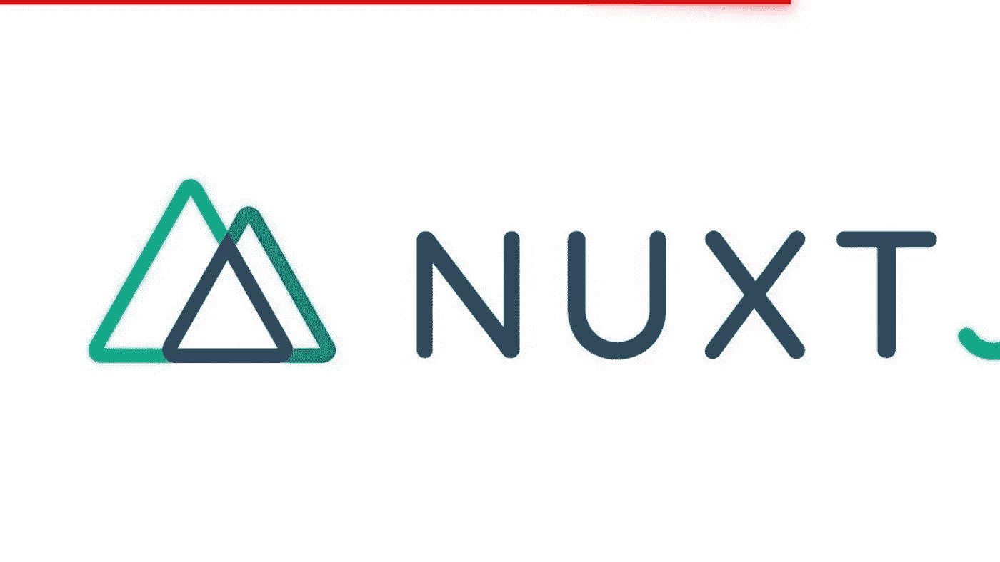

# 自定义 Nuxt 的默认 HTML 模板

> 原文：<https://blog.devgenius.io/customizing-the-nuxts-default-html-template-b2c6e768f2f7?source=collection_archive---------16----------------------->



Nuxt 有一个匿名的 HTML 模板，它会不断地填充你的组件、页面、样式表、脚本和其他内容。你很少会有理由更新模板，甚至看到它。

一个非常重要的场景，你可能需要定制这个模板，当你想为一些浏览器添加条件 CSS 类时，比如 IE，Safari 和其他浏览器。万一你想定制它，这篇文章教你如何做。

Nuxt 使用的默认模板如下所示:

```
<!DOCTYPE html> 
  <html {{ HTML_ATTRS }}>
    <head {{ HEAD_ATTRS }}>
       {{ HEAD }} 
    </head>

    <body {{ BODY_ATTRS }}> 
        {{ APP }} 
    </body> 
</html>
```

要定制默认模板，在默认项目的根目录下创建一个名为`app.html`的文件，包含默认的 Nuxt 容器标签，并根据需要添加定制代码。为 IE 添加条件 CSS 类的自定义 Nuxt HTML 模板示例如下:

```
<!DOCTYPE html> 
*<!--[if IE 9]>
  <html lang="en-US" class="lt-ie9 ie9" {{ HTML_ATTRS }}>
<![endif]-->* 

*<!--[if (gt IE 9)|!(IE)]> <!-->*
  <html {{ HTML_ATTRS }}>
*<!--<![endif]-->*

  <head {{ HEAD_ATTRS }}> 
  	  {{ HEAD }} 
  </head>

  <body {{ BODY_ATTRS }}> 
    {{ APP }} 
  </body> 
</html>
```

就是这样，Nuxt 现在将在呈现您的应用程序时使用这个新的 HTML 模板。

*原载于【https://nuhuibrahim.com】[](https://nuhuibrahim.com/blog/customizing-the-nuxts-default-html-template)**。***