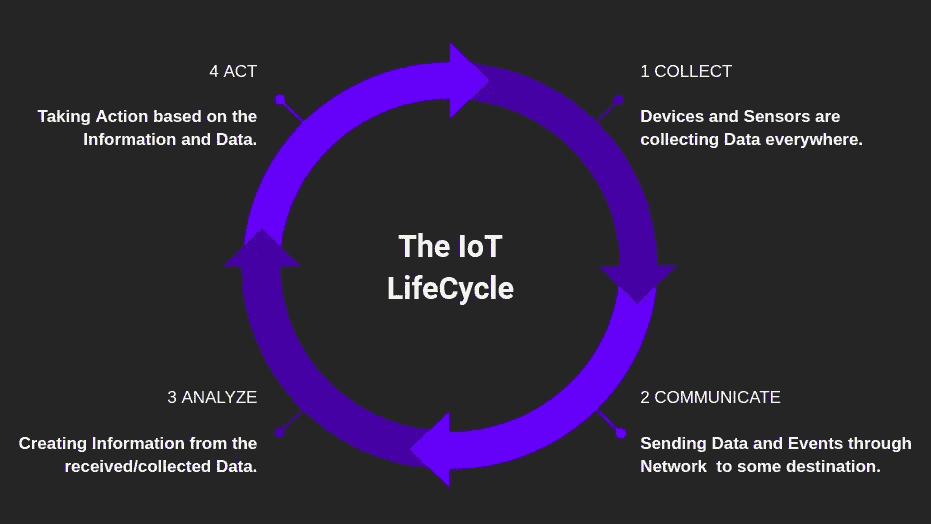

# 前沿技术—物联网

> 原文：<https://blog.devgenius.io/cutting-edge-technology-internet-of-things-3e7c246af831?source=collection_archive---------15----------------------->

> 在这篇中型文章中，我将带您了解物联网技术，并分享关于该主题的观点。我将带您了解物联网的基本定义、物联网的原因、物联网技术、物联网的应用、未来的范围和可能性。我还将简要说明从哪里以及如何开始。快乐阅读。

物联网

# IoT 是什么？

设备、嵌入了传感器、执行器、软件、电子设备的物理对象以及网络连接的互联，使这些对象能够收集和交换数据。

简单来说:
*通过“互联网”相互连接的物理对象或“事物”的网络*

# 物联网简史

懂年表！

*   **1990 年**:约翰 Roomkeyst 发明的第一台联网烤面包机
*   **1999** :物联网一词是凯文·阿什顿(物联网之父)创造的。
*   2000 年 : LG 宣布了它的第一个互联网冰箱计划。
*   **2008–2009**:物联网“诞生”了

# 物联网生命周期

物联网生命周期

**1。收集:** 设备和传感器到处都在收集数据。

**2。通信:** 通过网络向某个目的地发送数据和事件。

**3。分析:** 从接收/收集的数据中创建信息。

**4。
行动:根据信息和数据采取行动。**

# 物联网如何工作？

整个过程从设备本身开始，如智能手机、数字手表、与物联网平台安全通信的电子设备。

物联网平台收集和组合来自多个设备和平台的数据，并应用分析与应用程序共享最有价值的数据，以满足特定行业的需求。

# 为什么是 IoT？

> 第一次听到物联网这个名词的人可能会有这个疑问，但是已经知道物联网的优势和重要性的人，会有如下反应。

我知道没错！

*   尖端技术
    -到 2025 年，500 亿台联网设备。
    -“*您购买的最后一项没有内置 Wi-Fi 或蓝牙的技术是什么？”*
*   完全透明，效率更低，质量更高。
*   在没有人工干预的情况下，机器能够相互通信，从而实现更快、更及时的输出。
*   更多的信息有助于做出更好的决策。
*   监控。
*   省钱。
*   节省时间。
*   日常任务的自动化。
*   更好的生活质量。

# 物联网技术

> 当我们谈论物联网时，市场上有许多技术，我在下面列出了几个。

*   **蓝牙:** 重要的短距离物联网通信协议/技术
*   **Zigbee:** ZigBee 类似于蓝牙，主要用于工业设置。
*   **Z-Wave:** Z-Wave 是一种低功耗射频通信物联网技术，主要设计用于家庭自动化产品，如灯控制器和传感器以及许多其他设备。
*   **Wi-Fi:** WiFi 连接是最流行的物联网通信协议之一
*   **蜂窝:**
    任何需要远距离操作的物联网应用都可以利用 GSM/3G/4G 蜂窝通信功能。
*   **NFC:** NFC(近距离通信)是一种物联网技术。它支持电子设备之间简单安全的通信，尤其是智能手机，让消费者无需亲临现场即可进行交易。
*   **LoRa Wan:** LoRaWAN 是流行的物联网技术之一，目标是广域网(Wan)应用。

# 物联网数据协议

1.  受限应用协议(CoAP)
2.  消息队列遥测传输协议(MQTT)
3.  高级消息队列协议(AMQP)
4.  数据分发服务

# **物联网硬件**

> 硬件是任何物联网项目的核心部分。

你知道的对！

> 硬件组件

*   **Arduino 微控制器:** 
*   树莓派:
    这是一款非常便宜的微型电脑，可以集成整个网络服务器。通常被称为“RasPi”，它有足够的处理能力和内存来运行 Windows 10 和物联网核心。
*   **Beagle Board:** Beagle Board 是一台单板计算机，采用基于 Linux 的操作系统，使用 ARM 处理器，处理能力比 RasPi 更强大。
*   **英特尔的 Galileo:** 它是第一款基于**英特尔**架构的**主板**，其硬件和软件引脚与为 Uno R3 设计的 **Arduino** 屏蔽兼容。
*   **Edison boards:** 它是一种模块化计算机，由英特尔提供，作为可穿戴设备和物联网设备的开发系统。

> 物联网硬件的构建模块

*   **事物:** 你要控制或监控的资产。
*   **数据采集模块:** 采集物理信号并转换成数字。
*   **数据处理模块:** 处理数据、执行分析、本地存储数据以及其他边缘计算的“计算机”。
*   **通信模块:** 与本地或云中的第三方系统通信

> 其他要求

*   **物联网传感器**
*   **可穿戴电子设备**
*   **基本设备**

# 物联网软件

> 当有人说 IoT 全是硬件的时候:|
> T3 我就像下面的

说真的！

不，物联网不仅仅是硬件，它还包括软件！

*   C 语言:
    C 编程语言植根于嵌入式系统——它甚至从编写电话交换机开始。
*   **C++语言:** C++是 C 语言的面向对象版本，是一种流行于 Linux OS 和 Arduino 嵌入式物联网软件系统的语言。
*   **Java:
    Java 的可移植性更强。它更像是一种只写一次就可以在任何地方阅读的语言，你可以安装库，花时间写一次代码，然后就可以开始了。**
*   **Python:** Python 是一种解释型语言，读起来简单，学起来快，写起来也快。此外，它还是服务于数据密集型应用程序的发电站。它的用途正在慢慢扩展到嵌入式控制和物联网领域，特别是树莓 Pi 处理器。
*   **B#:** B#是专门为嵌入式系统设计的，它小巧紧凑，内存容量更小。
*   JavaScript:
    JavaScript 是一种非常事件驱动的语言，这使得它非常适合对来自设备的新数据做出反应，并触发设备本身的动作。
*   **数据采集:** 用于数据过滤、数据安全、传感、测量。这些协议通过感应实时物体来帮助决策。它可以通过从设备收集数据或向设备分发数据两种方式工作。所有的数据都传送到中央服务器。
*   **设备集成:** 该软件确保设备绑定并连接到网络，便于信息共享。确保多个设备之间的稳定协作和通信。
*   **实时整合:** 来自用户的输入作为潜在数据，用于执行实时分析、提出见解、提出建议以解决组织的问题并改进其方法。
*   **应用程序和流程扩展:** 这些应用程序扩展了现有系统和软件的覆盖范围，以支持更广泛、更有效的系统。它们集成了用于特定目的的预定义设备，例如允许某些移动设备或工程仪器访问。

# 物联网公司

嘣！

> 全球五大物联网公司

*   国际商用机器公司
*   谷歌
*   美国英特尔公司(财富 500 强公司之一ˌ以生产 CPU 芯片著称)
*   微软
*   加拿大白鲑

# 物联网应用

> **物联网**本质上是嵌入式设备连接到互联网的平台，因此它们可以相互收集和交换数据。它使设备能够像人类一样进行交互、协作和相互学习。下面是物联网的几个应用。

*   智能家居
*   衣服
*   智能城市
*   智能电网
*   工业互联网
*   联网汽车
*   互联健康
*   智能零售
*   智能供应链
*   智能农业

# 未来的范围和可能性

钱&钱！

## 物联网影响趋势

> 一项新的研究生成了一份报告，名为“2023 年前物联网的主要战略趋势和技术”，陈述了 10 个最具影响力的物联网趋势

*   人工智能
*   信息经济学和数据经纪
*   从智能边缘到智能网格的转变
*   物联网治理
*   传感器创新
*   社会、法律和道德物联网
*   可信硬件和操作系统。
*   最新物联网用户体验
*   芯片上的创新
*   物联网无线网络新技术

# 物联网职业机会

> 在众多机会中，以下是物联网领域的职业机会:

*   数据分析
*   网络和结构
*   保护
*   设备和硬件
*   单元格和用户界面开发

# 物联网工作的类型

> 在物联网职业机会中，提供了各种类型的物联网工作:

*   传感器和执行器专业人员
*   嵌入式程序工程师
*   软件程序工程
*   安全技术

# 从哪里以及如何开始？

派对时间！

> 我有 6 个简单的建议:

1.  深入了解传感器
2.  关注用户界面
3.  学习 JavaScript 或 Python
4.  玩树莓派
5.  找到一个社区
6.  保持你的技能领先

> 此外，当我们谈论开始使用任何技术时，这完全取决于一个人学习和发展技能的方式，以下是你可以采用的方式。

*   线上:
    -Udemy
    -Coursera
    -Lynda
    -io tify
*   书
*   YouTube 教程
*   DIY 项目
*   *“这是你的选择”*

# 谈话视频

> 我做了一个关于这个主题的演讲，你可以看下面的视频，通过解释获得更多的见解！

谈话录音！

嘿，读者们，感谢你们的时间。如果你喜欢这个博客，别忘了鼓掌欣赏它👏如果你喜欢❤，你可以给 50 英镑👏

> 我是影响者—Google Crowdsource | hackere earth CA | coding blocks CA | Chapter Lead—Script Foundation | Hackathon 爱好者| GoogleLocalGuide | ML 爱好者| Mentor | Blogger | TechSpeaker |社区爱好者

如果您有任何问题或建议，欢迎在下面发表评论，或者您可以通过以下方式与我联系:

LinkedIn:

 [## 西达尔特·达亚尔瓦尔-导师| MLH 夏季联赛-大联盟黑客| LinkedIn

### 大家好，我是西达尔特·达亚尔瓦。对技术充满热情，渴望学习和探索更多…

www.linkedin.com](https://www.linkedin.com/in/siddharth-dayalwal/) 

推特:

[https://twitter.com/SiddharthDayal1](https://twitter.com/SiddharthDayal1)

Instagram:

[https://www.instagram.com/technobot.siddharth.2526/](https://www.instagram.com/technobot.siddharth.2526/)

> 点击这里查看我之前的文章:

 [## 使用深度学习的外观不变人脸验证！

### 人脸验证是给定人脸与已知身份的一对一映射。人们经常会经历几个…

medium.com](https://medium.com/@siddharthdayalwal/appearance-invariant-face-verification-using-deep-learning-d61ace4ddb83)  [## 开源节——一个新的开始

### 开源节或操作系统节是一个为期一天的活动，它是所有关于开源技术和资源，可以…

medium.com](https://medium.com/ai-in-plain-english/opensource-fest-a-new-beginning-27dba55bf457)  [## CodeVenza —代码之旅

### CodeVenza 是一项为期两天的编码活动，在 2018 年计算机科学教育周(12 月 7 日)期间举行

medium.com](https://medium.com/club-devbytes/codevenza-journey-to-code-20dc62034153)