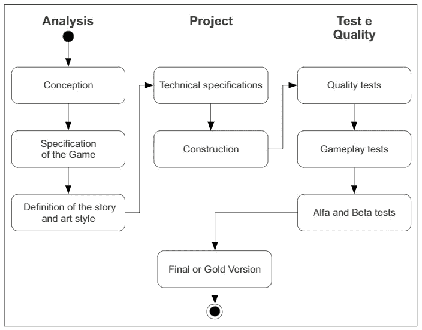
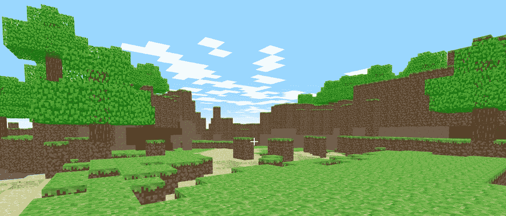
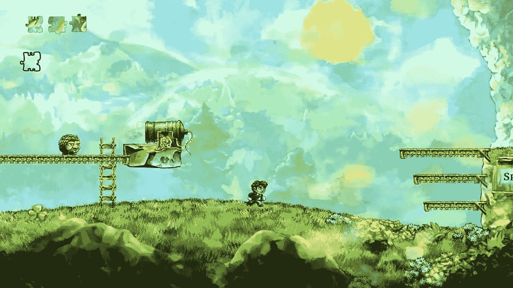
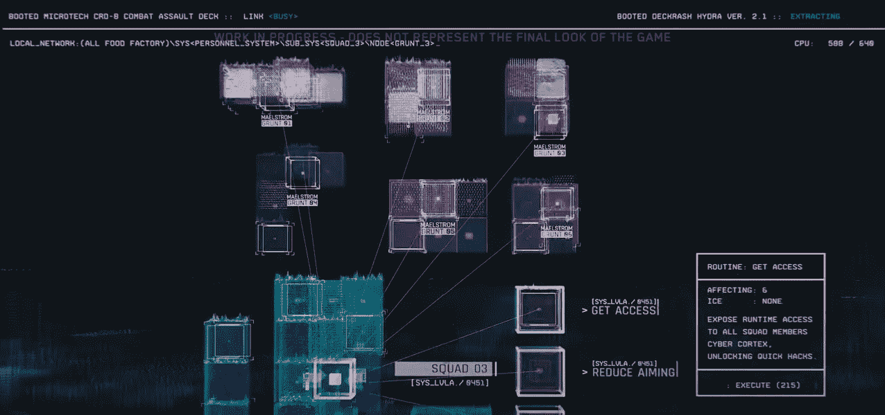

# 从软件工程的角度看赛博朋克 2077

> 原文：<https://blog.devgenius.io/cyberpunk-2077-through-the-lens-of-software-engineering-416e496b2e4e?source=collection_archive---------3----------------------->

## 糟糕的软件工程应该为游戏最近的灾难负责吗

赛博朋克 2077 的一个小故障

视频游戏仍然在专门的实体店出售，它们的产品看起来更像电影，开发人员回避软件工程其他部分的一些最佳实践。但是，游戏开发者确实做软件；全球收入价值 1650 亿美元的软件[1]。虽然行业评论家经常从叙事、可玩性和设计的角度来讨论产品，但我们作为开发人员可以通过软件开发的角度来思考游戏行业的成功和失败，从而学到一些东西。幸运的是，2020 年为后者提供了一个壮观的例子。

## 失败

2020 年 12 月 10 日，波兰游戏开发商 CDPR 发布了赛博朋克 2077。自 2013 年宣布以来，赛博朋克已经进行了大量的宣传，赢得了 2019 年金操纵杆奖的“最受期待”和 Gamescom 奖的“最受欢迎”[2，3]。然而，当玩家拿到游戏时，他们发现这是一个很大的失望。bug 范围从沉浸式破坏(角色不穿裤子到处走)到令人沮丧的(保存文件损坏)。此外，在 CGI 预告片和之前的游戏演示中显示的位置和功能在最终产品中消失了。这款游戏在 PC 上运行良好，但在 PS4 和 Xbox One 上几乎无法运行。索尼公司史无前例地将这款游戏从其数字商店中移除。

## 贪多嚼不烂

CDPR 给自己设置了一个实质性的技术挑战。对于这种规模的游戏来说，他们 400 人的开发团队很小；赛博朋克被宣传为游戏的演变，如拥有 1600 个开发者的《红色死亡救赎 2》(2018)，以及在 15 个工作室之间分配工作的《刺客信条·瓦尔哈拉》(2020)。工作室的发行策略加剧了这种情况。这款游戏是为当前一代(PS4 和 XB One)以及下一代游戏机(PS5 和 XB X 系列)和 PC 开发的。CDPR 选择在发布时提供全球本地化，翻译文本和音频，并进行文化敏感的调整。他们还支持全球角色对口型支持，这是前所未闻的。[8]

发布如此广泛的版本对有效的 QA 测试提出了挑战。在开发过程中，下一代版本被推迟到 2021 年，其他版本在最后一刻从 11 月 19 日推迟到 12 月 10 日，原因是测试[9]。此外，匿名与彭博交谈的员工声称，开发人员只能使用个人电脑，管理层忽视了游戏对于 7 年前的游戏机来说过于复杂的担忧[10]。这些员工还报告说，CDPR 没有像较小的工作室那样，重复使用《巫师 3》(2015)中使用的“红色引擎 3”游戏引擎或第三方引擎，而是选择与赛博朋克同时开发一个新的引擎。一名员工形容这就像“当你面前的铁轨正在铺设时，试图驾驶一辆火车”。游戏引擎提供渲染、音频、物理引擎以及 AI 工具；这些都是赛博朋克被发现有问题的方面。

## 追逐瀑布

从历史上看，包括 CDPR 在内的大多数高预算游戏都是使用瀑布模型(的一个版本)开发的。在最终发布日期之前，广泛的规划之后是长时间的开发[11]。在软件开发的其他部分，向敏捷的转变导致了软件质量、灵活性和用户反应的提高；可以假设游戏已经落后于时代，也可以通过转向敏捷获得巨大的回报。

游戏的瀑布模型

事实上，在过去的十年里，已经有几个游戏采用迭代开发的成功故事。《我的世界》从原型开始定期发布新的功能或性能改进的更新，已经卖出了超过 2 亿份[12]。Steam 的早期接入程序托管了数百款仍在开发中的游戏[13]。许多广受好评的版本的开发人员将平台和迭代开发作为他们成功的原因。Devel-oper UnknownWorlds 让玩家投票决定在他们的游戏中加入哪个特性，Subnautica。内向工作室知道他们有一个很好的“监狱建筑师”的核心想法，但使用他们的玩家的输入来充实游戏的最终版本。[14]

然而，以这种方式开发会对可以制造的产品类型造成限制。手工制作的纹理和角色模型很难迭代完成，如果一个游戏要呈现一个线性的体验或故事，玩家想要最终版本。上面列出的成功案例有简单的图形(见图 3)和故事元素；他们在很大程度上也属于“开放式生存”类型，这被许多人认为是过度饱和[15]。此外，几乎每一个在游戏大奖上赢得年度游戏的游戏都是一种叙事驱动的、图形复杂的体验，就像赛博朋克被开发出来一样。如果 CDPR 决定迭代开发，他们就不会做出同样的游戏，有明显的市场压力表明他们为什么没有做出改变。

《我的世界》的简单体素图形

## 管理混乱

不幸的是，CDPR 采取的发展战略存在其他问题。在没有团队咨询或基于数据的论证的情况下，根据个别经理的意见，功能被删除然后重新启用。“项目文档”通常在开发之初就被写出来，描述游戏的外观和感觉，但却经常被忽视。[11, 10]

软件是由人开发的，人们需要被善待才能做好他们的工作。随着项目的螺旋上升，CDPR 的开发人员在一年多的时间里受到“紧缩”的影响，这是一种由长时间工作和每周工作 6/7 天组成的行业惯例[17]。紧缩对健康的影响已被充分证明，它会导致高人才流失率[18]。许多业内人士认为这导致了错误的代码，可以通过更好的控制范围来避免。

## 测试，或缺乏测试

一些人认为最终产品的缺陷是由于在开发过程中缺乏对测试的重视。在对失败的分析中，CI/CD 作者 Dave Farley 指出，在针对引擎和 UI 程序员的广告中很少提到测试或代码质量。相反，CDPR 似乎更喜欢雇佣擅长调试的 QA 测试人员和开发人员。[20]

尽管如此，一个明显的错误是行业标准。典型的游戏开发瀑布模型在游戏构建完成后会分配大量时间用于测试[11]。真人团队玩游戏，尝试新的玩家动作并报告错误。

事实上，有限测试的实践在游戏开发中很普遍，但这并不意味着这是一个好主意。然而广受赞誉的游戏开发商乔纳森·布洛却支持它。在 2013 年的一个直播中，他解释了他的信念，即当试图做出有趣的东西时，TDD 是不可能的，称其支持者“缓慢而低效”。Blow 反对编写单元测试，他评论说，当事情凑在一起时，bug 通常会出现，单元测试既膨胀了代码库，又限制了开发人员的灵活性；用他自己的话说“你到底想写多少代码？”[22].同为开发者的贾法尔·索尔塔尼曾在 Rare 工作，他谈到在开发一款 AAA 游戏时，持续运行大型测试套件是如何迅速变得不可行的，他提倡优先考虑最不稳定的组件[23]。

Blow 最出名的是 2008 年的游戏《辫子》

## 演示旨在帮助谁？

该游戏炒作的一个重要贡献者是 2018 年电子娱乐博览会期间发布的 2018 年 48 分钟演示。近年来，这些大型演示已经成为游戏营销的重要组成部分，通常在游戏发布前至少一年进行。尽管这样的演示对开发有极大的破坏性。为了制作演示版，开发人员经常会在几个月的时间里远离游戏的有用工作。Rare 的一位前开发人员告诉我，这些演示的工作是在一个单独的分支上完成的，在相关会议后该分支被删除了。消费者还希望这些演示能够代表最终的项目，包括纹理、配音和游戏的其他组件，这些通常在开发的后期阶段才需要完成。CDPR 的开发者在接受彭博采访时证实，赛博朋克也不例外。然而，他们也声称演示完全是假的；营销活动的一部分，而不是开发的一部分[10]。

E3 演示中展示的黑客迷你游戏并没有出现在最终游戏中

这些演示在行业中被称为“垂直切片”,但在他的演讲“垂直切片挑战”中，Volition 的高级制作人 Greg Donovan 展示了它们是如何扭曲原始想法的。意志为他们的 2006 游戏圣徒行创造了一个垂直切片。像赛博朋克一样,《圣徒之行》是一款开放世界的游戏，也像《CDPR》一样,《意志》接受了重大的技术挑战。然而，在开发开始之前，Volition 就创建了它的垂直切片。目标是评估项目的可行性，预测任何挑战，并说服出版商支持开发。原型做得很快，不打算给消费者看；因此，它运行在一个可怜的帧速率，有未完成的纹理，没有音乐或对话。开发始于对障碍的明确识别，以及对完成未来任务所需的时间和资源的了解[24]。CDPR 没有按照 Volition 的步骤，开发一个工具来帮助更好地规划游戏，而是将急需的开发工作转移到了市场营销上。

圣徒行垂直切片

然而，忽视这两种发展之间的差距是错误的。自 2006 年以来，消费者的期望一直在变化，在开发过程中不展示长时间的游戏性将是一个重大的财务风险。不过，我可以指出一些当代游戏使用垂直切片来更好地为开发服务，同时又不忽视营销。

在《合金装备 5》(2015)的开发过程中，我们决定单独发布序言，这是游戏的一个小部分，具有很小的可探索区域和有限的游戏功能。这给了开发人员一个机会来完成一个使用新的 Fox 引擎的项目，并获得关于性能和机制的反馈。将“归零地”货币化的决定受到了批评，但其内容本身却广受欢迎[25，26]。

在他们最近的游戏《盗海》(2018)中，稀有允许内部程序中的用户玩游戏的早期版本。至关重要的是，这些是游戏在特定时间的快照，而不是在单独的分支上完成的工作。该计划中的玩家可以直播游戏，并与开发者直接沟通[27]。《贼海》是一个多人游戏，使用了开创性的水物理学；该项目提供了大规模测试两者的机会。

贼海游戏

## 流媒体能解决问题吗？

在赛博朋克推出的混乱中，人们看到了游戏如何避免这些问题。赛博朋克是在谷歌的云游戏服务 Stadia 上推出的。在 Stadia 上，谷歌利用其基础设施为玩家提供相当于高端电脑的游戏费用。玩家报告了稳定的体验，我在亲自调查了游戏在平台上的运行情况后对此表示赞同。许多人认为所谓的“游戏即服务平台”是游戏的未来。如果它们成为标准，开发适合所有人的游戏将会容易得多，而且不需要在动力不足的机器上运行，游戏的整体图形保真度和技术复杂性可能会更高。如果不受限于 5 年以上的游戏机发布周期，图形创新的速度也可能会加快。然而，这样的游戏格局需要一定水平的基础设施，而这种基础设施目前在全球范围内并不存在。即使在美国，许多用户也没有足够的宽带带宽来使用 Stadia。目前，大预算游戏的商业成功依赖于物理硬件的限制。

## 总结想法

Cyberpunk 的发展是一个好的软件开发实践被妥协以服务于其他目标的故事。明智的技术捷径没有被使用，以便产品可以有最大的行业影响。为了支持营销，牺牲了使用垂直切片来识别挑战和管理内部预期的机会。让用户驱动开发和迭代工作的机会被牺牲了，以追逐批评的喝彩。而不是利用云

为每位玩家提供低成本稳定体验的技术该游戏是针对老化的硬件开发的，旨在改善安装基础。有些妥协是可以理解的，商业和关键的成功是合理的目标。然而，CDPR 采取的大量权衡导致他们创造出一个破碎的最终产品。这场比赛会被记住，但是因为所有错误的原因。

乔·拉克姆

## 参考

[1]《赛博朋克 2077》被认为是今年最大的电子游戏。发生了什么事？【在线】。可从以下网址获取:https://www . nytimes . com/2020/12/19/style/cyber punk-2077-video-game-disaster . html。

[2]赛博朋克 2077 声称今年的黄金操纵杆为最想玩的游戏。【在线】。可从:[https://archive . VN/20191116063337/https://www . gama sutra . com/view/press releases/354155/cyber punk _ 2077 _ claims _ this _ years _ Golden _ Joystick _ for _ Most _ Wanted _ game . PHP .](https://archive.vn/20191116063337/https://www.gamasutra.com/view/pressreleases/354155/Cyberpunk_2077_claims_this_years_Golden_Joystick_for_Most_Wanted_Game.php.)【2021 年 1 月 12 日访问】。

[3]2020 年 gamescom 大奖颁给了不夜城。【在线】。可从:[https://www.gamescom.global/gamescom-now/gamescom-award](https://www.gamescom.global/gamescom-now/gamescom-award)，【2021 年 1 月 12 日获取】。

[4]索尼从 playstation store 下架《赛博朋克 2077》，并提供退款。【在线】。可从:[https://www . vulture . com/2020/12/Sony-removes-cyber punk-2077-from-PlayStation-store . html](https://www.vulture.com/2020/12/sony-removes-cyberpunk-2077-from-playstation-store.html)获取。[2021 年 1 月 12 日访问]。

[5]赛博朋克 2077 的开发商人力是巫师 3 + 60%。[在线]。可从:[https://variety . com/2018/gaming/features/red-dead-redemption-2-narrative-interview-1202992401/，](https://variety.com/2018/gaming/features/red-dead-redemption-2-narrative-interview-1202992401/,)【2021 年 1 月 12 日访问】。

【6】《赤死回生 2》故事背后的故事。【在线】。可从:[https://variety . com/2018/gaming/features/red-dead-redemption-2-narrative-interview-1202992401/。](https://variety.com/2018/gaming/features/red-dead-redemption-2-narrative-interview-1202992401/.)【2021 年 1 月 12 日进入】。

[7]多达 15 个工作室参与了《刺客信条:瓦尔哈拉》的制作。【在线】。可从:[https://www . kotaku . com . au/2020/05/a-stagging-15-studios-worked-on-assigners-creed-Valhalla/](https://www.kotaku.com.au/2020/05/a-staggering-15-studios-worked-on-assassins-creed-valhalla/)，【2021 年 1 月 12 日访问】。

[8]赛博朋克 2077 将平等对待每一种语言，为每一个配音员提供完全的对口型表演。【在线】。可从:[https://www . VG 247 . com/2020/10/20/cyber punk-2077-full-lip-sync-ducked-languages-localization/](https://www.vg247.com/2020/10/20/cyberpunk-2077-full-lip-sync-dubbed-languages-localisation/)获取。[2021 年 1 月 12 日访问]。

[9]赛博朋克 2077 被推迟到 12 月。【在线】。可从:[https://www.pcgamer.com/cyberpunk-2077-has-been-delayed](https://www.pcgamer.com/cyberpunk-2077-has-been-delayed)【2021 年 1 月 12 日获取】。

[10]了解赛博朋克 2077 灾难性的首次亮相。【在线】。可从:[https://www . Bloomberg . com/news/articles/2021-01-16/cyber punk-2077-what-caused-the-video-game-s-disastorary-rollout](https://www.bloomberg.com/news/articles/2021-01-16/cyberpunk-2077-what-caused-the-video-game-s-disastrous-rollout)。[2021 年 1 月 12 日访问]。

[11]法比奥·佩特里略和马塞洛·皮门塔。敏捷存在吗？游戏开发中的敏捷实践，第 9-15 页，2010 年 1 月。doi: 10.1145/1878450.1878453。

[12]《我的世界》仍然令人难以置信地受欢迎，其销售额高达 2 亿英镑，每月播放量达 1.26 亿英镑。【在线】。可从:[https://www . the verge . com/2020/5/18/21262045/minecraft-sales-monthly-players-statistics-YouTube 获取。](https://www.theverge.com/2020/5/18/21262045/minecraft-sales-monthly-players-statistics-youtube.)【2021 年 1 月 12 日访问】。

[13]Steam 上的早期访问。【在线】。可从:【https://store.steampowered.com/genre/Early%20Access/】T2，【2021 年 1 月 12 日获取】。

[14]所有开发者都应该学习的 7 款成功的早期接入游戏。【在线】。可从:[https://www . gama sutra . com/view/news/275719/7 _ successful _ Early _ Access _ games _ that _ all _ developers _ should _ study . PHP，](https://www.gamasutra.com/view/news/275719/7_successful_Early_Access_games_that_all_developers_should_study.php,)【2021 年 1 月 12 日访问】。

[15]开放世界生存类游戏已经走到尽头了吗？【在线】。可从:[https://www . pcgamer . com/uk/face-off-has-the-open-world-survival-genre-run-its-course/](https://www.pcgamer.com/uk/face-off-has-the-open-world-survival-genre-run-its-course/)获取。[2021 年 1 月 12 日访问]。

[16]游戏奖项:历史。【在线】。可从:[https://thegameawards.com/history](https://thegameawards.com/history)【2021 年 1 月 12 日获取】。

[17]尽管过去有过承诺，赛博朋克 2077 还是经历了几个月的财政紧缩。【在线】。可从:[https://www . polygon . com/2020/12/4/21575914/cyber punk-2077-release-crunch-labor-delays-CD-projekt-red](https://www.polygon.com/2020/12/4/21575914/cyberpunk-2077-release-crunch-labor-delays-cd-projekt-red)【2021 年 1 月 12 日访问】。

[18]电子游戏行业的黑暗面——哈桑·米娜杰的《爱国者法案》—网飞。【在线】。可从:[https://www.youtube.com/watch?v=pLAi_cmly6Q](https://www.youtube.com/watch?v=pLAi_cmly6Q)【2021 年 1 月 12 日获取】。

[19]如何避免视频游戏开发危机。【在线】。可从:[https://www . games industry . biz/articles/2018-10-19-how-to-avoid-video-game-development-crunch](https://www.gamesindustry.biz/articles/2018-10-19-how-to-avoid-video-game-development-crunch)【2021 年 1 月 12 日访问】。

[20]糟糕的软件工程扼杀了《赛博朋克 2077》的发行。【在线】。可从:https://www.youtube.com/watch？v=E-jGEtqB4wU。[2021 年 1 月 12 日访问]。

[21]电子游戏测试可能很有趣，但它需要大量的艰苦工作:你能胜任这项工作吗？【在线】。可从:[https://www.gamedesigning.org/video-game-tester/](https://www.gamedesigning.org/video-game-tester/)【2021 年 1 月 12 日获取】。

[22] Jonathan blow 论单元测试和 tdd。【在线】。可从 https://www.youtube.com/watch?v=21JlBOxgGwY[获得](https://www.youtube.com/watch?v=21JlBOxgGwY)【2021 年 1 月 12 日获得】。

[23]贾法尔·索尔塔尼——在 aaa 视频游戏中采用持续交付——2018 年管道会议。【在线】。可从:【https://www.youtube.com/watch?v=8hXRvvFDztg 【2021 年 1 月 12 日获取】。

[24]垂直切片挑战。【在线】。可从:[https://www.youtube.com/watch?v=1h4M7zDPg1Y](https://www.youtube.com/watch?v=1h4M7zDPg1Y)【2021 年 1 月 12 日获取】。

[25]金属齿轮固体 v:接地零点-40 美元。【在线】。可从:[https://v1 . escapist magazine . com/videos/view/zero-punctuation/9053-Metal-Gear-Solid-V-Ground-zeros-40-Demo](https://v1.escapistmagazine.com/videos/view/zero-punctuation/9053-Metal-Gear-Solid-V-Ground-Zeroes-40-Demo)获取【2021 年 1 月 12 日获取】。

[26]《合金装备:归零地》是有史以来最棒、最昂贵的演示。【在线】。可从:[https://www . eurogamer . net/articles/2014-03-05-metal-gear-solid-ground-zeros-preview 获取。](https://www.eurogamer.net/articles/2014-03-05-metal-gear-solid-ground-zeroes-preview.)【2021 年 1 月 12 日访问】。

[27]seaofthiesiensiderprogrammeofferschanceauthenticatingearlybuilds。【在线】。可从:[https://www . eurogamer . net/articles/2016-11-22-sea-of-thicks-insider-program-offers-chance-at-testing-early-builds 获取。](https://www.eurogamer.net/articles/2016-11-22-sea-of-thieves-insider-programme-offers-chance-at-testing-early-builds.)【2021 年 1 月 12 日访问】。