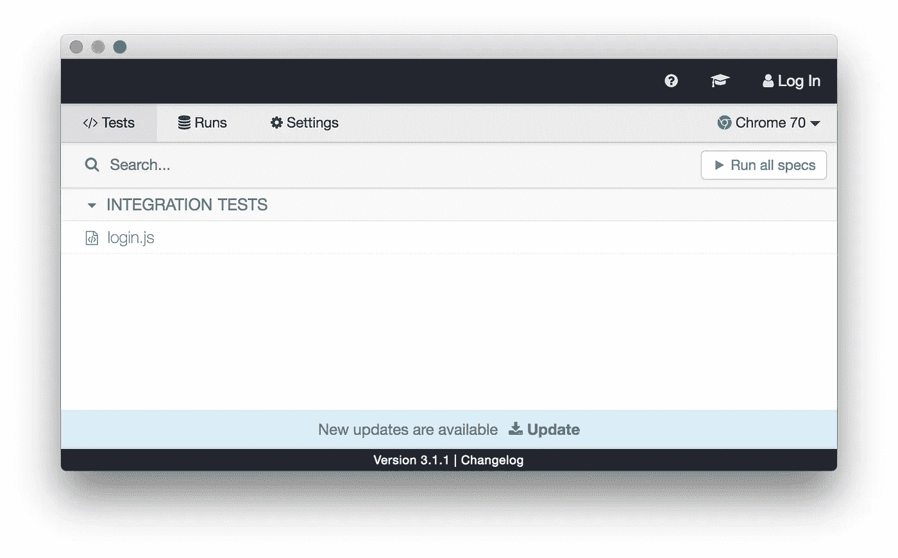

# 赛普拉斯 E2E 自动化测试

> 原文：<https://blog.devgenius.io/cypress-e2e-automation-tests-4a1f38beb324?source=collection_archive---------3----------------------->

端到端测试中的一些常规和 mad 情况。


单元测试并不是我们需要用来覆盖代码的唯一可能性。端到端测试对于检查 web 应用程序的用户流也很重要。在这里，我将我的一些经验与 Cypress 框架结合起来。

因此，让我们将柏树添加到项目中:

```
npm install cypress
or
yarn add cypress --dev
```

您可以轻松打开 Cypress 独立交互应用程序:

```
npx cypress open
or
ng e2e --watch
```



Cypress 应用程序运行特定测试

您需要启动您的 Angular 项目(ng serve 命令)，例如，它将在 [http://localhost:5000/](http://localhost:5000/) 上运行，并允许 Cypress 在 Angular 上运行 E2E 测试。

没关系，您将在旧项目或新项目中使用哪个版本的 Cypress。我们总是有方法来模拟页面上的 UI 动作，做出断言并验证它。

客户机/服务器测试的想法很简单。我们定义页面的行为，然后让**访问()。**

对服务器的请求可能是真实的，或者我们可以添加存根 json 响应:

```
cy.server()
cy.route('/account/*').as('getAccount')
cy.visit('/account/1')
cy.wait('@getAccount').then((xhr) => {
  // now get the xhr details: body, status...
})
```

**Get** 关键字——它可以用来获取页面上的常规 UI 元素。

```
describe('should test select element', () => {
  before(function () {
    cy.visit('http://localhost:5000/')
  })

  it('signs up a new user', () => {
    cy.get('button').contains('Create').click();
    cy.get('#season').select('Spring', {force: true });
    cy.get('#season').contains('Spring')
  });
});
```

或者使用 Cypress 的另一个例子——制作 XHR 请求的存根。存根响应确实非常有用。我们创建 fixture 文件夹并存储响应 json 文件。

嘲讽和存根有什么区别？

模仿意味着在测试中用一个伪造的副本替换功能，并提供一些与之交互的功能。
Stubbing 是指用假版本替换 api 网络请求或服务。

**Route** —拦截 XMLHttpRequests 并改变网络请求的行为。在 Cypress 版本≥ 6 中实现了 Fetch。

```
describe('should be predicted response', () => {
  beforeEach(() => {
    cy.server();
    cy.route({
      method : 'GET',
      url: '/account/',
      status: 200,
      response: {
        id: 1,
        phone: 'Test12345',
        email: 'test@test.com',  
      },
    });
  });
  it('successfully loads', () => {
    cy.visit('/account');
  });
});
```

**拦截** —从 Cypress 6 开始，最好使用这种改进的方法。而不是不推荐使用的服务器()和路由()。

```
cy.intercept({
      method: 'GET',
      url: '**/api/**',
    }).as('MyQuote');
cy.wait('@MyQuote').its('status').should('be', 200);
```

但是**拦截**行为已经改变:我们不能使用 fixture json 作为变量。此参数应设置为文本等。

```
cy.intercept('GET', '/api/work', { fixture: 'stubWork.json' })
```

但是可以这样做:

```
cy.intercept('POST', '/api/work', req => {
    body = req.body
  }).as('myWork');
```

**Its** 关键字—获取前一个对象的请求属性。

```
// Wait for response.status to be 200
cy.wait('[@](http://twitter.com/dataGetFirst)MyApiData').its('status').should('be', 200);// get length of checkboxes array
cy.get('.checkbox').its('length').then(($lenght) => { ... });
```

**Should** 关键字—创建带有条件的断言，以检查元素如何改变其自身的状态。

它可以是不同的条件:存在或不存在、有值、css 或文本、可见或不可见等等。

```
 cy.contains('button', 'Submit').click();
    cy.get('[data-ng-show="user"]', { timeout: 500 })
      .should('be.visible').then(() => {
         cy.get('[data-ng-show="user"]').click();
   })
```

**在 vs 中查找** —在父元素范围内工作

。find()用于对一个元素进行单次搜索，但是只能对该元素进行操作

。within()允许您更改搜索子元素的范围，并使用 cy.get()直接调用它们

```
cy.get("#el").within(() =>
   cy.get("input").should("have.value", value));
or
cy.get(element).find(subelement);
```

**然后**(父元素) **—** 关键字，允许您将元素传递给函数使用。

```
cy.get('@example').then((example) => {
    cy.log(example);
    cy.get(example).find('subelementSelector');
});
```

**请求** —使用标题、方法等具体细节提出请求。

```
const options = {
      method: 'GET',
      url: '**/api/quote/**',
      auth: {
        username: 'user',
        password: 'password',
      },
      headers: {
        contentType: 'application/json',
      }
    };

cy.server().request(options).then((response) => {
  expect(response.status).to.eq(200);
  console.log(response.body);
})
```

**Wrap**——只要等到承诺解决。如果承诺被批准，cy.wrap()将成功通过测试。

```
cy.wrap($input)
  .first()
  .should($inputfield => expect($inputfield).to.be.visible)
  .click()
  .clear()
  .type('test');
cy.wrap($input).parent().find('span').click();
```

# **一些实际任务**

**任务一**。获取 HTML 表格的第一行或最后一行

```
cy.get(".tariff-selection-table > tbody td")
      .last()
      .click();
    cy.get("#apply-button").click();
```

或者用另一种方法得到最后一行 TR

```
cy.get('.table').find('tr')
        .then(tr => {
          const count = Cypress.$(tr).length;
          cy.get('tr').its('length').should('be.gt', 1);
          cy.get(`#selection-table-row-${count-1}`).click();
        });
```

**任务二**。找不到别名。CypressError: cy.wait()找不到“ [@](http://twitter.com/CoverLetter) QuotationRequest”的注册别名。

请求应及时提出。柏树干得太快了。有时您需要使用 cy.wait(500)毫秒，但是最好使用等待异步操作的别名。

例如，我们可以在日志中看到已经发出了 2 个请求

GET/[API/rest-client/quotes/rates](http://localhost:4200/api/rest-client/fclquotations/rates)504 2029.601 ms—-

GET/_ _ cypress/xhrs/[http://localhost:4200/API/rest-client/quotes/rates](http://localhost:4200/api/rest-client/fclquotations/rates)200 15.544 ms—-

当组件启动时(在 Cypress 之前)，第一个请求由应用程序自己发出，第二个请求是 Cypress 正确的请求。

因此，Cypress 应该在应用程序执行之前处理请求，否则您将收到一个 504 错误。
**由于**关键字创建了 async/await 操作的别名， **wait** 关键字只是等待该别名操作结束。

```
//lets create separate class for methods
stubQuotationRequest() {
  *cy*.server()
    .route("GET", "**/api/rest", "fixture:response")
    .as("QuotationRequest");
}
waitForQuotationResponse() {
  *cy*.wait("@QuotationRequest");
}//now use it in E2E test
stubQuotationRequest();
waitForQuotationResponse();
```

**任务三**CypressError:重试超时:应找到元素:“. button.error”，但从未找到。

有时我们需要检查元素是否出现在 UI 中，并用它来检查 if/else。可能会出现这样的情况，测试在 localhost 上工作正常，但是由于 api 请求而在 Jenkins 上工作不正常。

```
 cy.get("body").then($body => {
      if ($body.find(".button.error").length > 0) {
        cy.get(".button.error").click();
      }
    });
```

**任务四**。使用我自己的数据属性，这样更容易定位元素。

```
Let's create custom html component MyButton:
<button class="button" [name]="label" (click)="onClick()"
        [attr.data-cy]="dataCy || null" />use it in Typescript component:
export class MyButton {
  [@Input](http://twitter.com/Input)() dataCy?: string;and spec test it:
  it("should render the default data type of the button", () => {
    component.dataCy = "submit";
    fixture.detectChanges();
    expect(fixture.nativeElement.querySelector(MyButton")
      .getAttribute("data-cy")).toBe("submit");
  });now it is the time to use component in application:
  <MyButton label='testButton' class='classButton'
     dataCy='myButtonCyId' ... />Cypress can access to custom attribute like this:
    cy.get('[datacy="myButtonCyId"]').should('be.visible')
      .should('have.attr', 'datacy', 'myButtonCyId');
```

任务五。测试文本与搜索文本进行比较。

```
cy.get('.myInput').invoke('text').should(input => {
  expect(input.toLowerCase()).to.contain(search.toLowerCase());
})
```

任务六。force:没错——要激励 Cypress 做自己想做的事。
在前一个输入框中输入内容后，您试图在第一个输入框中输入内容。

```
cy.get("#firstInput").click({ force: true});
cy.get("#firstInput").clear({ force: true});
cy.get("#firstInput").type("First text");
cy.get(".anotherInput").clear({ force: true });
cy.wait(500);
cy.get("#secondInput").type("Second text");
```

任务 7 。scrollTo()没有像我们预期的那样工作:在页面上找不到元素。

```
cy.get('.myClass').scrollTo('bottom');
```

我们可以使用 scrollIntoView()来代替:

```
cy.get("#myId").scrollIntoView();
```

**任务 8** 。借助“each”关键字迭代相似的项目。

假设我们有许多类'价格头'。我们想结合价值观

```
 let topTotal = 0.00;
    cy.get(".price-header").each(($el, index) => {
      if (index % 3 === 0) topTotal += parseFloat($el.text());
    }).then(() => {
      expect(topTotal).greaterThan(0); // or .equals(100);
    });
```

或者举例来说，我们必须访问每个输入并写入新值

```
 cy.get('.input-price-valid')
   .each(($el, index, $list) => {
      cy.wrap($el).type(value).click();
   });
```

**任务 9** 有时 type()输入文本非常慢。我们可以使用一些技巧:

```
***cy***.get('.rate')
  .within(() =>
    ***cy*** .get("input")
      .type(myValue, {delay: 0})
      .type('{enter}')
  );
```

或者我们可以复制+粘贴整个值，而不是使用类型关键字(类型包含这么多 DOM 事件)

```
***cy***.get(".rate").within(() =>
  ***cy***.get('input')
    .invoke('val', myValue)
    .trigger('change')
);
```

**任务十**。CypressError: `cy.then()`失败，因为您混淆了异步代码和同步代码。

在运行其他方法之前，我们必须等待同步返回值:

```
let carrier = "";// sync code
const result = ***cy***.get(".prices").click()
  .find('.charge').invoke('text').then((text) => {
    carrier = text.trim();
    ***console***.log("carrier: " + carrier);
  });// async code
***cy***.get("#apply-button").click();

result.then(() => {
  ***console***.log("carrier result: " + carrier);
  this.verifySelectedLabel(carrier);
});
```

**任务十一**。在你的测试中添加循环。有时多次运行测试会很有帮助。你会看到它是否稳定地揭示了代码的衰变位置。

```
Cypress._.times(10, () => {
...
});
```

**任务 12。**让我们使用正则表达式通过特定模板进行检查:

```
cy.get('div.number').contains(/\d+/);cy.contains('div.number', /\d+/);cy.get('.price').contains(/\d+.\d{2} JPY/);
```


华金·索罗拉的画，1908 年左右。

**结论**

就是这样。有时候 Cypress 会让你陷入困境，尤其是 API 请求/响应。我们需要很大的耐心。我们将变化恢复到稳定的状态，并一步一步地前进，以取得积极的成果。可视化自动化测试是必要的，以避免错过最近分支的一些 UI 变化。

**意外的结论**

很高兴看到 Cypress 内部使用 jQuery 库来进行简单的迭代操作。jQuery 现在几乎不用了。

[](https://docs.cypress.io/api/commands/server#Options) [## 服务器| Cypress 文档

### 启动一个服务器，开始将响应路由到 cy.route()并更改网络请求的行为。⚠️ cy.route()…

docs.cypress.io](https://docs.cypress.io/api/commands/server#Options)  [## 厨房水槽

### 厨房水槽|柏树示例

example.cypress.io](https://example.cypress.io/commands/querying) [](https://docs.cypress.io/guides/references/best-practices) [## 最佳实践| Cypress 文档

### 2018 年 2 月，我们在 AssertJS 举办了“最佳实践”会议。本视频演示了如何接近…

docs.cypress.io](https://docs.cypress.io/guides/references/best-practices)