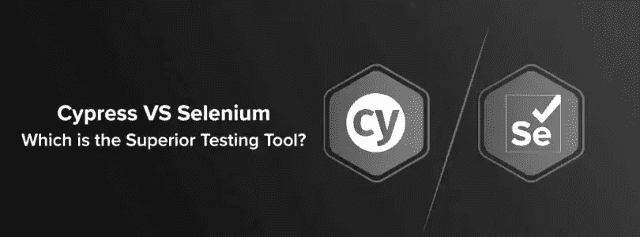
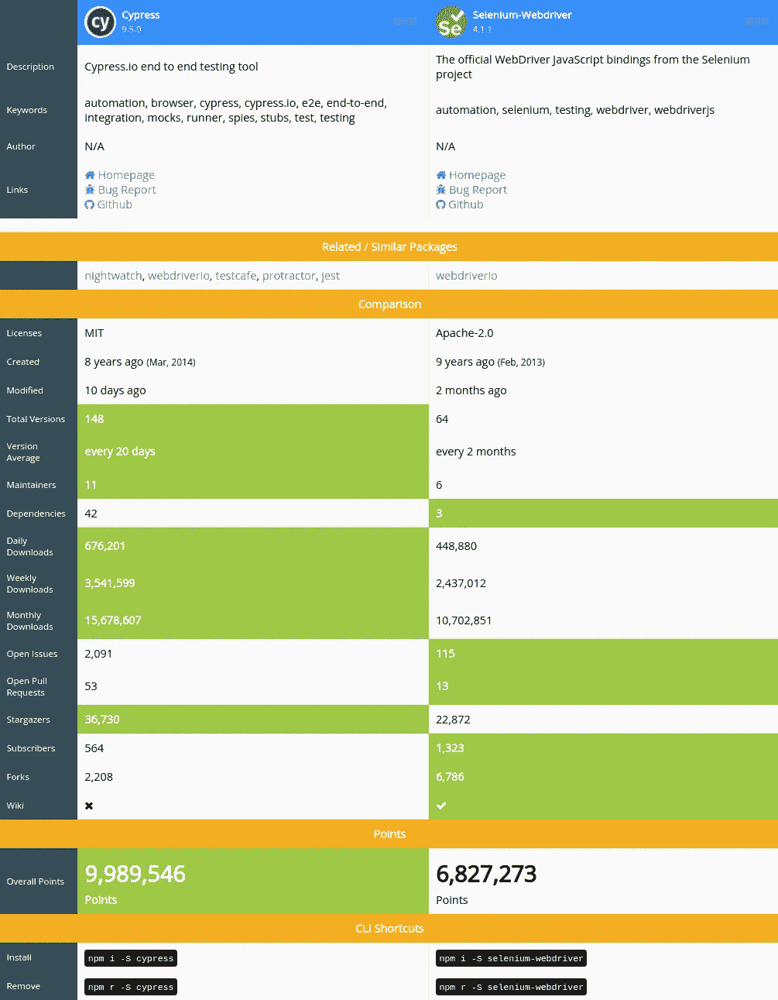
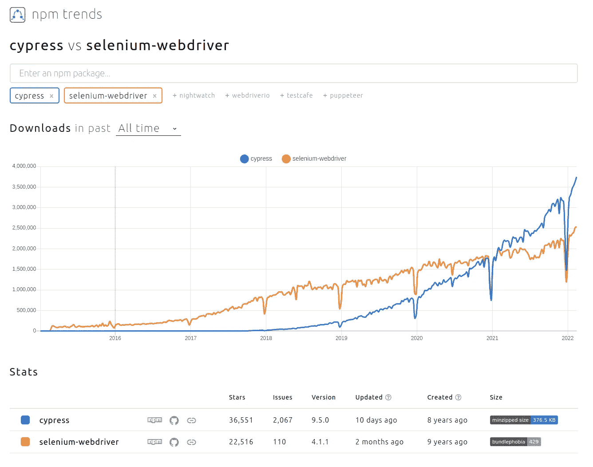

# Cypress:它比 Selenium Web-Driver 好吗？

> 原文：<https://blog.devgenius.io/cypress-vs-selenium-web-driver-2135dd54800c?source=collection_archive---------7----------------------->

你知道，我并不是在为 Cypress 或其他什么东西做营销，但这里有一些统计数据，所以你可以理解为什么 Cypress 是一个优秀的基于 web 的自动化测试工具。

在此之前，对于那些没有读过我以前文章的人，这里有两个测试工具的总结。

## 柏树是什么？

Cypress.io 是一个用户友好的测试自动化工具，用于端到端测试、UI 测试、回归套件、集成和单元测试。它安装简单，不需要对您的代码做任何更改。Cypress.io 以在构建 web 应用程序时快速实时地编写测试而自豪。

## 硒是什么？

Selenium 是一个开源测试自动化工具，用于自动化 web 浏览器。十多年来，这个工具一直是测试人员的热门选择，借助于 Selenium WebDriver 库及其特定于语言的框架，它方便了质量保证团队自动化任何浏览器的测试用例过程。

下面是在 https://npmcompare.com/compare/的帮助下做的一些比较

有了这些，你还想知道这些工具的关键优势。

## 柏树

*   **完整框架**
*   **非常快**(比 Selenium 快，因为 Cypress 用的是 Javascript，JS 是浏览器唯一的母语)
*   不需要扎实的编程技能
*   测试和模拟 API(Selenium 中没有提供这个特性)

## 硒

*   **兼容性**(Linux、Unix、Windows、Mac OS 等操作系统的交叉)
*   从 Java、JavaScript、Python 和 Ruby 等编程语言中进行选择的灵活性
*   兼容所有现代浏览器，如 Firefox、Chrome、Safari 和 Edge
*   简洁且相关的 API

等等，先不要太激动，让我们抛开一些缺点，让你对你想选择什么作为框架主要工具有一个全面的了解。所以缺点在这里。

## 柏树

*   没有 IE 和 Safari 支持(它目前正在进行跨浏览器测试，这意味着在未来的更新中将支持这一点)
*   异步代码
*   没有移动自动化(Cypress“目前”是基于网络的自动化)
*   单一域或单一选项卡

## 硒

*   缺少自动生成测试结果的内置命令
*   页面加载或元素加载处理的复杂性
*   对图像测试的支持不足
*   创建测试脚本的耗时过程
*   与 Cypress 相比，设置测试环境的复杂性

这里有一些统计数据，对于那些喜欢图形和数字的人来说，可以给你一个更好的确认偏差基础。

让我从我的角度给你一些见解，作为一个 QA 专家，我正在努力学习每一个用来提供最高质量的工具。所以在过去的三年里，我一直在研究和学习 Selenium，所以现在，我做自己的项目只是为了继续练习，同时学习一个新工具，这是为了这个博客，它的 Cypress。

你也可以做同样的事情，并且愿意学习每一个为 QA 引入的工具，但是你需要一个接一个地学习，这样你才能专注于你选择的工具。

> 我们不断前进，打开新的大门，做新的事情，因为我们好奇…而好奇心不断引领我们走向新的道路。华特·迪士尼说。

 [## 每当侯赛因·巴申发表文章时，就收到一封电子邮件。

### 每当侯赛因·巴申发表文章时，就收到一封电子邮件。通过注册，您将创建一个中型帐户，如果您还没有…

husseinbaashen.medium.com](https://husseinbaashen.medium.com/subscribe)