# DA 组合项目-ETL/数据库设计/ MySQL(第二部分)

> 原文：<https://blog.devgenius.io/da-portfolio-project-etl-database-design-mysql-part-ii-2e5aac3fc827?source=collection_archive---------5----------------------->

在 [Unsplash](https://unsplash.com?utm_source=medium&utm_medium=referral) 上由 [Rodion Kutsaev](https://unsplash.com/@frostroomhead?utm_source=medium&utm_medium=referral) 拍照

在本系列的前一部分中，我们为项目创建了一个单独的环境，并安装了我们需要的库。今天我们将从编码开始！

现在，我必须澄清这个项目是关于什么的。因为我对武侠片非常着迷，所以我选择了它作为这个项目的主题。我以这样一种方式制作了它，这是一件非常有趣的事情，想象一下我甚至忘记我正在编码的场景。所以我所做的基本上是创建一个数据库，在一个叫做*万会*的特殊地方保存所有教派的信息。我们有所有的教派，属于他们的人，关于他们的信息，教派之间的联盟和各自拥有的武器。我是如此专注，以至于我为它创建了一个完整的场景，只是从我的文件中复制粘贴它，可以在这里找到*。*

> *万惠市民数据库设计*
> 
> *万惠社最高统治者陈诚已经联系我们，解决他的问题。据他说，很多武术家开始放弃他们的教派并消失了。巧合的是，随机的暴力行为开始在该国不同地区发生，他怀疑胭脂武术家是幕后黑手。此外，一些教派开始变得过于强大，他怀疑他们可能试图联合起来推翻他。这就是为什么他想让我们设计一个数据库，用所有公民的信息填充它，这样他就可以跟踪他们的行动。有点可疑，但我们还是同意了，因为报酬实在太好了，让人无法拒绝。*
> 
> *在问了他更多的问题以便能够掌握我们正在处理的事情之后，我们了解到以下信息:*
> 
> *万会基本上是建立在一群教派之上的，这些教派有许多人属于它，他们都在它的土地上训练和生活。*
> 
> *一些教派之间有一些联盟，原因是为了扩大他们的知识和业务。不与其他教派结盟并不一定意味着他们是敌人，毕竟他们都追随最高统治者。*
> 
> *人们可以培养不同的东西，例如他们培养阴影的力量，或者自然。这应该包括在数据库中。*
> 
> *公民力量有 9 个等级:1-3 为初级，4-6 为中级，最后 7-9 为高级。*
> 
> *我们只对 15-77 岁的人感兴趣，因为其他人并不构成太大威胁。*
> 
> *作为初始设计，我们的数据库中需要 4 个表:*
> 
> ***Citizens** 保存公民个人信息的表格。*
> 
> ***门派**表格，保存门派信息。*
> 
> ***联盟**表看哪些门派相处融洽。*
> 
> ***盘点**表格，记录每个门派拥有的武器。*
> 
> *显然，数据库将被篡改，因为我们继续下去，但现在这是我们想要的。*

*这是目前的 ER 图:*

*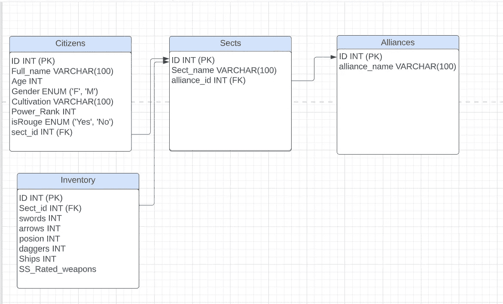*

*研究一下，然后继续前进。*

*基本上现在我们将做一个 ETL 过程:提取，转换，加载。让我们开始提取:*

*在开始搜集之前，让我们输入不需要太多努力的简单数据。*

*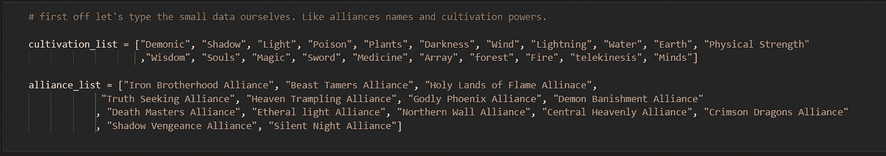*

*小薯条*

*这让我做了很多清醒的梦来想出它们，哈哈。稍后我们将使用这些列表来填充数据库。既然小薯条已经不碍事了，那就抓紧时间吧。*

*首先，让我们导入我们需要的所有东西:*

*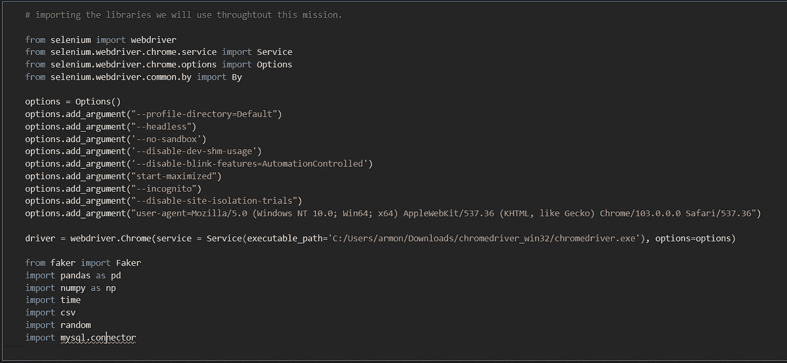*

*Selenium 用于抓取，faker 用于导入假数据，pandas 使我们可以构建一些数据框架，numpy 在将数据插入数据库时选择一些随机选择(也有 random)，时间等待几秒钟当抓取我们的数据时，selenium 库中已经有一个，但我更喜欢这个，csv 从我的 csv 文件中读取数据，最后 mysql 连接器连接到我们的 MySQL 工作台。*

*我们走吧。我们将从搜集教派名称开始。*

*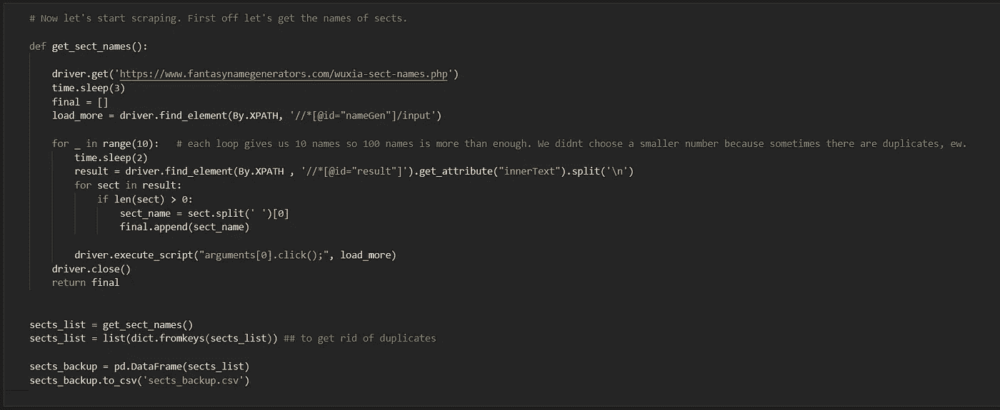*

*我们将网站如代码所示，这是它看起来的样子的一个片段:*

*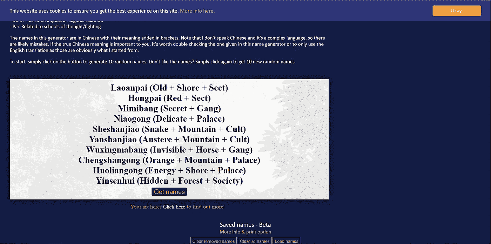*

*[https://www.fantasynamegenerators.com/wuxia-sect-names.php](https://www.fantasynamegenerators.com/wuxia-sect-names.php)*

*正如你所看到的，它列出了 10 个名字，我们可以用做合适的教派名称。通过点击“获取姓名”,你可以获得额外的 10 分，以此类推。现在我应该提到，有时它显示一个名字两次或三次，所以为了满足我需要的教派数量，它循环 10 次，这意味着最多 100 个教派名称。我们不会用光所有的钱，但最好有比我们需要的多一点的钱，以防万一。*

*然后，我们将所有结果保存在 csv 文件中。我为什么要这么做？只是为了安全起见。事实是，我的另一个收集名字的功能花了很长时间。下面这张照片会让你感受到我的巨大痛苦:*

*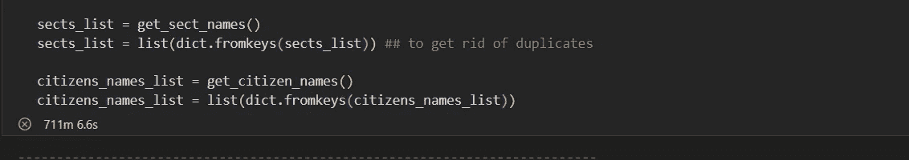*

*悲伤的时光*

*如您所见，代码在 700+分钟后崩溃，超过了 11 个小时！只是因为我的笔记本电脑与无线网络断开了连接，而我却不知道。11 个小时算不了什么，因为我甚至不能得到我的结果。所以，是的，总是保持备份作为 csv 或什么。*

*好了，我们有了各自的教派名称。现在让我们来看看公民的名字:*

*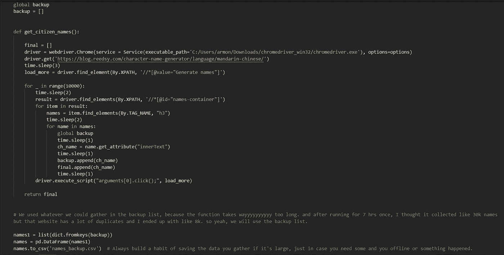*

*这一次，网站给我们每个循环 5 个名字，所以我让它运行了 10，000 次，这也没有用。因为我以为我会得到 4 万到 5 万个没有出现的名字。相反，它给了我一堆重复的名字，总共有 8000 个。没关系，我们可以这样做。这让我想到了下一步，生成假数据。*

*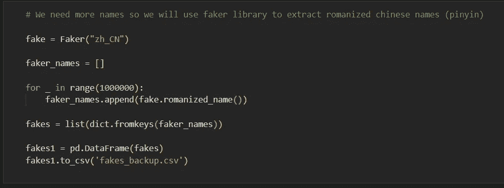*

*循环的数量可能会吓到你，但它实际上运行不到一分钟！再次重复了很多，但我们会尽可能使用。*

*接下来我做的事情只是因为。可以跳过。我还用汉字生成了一堆中文名字，只是因为它们更贴近我的内心。但没有使用作为基础，因为我不能保证每个人看到我的项目可以阅读中文。所以我坚持用罗马化的。*

> *有趣的事实:我在大学学习期间，纯粹出于好奇，选修了大约 8 个学分的普通话。最后得了满分。*

**

*是啊，一百万个循环…*

*这给了我 43000 个不同的名字！太好了。*

*这就是提取我们的数据。现在我们将对它进行一点改造。*

*我们从抓取网站得到的名字和从 faker 得到的名字有一个很大的区别。订单。通过刮取获得的名字是这样的顺序:姓+名，而冒名者的名字则相反。所以我们想用姓在前的那个，把所有这些名字连在一个地方。*

*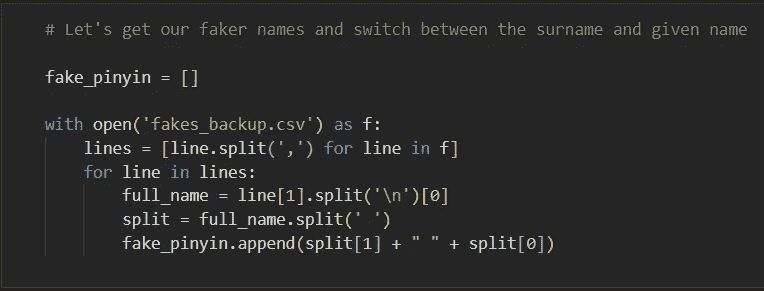**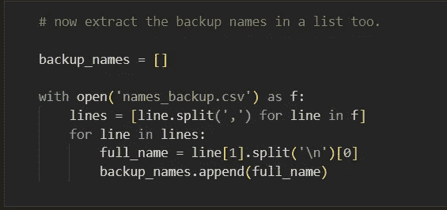**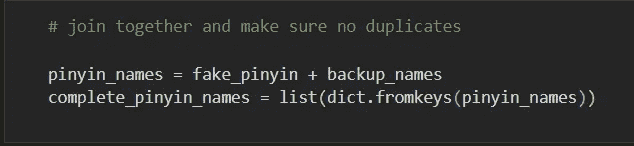*

*现在，我们已经提取了数据，并对其进行了一些转换。剩下的就是开始设计一个数据库，把它们加载进去。这将发生在明天的第三部分。现在只要确保你得到了如何刮，从 csv 文件读取工作。自己运行并探索一下。除了已经在 GitHub 上的 jupyter 笔记本之外，我现在将创建一个 python 文件，这样你就可以快速运行它了。因为笔记本有点麻烦。*

*更新:链接到 python 文件 [***这里***](https://github.com/Armonia1999/Database-design-ETL-MySQL/blob/main/ETL.PY) 。只要做必要的改变，就应该是这样。*

*See you tomorrow ! 拜拜 ♥*