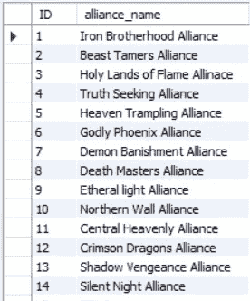
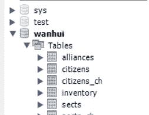

# DA 组合项目-ETL/数据库设计/ MySQL(第三部分)

> 原文：<https://blog.devgenius.io/da-portfolio-project-etl-database-design-mysql-part-iii-129766e1f586?source=collection_archive---------11----------------------->


[https://www.mysql.com/](https://www.mysql.com/)

欢迎大家回来！如果你是新来的，在开始这一部分之前，先检查一下另外两部分。[**第一部分**](https://medium.com/@Armonia1999/da-portfolio-project-etl-database-design-mysql-part-i-473b340806ca)[**第二部分**](https://medium.com/@Armonia1999/da-portfolio-project-etl-database-design-mysql-part-ii-2e5aac3fc827) 。

在最后一部分中，我们经历了数据的提取和转换步骤。今天是 ETL 过程的最后一步:**加载**。

我们仍将使用 python，为了能够将我们在 python 中所做的一切应用到我们的 MySQL Workbench，我们将使用 mysql-python 连接器。正如我在第一部分中展示的，我们应该将它安装到我们的 anaconda 环境中，如下所示:

```
conda install -c anaconda mysql-connector-python
```

我们应该准备好了。让我们来设置一下:

正如您在上面的代码中看到的，我们通过提供名称和密码创建了到 RDBMS 的连接。你应该根据你的改变它们。之后，我们创建了一个名为“Wanhui”的数据库，它将保存我们稍后将创建的所有表。然后在最后一行中，我们修改了数据库连接，这样它将使用我们刚刚创建的数据库。

让我们开始构建我们的表，从最简单的开始:Alliance 表。

所以我们创建了一个名为 alliances 的表，它只有两列:ID 和 alliance_name。你可能已经注意到了，我们这样做是为了让 ID 自动递增，这非常方便。然后，我们将所有联盟名称加入元组中，用逗号分隔它们，这样就可以在一行中插入表中的所有值，而不是一个接一个地插入。如果我们去我们的工作台，它将看起来像这样:



啊，是的，浮夸的名字..

好了，现在我们知道一切进展顺利，让我们继续下一张表:教派。

嗯，看起来我们不能从左向右移动，我将在最后链接我的 GitHub，所以检查那里的 python 文件。

好了，这次我们创建了教派表。它只有 3 列:ID，教派名称和联盟 ID，告诉我们这个教派属于哪个联盟。我们通过创建一个包含元组的列表来插入这些值，元组中存储了教派名称和一个 1 到 14 之间的随机数(因为这是我们拥有的联盟数)，因为这是一个列表，所以我们使用“executemany”来完成它。然后，我们使用 db.commit()将更改提交给数据库

请记住，我们仍然需要向这个表中添加一些列，例如:教派首领，但是因为我们还没有公民表，所以我们还不能这样做。因此，当我们转移到工作台而不是 python 时，我们将进行这些更改，这样会更有趣。

好，下一张表:库存。

这一次我把线分成多条线，这样你就可以看到❤了

库存表有以下几列:ID，sect_id，这样我们可以在以后查看特定教派的库存，以及每个教派拥有的剑、箭、毒药、匕首、船只和 SS 等级武器的数量。为了选择每个教派有多少武器，我们使用了随机库。随意调整对你有意义的数字哈哈。

现在是我亲爱的最后一桌:公民们。

首先让我们构建表格:

所以我们有一个 ID，全名，年龄，性别，可以是我们指定的任何一个，修炼能力，等级，是否是胭脂，最后是他们所属教派的教派 ID。运行它，我们会准备好桌子。现在让我们填充它:

让我们慢慢回顾一下我们所做的事情。首先，我们有一个空的 val 列表，我们将向其中添加我们想要加载到表中的数据。然后是权重，值分别为 0.99 和 0.01。这是什么意思？以前，当我们使用随机库生成特定范围内的随机数据时，每个数字都有均等的机会被选中。但是这一次，我们不能给每个公民同等的机会被涂脂抹粉或者不涂脂抹粉，因为这意味着几乎 50%的公民会被涂脂抹粉！所以我将使用 numpy 的随机选择函数，它也将权重作为参数。所以我们会用权数来衡量胭脂，然后用权数来衡量公民的权力等级。

你可能也注意到了一件事。当生成代表教派 ID 的数字时，我们选择了 1 到 30 的范围。为什么？我们确实有大约 100 个教派，但我选择不使用所有的教派，以便每个教派有更多的公民。我们有大约 9000 名公民，甚至更多，通过选择 30 个教派，我们应该得到每个教派大约 300 人。如果我们选择更多，教派的人会少很多，那就不好玩了。

我做的最后一件事是创建一个 citizens_CH 表来保存我的 43k 个有中文名字的公民，但我们不会在这里这样做，因为这是额外的，只是为了我个人的选择。

现在去你的工作台，一切都应该做好了。这是我的一个片段:



今天就到这里吧，我亲爱的附庸们，明天我会看到你们使用 SQL ❤开始我们的 EDA，这将是我认为最有趣的部分！

