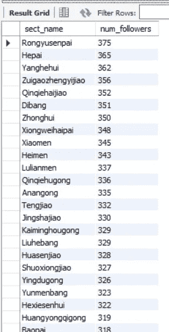
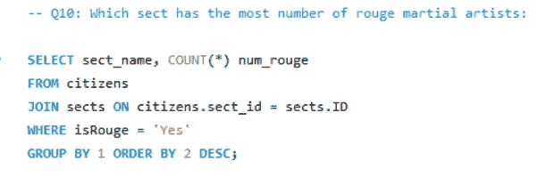
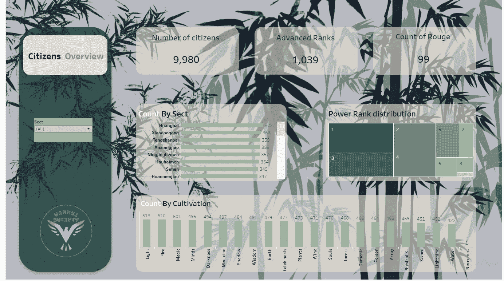

# DA 组合项目-ETL/数据库设计/ MySQL(第四部分)

> 原文：<https://blog.devgenius.io/da-portfolio-project-etl-database-design-mysql-part-iv-359fc03b9d89?source=collection_archive---------6----------------------->

[安德鲁·尼尔](https://unsplash.com/@andrewtneel?utm_source=medium&utm_medium=referral)在 [Unsplash](https://unsplash.com?utm_source=medium&utm_medium=referral) 上拍照

在最后一部分中，我们设计了数据库并将数据加载到其中。今天，我们将继续使用 SQL 进行 EDA。所以，启动你的 MySQL 工作台，让我们开始吧。

在继续之前，查询已经在我的项目文件夹上链接 [***这里***](https://github.com/Armonia1999/Database-design-ETL-MySQL) 。我建议在一个单独的标签中打开它们并浏览它们，我已经有很多解释了，所以试试吧。

提醒:一篇很长的文章在等着你。

要开始查询我们的数据库，我们需要首先使用它，因此我们的查询将应用于它的表:

现在让我们看一下我们的表:

我们限制在 20 个，因为我们不需要看到绝对的一切，浪费时间和空间。

我们的公民表看起来像什么，例如:

如此感人的一幕…

接下来，我们的表格有多少行和列？

对 citizens_CH 的结果是什么？让我们运行它:

天哪，我们有 43k+行，有多少列？如果你运行它，它应该是 8。

现在，我们通常还会检查是否有空值或重复值，但是因为我们收集了自己的数据，所以我们知道事实上我们没有这些值:)

我想改变一些东西，我们的表 citizens 和 citizens_CH 在一列中有全名，让我们把它们分成姓和名。在做不必要的改变之前，我们需要确定我们能做到:

鼓点，有用吗？

是的，是的，噪音。现在让我们把它添加到我们的表中。

因此，在上面的行中，我们直接在 full_name 列后面添加了列 surname 和 given_name，这样看起来更美观，默认值是一个空字符串。是时候填充它们了:

我们会得到这个:

就像梦里的场景一样。

从现在开始我们将以提问的形式继续，这样会更有趣。

这是我们得到的结果:

首先，让我们运行第一个查询:

所以我们有 14 个联盟，第二行是看看我们的教派表中有多少个联盟。但是为什么只有门派 ID 小于 31 的地方？如果你还记得当我们使用 Python 设计数据库时，我们不想使用我们收集的所有 90 多个教派，我们只将我们的公民划分为 30 个教派，证据在这里:

所以这就是为什么我们想知道我们的教派属于多少联盟？

你看到了吗？在所有联盟中，当我们选择随机教派与随机联盟结盟时，只有 12 个被使用。还有另外两个基本不属于任何教派。是的，我们只有 30 个教派:

Okie dokie，问题 3:

那就是:

哇，穿制服真漂亮。NEXTTT:

那就是:

嗯，有意思。让我们看看第五个问题:

多少？

荣跃森派？？？有点傻。

好的，兄弟姐妹们，哪个联盟最强？

很好，我就知道我能指望驯兽师。这让我们想到:

是的，这是陈诚想知道的一些信息:

我没想到这个名字会有任何降低。

好吧，别让我们等着，什么事？

> Qin 钦 / 欽 Meaning: **to respect, to admire, to venerate, by the emperor himself**.

…

酷毙了。现在让我们继续讨论紧迫的问题:

是的，那是我们需要的调味汁。

我们所有的眼睛都在看着你，亲爱的，我在看着你..

咻让我颤抖吧..

第三，我又见面了..太多的巧合..

情节转折:

好的，让我们看看我们能做些什么。一些窗口函数应该可以做到这一点。

有用吗？

看起来是这样。让我们更改表格并分配它们:

好了，现在我们做到了，我们的教派表看起来怎么样？

好看。

完美。没有胭脂门主。现在让我们将他们在公民表中的排名改为 10:

我们已经接近终点了，至少我们是这样认为的！

好，先加他为公民:

我们知道我们有 9979 个公民，所以他的 ID 是 9980。既然我们已经把他添加为公民和门派掌门，那就让所有胭脂人都追随他的门派吧。

好吧，让我们给他一些武器:

呵呵，既然他寻求扩张，那我们也创建一个他唯一门派所属的联盟吧:

今天到此为止。也许下一次我们可以进行教派间的战争，让它变得更有趣，但不是今天。我想做的最后一件事是选择我想要的数据，并将其导出为外部 txt 文件，然后从那里加载到 excel 并构建一个仪表板。我们就是这样做的:

最终文件已经在我的 Github 上了，你可以直接构建一个仪表板。

先睹为快？

你只要看到左下方的万惠 Logo 就知道我付出了多少努力。我们还有一个过滤器，可以看到某个门派的具体信息。点击这里的链接*，你可以体验一下它是如何工作的:)*

*希望你喜欢这个项目！这是最后一部分，我们将分开，直到我找到一个新的项目哈哈。*

*感谢您的阅读和…*

*安静点。*