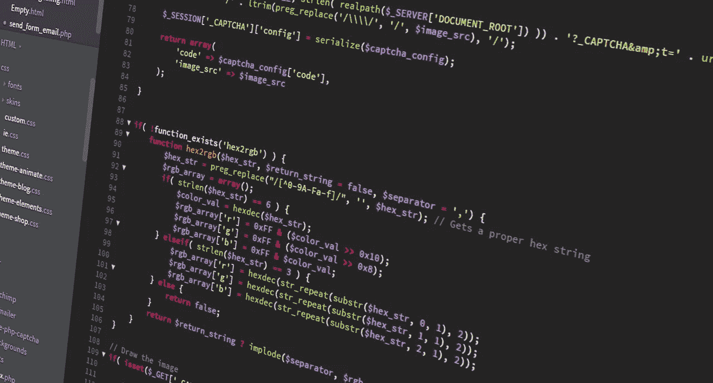

# 日常编码问题:问题 1

> 原文：<https://blog.devgenius.io/daily-coding-problem-problem-1-4ac675d9f197?source=collection_archive---------14----------------------->

随着新冠肺炎和锁定的生效，我决定提高我的编码技能。于是我开始在 [**ProductHunt**](https://www.producthunt.com/) 中寻找可以帮我的产品。然后我偶然发现了这个叫做[**daily code problem**](https://www.dailycodingproblem.com/)的产品。我知道这是一个老产品，但这是我第一次遇到这个！。

当你订阅**daily code problem**的时候，他们每天都会给你发一个问题来解决。我试图解决这个问题，并想为什么不把它作为博客发布在 medium 上，这样也能提高我的写作技巧。我将在 **Python** 和 **Go** 编程语言中实现这些问题。

# 问题

> 给定一个数字列表和一个数字`k`，返回列表中任意两个数字的总和是否为`k`。
> 
> 比如给定`17`的`[10, 15, 3, 7]`和`k`，返回 true，因为`10 + 7`是`17`。
> 
> 额外收获:你能一次完成吗？
> 注:这个问题是谷歌问的。

我们稍后将讨论奖金部分。

我们想到的最直接的方法是运行两个循环，检查元素是否符合给定的目标。如果你第一眼就找到了相同的解决方案，没关系！。这就是答案。

# 解决方案 1:使用两个循环

**Python:**

**去:**

**时间复杂度** : O(n)

**空间复杂度** : O(1)

如果我们仔细观察，我们会检查值 **k** 和元素之间的差异是否存在于数组中。这样做使我们再次迭代数组，因此我们的时间复杂度变为 O(n)。如果我们能在 O(1)时间内检查元素是否存在于数组中呢？是的，我们可以！使用**散列表**。每次计算差异时，我们都检查哈希表中是否存在差异。如果存在差异，我们可以返回 True 并结束计算。如果没有，我们就不会遇到这样的元素并将当前元素添加到哈希表中。最后，如果没有元素匹配目标总和 **k.** ，我们将返回 False

# 解决方案 2:使用哈希表

**Python:**

**去:**

**时间复杂度** : O(n)

**空间复杂度** : O(n)

我希望你们喜欢这篇文章。

如果你觉得有帮助，请分享和鼓掌非常感谢！😄

欢迎在评论区提问！。