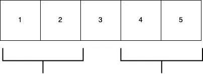

# 日常编码问题:问题 2

> 原文：<https://blog.devgenius.io/daily-coding-problem-problem-2-59f714e4ee78?source=collection_archive---------15----------------------->

第二个问题我来了！。

# 问题

> 给定一个整数数组，返回一个新数组，使得新数组中索引`i`处的每个元素都是原始数组中除了`i`处的数字之外的所有数字的乘积。
> 
> 例如，如果我们的输入是`[1, 2, 3, 4, 5]`，那么预期的输出将是`[120, 60, 40, 30, 24]`。如果我们的输入是`[3, 2, 1]`，那么预期的输出将是`[2, 3, 6]`。
> 
> 追问:不能用除法怎么办？

不要马上考虑最佳解决方案。

第一个也是最明显的解决方案是暴力方法。我们可以使用两个循环，在指数不相同的条件下计算乘积。

# 解决方案 1:使用两个循环

**Python:**

**去:**

**时间复杂度:** O(n)

**空间复杂度:** O(1)

上述问题可以被优化为在单次通过中运行。你能认出来吗？。是的，我们可以这样做，首先计算乘积，然后用当前位置的元素除以整个乘积。这将给出除该元素之外的所有元素的乘积。没那么难吧。我们来实施吧。

# 解决方案 2:首先计算乘积

**Python:**

**去:**

**时间复杂度:** O(n)

**空间复杂性:** O(1)

我们现在已经设法一次性找到了解决办法。现在让我们试试奖金部分。后续告诉我们不用除法就能找到解。嗯🤔。所以如果不允许除法，我们唯一能做的就是乘法。怎么才能找到除了任何一个元素之外的所有元素的乘积？。慢慢想吧！。

因此，为了避免包含该元素并找到其他元素的乘积，我们可以计算右侧和左侧所有元素的乘积。

例如，如果我们试图找出除了位置 2 的元素之外的所有元素的乘积，我们计算它左边所有数字的乘积(1 * 2)和它右边所有数字的乘积(4 * 5)。这样我们就可以不用除法求解了。我们如何一次就做到这一点？。我们可以维护两个数组，一个存储每个元素左边所有元素的乘积，另一个存储右边所有元素的乘积。你自己先试试这个。

**Python:**

**去:**

时间复杂度:O(n)

**空间复杂度:** O(n)

上述解决方案的一个问题是，我们使用了额外的空间来存储左右元素的乘积。我们能在不使用额外空间的情况下实现这一点吗？。我们可以在结果数组本身中更新它，而不是使用这些额外的空格。这种通过计算左边和右边元素的乘积来寻找答案的方法是一种**贪婪方法**。

# 解决方案 3:贪婪的方法

**巨蟒:**

**去:**

时间复杂度: O(n)

**空间复杂度:** O(1)

我希望你们喜欢这篇文章。

如果你觉得有帮助，请分享和鼓掌非常感谢！😄

欢迎在评论区提问！。