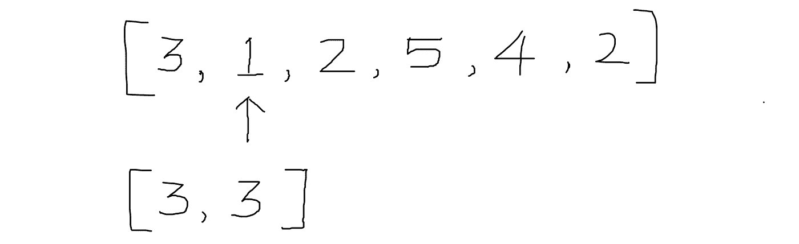

# 日常编码问题:问题 9

> 原文：<https://blog.devgenius.io/daily-coding-problem-problem-9-b5fcb2f564b6?source=collection_archive---------12----------------------->

照片由 [XPS](https://unsplash.com/@xps?utm_source=unsplash&utm_medium=referral&utm_content=creditCopyText) 在 [Unsplash](https://unsplash.com/@xps?utm_source=unsplash&utm_medium=referral&utm_content=creditCopyText) 上拍摄

我又遇到了另一个问题！。

# 问题

> 给定一个整数列表，写一个函数，返回非相邻数的最大和。数字可以是`0`也可以是负数。
> 
> 例如，`[2, 4, 6, 2, 5]`应该返回`13`，因为我们选择了`2`、`6`和`5`。`[5, 1, 1, 5]`应该返回`10`，既然我们挑了`5`和`5`。
> 
> 追问:你能在 O(N)时间和常数空间做到这一点吗？

乍一看，我们可能会被提示使用奇偶位置来解决这个问题，即计算偶数位置上所有数字的和，计算奇数位置上所有数字的和，并找出两个位置中的最大值。但这并不能解决问题。在这个例子中尝试相同逻辑`[5,1,1,5]`。预期结果将是`10`，但实际结果是`6`。所以使用奇偶位置的逻辑失败。怎么才能解决这个问题？🤔。我们可以使用**动态规划**来解决这个问题。这里的想法是从之前计算的问题中获取结果。

考虑例子`[3,1,2,5,4,2]`。我们将维护一个额外的数组来存储之前计算的答案。

让我们假设数组中只有一个数字，那就是`3`。在这种情况下，最大和将是该数字本身。

现在，考虑数组中有两个数字的情况，我们不能只将这两个数字相加，因为它们是相邻的。所以结果会是两者的最大值，也就是`3`。

有趣的部分从第三个索引的数字开始。我们是要保留第二个索引的数字还是第一个和第三个索引的数字之和？。

通过观察这个，我们可以推导出一个计算下一个最大和的公式。

对于任何位置`i`,`dp[i]`的值为`arr[i]`与之前计算的值`dp[i-2]`或`dp[i-1]`之和的最大值。让我们在代码中应用它。

# 解决方案 1:动态编程

**Python:**

**去:**

时间复杂度: O(n)

**空间复杂度:** O(n)

如何得到一个空间复杂度不变的解？如果我们仔细观察，int `dp`数组，我们只是对任何位置使用前面的两个索引值。所以不用维护数组，我们可以简单地用两个变量来解决这个问题。

# 解决方案 2:动态编程(常数空间)

**Python:**

**开始:**

时间复杂度:O(n)

**空间复杂度:** O(1)

我希望你们喜欢这篇文章。

如果你觉得有帮助，请分享和鼓掌非常感谢！😄

欢迎在评论区提出你的疑问！。